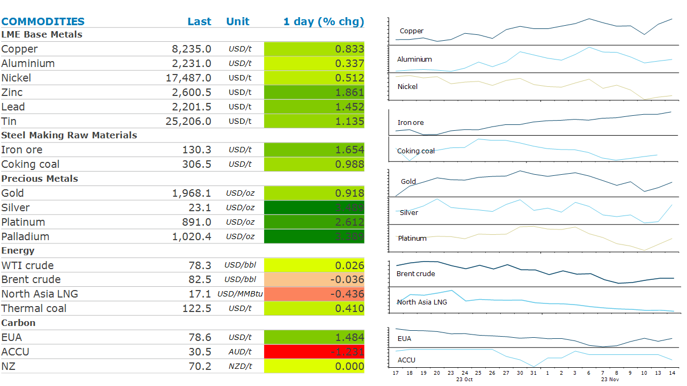

# Gold rallies after low US inflation

**Date:** November 15, 2023  
**Publisher:** Breakwave Advisors | **Category:** Market Insights  
**Original URL:** [https://www.breakwaveadvisors.com/insights/2023/11/15/irw0xzbtihfobjxhfgg00ajgoz5dut](https://www.breakwaveadvisors.com/insights/2023/11/15/irw0xzbtihfobjxhfgg00ajgoz5dut)  

---

*By*[*Daniel Hynes*](https://www.linkedin.com/in/dahynes/)

A risk-on tone across markets, triggered by lower inflation data helped boost sentiment. This was aided by a weaker USD, which increased investor appetite in the sector.

> **Figure 1: 1699995347123**  
> [Local Asset](file:///C:/Users/Dell/Github/Shipping/corpus/03-breakwave/insights/2023/assets/2023-11-15_irw0xzbtihfobjxhfgg00ajgoz5dut_img_1699995347123_aa55fb397cb4.png)

**Gold**rallied after US inflation came in lower than expected. This triggered a fall in the USD while Treasury yields also dropped. The data is likely to take the pressure off the Fed to further tighten monetary policy this year. This sparked some strong buying in the precious metal and is likely to[support further investment demand of gold](../pdfs/2023-11-15_irw0xzbtihfobjxhfgg00ajgoz5dut_the-vault-gold-market-s-sanctuary_e63bf31c32b2.pdf). We also see geopolitical tensions becoming a recurring feature, which should see a structural risk premium embedded. A drive by central banks to diversify their reserves has been a feature of the gold market since early 2022. Increasing geopolitical risks will fuel this trend. This should reduce the burden on physical and investment demand for clearing the market surplus.

The spectre of an end to the tightening cycle helped push**base metals**higher. Rate hikes have weighed on economic growth in developed economies, raising concerns about demand for copper and other metals. This has been an issue that participants at Asia Copper Week have been discussing this week. However, optimism has been building that support for China’s struggling real estate sector will start to have an impact. The country plans to provide CNY1tn of low-cost financing to urban village renovation and affordable housing programs.

**Iron ore**futures hit USD130/t for the first time since March on the spectre of stronger demand from the property sector. This has been aided by low inventories at Chinese steel mills and expectations of restocking before February’s Lunar New Year holiday. The recent rally in prices raised the spectre of government intervention. China Mineral Resources Group, the state-backed firm set up to consolidate the country’s iron ore purchases, said that iron ore prices had reached unreasonable levels.

**Crude oil**rallied following the inflation print. However, it gave up much of those gains late in the session as concerns over fundamentals came back to the fore. The International Energy Agency said that global oil markets will not be as tight as expected this quarter, as demand is outpaced by upgrades to supplies. Most of this growth is coming from the US. It also highlighted that refining margins slumped month on month in October, with most regions seeking a return to profitability levels seen late in Q2. However, it sees oil demand remaining healthy. It raised its forecast due to better-than-expected consumption in China.

**Global gas**markets were steady amid ongoing supply-side issues. Prices jumped earlier in the week after power to Freeport’s LNG export terminal in Texas fell dramatically. However, gas feed appears to have resumed to normal levels on Tuesday. Israel’s gas flows to Egypt are also expected to return to pre-war levels early next week after a major offshore field resume output on easing safety concerns.

Data source:[Commodities Wrap](https://www.linkedin.com/newsletters/commodities-wrap-6692196755876012032/?fbclid=IwAR3kiXJqZdxmp9ZcRwBNI7FsBySI-XSC0pfPur1qzjt7OZp7PTE59Tsl1QI)
