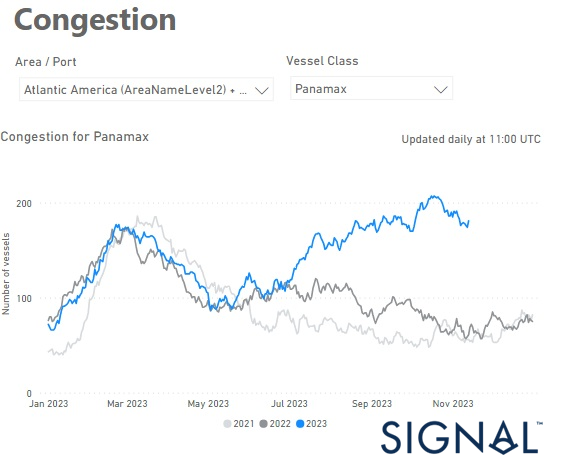
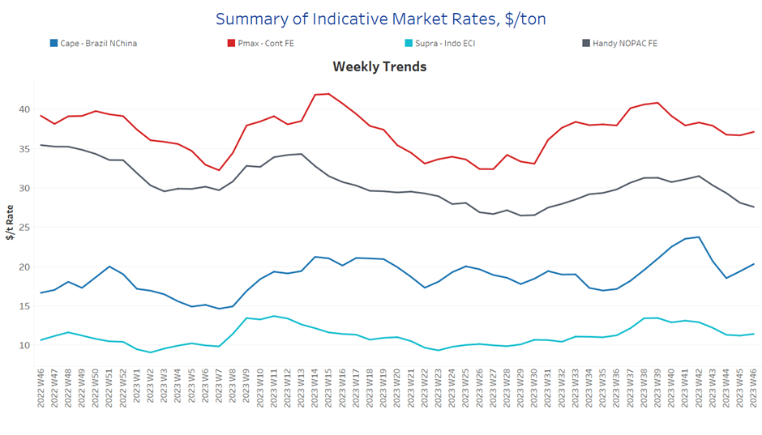
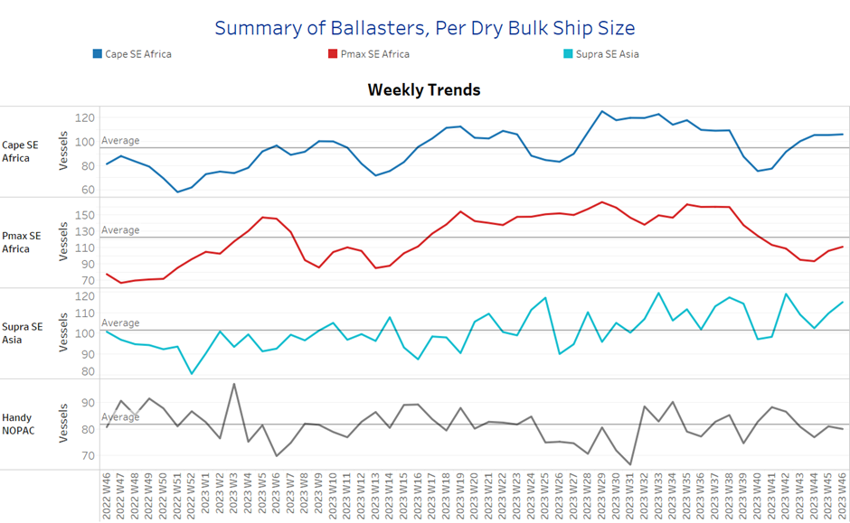
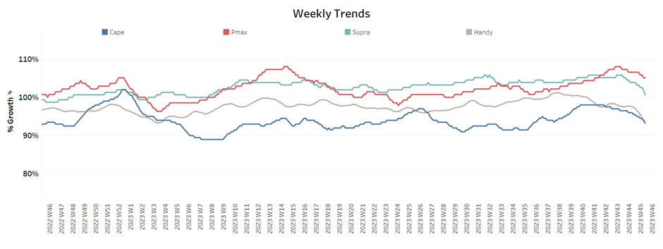
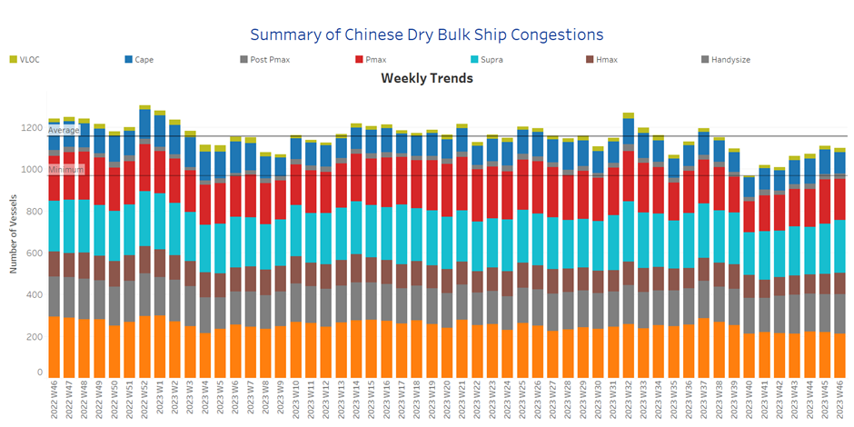

# Signal Dry Bulk Weekly Report

**Date:** November 16, 2023  
**Publisher:** Breakwave Advisors | **Category:** Market Insights  
**Original URL:** [https://www.breakwaveadvisors.com/insights/2023/11/16/signal-dry-bulk-weekly-report](https://www.breakwaveadvisors.com/insights/2023/11/16/signal-dry-bulk-weekly-report)  

---

## Chart of the Week : Dry Bulk Congestion Brazil Panamax​​​​​

### Higher Monthly Volumes of Congestion at Major Brazilian Ports and Days Waiting

> **Figure 1: Market Chart 1**  
> **Interactive Data & Source:** [Signal Ocean Platform](https://www.thesignalgroup.com/signal-ocean-platform) | [Local Asset](file:///C:/Users/Dell/Github/Shipping/corpus/03-breakwave/insights/2023/assets/2023-11-16_signal-dry-bulk-weekly-report_img_unnamed-2023-11-16t122731810_906ea8c4433e.png)

In the third week of November, the larger ship categories recorded greater stability in freight rates, which indicates a more solid development. In contrast, a downward trend was observed in the smaller ship sizes, particularly in the Handysize category. At the beginning of the fourth quarter, the stability of the upturn in freight rates is being called into question. The current supply and demand dynamics do not yet show promising signs of robust momentum, adding to the uncertainties in the market.
Interestingly, the Panamax freight market should continue to gain momentum as congestion in Brazilian ports has reached record levels compared to a similar period two years ago.

In the meantime, the Chinese property market fuelled hopes with iron ore prices recording a recent increase. Iron ore has emerged resilient amidst the general weakness in the commodity complex, reaching an eight-month peak due to a combination of positive sentiment and supportive fundamentals in China, Reuters news reported. As the largest global purchaser of the steel raw material, China's influence is pivotal in driving these price increases.
Iron ore contracts in Singapore concluded at $129.24 per metric ton on Monday, marking the highest point since March 16. This ascent represents a substantial 25% rally from the low of $103.21 recorded on August 3.

​​​For more information on this week's trends, see the analysis sections below:

Freight Market, Supply, Demand and Port Congestion

## Section 1/ Freight

‘The Big Picture’ - Capesize and Panamax Bulkers and Smaller Ship Sizes

Market Rates ($/t) Mixed

> **Figure 2: Market Chart 2**  
> **Interactive Data & Source:** [Signal Ocean Platform](https://www.thesignalgroup.com/signal-ocean-platform) | [Local Asset](file:///C:/Users/Dell/Github/Shipping/corpus/03-breakwave/insights/2023/assets/2023-11-16_signal-dry-bulk-weekly-report_img_unnamed-2023-11-16t122852758_968755cb9c50.png)

The third week of November began with mixed sentiment on freight rates, as the larger vessel categories seemed to hold strength compared to the downward pressure in Handysize and Supramax.

- Capesize vessel freight rates from Brazil to North China rose to $19.6/tonne, with the last low recorded in mid-September. It remains to be seen whether rates will exceed the $20/tonne mark in the final days of the month.
- Panamax vessel freight rates from the Continent to the Far East remained below $40 per tonne for another week, with sentiment settling around $37per tonne, while the market shows similar dynamics to a month ago.
- Supramax vessel freight rates on the Indo-ECI route remained steady around $11 per tonne for the second week in a row, a monthly decline of 16%.
- Handysize freight rates for the NOPAC Far East route continued their downward trend below $30/tonne since early November with rates at $28/tonne. Compared to a similar week in October, rates are down 12%.

## Section 2/ Supply

> **Figure 3: Supply Trend Lines for Key Load Areasballasters (#Vessels) Increasing**  
> **Interactive Data & Source:** [Signal Ocean Platform](https://www.thesignalgroup.com/signal-ocean-platform) | [Local Asset](file:///C:/Users/Dell/Github/Shipping/corpus/03-breakwave/insights/2023/assets/2023-11-16_signal-dry-bulk-weekly-report_img_unnamed-2023-11-16t123053362_23c205cba14d.png)

In the third week of November, there was an increase in the number of ballasters with the Capesize and Supramax size segments showing a higher trend than other ship sizes.

- Capesize SE Africa: The number of ballasters kept rising above the annual average of 100, with the last low in week 40.
- Panamax SE Africa: The number of ballasters is still below the average of 120 for the last six weeks, with a slight increase since the beginning of November.
- Supramax SE Asia: The number of ballast ships has risen to almost 120, with a constant upward trend for three consecutive weeks.
- Handysize NOPAC: The number of ballast ships indicated a rise to over 90 last week, a downward correction was recorded in the third week of November, but the latest low remained at week 44.

## Section 3/ Demand

> **Figure 4: Summary of Dry Bulk Demand, per Ship Sizetonne Days Decreasing**  
> **Interactive Data & Source:** [Signal Ocean Platform](https://www.thesignalgroup.com/signal-ocean-platform) | [Local Asset](file:///C:/Users/Dell/Github/Shipping/corpus/03-breakwave/insights/2023/assets/2023-11-16_signal-dry-bulk-weekly-report_img_unnamed-2023-11-16t123140065_ef8021672323.png)

Demand growth was down for all ship sizes and there were no signs of recovery yet, with a final upturn in week 42.

- Capesize: The downward trend remained at a level that had not been reached before the last peak in week 41, while the decline does not seem to have stopped by the end of the month.
- Panamax: The downward correction from the high in week 42 resembled the weakness of previous weeks with November signalling a lower trend of growth than October.
- Supramax: The growth rate remained at its lowest level of the year for three consecutive weeks, while it seems that there will not be a higher pace for the second half of the month.
- Handysize: Demand growth is still decreasing by falling to the lowest levels since the end of week 37.

## Section 4/ Port Congestion

> **Figure 5: Dry Bulk Ships Congested at Chinese Portsno of Vessels Decreasing**  
> **Interactive Data & Source:** [Signal Ocean Platform](https://www.thesignalgroup.com/signal-ocean-platform) | [Local Asset](file:///C:/Users/Dell/Github/Shipping/corpus/03-breakwave/insights/2023/assets/2023-11-16_signal-dry-bulk-weekly-report_img_unnamed-2023-11-16t123302077_626b5ee983cf.png)

The level of ship congestion decreased following the spike of the previous week, with lower levels of congestion in the large vessel size categories.

- Capesize: The number of congested vessels has fallen to 107, 7 fewer than the previous week, and it remains to be seen whether the number of overloaded ships will fall below 100.
- Panamax: The number of congested ships fell below 200 after there had been signs of an accelerated rise above this threshold in the previous days of November.
- Supramax: The number of ships remained stubbornly at 250, 25 higher than the previous week, with a tendency to remain above 200.
- Handysize: The number of congested ships to 170, 6 less than the previous week, and there are signs of a further decrease in the coming days.

Data Source:[Signal Ocean Platform](https://www.thesignalgroup.com/signal-ocean-platform)
