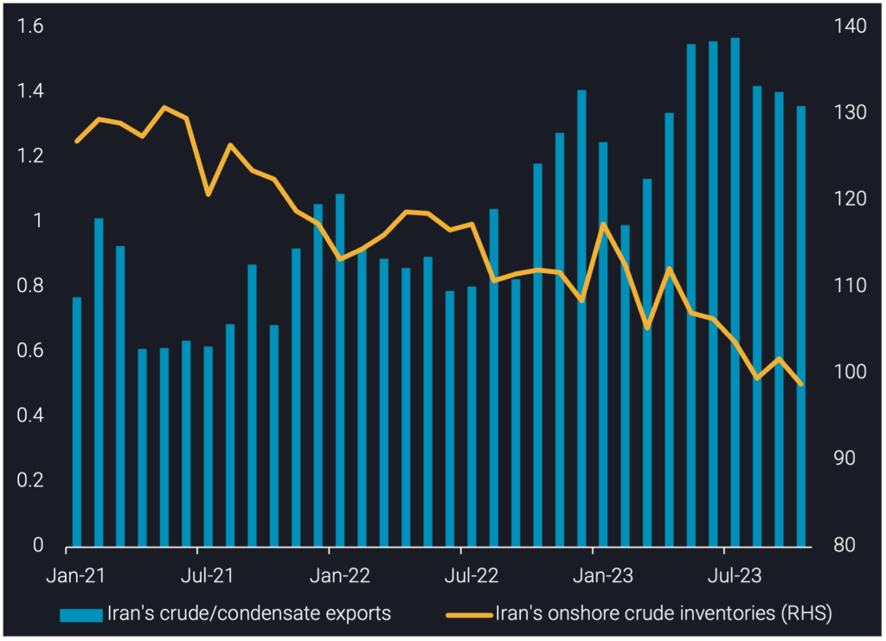
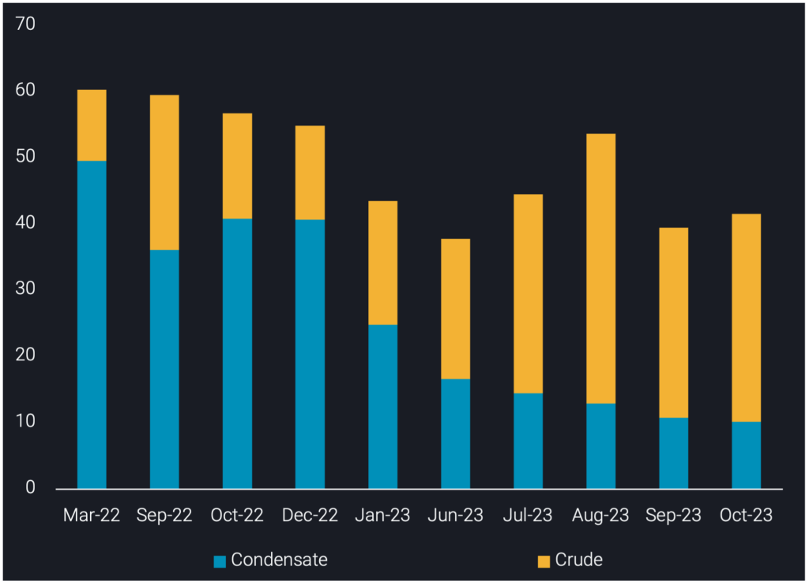
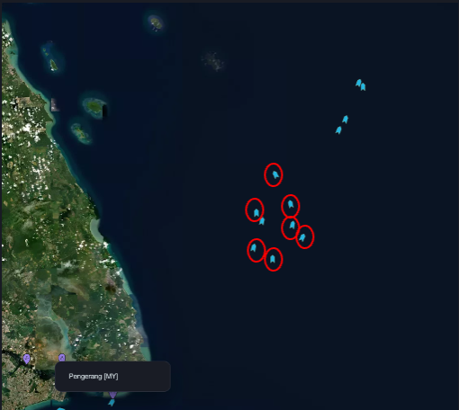

# Momentum in Iranian crude/condensate exports slows

**Date:** November 16, 2023  
**Publisher:** Breakwave Advisors | **Category:** Market Insights  
**Original URL:** [https://www.breakwaveadvisors.com/insights/2023/11/16/t1j5lt27pkd8up3fqkxjxfzqyx8s3w](https://www.breakwaveadvisors.com/insights/2023/11/16/t1j5lt27pkd8up3fqkxjxfzqyx8s3w)  

---

## This Insight Explores Why Iran’s Crude/condensate Export Levels Slowed From Previous Months and Floating Storage Levels Declined.

*By*[*Armen Azizian*](https://www.linkedin.com/search/results/all/?fetchDeterministicClustersOnly=true&heroEntityKey=urn%3Ali%3Afsd_profile%3AACoAABcR8rABbq0IzC6LkmXkEIICI-LUmZ3s9SU&keywords=armen%20azizian&origin=RICH_QUERY_SUGGESTION&position=0&searchId=672471da-1f3b-412e-a779-25b037e1f7f4&sid=J-4&spellCorrectionEnabled=false)

Iran’s crude/condensate exports were observed at 1.3mbd in October, a 100kbd decline from the Q3 average and the lowest volume observed since May. This is still 300kbd higher than the 2022 average and is a 100kbd increase y-o-y, supporting Iran’s elevated crude exports observed this year.

Iran’s onshore crude/condensate inventories declined to 99mb in October, reaching a multi-year low. The 3.2mb stock draw through October – equivalent to 100kbd – may have supported exports, despite the decline m-o-m.

> **Figure 1: Iranian Crude/condensate Exports (Mbd**  
> *Iranian crude/condensate exports (mbd, LHS)vsIranian onshore crude inventories (mb, RHS)*  
> **Interactive Data & Source:** [Analytics Vortexa](https://analytics.vortexa.com/?dateRange=2021-01-01T00%3A00%3A00.000Z__2023-10-31T23%3A59%3A59.999Z&filtersEnabled=%5B%22p%22%2C%22o%22%2C%22d%22%2C%22d_r%22%2C%22v%22%2C%22intra_d%22%2C%22sts_o%22%5D&from=%5B%22d308ddc557e774187ad6c7da81b39db990def9a39e6c88e79cb163b6bdd6e8e5%22%5D&geoBreakdownOriginGlobal=port&gradeAnalysisClassification=api&metric=bpd&page=Flows&products=%5B%2254af755a090118dcf9b0724c9a4e9f14745c26165385ffa7f1445bc768f06f11%22%5D&tabId=14d44ae5-49d1-4a8b-ba21-9bed374439de&timeSeriesHiddenSeries=%5B%22b68cbb746f8b9098c50e2ba36bcad83001a53bd362e9031fb49085d02c36659c%22%2C%225de0b00094e0fd7542c10f9f8a71b4008d55750f21dc905cda9b0f7f5f76bc08%22%2C%229b0f7f5de0b111910f9f8a71b4008d4e0fd7542c55750f21dc905cda5f76bc08%22%5D&v=3&vesselClassChartView=count) | [Local Asset](file:///C:/Users/Dell/Github/Shipping/corpus/03-breakwave/insights/2023/assets/2023-11-16_t1j5lt27pkd8up3fqkxjxfzqyx8s3w_img_iran-picture-2-insight-1024x742_43bc119a7ba7.png)

## Iranian Floating Storage Declines From Ytd High

Iranian crude/condensate in floating storage was assessed at 41.6mb for the month of October, comprising 75% crude and 25% condensate.

Iranian floating storage in October was 2.1mb higher than the September assessment. South Pars Condensate in floating storage was assessed at 10.2mb in October, the lowest assessed volume on record. This is due to higher NITC fleet utilisation and declining condensate exports in recent months. Iranian crude in floating storage was assessed at 31.4mb in October, a 2.7mb increase m-o-m.

Despite the marginal m-o-m increase observed in October, Iran’s floating storage declined by 12mb compared to August, a year-to-date (YTD) high. This YTD high was a consequence of Iran’s record-high exports observed from May to July, where exports surpassed 1.5mbd. Some of these barrels found their way into floating storage, due to the lag which exists between Iran’s exports and China’s imports because of the involvement of middle-men. This floating storage stock build meant China had access to large supplies of Iranian crude, which they proceeded to draw from. This contributed to lower Iranian crude exports in October as crude on-the-water volumes were already sufficient.

The 41.6mb of Iranian crude/condensate floating storage was split between 30% domestic and 70% outside Iran, with the latter located offshore Malaysia and China.

> **Figure 2: Iranian Crude/condensate in Floating Storage (Mb)**  
> *Iranian crude/condensate in floating storage (mb)*  
> **Interactive Data & Source:** [Analytics Vortexa](https://analytics.vortexa.com/?filtersEnabled=%5B%22l%22%2C%22s%22%2C%22v_cg_st%22%2C%22v%22%2C%22l_c%22%2C%22o%22%2C%22d%22%2C%22sts_o%22%2C%22c_o%22%2C%22v_o%22%5D&latestProducts=%5B%2254af755a090118dcf9b0724c9a4e9f14745c26165385ffa7f1445bc768f06f11%22%5D&page=Map&size=0&tabId=f6f54f37-4b6b-4641-b405-0a16acee3d79&v=3&vesselClasses=%5B%22oil_vlcc%22%5D&voyageStatus=%5B%22laden%22%5D) | [Local Asset](file:///C:/Users/Dell/Github/Shipping/corpus/03-breakwave/insights/2023/assets/2023-11-16_t1j5lt27pkd8up3fqkxjxfzqyx8s3w_img_iran-picture-3-insight-1024x742_7a2236453557.png)

## Ample Supply of Iranian Crude for China Despite Export Slowdown

As of 14 November, there are 12 crude-laden VLCCs offshore Malaysia, seven of which are laden with Iranian crude/condensate, carrying a combined 12.5mb. This equates to 400kbd if this crude/condensate were to be bought and drawn down in November, which would account for 30% of the total volumes of crude/condensate China imported from Iran in October. This suggests that – aside from Iran’s continued loadings (exports) and floating storage volumes available to draw from – independent refiners in China have access to ample supplies of Iranian crude/condensate ready to be bought.

These VLCCs (which are part of the opaque market fleet) share the common characteristics of tankers operating in sanctioned markets. They average 17 years old, with the oldest tanker being 27 years old. Five of them are operated by Iran (NITC) whilst two are operated by UAE and low-tax sovereign interests.

> **Figure 3: 1st Iran Picture Insight**  
> **Interactive Data & Source:** [Analytics Vortexa](https://analytics.vortexa.com/?filtersEnabled=%5B%22l%22%2C%22s%22%2C%22v_cg_st%22%2C%22v%22%2C%22l_c%22%2C%22o%22%2C%22d%22%2C%22sts_o%22%2C%22c_o%22%2C%22v_o%22%5D&latestProducts=%5B%2254af755a090118dcf9b0724c9a4e9f14745c26165385ffa7f1445bc768f06f11%22%5D&page=Map&size=0&tabId=f6f54f37-4b6b-4641-b405-0a16acee3d79&v=3&vesselClasses=%5B%22oil_vlcc%22%5D&voyageStatus=%5B%22laden%22%5D) | [Local Asset](file:///C:/Users/Dell/Github/Shipping/corpus/03-breakwave/insights/2023/assets/2023-11-16_t1j5lt27pkd8up3fqkxjxfzqyx8s3w_img_1st-iran-picture-insight_b52935630479.png)

## Will Iran’s Crude/condensate Exports Return to Q3 Levels?

Iran could export more crude/condensate, but there are a number of unknowns, both economic and political. Firstly, Venezuela’s sanctions have now been lifted, and the potential resurgence of former buyers places a question around how much Venezuelan crude China may be able to purchase; this may result in higher demand for Iranian crude. On the other hand, these sanctions were lifted with conditions which Venezuela’s government must adhere to; if not, we could see sanctions re-imposed.

Secondly, Russian Urals prices have risen in recent months, making Iranian crude more competitive. However, Shandong province has been drawing stocks in recent months, but with declining refining margins, they may not increase crude demand from current levels. This means that regardless of how competitive Iranian barrels are, there may not be strong reasons for Iran to export at Q3 levels.

Finally, Iran has increased its crude production to 3.1mbd (OPEC). There is still a relationship between onshore stock draws and higher exports, suggesting Iran has the capacity to increase exports if it needs to. Iran does also have the tanker capacity to increase exports, as demonstrated by its Q3 levels, so they can respond to demand when needed; the question is if its needed.

Data Source:[Vortexa](https://www.vortexa.com//oil-gas-data-traders-analysts-data-scientists?gclid=Cj0KCQjw8_qRBhCXARIsAE2AtRZKOvMnbilZ_6_91d7huSFFy71pWLrnPwGwOHVzXsmsG-1a1mZnQw8aAt89EALw_wcB&hsa_acc=1782073842&hsa_ad=548425387665&hsa_cam=14746637662&hsa_grp=125038601902&hsa_kw=&hsa_mt=&hsa_net=adwords&hsa_src=g&hsa_tgt=dsa-1431852288425&hsa_ver=3&utm_campaign=%5BCD%5D%20-%20DSA%20-%20EMEA&utm_medium=cpc&utm_medium=ppc&utm_source=google&utm_source=adwords&utm_term=)
