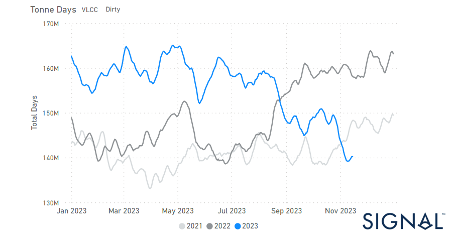
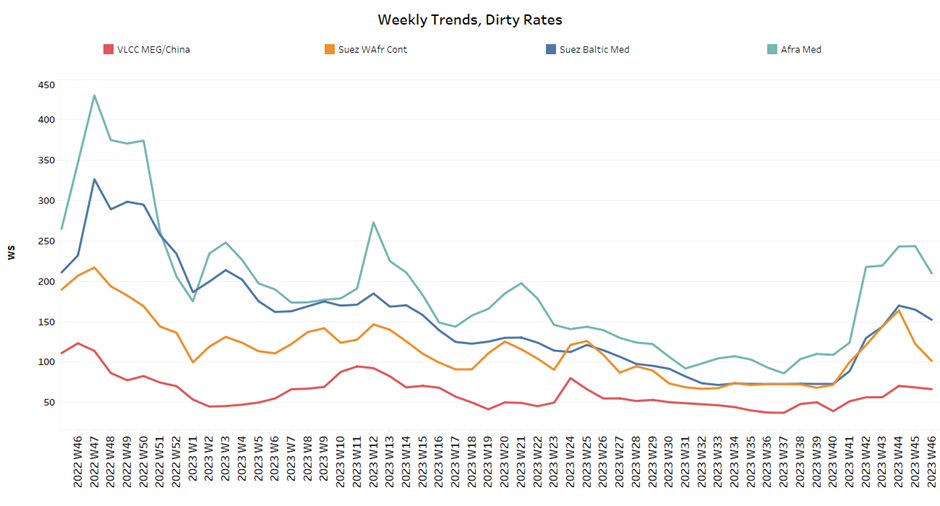
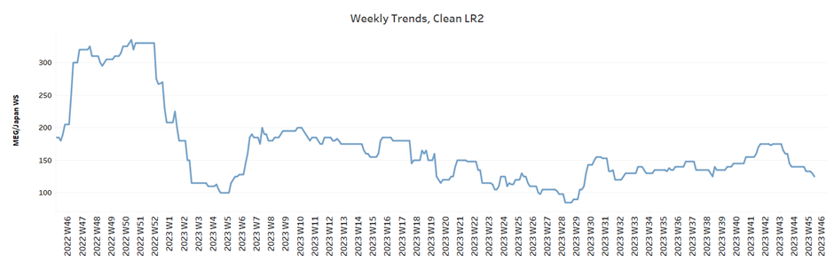
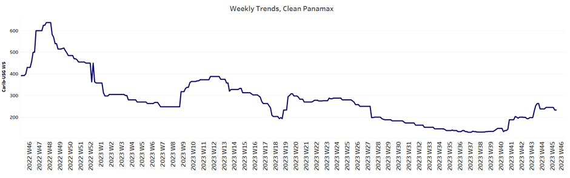
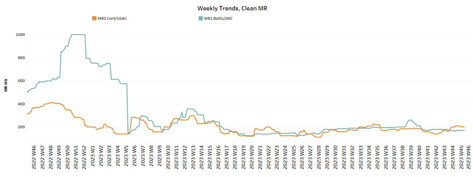
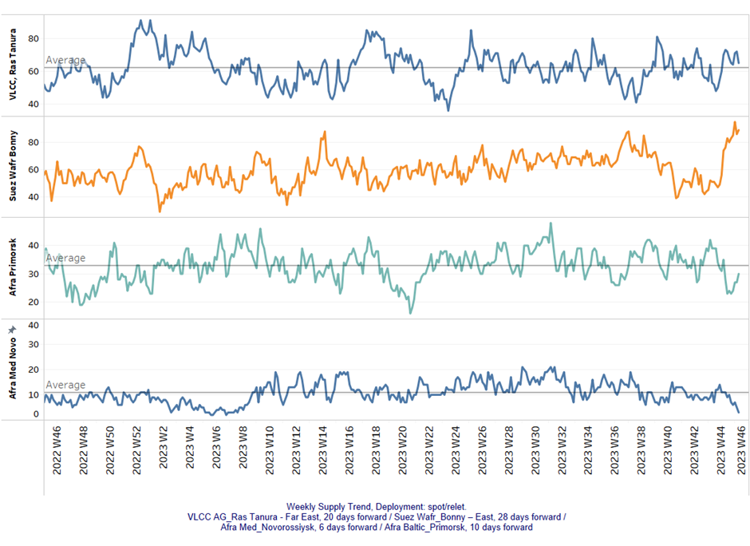
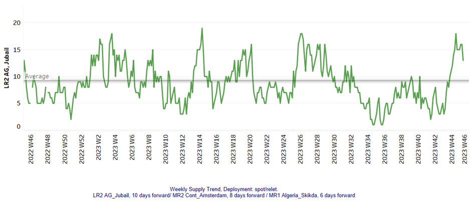
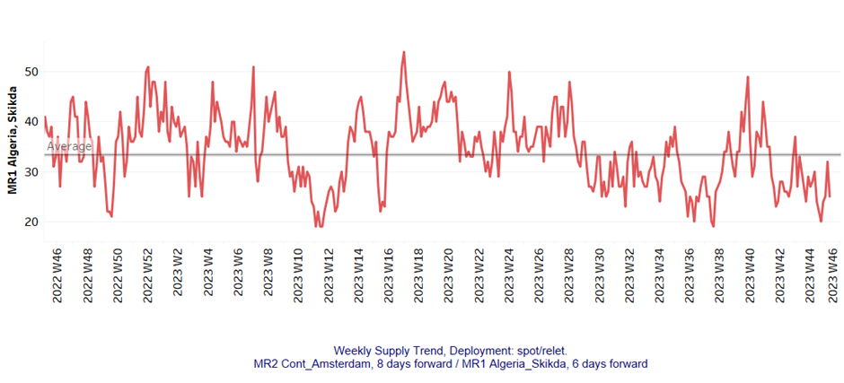
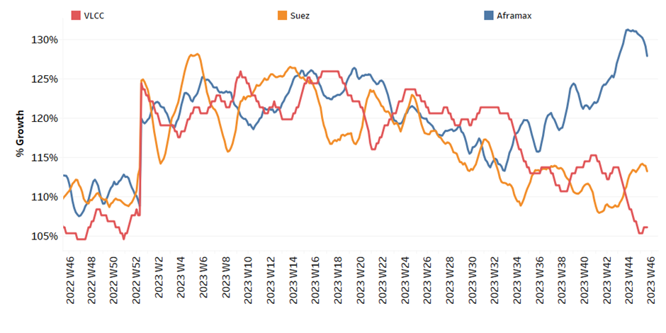
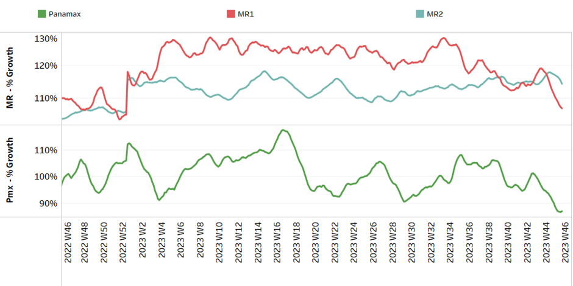

# Signal Tanker Weekly Report

**Date:** November 17, 2023  
**Publisher:** Breakwave Advisors | **Category:** Market Insights  
**Original URL:** [https://www.breakwaveadvisors.com/insights/2023/11/17/signal-tanker-weekly-report](https://www.breakwaveadvisors.com/insights/2023/11/17/signal-tanker-weekly-report)  

---

## Chart of the Week: VLCC Dirty Tonne Days

**Growth in VLCC dirty tonne days slowed to its lowest level of the year in the fourth quarter**

> **Figure 1: Market Chart 1**  
> **Interactive Data & Source:** [Signal Ocean Platform](https://www.thesignalgroup.com/signal-ocean-platform) | [Local Asset](file:///C:/Users/Dell/Github/Shipping/corpus/03-breakwave/insights/2023/assets/2023-11-17_signal-tanker-weekly-report_img_unnamed-2023-11-17t103051314_ed251676036b.png)

In the third week of November, crude freight market sentiment recorded a decrease with VLCC AG to China rates holding a resistance for firmer levels, however, when looking at the demand side there has been a further decrease in VLCC dirty tonne days growth.
In the clean segment, there has been a rather steady sentiment amid a weakening picture of the previous weeks, while demand does not yet still provoke signs of recovery. Overall, the fourth quarter of the year seems to evolve with a downward pressure on freight rates despite optimism for a winter demand boosting the rates.

On Thursday, a decline in oil prices continued, building on losses from the previous session. This downturn was fuelled by apprehensions about subdued energy demand from China, contributing to a lacklustre sentiment in the market.
Brent futures witnessed a dip, hovering around $80, while U.S. West Texas Intermediate crude (WTI) saw a decrease, reaching $76.01. The prevailing market conditions reflect the impact of concerns over Chinese energy demand and contribute to the overall downward trend in oil prices.

For more information on this week's trends, see the analysis sections below:

Freight Market, Supply and Demand

## Section 1/ Freight

Market Rates (WS)

‘Dirty’ WS - Decreasing​
VLCC - Suezmax - Aframax

> **Figure 2: ​​​​The Crude Oil Freight Market Rates Declined in the Third**  
> *​​​​The crude oil freight market rates declined in the third week of November, although the recovery in the VLCC segment gave cause for optimism.*  
> **Interactive Data & Source:** [Signal Ocean Platform](https://www.thesignalgroup.com/signal-ocean-platform) | [Local Asset](file:///C:/Users/Dell/Github/Shipping/corpus/03-breakwave/insights/2023/assets/2023-11-17_signal-tanker-weekly-report_img_unnamed-2023-11-17t103211978_c303ede39f0a.png)

- VLCC MEG-China freight rates firmer momentum above 70 WS, up 25% from a similar week in the previous month, but 40% lower than a year ago.
- Suezmax freight rates for shipments from West Africa to continental Europe fell to WS 98 after reaching a high of WS 140 the previous week, down 50% year-on-year. Rates on the Suez-Baltic-Med route reached a level of around WS 140, a decrease of 18% compared to the previous week.
- Aframax Med freight rates have started to approach the WS200 level and there are signs of a rise above this mark and current rates are now 50% higher than a month ago.

> **Figure 3: ‘Product’ Wslr2 Weaker**  
> **Interactive Data & Source:** [Signal Ocean Platform](https://www.thesignalgroup.com/signal-ocean-platform) | [Local Asset](file:///C:/Users/Dell/Github/Shipping/corpus/03-breakwave/insights/2023/assets/2023-11-17_signal-tanker-weekly-report_img_unnamed-2023-11-17t103221187_6f61c60e27a4.png)

- LR2 AG freight rates continued their weakness and fell to 125 WS, which is 10% less than the previous week and 19% less than a month ago.

> **Figure 4: PANAMAX (Sentiment: Steady)**  
> **Interactive Data & Source:** [Signal Ocean Platform](https://www.thesignalgroup.com/signal-ocean-platform) | [Local Asset](file:///C:/Users/Dell/Github/Shipping/corpus/03-breakwave/insights/2023/assets/2023-11-17_signal-tanker-weekly-report_img_unnamed-2023-11-17t103324043_96960f9351e0.png)

- Panamax Carib-to-USG rates appeared to stabilise at around 260 WS, 23% higher than a month ago.

> **Figure 5: ‘Clean’mr Steady**  
> **Interactive Data & Source:** [Signal Ocean Platform](https://www.thesignalgroup.com/signal-ocean-platform) | [Local Asset](file:///C:/Users/Dell/Github/Shipping/corpus/03-breakwave/insights/2023/assets/2023-11-17_signal-tanker-weekly-report_img_unnamed-2023-11-17t103439279_a1f654f149ce.png)

- MR1 rates for the Baltic continent remained almost at the same level as the previous week and were around 170 WS, a 70% decrease compared to a similar week a year ago.

- MR2 rates for shipments from the continent to the U.S. maintained the previous week's elevated level, dropping only 10 points to WS 200, a decline of 40% on an annualised basis.

## Section 2/ Supply

> **Figure 6: 'Dirty' (#Vessels) - Mixed**  
> **Interactive Data & Source:** [Signal Ocean Platform](https://www.thesignalgroup.com/signal-ocean-platform) | [Local Asset](file:///C:/Users/Dell/Github/Shipping/corpus/03-breakwave/insights/2023/assets/2023-11-17_signal-tanker-weekly-report_img_unnamed-2023-11-17t103547740_fdbc215d5dba.png)

The third week of November brings downward pressure in the VLCC Ras Tanura, while the Suezmax Wafr Bonny has peaked in the last four weeks.

- VLCC Ras Tanura: The number of ships dropped to 65, 7 less than the previous week but still above the annual average, while the last low was reached in week 42.
- Suezmax Wafr: The number of ships has accelerated to over 80, and the latest figure is now 100% higher than the low of week 42.
- Aframax Primorsk: The current number of ships is 30, which is almost 2 below the yearly average.
- Aframax Med Novo: The number of ships dropped to one of the lowest levels for the first time since the end of week 40 at levels around 3, which is 7 lower than the yearly average.

> **Figure 7: 'Clean'lr2 (#Vessels) - Decreasing**  
> **Interactive Data & Source:** [Signal Ocean Platform](https://www.thesignalgroup.com/signal-ocean-platform) | [Local Asset](file:///C:/Users/Dell/Github/Shipping/corpus/03-breakwave/insights/2023/assets/2023-11-17_signal-tanker-weekly-report_img_unnamed-2023-11-17t103739579_4ddbfd440857.png)

> **Figure 8: MR1 (#Vessels) - Decreasing**  
> **Interactive Data & Source:** [Signal Ocean Platform](https://www.thesignalgroup.com/signal-ocean-platform) | [Local Asset](file:///C:/Users/Dell/Github/Shipping/corpus/03-breakwave/insights/2023/assets/2023-11-17_signal-tanker-weekly-report_img_unnamed-2023-11-17t104015074_996937eb4111.png)

- Clean LR2 AG Jubail: The latest figure has been revised downwards to 13 ships after peaking at 18 two weeks ago, with the upward trend above the annual average.

- Clean MR1 Algeria Skikda: There has been a downward trend recently, with readings at 25.5 lower than the previous week, and it remains to be seen whether the last few days of the month will see a trend below the annual average of 33.

## Section 3/ Demand (Tonne Days)

> **Figure 9: ​​‘Dirty’ Mixed**  
> **Interactive Data & Source:** [Signal Ocean Platform](https://www.thesignalgroup.com/signal-ocean-platform) | [Local Asset](file:///C:/Users/Dell/Github/Shipping/corpus/03-breakwave/insights/2023/assets/2023-11-17_signal-tanker-weekly-report_img_unnamed-2023-11-17t104053704_f6d286afe2f2.png)

- Dirty tonne days: The third week of November saw a continuation of the significant downward correction in demand growth for VLCCs since week 42, with sentiment also weakening for Aframax. However, the Suezmax maintained the firmness of two weeks ago with an upward trend for the next few days.

> **Figure 10: ‘Clean’ Decreasing**  
> **Interactive Data & Source:** [Signal Ocean Platform](https://www.thesignalgroup.com/signal-ocean-platform) | [Local Asset](file:///C:/Users/Dell/Github/Shipping/corpus/03-breakwave/insights/2023/assets/2023-11-17_signal-tanker-weekly-report_img_unnamed-2023-11-17t104158114_6b512e509390.png)

- Panamax tonne days: The growth rate is revised downwards significantly as we approach the end of the week, while the last peak was recorded in week 34.

- Clean MR tonne days: The outlook for demand growth held the weakness of previous weeks for MR1, while the downward trend for MR2 remained less pronounced than the lows of weeks 25 and 27 for two consecutive weeks.

Data Source:[Signal Ocean Platform](https://www.thesignalgroup.com/signal-ocean-platform)
