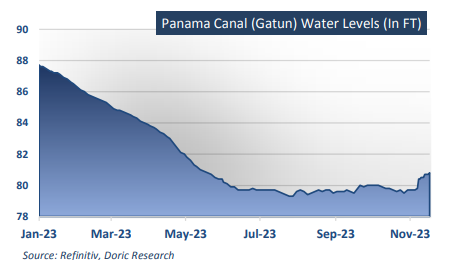
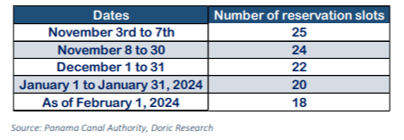
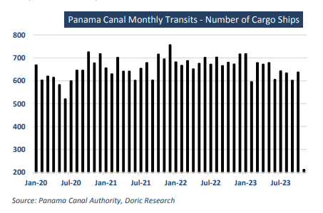

# Doric Weekly Market Insight

**Date:** November 20, 2023  
**Publisher:** Breakwave Advisors | **Category:** Market Insights  
**Original URL:** [https://www.breakwaveadvisors.com/insights/2023/11/20/9j1lbdouo3d74axzywcylr5k1ajqzy](https://www.breakwaveadvisors.com/insights/2023/11/20/9j1lbdouo3d74axzywcylr5k1ajqzy)  

---

> **Figure 1: Homepage+banner+1**  
> **Interactive Data & Source:** [Breakwave Advisors Market Insights](https://www.breakwaveadvisors.com/breakwave-day-2023) | [Local Asset](file:///C:/Users/Dell/Github/Shipping/corpus/03-breakwave/insights/2023/assets/2023-11-20_9j1lbdouo3d74axzywcylr5k1ajqzy_img_homepage2bbanner2b1_5d7211685255.png)

[

> **Figure 2: Bymichalis Voutsinas**  
> *ByMichalis Voutsinas*  
> **Interactive Data & Source:** [Linkedin](https://www.linkedin.com/in/michalis-voutsinas-587544163/) | [Local Asset](file:///C:/Users/Dell/Github/Shipping/corpus/03-breakwave/insights/2023/assets/2023-11-20_9j1lbdouo3d74axzywcylr5k1ajqzy_img_homepage2bbutton_1d014100cc65.png)](https://www.breakwaveadvisors.com/breakwave-day-2023)

## “The Overall Macroeconomic Landscape Appears More Resilient at Last, Promising the Potential for Improved Conditions in the Coming Year. “

Historically high temperatures have been recorded in the year 2023 in the Atlantic Ocean, exacerbated by the presence of the El Niño phenomenon. This phenomenon elevates the temperature of the Pacific Ocean and, in the case of Panama, has caused a delay in the onset of the rainy season. Consequently, there has been a substantial decrease in freshwater levels in the reservoirs of the Panama Canal, which are essential for its operation, as reported by the Panama Canal Authority. October, in particular, witnessed a 41 percent reduction in rainfall compared to the norm, marking the driest October in the last 73 years of recorded data. The ongoing drought is persistently affecting the Panama Canal’s reservoir system, causing Gatun Lake to reach unprecedentedly low levels for this time of year.

> **Figure 3: 1ceb1**  
> **Interactive Data & Source:** [Doric](https://www.doric.gr/) | [Local Asset](file:///C:/Users/Dell/Github/Shipping/corpus/03-breakwave/insights/2023/assets/2023-11-20_9j1lbdouo3d74axzywcylr5k1ajqzy_img_1ceb1_7ff19d0867f3.png)

As less than two months remain until the conclusion of the rainy season, both the Canal and the country are confronted with the challenge of the imminent dry season. The current water reserve, which must sustain over 50 percent of the population and simultaneously support the operations of the interoceanic waterway, is at a critical minimum. In response, starting from November 3rd, booking slots have been reduced to 25 per day from an already diminished 31 per day, as reported by the Canal Authority. This number is expected to undergo further reduction over the next three months, reaching 18 slots per day starting February 2024.

> **Figure 4: 1ceb2**  
> **Interactive Data & Source:** [Doric](https://www.doric.gr/) | [Local Asset](file:///C:/Users/Dell/Github/Shipping/corpus/03-breakwave/insights/2023/assets/2023-11-20_9j1lbdouo3d74axzywcylr5k1ajqzy_img_1ceb2_026ee20ff2f1.png)

Approximately 1,000 vessels navigate through the Panama Canal each month, transporting a collective load exceeding 40 million tonnes of goods, constituting around 5 percent of global maritime trade volumes, as per the IMF. However, due to drought-induced restrictions stemming from insufficient rainfall at Gatun Lake, the canal's vital water source, throughput has diminished by approximately 15 million tonnes this year. This has also led to an additional six days in transit for ships. Notably, the impacts of the drought are most acutely felt in ports in Panama, Nicaragua, Ecuador, Peru, El Salvador, and Jamaica, with repercussions reaching as far as Asia, Europe, and North America.

The enduring drought is anticipated to impede trade for months to come, with canal passages projected to reduce by half, from the standard 36 ships per day to 18, by February. Economies heavily dependent on the canal for trade should brace for prolonged disruptions and delays.

> **Figure 5: 1ceb3**  
> **Interactive Data & Source:** [Doric](https://www.doric.gr/) | [Local Asset](file:///C:/Users/Dell/Github/Shipping/corpus/03-breakwave/insights/2023/assets/2023-11-20_9j1lbdouo3d74axzywcylr5k1ajqzy_img_1ceb3_064bf47be72b.png)

While concerns within the shipping community about the disruptive impacts of climate change on global trade are escalating, Goldman Sachs, the American multinational investment bank, has provided a more sanguine perspective for the course of global economy in its latest macro outlook. Goldman Sachs Research anticipates that the global economy will surpass expectations in 2024, echoing the outperformance witnessed in 2023. The leading financial institution foresees another year of growth outperformance across the majority of economies worldwide, projecting global growth to balance at 2.6 percent for the coming year.

The primary reason for this optimistic growth outlook is the apparent lack of necessity for central banks to trigger a recession to curb inflation. In fact, inflation rates have already been on a downward trajectory, reaching their lowest levels since 2021 in many cases. In an environment of significantly reduced headline inflation and resilient labor markets, the growth of real disposable income is expected to further bolster GDP growth. Moreover, Goldman Sachs foresees a lesser drag from tighter financial conditions in 2024 compared to 2023, as the maximum impact of monetary tightening on the growth rate typically lags by about two quarters. Lastly, the investment bank anticipates a recovery in manufacturing activity in 2024 following a subdued pace in 2023. The weak industrial activity this year resulted from a confluence of unusual challenges, including a shift in spending back towards services from goods, the European energy crisis, an inventory destocking cycle to rectify an overbuild in 2022, and a slower-than-expected rebound in Chinese manufacturing. Many of these challenges are expected to diminish in the coming year.

Despite facing challenges such as China's ongoing economic slowdown, along with geopolitical and climate change disturbances impacting global trade, the overall macroeconomic landscape appears more resilient at last, promising the potential for improved conditions in the coming year.

Data source:[Doric](https://www.doric.gr/)
