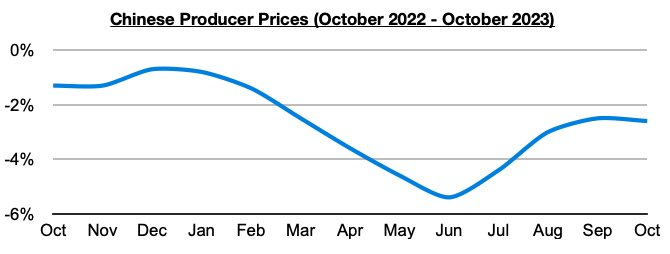
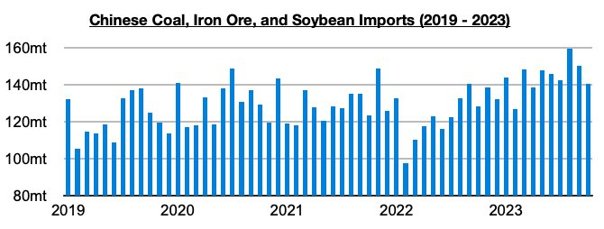
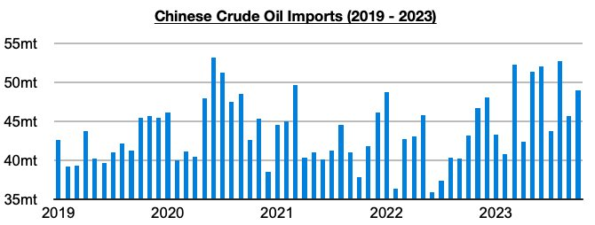

# China Continues to Benefit Greatly in 2023

**Date:** November 20, 2023  
**Publisher:** Breakwave Advisors | **Category:** Market Insights  
**Original URL:** [https://www.breakwaveadvisors.com/insights/2023/11/20/china-continues-to-benefit-greatly-in-2023](https://www.breakwaveadvisors.com/insights/2023/11/20/china-continues-to-benefit-greatly-in-2023)  

---

> **Figure 1: Homepage+banner+1**  
> **Interactive Data & Source:** [Breakwave Advisors Market Insights](https://www.breakwaveadvisors.com/breakwave-day-2023) | [Local Asset](file:///C:/Users/Dell/Github/Shipping/corpus/03-breakwave/insights/2023/assets/2023-11-20_china-continues-to-benefit-greatly-in-2023_img_homepage2bbanner2b1_5d7211685255.png)

[

> **Figure 2: Byjeffrey Landsberg**  
> *ByJeffrey Landsberg*  
> **Interactive Data & Source:** [Linkedin](https://www.linkedin.com/in/jeffrey-landsberg-70ab957/) | [Local Asset](file:///C:/Users/Dell/Github/Shipping/corpus/03-breakwave/insights/2023/assets/2023-11-20_china-continues-to-benefit-greatly-in-2023_img_homepage2bbutton_1d014100cc65.png)](https://www.breakwaveadvisors.com/breakwave-day-2023)

China’s producer prices (which includes commodities and production materials) fell year-on-year in October by 2.6%, marking the thirteenth straight month of contraction. As we have stressed often in Commodore's Weekly Dry Bulk Reports and Weekly China Reports, weaker global commodity prices benefit China much more than it benefits developed economies including the United States and European Union.

> **Figure 3: Chart 1 (83)**  
> [Local Asset](file:///C:/Users/Dell/Github/Shipping/corpus/03-breakwave/insights/2023/assets/2023-11-20_china-continues-to-benefit-greatly-in-2023_img_chart1288329_fa8b9c3682cf.jpg)

With many commodity prices experiencing weakness this year (due primarily to weakness in demand from the world outside of China), China has continued to benefit greatly. As we discussed in our most recent Weekly Dry Bulk Report, China’s imports of coal, iron ore, and soybeans in October most recently totaled 140.6 million tons. This was up year-on-year by 12.3 million tons (10%). Through the first ten months of this year, these imports have grown year-on-year by a total of 223.3 million tons (18%).

> **Figure 4: Chart 2 (74)**  
> [Local Asset](file:///C:/Users/Dell/Github/Shipping/corpus/03-breakwave/insights/2023/assets/2023-11-20_china-continues-to-benefit-greatly-in-2023_img_chart2287429_27b1bbbd7b9f.jpg)

Also of note is that the first ten months of this year have seen China’s crude oil imports grow year-on-year by 59.9 million tons (14%).

> **Figure 5: Chart 3 (52)**  
> [Local Asset](file:///C:/Users/Dell/Github/Shipping/corpus/03-breakwave/insights/2023/assets/2023-11-20_china-continues-to-benefit-greatly-in-2023_img_chart3285229_67ff55ee6147.jpg)
