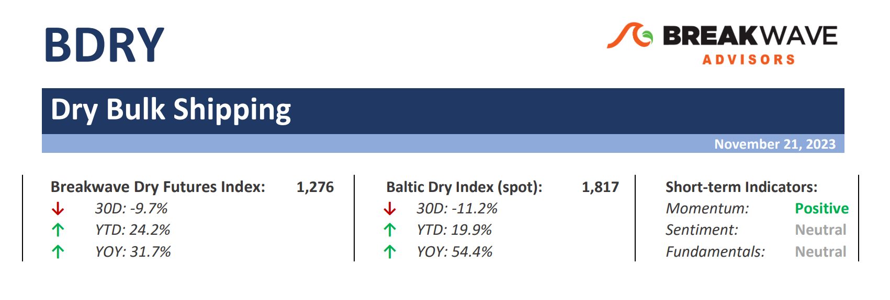
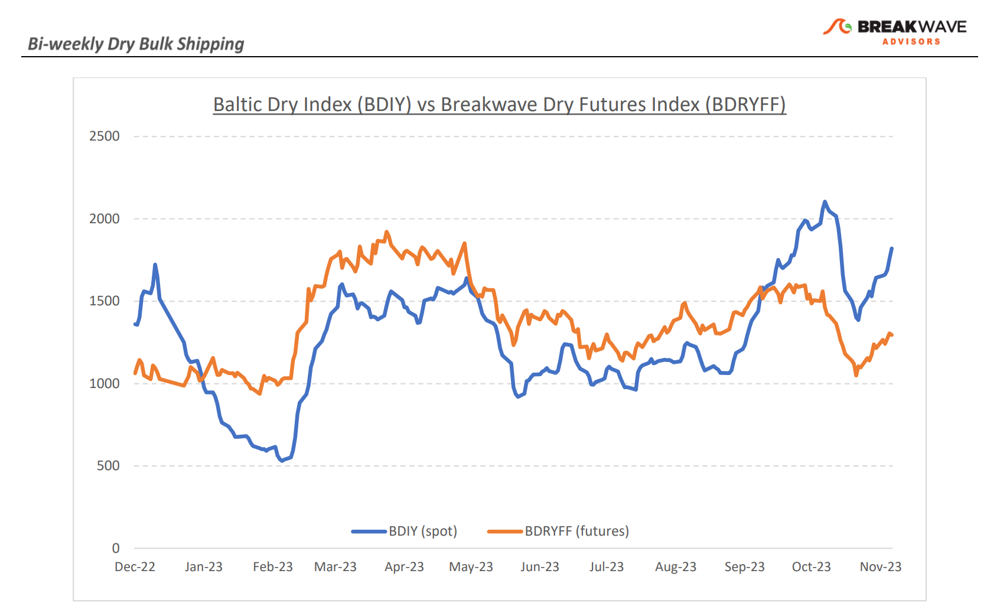
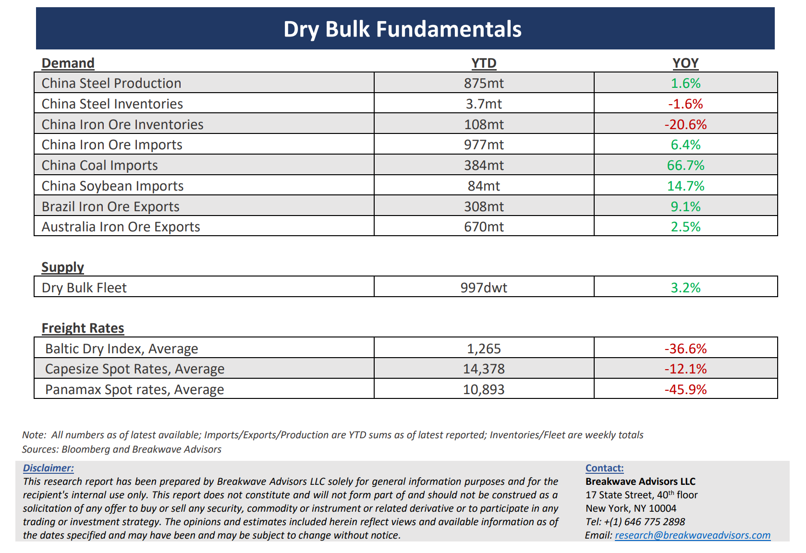

# Breakwave Bi-Weekly Dry Bulk Report - November 21, 2023

**Date:** November 21, 2023  
**Publisher:** Breakwave Advisors | **Category:** Market Insights  
**Original URL:** [https://www.breakwaveadvisors.com/insights/2023/10/31/breakwave-bi-weekly-drybulk-report-nov-21-2023-3r233](https://www.breakwaveadvisors.com/insights/2023/10/31/breakwave-bi-weekly-drybulk-report-nov-21-2023-3r233)  

---

> **Figure 1: Dbreporttop**  
> [Local Asset](file:///C:/Users/Dell/Github/Shipping/corpus/03-breakwave/insights/2023/assets/2023-11-21_breakwave-bi-weekly-drybulk-report-nov-21-2023-3r233_img_dbreporttop_fb242a50dff3.png)

**• Capesize Spot Index bounces back in the 20s… but is a correction inevitable?**– Capesize spot rates staged a sharp rebound following an earlier drop into the mid-teens, with the Index moving firmly above 20,000. Futures indicate a gradual softening as we approach year end, in line with historical seasonal patterns. Additionally, the volume-heavy Brazil route is already priced in the low teens. The fourth quarter will most likely end up being the strongest quarter of 2023, with average Capesize rates above 20,000, and such an outcome mainly reflects the tight Atlantic market (which coincidentally is also the reason why Panamax spot rates have also had an impressive rally so far this quarter). However, as it is always the case, one should not get overly excited about the near future, as the first quarter is upon us and absent any weather-related disruptions, demand for bulk transportation declines, leading to lower spot rates versus the rest of the year. We believe the spot Capesize requirements for the first several months of 2024 out of Brazil will be minimal, which in turn should have a dampening effect on spot rates for that period. Yet, a lot of such a prediction is priced-in the futures curve (after all, Q1 contracts are already trading more than 50% below spot), but the surprise element can go both ways and we have experienced low-single digit spot rates in the past during such weak periods. For now though, Q4 contracts are settling with a decent gain, something that was not expected a few months ago. Can Q1 also surprise us on the upside? Time will tell, but it is volatility that generates positive returns in shipping, and we should be getting plenty of that in the coming months.

**• More stimulus from China, but little results so far**– The Chinese government continues to push new measures and add more liquidity into the economy, but so far there has been little evidence of a change in the underlying economic conditions, especially when it comes to real estate. As we have discussed in the past, the issue is more fundamental and adding liquidity does little to address the root causes of the current housing turmoil in that part of the world. After all, it is mainly a matter of confidence in the long-term outlook of China’s housing prospects, and it is difficult to change public opinion by just throwing more money into the problem. The Chinese consumer has become a major creditor of real estate in China as the past practice of pre-paying part of the construction costs before completion has left a significant part of the consumers exposed to a real estate developer industry that is in the brick of insolvency. No wonder that banks remain hesitant to finance existing projects given the declines in value and the credit priority that homeowners will eventually have if housing units are not completed.

**• Dry bulk focus shifts back to fundamentals**– Following a period of high uncertainty and significant disruptions across the commodity spectrum, the gradual normalization of trade is shifting the market’s attention back to the traditional demand and supply dynamics that have shaped dry bulk profitability for decades. As effective fleet supply growth for the next few years looks manageable, demand will be the main determinant of spot freight rates with China returning back to the driver’s seat as the dominant force of bulk imports and thus shipping demand.

> **Figure 2: Dbreportchart**  
> [Local Asset](file:///C:/Users/Dell/Github/Shipping/corpus/03-breakwave/insights/2023/assets/2023-11-21_breakwave-bi-weekly-drybulk-report-nov-21-2023-3r233_img_dbreportchart_196c87098325.png)

> **Figure 3: Dbreportbottom**  
> [Local Asset](file:///C:/Users/Dell/Github/Shipping/corpus/03-breakwave/insights/2023/assets/2023-11-21_breakwave-bi-weekly-drybulk-report-nov-21-2023-3r233_img_dbreportbottom_1bc4763e3d47.png)

### Subscribe:
