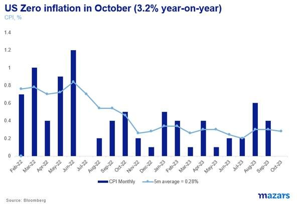
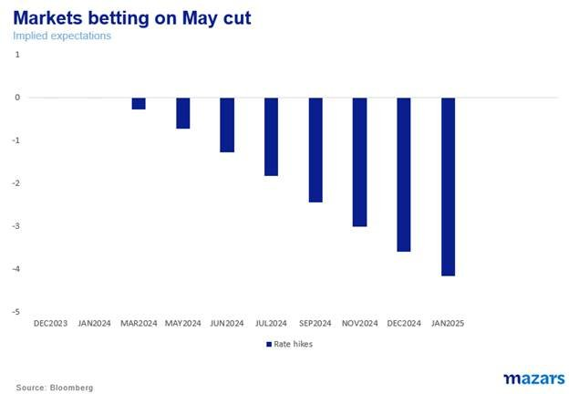
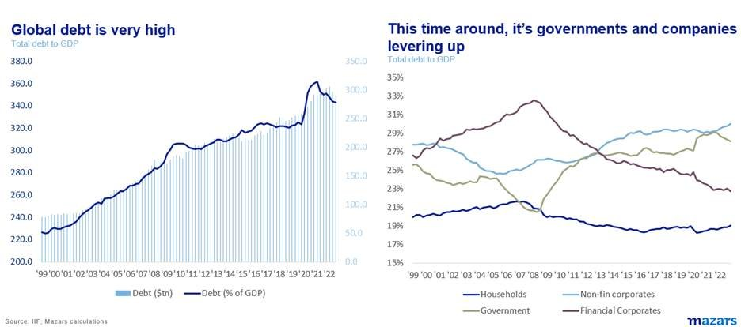

# So, is inflation really beaten this time?

**Date:** November 21, 2023  
**Publisher:** Breakwave Advisors | **Category:** Market Insights  
**Original URL:** [https://www.breakwaveadvisors.com/insights/2023/11/21/so-is-inflation-really-beaten-this-time](https://www.breakwaveadvisors.com/insights/2023/11/21/so-is-inflation-really-beaten-this-time)  

---

> **Figure 1: Homepage+banner+1**  
> **Interactive Data & Source:** [Breakwave Advisors Market Insights](https://www.breakwaveadvisors.com/breakwave-day-2023) | [Local Asset](file:///C:/Users/Dell/Github/Shipping/corpus/03-breakwave/insights/2023/assets/2023-11-21_so-is-inflation-really-beaten-this-time_img_homepage2bbanner2b1_5d7211685255.png)

[

> **Figure 2: Three Things Investors Should Know at the Beginning of the Week**  
> *The three things investors should know at the beginning of the week*  
> **Interactive Data & Source:** [Linkedin](https://www.linkedin.com/in/george-lagarias-mba-3baa769/) | [Local Asset](file:///C:/Users/Dell/Github/Shipping/corpus/03-breakwave/insights/2023/assets/2023-11-21_so-is-inflation-really-beaten-this-time_img_homepage2bbutton_1d014100cc65.png)](https://www.breakwaveadvisors.com/breakwave-day-2023)

1. *Inflation might be down, but it is probably not out. Consumers might come back for the festive season, geopolitics remain challenging, the labour market remains tight and rent prices are still high.*
2. *Where we stand today, we need to see more compelling evidence of consumer weakness, as well as government restraint against pro-cyclical fiscal expansion.*
3. *A bet on rates coming down might be premature. Yields coming off too fast actually undermines the rate pause, which was partly justified by the fact that the market had done a lot of tightening for central banks. There’s no need to rush locking in a yield. Yields aren’t going to disappear. A decade and a half of zero-rates was traumatic for buy-and-hold bond investors, to be sure, but with all the debt and the spending that needs to happen, we aren’t likely to experience floored interest rates and below 2% inflation anytime soon.*

*By*[*George Lagarias*](https://www.linkedin.com/in/george-lagarias-mba-3baa769/)

Last week, inflation readings in both the US and the UK were encouraging. For September prices didn't move at all, so the year-on-year headline number dropped to 3.2% and 4.7% respectively. Consumption in both countries is weakening, and data in the UK was especially poor, suggesting that high interest rates are finally deterring consumers from paying higher prices.

> **Figure 3: Market Chart 3**  
> [Local Asset](file:///C:/Users/Dell/Github/Shipping/corpus/03-breakwave/insights/2023/assets/2023-11-21_so-is-inflation-really-beaten-this-time_img_image00428429_62f06b656d54.jpg)

Yields dropped significantly last week, and stocks resumed their rally towards all-time highs, as markets are now pricing in rate cuts early to mid-next year.

> **Figure 4: Market Chart 4**  
> [Local Asset](file:///C:/Users/Dell/Github/Shipping/corpus/03-breakwave/insights/2023/assets/2023-11-21_so-is-inflation-really-beaten-this-time_img_image00528629_795c4e2538fe.jpg)

With the conflict in the Middle East contained within the region and no oil embargoes in sight, the question in everyone’s mind is whether this second wave of inflation is finally pushed back. Are we inching towards normality?

Our opinion is not too dissimilar from that of the central banks. “Wait for it”.

For one, we are now entering the festive season, where discretionary spending finally picks up. Consumers have learned to wait for sales on Black Friday. Following that, there’s traditional Christmas spending. We should wait for December’s data for a more accurate picture.

Second, in terms of non-discretionary spending, energy prices might be coming off, but tensions are still high. The recent energy and food conflagrations as a result of war weren’t accidents. They were engineered. It stands to reason that leaders who want to see further political upsets won’t necessarily stop here.

Third, there’s no real estate crash. While this is good for those who own the asset, it’s bad for those who need it and have to pay for it as it keeps rents very high. City-based workers are still forced to demand higher salaries at year-end, which employers might have to pay.

Fourth, labour markets remain rather tight across the board. This means that getting back to a sustainable 2% inflation path will not be easy. Many Fed members have expressed the opinion that they might have yet to do more inflation fighting, and it would be unwise not to take them at their word.

Long-term factors are not very positive for inflation returning to a sustainable 2% either.

Infrastructure spending still needs to happen en masse. We are moving from the era of computing to the era of AI. At the same time, we are moving from the era of the Pax Americana to a multi-polar world, which requires supply chains to be rebuilt. Infrastructure has been suffering from underinvestment in the Western world for years. The US has picked up the pace, but Europe is still falling behind.

And then there’s the issue of debt. Global debt to GDP stands at a near record of 340% to GDP. Interest payments in the US and the UK are soaring. Government fiscal expansion does not help the fight against inflation. And if governments want money to keep refinancing their debt then they will either need to pay a decent yield to investors, or test central bank independence by compelling them to buy government debt.

> **Figure 5: Market Chart 5**  
> [Local Asset](file:///C:/Users/Dell/Github/Shipping/corpus/03-breakwave/insights/2023/assets/2023-11-21_so-is-inflation-really-beaten-this-time_img_image00628929_859951e3a82e.jpg)

Inflation might be down, but it is probably not out. Central bankers are right to worry about declaring victory too soon. They have been burned in the past. To quote Winston Churchill, “we must be very careful not to assign to this deliverance the attributes of a victory”. At least not just yet. Where we stand today, we need to see more compelling evidence of consumer weakness, as well as government restraint against pro-cyclical fiscal expansion.

What does this mean for investors?

One, a bet on rates coming down might be premature. Markets are now betting on May for the first US rate cuts, but markets also have a history of mispricing rates. Yields coming off too fast actually undermines the rate pause, which was partly justified by the fact that the market had done a lot of tightening for central banks.

Second, there’s no need to rush locking in a yield. Yields aren’t going to disappear. A decade and a half of zero-rates was traumatic for buy-and-hold bond investors, to be sure, but with all the debt and the spending that needs to happen, we aren’t likely to experience floored interest rates and below 2% inflation anytime soon.
