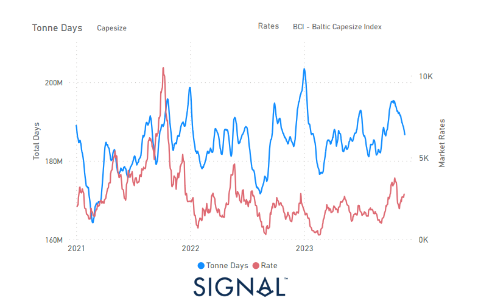
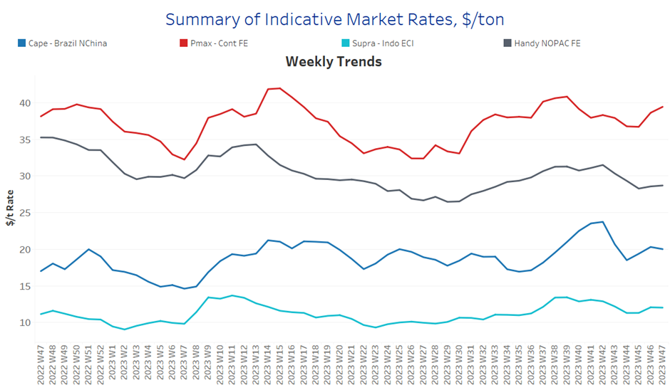
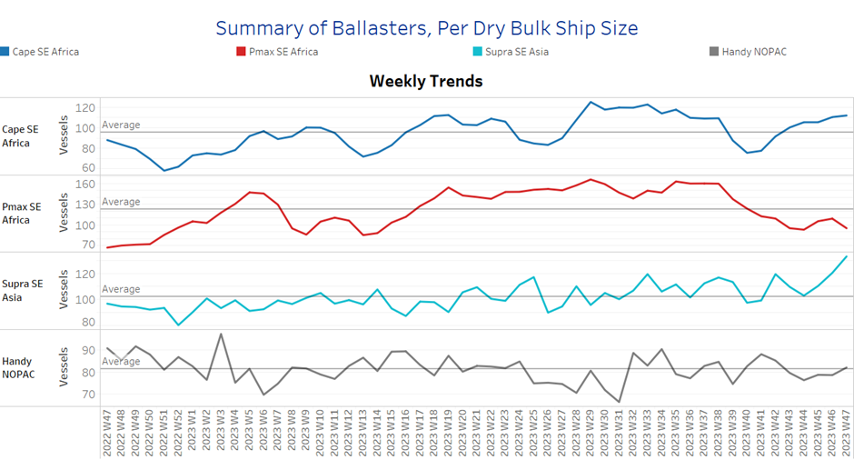
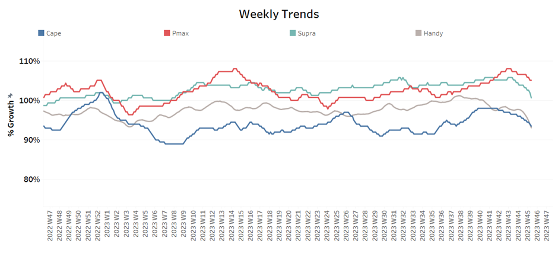
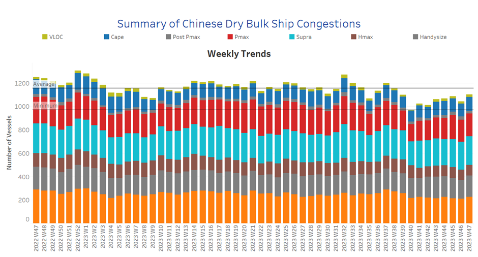

# Signal Dry Bulk Weekly Report

**Date:** November 22, 2023  
**Publisher:** Breakwave Advisors | **Category:** Market Insights  
**Original URL:** [https://www.breakwaveadvisors.com/insights/2023/11/22/r8gcvmsacgua3v7mrq5rxsti2x6zjk](https://www.breakwaveadvisors.com/insights/2023/11/22/r8gcvmsacgua3v7mrq5rxsti2x6zjk)  

---

## Chart of the Week :Dry Bulk Capesize Tonne Days to All Destinations​​​​​

### The Last Spike in Tonne Days Growth in Mid October Triggered the Recent Upturn in the BCI

> **Figure 1: Market Chart 1**  
> **Interactive Data & Source:** [Signal Ocean Platform](https://www.thesignalgroup.com/signal-ocean-platform) | [Local Asset](file:///C:/Users/Dell/Github/Shipping/corpus/03-breakwave/insights/2023/assets/2023-11-22_r8gcvmsacgua3v7mrq5rxsti2x6zjk_img_unnamed-2023-11-22t141116142_f8fe56d4ca1f.png)

During the fourth week of November, larger ship categories maintained their stability from preceding days. Notably, the Panamax vessel size exhibited noteworthy gains. Meanwhile, the uncertainty surrounding a stronger momentum for the Capesize segment appeared to have diminished, showing signs of an upturn.
Of particular interest is the observation that the surge in demand tonne days for Capesize vessels, noted since mid-October, played a pivotal role in creating a more robust freight environment. This, in turn, contributes to a more optimistic outlook as we approach the end of the month.

Meanwhile, iron ore prices have started to find a firmer environment with positive news on the Chinese economic stimulus drive. According to mining. Com news, iron ore experienced a remarkable rally, reaching its highest intraday price since February, driven by growing optimism about demand. The key steelmaking commodity rose by up to 2.3% in Singapore, after gaining 2% the previous day.
This momentum was fueled by an editorial in the state media on Tuesday, which emphasised that the funds from the one trillion yuan ($140 billion) bond issue recently announced by Beijing should be used immediately for construction projects.

​​​For more information on this week's trends, see the analysis sections below:

Freight Market, Supply, Demand and Port Congestion

## Section 1/ Freight

‘The Big Picture’ - Capesize and Panamax Bulkers and Smaller Ship Sizes

Market Rates ($/t) Mixed

> **Figure 2: Market Chart 2**  
> **Interactive Data & Source:** [Signal Ocean Platform](https://www.thesignalgroup.com/signal-ocean-platform) | [Local Asset](file:///C:/Users/Dell/Github/Shipping/corpus/03-breakwave/insights/2023/assets/2023-11-22_r8gcvmsacgua3v7mrq5rxsti2x6zjk_img_unnamed-2023-11-22t141239463_a0b61c9e6832.png)

In the last few days of November, Capesize Brazil-N China rates have weakened, while Panamax Cont FE rates are still showing a significant increase compared to the levels of two weeks ago. In the smaller

- Capesize vessel freight rates from Brazil to North China reached $20/tonne, down $5/tonne from the October 18 peak, with the difficult economic situation in China appearing to have a negative impact on sentiment.
- Panamax vessel freight rates from the Continent to the Far East have been $39-40 per tonne for three weeks in a row, and it looks like November will end with similar highs as almost ten weeks ago.
- Supramax vessel freight rates on the Indo-ECI route increased by 2% to $12 per tonne compared to the previous week, but were still 6% lower than a month ago.
- Handysize freight rates for the NOPAC Far East route have still hovered below $30/tonne since early November, with rates in recent days at $29/tonne, down 19% from a similar week last November.

## Section 2/ Supply

> **Figure 3: Supply Trend Lines for Key Load Areasballasters (#Vessels) Increasing**  
> **Interactive Data & Source:** [Signal Ocean Platform](https://www.thesignalgroup.com/signal-ocean-platform) | [Local Asset](file:///C:/Users/Dell/Github/Shipping/corpus/03-breakwave/insights/2023/assets/2023-11-22_r8gcvmsacgua3v7mrq5rxsti2x6zjk_img_unnamed-2023-11-22t141356067_081dea501bb1.png)

The number of ballasters has continued to increase significantly in the Capesize and Supramax segments, while the Panamax segment has seen a sustained downward trend, which is fueling optimism for a further firming of rates in the coming days.

- Capesize SE Africa: The number of ballasters held accelerated levels at above 100, with the last low in week 40 (~76).
- Panamax SE Africa: The number of ballasters dropped significantly to 97, when the last peak was at week 38 (~160).
- Supramax SE Asia: The number of ballast ships remained at the previous week's level of 120, with a constant upward trend for four consecutive weeks.
- Handysize NOPAC: The number of ballast ships indicated a rise to 85, when last week hovered at around 90, while the latest low remained at week 44 (~76).

## Section 3/ Demand

> **Figure 4: Summary of Dry Bulk Demand, per Ship Sizetonne Days Decreasing**  
> **Interactive Data & Source:** [Signal Ocean Platform](https://www.thesignalgroup.com/signal-ocean-platform) | [Local Asset](file:///C:/Users/Dell/Github/Shipping/corpus/03-breakwave/insights/2023/assets/2023-11-22_r8gcvmsacgua3v7mrq5rxsti2x6zjk_img_unnamed-2023-11-22t141506699_87c7834a7ad1.png)

Demand growth has decreased for all ship sizes over the last seven weeks, and there were no signs of recovery yet, with the Panamax vessel size recording a stronger performance than other vessel sizes.

- Capesize: The downward trend is confirmed one week more, with the last peak at week 41, while the growth rate has not yet fallen to the lows of week 38.
- Panamax: November still signals a lower growth trend than October, but the recent levels seem to favour a firmer sentiment in the freight market.
- Supramax: The growth rate held a decreased pace by falling to the lowest levels since the end of week 44.
- Handysize: Demand growth has not yet shown any signs of an upward trend, while the last peak appeared at week 25.​​​​​​

## Section 4/ Port Congestion

> **Figure 5: Dry Bulk Ships Congested at Chinese Portsno of Vessels Increasing**  
> **Interactive Data & Source:** [Signal Ocean Platform](https://www.thesignalgroup.com/signal-ocean-platform) | [Local Asset](file:///C:/Users/Dell/Github/Shipping/corpus/03-breakwave/insights/2023/assets/2023-11-22_r8gcvmsacgua3v7mrq5rxsti2x6zjk_img_unnamed-2023-11-22t141604479_644474c9f326.png)

The level of ship congestion increased following the downward trend of the previous week, with higher levels of congestion in all vessel size categories.

- Capesize: The number of congested vessels rose to 120, 9 more than the previous week, while the number of overloaded ships seemed unlikely to fall below 100.
- Panamax: The number of congested ships fell rose to 200, 10 more than the previous week, with signs of an accelerated rise ending the month.
- Supramax: The number of ships is now above 240, almost 10 higher than the previous week, with a tendency to stay above 200, as we have not seen values around 200 since the end of week 40.
- Handysize: The number of congested ships is now around 180, almost 20 higher than the previous week, and there are signs of a further increase at the end of month.

Data Source:[Signal Ocean Platform](https://www.thesignalgroup.com/signal-ocean-platform)
