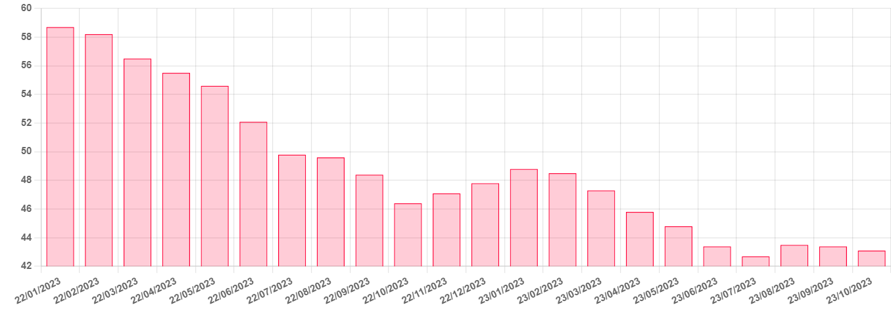

# Distillate Disconnect

**Date:** November 23, 2023  
**Publisher:** Breakwave Advisors | **Category:** Market Insights  
**Original URL:** [https://www.breakwaveadvisors.com/insights/2023/11/23/distillate-disconnect](https://www.breakwaveadvisors.com/insights/2023/11/23/distillate-disconnect)  

---

> **Figure 1: Homepage+banner+1**  
> **Interactive Data & Source:** [Breakwave Advisors Market Insights](https://www.breakwaveadvisors.com/breakwave-day-2023) | [Local Asset](file:///C:/Users/Dell/Github/Shipping/corpus/03-breakwave/insights/2023/assets/2023-11-23_distillate-disconnect_img_homepage2bbanner2b1_5d7211685255.png)

[

> **Figure 2: Homepage2bbutton**  
> **Interactive Data & Source:** [Gibsons Co](https://www.gibsons.co.uk/market-reports) | [Local Asset](file:///C:/Users/Dell/Github/Shipping/corpus/03-breakwave/insights/2023/assets/2023-11-23_distillate-disconnect_img_homepage2bbutton_1d014100cc65.png)](https://www.breakwaveadvisors.com/breakwave-day-2023)

## Distillate Disconnect

The European oil demand outlook is back in focus ahead of this winter, as continued macroeconomic developments cast a shadow over the region’s energy market. In particular, European distillate demand is expected to underperform as lower industrial activity, reduced road fuel demand and EV uptake gathers pace. With that in mind, one might question whether underlying demand levels are sufficient to sustain a bullish product tanker market.

The latest Eurozone manufacturing PMI reading for October came in at 43.1, falling further from September’s reading of 43.4, both of which indicate a contraction in regional economic activity. Weaker industrial output combined with worsening consumer sentiment is a clear sign that European demand is likely to remain under pressure into 2024. The latest IEA data shows OECD Europe gasoil demand decreased by 400 kbd in Q3, while overall demand for the whole of 2023 is expected to drop by 100 kbd, followed by a further fall of 90 kbd in 2024. The biggest reduction has been seen in Germany, where gasoil demand was 130 kbd lower year on year, a 12.9% decrease. Given Germany’s position as the region’s largest economy with a vast industrial and petrochemical sector, the outlook for Europe is increasingly bleak.

At the same time, regional middle distillate stocks are at their lowest since the end of last year, however, we are not expecting to replicate the large build seen ahead of the ban of Russian diesel into Europe last winter due to current weak demand levels. This signals that despite the expectations for the global distillates market tightening up in the coming months, Europe may able to cope with lower inventories this winter. In terms of imports from the East, these have been decreasing from 1.3 mbd in August to 1.18 mbd in October, while November is trending even lower at 1.14 mbd. This has particularly impacted the LR2 sector, which is underperforming relative to the strength of the Aframax market.

Nevertheless, there might be some cause for the product tanker sector to be optimistic later into the new year. Firstly, from a trading perspective, the East to West gasoil arb should evolve to support interregional flows to Europe for eventual restocking, especially given the fact that Europe is structurally short in distillate production. Secondly, the arb could open up wider as refinery complexes in the Middle East and India come out of their current maintenance schedules, increasing regional supply East of Suez, which should widen the price differentials beyond current levels. Thirdly, with Middle Eastern refineries operating more competitively than those in Europe both in terms of costs and margins, increased volumes from East of Suez are likely to put additional pressure on European refining margins, further disincentivizing local production and supporting imports. On top of this, Middle distillate stocks in Singapore have been rising over recent weeks and excess supply could head West, if the arb and freight support this.

If we see the arb economics translate into sustained higher volumes from the East to Europe for restocking, the LR2 and LR1 sectors should expect to find support from these long haul flows but the extent to which will depend on the health of the European economy which for now has a long way to go in terms of building the required demand strength and industrial activity needed to send a clear pricing signal to facilitate these higher future imports. For now, attention will remain on the state of the European macro environment and how this winter plays out.

## Eurozone Manufacturing Pmi

> **Figure 3: Αρχείο Λήψης (5)**  
> **Interactive Data & Source:** [Gibsons Co](https://www.gibsons.co.uk/market-reports) | [Local Asset](file:///C:/Users/Dell/Github/Shipping/corpus/03-breakwave/insights/2023/assets/2023-11-23_distillate-disconnect_img_ceb1cf81cf87ceb5ceafcebfcebbceaecf88_034992df0ae3.png)

Data source:[Gibson Shipbrokers](https://www.gibsons.co.uk/market-reports)
