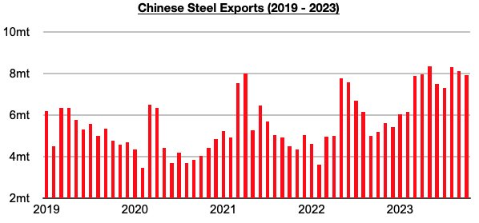
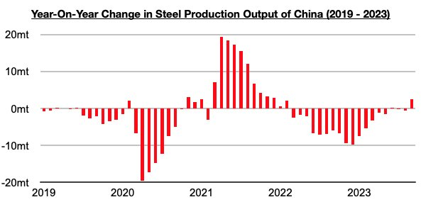
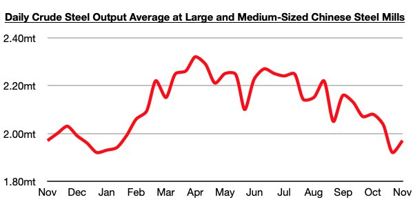

# China's Steel Exports High But Remain Below Peak

**Date:** November 23, 2023  
**Publisher:** Breakwave Advisors | **Category:** Market Insights  
**Original URL:** [https://www.breakwaveadvisors.com/insights/2023/11/23/pwknfxcrpudzi4sdyo11lx5klz6e83](https://www.breakwaveadvisors.com/insights/2023/11/23/pwknfxcrpudzi4sdyo11lx5klz6e83)  

---

> **Figure 1: Homepage+banner+1**  
> **Interactive Data & Source:** [Breakwave Advisors Market Insights](https://www.breakwaveadvisors.com/breakwave-day-2023) | [Local Asset](file:///C:/Users/Dell/Github/Shipping/corpus/03-breakwave/insights/2023/assets/2023-11-23_pwknfxcrpudzi4sdyo11lx5klz6e83_img_homepage2bbanner2b1_5d7211685255.png)

[

> **Figure 2: Byjeffrey Landsberg**  
> *ByJeffrey Landsberg*  
> **Interactive Data & Source:** [Linkedin](https://www.linkedin.com/in/jeffrey-landsberg-70ab957/) | [Local Asset](file:///C:/Users/Dell/Github/Shipping/corpus/03-breakwave/insights/2023/assets/2023-11-23_pwknfxcrpudzi4sdyo11lx5klz6e83_img_homepage2bbutton_1d014100cc65.png)](https://www.breakwaveadvisors.com/breakwave-day-2023)

Back in Commodore's June 12th Weekly Dry Bulk Report, we predicted that China’s steel exports had very likely peaked. At that time, May’s data had just been released and that showed that exports totaled a very robust 8.4 million tons (which marked the largest amount of steel exported since September 2016). While sentiment at the time was that steel exports would continue to rise — even Baosteel was publicly predicting a continued climb in China’s steel exports — it appeared very likely to us that exports would begin to fall due to a firming in global steel output outside of China coinciding with a decline in China’s steel output. So far, our prediction has been correct. June ended up marking the first month all year that exports fell. Previously, exports had risen every month this year.

> **Figure 3: Chart 1 (68)**  
> [Local Asset](file:///C:/Users/Dell/Github/Shipping/corpus/03-breakwave/insights/2023/assets/2023-11-23_pwknfxcrpudzi4sdyo11lx5klz6e83_img_chart1286829_c7860fe1e6f3.jpg)

China’s steel exports have now fallen during four of the last five months — and May’s 8.4 million tons has in fact remained this year's peak and the largest amount exported since 2016. Steel exports in October most recently totaled 7.9 million tons. This is down month-on-month by 200,000 tons (-2%) but up year-on-year by 2.7 million tons (52%).

Going forward, we continue to believe that May’s volume will remain 2023’s peak as steel output outside of China has continued to improve and as China’s own steel output has fallen by a large amount. As we have been highlighting in Commodore's Weekly Dry Bulk Reports and Weekly China Reports, June saw an inflection point as there was finally growth in steel output outside of China. Prior to June, steel output outside of China fell on a year-on-year basis for fifteen straight months (during those fifteen months, production outside of China contracted year-on-year by 77 million tons). June, July, August, and September have collectively seen steel outside of China grow year-on-year by 2.1 million tons.

> **Figure 4: Chart 2 (63)**  
> [Local Asset](file:///C:/Users/Dell/Github/Shipping/corpus/03-breakwave/insights/2023/assets/2023-11-23_pwknfxcrpudzi4sdyo11lx5klz6e83_img_chart2286329_b404ef6aaa37.jpg)

At the same time that steel output has been growing outside of China, steel output in China has fallen significantly (which is normal during the second half of the year). By late October, China's steel output had fallen to the lowest level seen all year. This month, however, has at least seen China's steel output rebound. Most recently, crude steel output at large and medium-sized mills in China averaged 1.97 million tons during November 1 - 10. This has marked a 3% increase from the previous eleven days and is flat from a year ago. Previously, China's steel output had remained down on a year-on-year basis since the middle of September.

> **Figure 5: Chart 3 (45)**  
> [Local Asset](file:///C:/Users/Dell/Github/Shipping/corpus/03-breakwave/insights/2023/assets/2023-11-23_pwknfxcrpudzi4sdyo11lx5klz6e83_img_chart3284529_643e3ad3f1fb.jpg)
