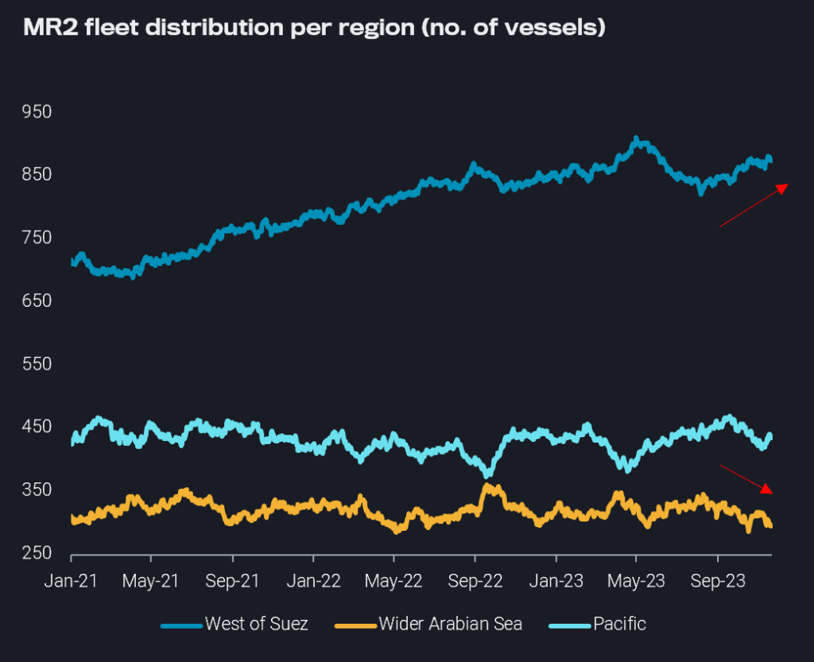
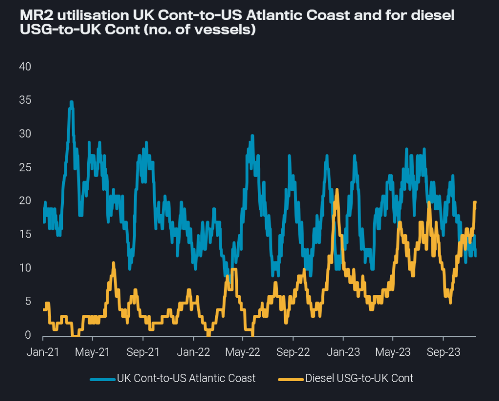
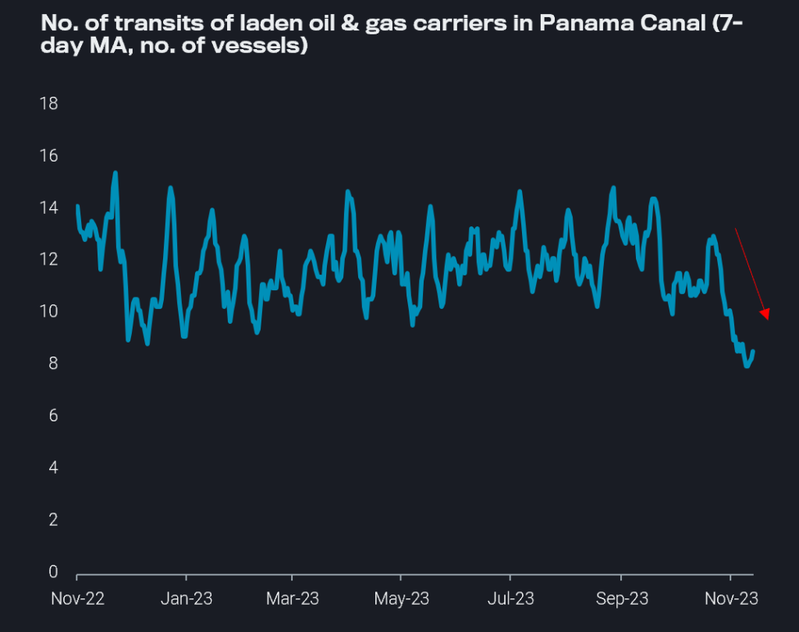

# Uncertainty for MRs migrating to the Atlantic Basin, Panama Canal congestion could create global fleet distribution rigidity

**Date:** November 23, 2023  
**Publisher:** Breakwave Advisors | **Category:** Market Insights  
**Original URL:** [https://www.breakwaveadvisors.com/insights/2023/11/23/uncertainty-for-mrs-migrating-to-the-atlantic-basin-panama-canal-congestion-could-create-global-fleet-distribution-rigidity](https://www.breakwaveadvisors.com/insights/2023/11/23/uncertainty-for-mrs-migrating-to-the-atlantic-basin-panama-canal-congestion-could-create-global-fleet-distribution-rigidity)  

---

> **Figure 1: Homepage+banner+1**  
> **Interactive Data & Source:** [Breakwave Advisors Market Insights](https://www.breakwaveadvisors.com/breakwave-day-2023) | [Local Asset](file:///C:/Users/Dell/Github/Shipping/corpus/03-breakwave/insights/2023/assets/2023-11-23_uncertainty-for-mrs-migrating-to-the-atlantic-basin-panama-canal-congestion-coul_img_homepage2bbanner2b1_5d7211685255.png)

[

> **Figure 2: Homepage2bbutton**  
> **Interactive Data & Source:** [Linkedin](https://www.linkedin.com/search/results/all/?fetchDeterministicClustersOnly=true&heroEntityKey=urn%3Ali%3Afsd_profile%3AACoAABXVyecBtg-pRnIrZe0BoWk0ygPiUfbvhsw&keywords=mary%20melton&origin=RICH_QUERY_TYPEAHEAD_HISTORY&position=0&searchId=f02d1fa9-9e15-44e9-a633-244117dfa6d4&sid=LNw&spellCorrectionEnabled=true) | [Local Asset](file:///C:/Users/Dell/Github/Shipping/corpus/03-breakwave/insights/2023/assets/2023-11-23_uncertainty-for-mrs-migrating-to-the-atlantic-basin-panama-canal-congestion-coul_img_homepage2bbutton_1d014100cc65.png)](https://www.breakwaveadvisors.com/breakwave-day-2023)

## Incentives for Mrs to Migrate East-to-West Are Currently High, But a Mixed Outlook in the Atlantic Basin Due to Weak Product Export Demand Awaits, and Panama Canal Congestion Could Mean Vessels Cannot Easily Reposition Going Forward.

*By*[*Mary Melton*](https://www.linkedin.com/search/results/all/?fetchDeterministicClustersOnly=true&heroEntityKey=urn%3Ali%3Afsd_profile%3AACoAABXVyecBtg-pRnIrZe0BoWk0ygPiUfbvhsw&keywords=mary%20melton&origin=RICH_QUERY_TYPEAHEAD_HISTORY&position=0&searchId=f02d1fa9-9e15-44e9-a633-244117dfa6d4&sid=LNw&spellCorrectionEnabled=true)

Migration to the West of Suez is increasing as Atlantic Basin earnings are now more than double Pacific Earnings (source: Baltic Exchange). East Asia and South East Asia’s exports on MRs have declined and Pacific Basin freight rates ([TC7](https://analytics.vortexa.com/?availabilitySplit=none&dateRange=last-24-months&fixtureSortOrder=laycan_from&fixturesOrderDirection=asc&outlook=outlook_1d&page=FreightPricing&preset=TC7&ratesBreakdownProperty=cost&tabId=c2aad4a1-7747-485c-b1ac-1dd09bbce4b8),[TC10](https://analytics.vortexa.com/?availabilitySplit=none&dateRange=last-24-months&fixtureSortOrder=laycan_from&fixturesOrderDirection=asc&outlook=outlook_1d&page=FreightPricing&preset=TC10&ratesBreakdownProperty=cost&tabId=c2aad4a1-7747-485c-b1ac-1dd09bbce4b8),[TC11](https://analytics.vortexa.com/?availabilitySplit=none&dateRange=last-24-months&fixtureSortOrder=laycan_from&fixturesOrderDirection=asc&outlook=outlook_1d&page=FreightPricing&preset=TC11&ratesBreakdownProperty=cost&tabId=c2aad4a1-7747-485c-b1ac-1dd09bbce4b8)) have been under pressure as[East Asia prompt availability surpasses](https://analytics.vortexa.com/?chartPeriod=all-available&filtersEnabled=%5B%22l%22%2C%22d%22%2C%22v%22%2C%22d_r%22%2C%22s%22%2C%22o%22%2C%22l_c%22%2C%22p_v%22%2C%22v_a%22%2C%22i_d%22%5D&isRegion=1&latestProducts=%5B%22b68cbb746f8b9098c50e2ba36bcad83001a53bd362e9031fb49085d02c36659c%22%5D&locationId=212fb4cfc862391faeacc63aa3ceb446a1c5ba6073da2a4e514a496e4c850635&page=VesselAvailability&previouslyVisited=0&selectedBarKeys=%5B%225%20-%209%20days%22%2C%22Today%20-%204%20days%22%5D&showFixed=0&splitSeries=0&tabId=08794a1a-c71d-4554-a3b1-59184681c591&v=3&vesselClasses=%5B%22oil_handymax_mr2%22%5D&vesselStatus=ballast)multi-year highs. However, there are a few factors at play that may make the decision to migrate East-to-West not as clear-cut as it appears in the medium-term.

> **Figure 3: MR2 Fleet Distribution per Region (No**  
> *MR2 fleet distribution per region (no. of vessels), retrievedvia Freight API/SDK*  
> **Interactive Data & Source:** [Vortexa](https://www.vortexa.com/product-api-and-sdk/) | [Local Asset](file:///C:/Users/Dell/Github/Shipping/corpus/03-breakwave/insights/2023/assets/2023-11-23_uncertainty-for-mrs-migrating-to-the-atlantic-basin-panama-canal-congestion-coul_img_21nov23-insight-img1-1024x833_b54184c099fd.png)

## Mixed Picture in Atlantic Basin

Although there is increased migration to the West of Suez, the outlook for MRs headed to the Atlantic Basin is mixed.

In the UK Cont, the outlook is bearish as[low utilisation to the US Atlantic Coast continues](https://analytics.vortexa.com/?dateRange=2021-01-01T00%3A00%3A00.000Z__2023-11-18T23%3A59%3A59.999Z&from=%5B%227fe5c7cd39e8e95bfab135ca495b1fb577367ae89e3f6148375b9122bd8c461a%22%5D&geoBreakdownDestinationGlobal=destination_shipping_region&geoBreakdownOriginGlobal=origin_shipping_region&latestProducts=%5B%22b68cbb746f8b9098c50e2ba36bcad83001a53bd362e9031fb49085d02c36659c%22%5D&latestProductsExcluded=%5B%22364ccbb996c944055b479810a8e74863267885dc1b01407cb0f00ab26dafe1e1%22%5D&page=FleetUtilisation&primarySplitProperty2=product_group_product&primaryTimeSeries2=tonne-miles&secondaryTimeSeries1=hide&tabId=113a2e44-e113-4507-9ff8-124a74694ec1&to=%5B%22244ad5cc63e68a0332c8c0bd31393f02fd8810cc7f0bcc7a7545f4a6603fbb4c%22%5D&v=4&vesselClasses=%5B%22oil_handymax_mr2%22%5D&voyageStatus=%5B%22laden%22%5D)due to PADD 1 being well-supplied with gasoline heading into the holiday season. At the same time, employment[UK Cont-to-WAf](https://analytics.vortexa.com/?dateRange=2021-01-01T00%3A00%3A00.000Z__2023-11-18T23%3A59%3A59.999Z&from=%5B%227fe5c7cd39e8e95bfab135ca495b1fb577367ae89e3f6148375b9122bd8c461a%22%5D&geoBreakdownDestinationGlobal=destination_shipping_region&geoBreakdownOriginGlobal=origin_shipping_region&latestProducts=%5B%22b68cbb746f8b9098c50e2ba36bcad83001a53bd362e9031fb49085d02c36659c%22%5D&latestProductsExcluded=%5B%22364ccbb996c944055b479810a8e74863267885dc1b01407cb0f00ab26dafe1e1%22%5D&page=FleetUtilisation&primarySplitProperty2=product_group_product&primaryTimeSeries2=tonne-miles&secondaryTimeSeries1=hide&tabId=113a2e44-e113-4507-9ff8-124a74694ec1&to=%5B%229f9774f40a5a36f75ae844510feaf1c01c262cf84ba1f229ff6a93fb8e0171e2%22%5D&v=4&vesselClasses=%5B%22oil_handymax_mr2%22%5D&voyageStatus=%5B%22laden%22%5D)has remained under pressure most of this year, especially after the removal of gasoline subsidies in Nigeria made European gasoline imports too expensive.

Over in the US Gulf, there is currently a better outlook for MRs.[USG prompt availability](https://analytics.vortexa.com/?chartPeriod=all-available&filtersEnabled=%5B%22l%22%2C%22d%22%2C%22v%22%2C%22d_r%22%2C%22s%22%2C%22o%22%2C%22l_c%22%2C%22p_v%22%2C%22v_a%22%2C%22i_d%22%5D&isRegion=1&latestProducts=%5B%22b68cbb746f8b9098c50e2ba36bcad83001a53bd362e9031fb49085d02c36659c%22%5D&locationId=e0d68b7a4ac37c97e3387471644d8b5c2a4be16a50092676ec3bec08408a2ebb&page=VesselAvailability&previouslyVisited=0&selectedBarKeys=%5B%22Today%20-%204%20days%22%2C%225%20-%209%20days%22%5D&showFixed=0&splitSeries=0&tabId=08794a1a-c71d-4554-a3b1-59184681c591&v=3&vesselClasses=%5B%22oil_handymax_mr2%22%5D&vesselStatus=ballast)looks tight while freight rates are currently at their highest since February 2023 ([TC14](https://analytics.vortexa.com/?availabilitySplit=none&dateRange=last-24-months&fixtureSortOrder=laycan_from&fixturesOrderDirection=asc&outlook=outlook_1d&page=FreightPricing&preset=TC14&ratesBreakdownProperty=cost&tabId=c2aad4a1-7747-485c-b1ac-1dd09bbce4b8),[TC18](https://analytics.vortexa.com/?availabilitySplit=none&dateRange=last-24-months&fixtureSortOrder=laycan_from&fixturesOrderDirection=asc&outlook=outlook_1d&page=FreightPricing&preset=TC18&ratesBreakdownProperty=cost&tabId=c2aad4a1-7747-485c-b1ac-1dd09bbce4b8)). The resurgence of European demand for US diesel is offering long-haul employment:[utilisation USG-to-UK Cont for diesel](https://analytics.vortexa.com/?dateRange=2021-01-01T00%3A00%3A00.000Z__2023-11-18T23%3A59%3A59.999Z&from=%5B%22e0d68b7a4ac37c97e3387471644d8b5c2a4be16a50092676ec3bec08408a2ebb%22%5D&geoBreakdownDestinationGlobal=destination_shipping_region&geoBreakdownOriginGlobal=origin_shipping_region&latestProducts=%5B%22deda35eb9ca56b54e74f0ff370423f9a8c61cf6a3796fcb18eaeeb32a8c290bb%22%5D&page=FleetUtilisation&primarySplitProperty2=product_group_product&primaryTimeSeries2=tonne-miles&secondaryTimeSeries1=hide&tabId=113a2e44-e113-4507-9ff8-124a74694ec1&to=%5B%227fe5c7cd39e8e95bfab135ca495b1fb577367ae89e3f6148375b9122bd8c461a%22%5D&v=4&vesselClasses=%5B%22oil_handymax_mr2%22%5D&voyageStatus=%5B%22laden%22%5D)is at 3.5-month highs. However, this might not continue at high levels as Europe’s diesel stocks through October were higher y-o-y (source: Argus), refinery utilisation in the US Gulf shows no upside, and refinery maintenance in Europe and the Wider Arabian Sea is ending. Additionally, rising USG freight rates could lead to a lack of workable arbitrage economics.

> **Figure 4: MR2 Utilisationuk Cont-to-Us Atlantic Coastand Fordiesel**  
> *MR2 utilisationUK Cont-to-US Atlantic Coastand fordiesel USG-to-UK Cont(no. of vessels)*  
> **Interactive Data & Source:** [Analytics Vortexa](https://analytics.vortexa.com/?dateRange=2021-01-01T00%3A00%3A00.000Z__2023-11-18T23%3A59%3A59.999Z&from=%5B%227fe5c7cd39e8e95bfab135ca495b1fb577367ae89e3f6148375b9122bd8c461a%22%5D&geoBreakdownDestinationGlobal=destination_shipping_region&geoBreakdownOriginGlobal=origin_shipping_region&latestProducts=%5B%22b68cbb746f8b9098c50e2ba36bcad83001a53bd362e9031fb49085d02c36659c%22%5D&latestProductsExcluded=%5B%22364ccbb996c944055b479810a8e74863267885dc1b01407cb0f00ab26dafe1e1%22%5D&page=FleetUtilisation&primarySplitProperty2=product_group_product&primaryTimeSeries2=tonne-miles&secondaryTimeSeries1=hide&tabId=aef829f0-9d5e-4304-8786-b7b0c1a06b5c&to=%5B%22244ad5cc63e68a0332c8c0bd31393f02fd8810cc7f0bcc7a7545f4a6603fbb4c%22%5D&v=4&vesselClasses=%5B%22oil_handymax_mr2%22%5D&voyageStatus=%5B%22laden%22%5D) | [Local Asset](file:///C:/Users/Dell/Github/Shipping/corpus/03-breakwave/insights/2023/assets/2023-11-23_uncertainty-for-mrs-migrating-to-the-atlantic-basin-panama-canal-congestion-coul_img_21nov23-insight-img2-1024x82428129_e4de4ff15138.png)

## Panama Canal Transit Issues Could Hinder Migration

Reduced transit slots as drought conditions in the Panama Canal persist are also contributing to overall uncertainty.[Transits through the canal for all laden oil and gas carriers continue to decline](https://analytics.vortexa.com/?chartView=bar&dateRange=last-12-months&filtersEnabled=%5B%22l%22%2C%22v%22%2C%22l_c%22%2C%22o%22%2C%22d%22%2C%22v_v_st%22%2C%22v_f%22%2C%22v_o%22%2C%22v_c%22%5D&location=%5B%22bd1594fc2d1404fa06f9406139c7620bb4d9f495bc33bb44cc153a327b0b40d8%22%5D&page=FleetDistribution&tabId=f18049f7-3bcf-4f62-8aba-7aa3bff871f3&v=3&voyageStatus=%5B%22laden%22%5D), which is likely to continue to cause difficulty for MRs transiting either to or from the Atlantic or Pacific Basin via the canal. Moving forward, fleet inflexibility looks likely, as repositioning and migration may be more difficult. If Atlantic Basin rates drop, MRs may not be able to go to the Pacific.

> **Figure 5: 21nov23insight Img3 1024x810**  
> **Interactive Data & Source:** [Analytics Vortexa](https://analytics.vortexa.com/?chartView=bar&dateRange=last-12-months&filtersEnabled=%5B%22l%22%2C%22v%22%2C%22l_c%22%2C%22o%22%2C%22d%22%2C%22v_v_st%22%2C%22v_f%22%2C%22v_o%22%2C%22v_c%22%5D&location=%5B%22bd1594fc2d1404fa06f9406139c7620bb4d9f495bc33bb44cc153a327b0b40d8%22%5D&page=FleetDistribution&tabId=8f9ba9b6-2df4-43f0-8688-1efe314877e9&v=3&voyageStatus=%5B%22laden%22%5D) | [Local Asset](file:///C:/Users/Dell/Github/Shipping/corpus/03-breakwave/insights/2023/assets/2023-11-23_uncertainty-for-mrs-migrating-to-the-atlantic-basin-panama-canal-congestion-coul_img_21nov23insight-img3-1024x810_bf210beb6224.png)

We noticed these dynamics in August and September 2023 when Panama Canal congestion was high, and MRs loading in the US Gulf and discharging in the West Coast Americas were forced to remain in the Pacific. Logistical difficulties for cargoes from the USG meant the West Coast Americas turned to Asia for transport fuels, and[transpacific utilisation](https://analytics.vortexa.com/?dateRange=2021-01-01T00%3A00%3A00.000Z__2023-11-18T23%3A59%3A59.999Z&destinationGlobalXFilter=%5B%2211bfbaabf3730e1a%22%2C%2217d6a6001127aaac%22%2C%226659ee9603465ff9%22%5D&from=%5B%22e6955a2c59dc90833986fe0894cf6718dddaa7816bb51bc955cdd3eb4470e554%22%5D&geoBreakdownDestinationGlobal=destination_shipping_region&geoBreakdownOriginGlobal=origin_shipping_region&latestProducts=%5B%22deda35eb9ca56b54e74f0ff370423f9a8c61cf6a3796fcb18eaeeb32a8c290bb%22%2C%22d72edbab2b5e2e249d8c216909945922a02eb017dd200f90876fee6fa180c743%22%2C%229256907ba7e4ed11ff03aa297a7e62e14484ce5a85c8118c7495b9120ad0e268%22%5D&page=FleetUtilisation&primarySplitProperty1=origin_shipping_region&primarySplitProperty2=destination_shipping_region&primaryTimeSeries2=tonne-miles&secondaryTimeSeries1=hide&tabId=113a2e44-e113-4507-9ff8-124a74694ec1&v=4&vesselClasses=%5B%22oil_handymax_mr2%22%5D&voyageStatus=%5B%22laden%22%5D)reached multi-year highs.

A repeat of this situation looks likely as Panama Canal transits decrease, which could put further pressure on tanker supply in the Pacific.Transpacific flows could again support MRs; however, this is contingent on the volume of products Asia has for export.The likelihood of refinery run cuts in East Asia after very high run rates the last few months plus the lack of further CPP product export quotas from China mean the upside for this tanker demand could be limited.

Ultimately, the longer Panama Canal issues endure, the more supportive this is for rates, but this is tempered by the weaker product outlook overall. Furthermore, lack of flexibility could mean the fleet might be stuck in a location where tonnage lists are long while being logistically unable to fulfil demand where it is needed.

Data Source:[Vortexa](https://www.vortexa.com//oil-gas-data-traders-analysts-data-scientists?gclid=Cj0KCQjw8_qRBhCXARIsAE2AtRZKOvMnbilZ_6_91d7huSFFy71pWLrnPwGwOHVzXsmsG-1a1mZnQw8aAt89EALw_wcB&hsa_acc=1782073842&hsa_ad=548425387665&hsa_cam=14746637662&hsa_grp=125038601902&hsa_kw=&hsa_mt=&hsa_net=adwords&hsa_src=g&hsa_tgt=dsa-1431852288425&hsa_ver=3&utm_campaign=%5BCD%5D%20-%20DSA%20-%20EMEA&utm_medium=cpc&utm_medium=ppc&utm_source=google&utm_source=adwords&utm_term=)
