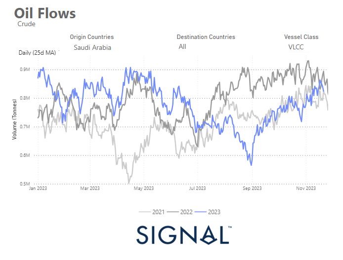
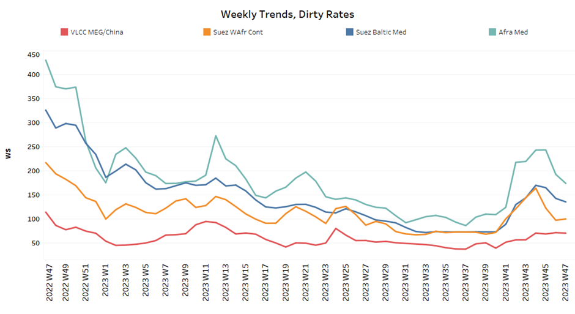
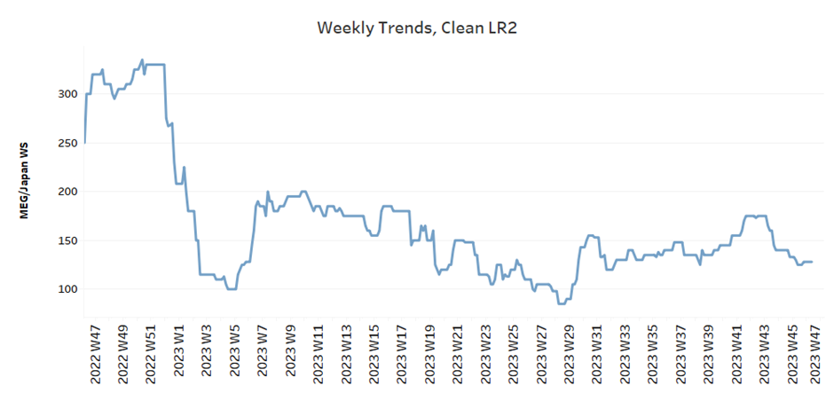
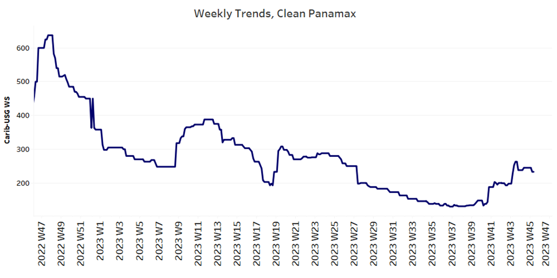
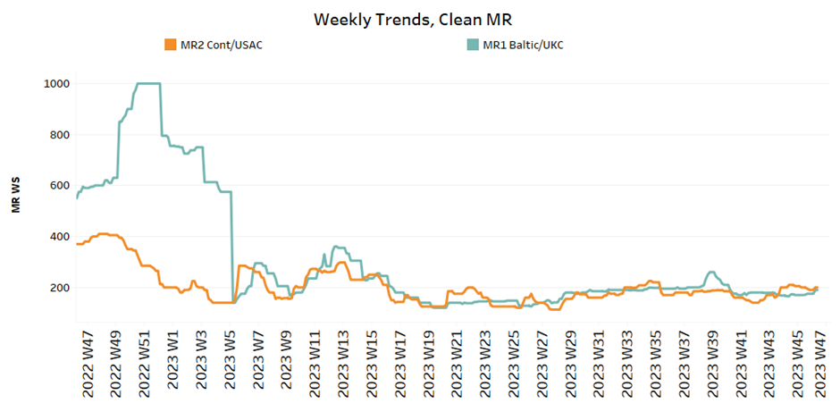
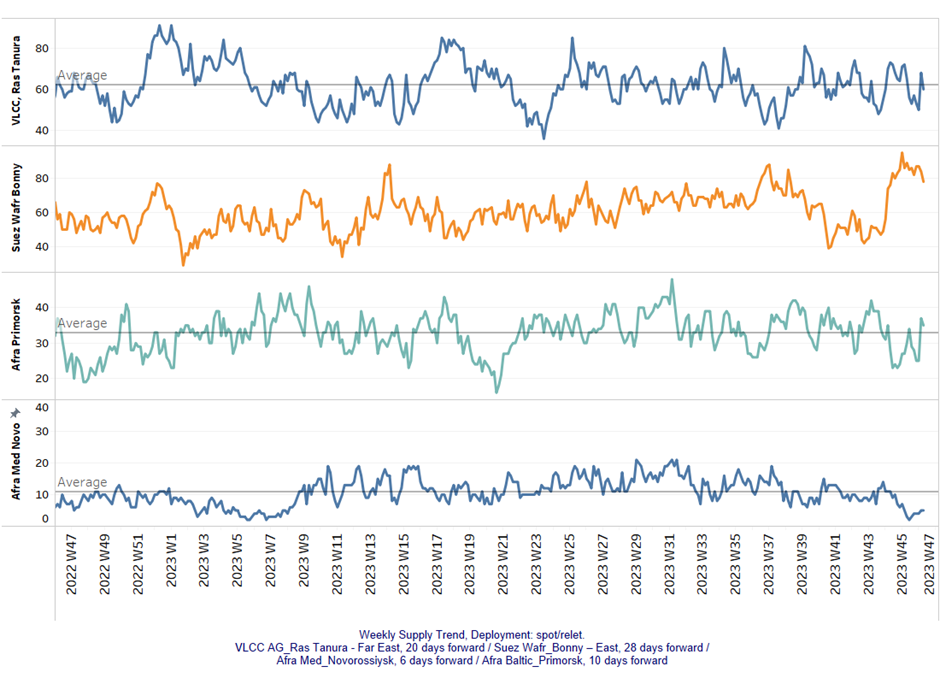
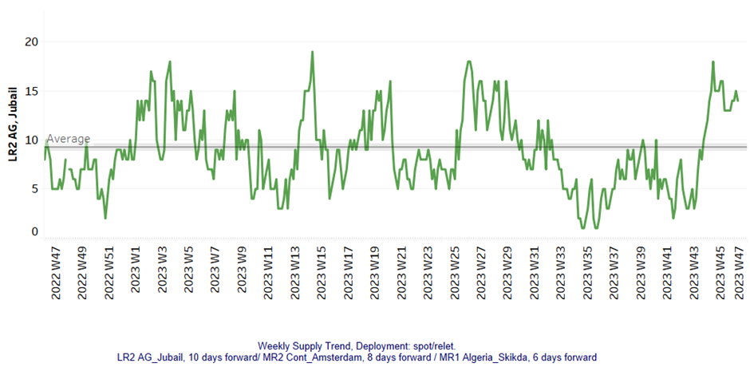
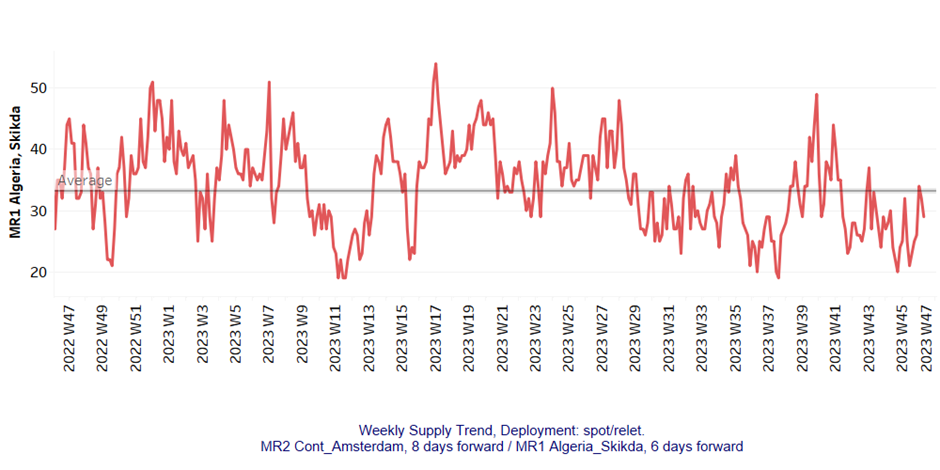
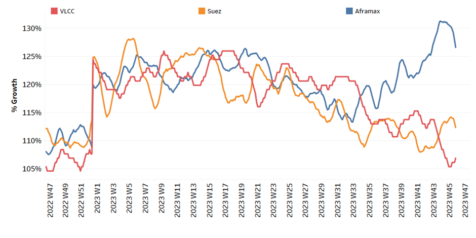
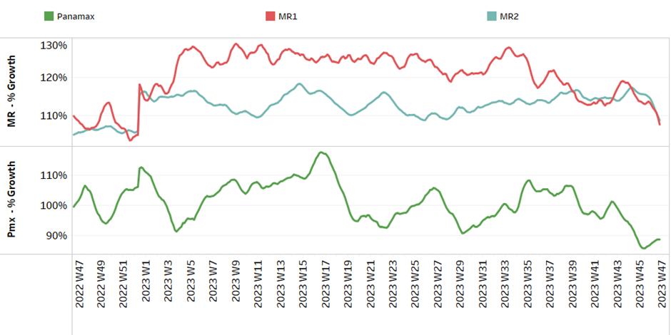

# Signal Tanker Weekly Report

**Date:** November 24, 2023  
**Publisher:** Breakwave Advisors | **Category:** Market Insights  
**Original URL:** [https://www.breakwaveadvisors.com/insights/2023/11/24/i56m3yrooefu0cdqctdfwudufojck1](https://www.breakwaveadvisors.com/insights/2023/11/24/i56m3yrooefu0cdqctdfwudufojck1)  

---

> **Figure 1: Homepage+banner+1**  
> **Interactive Data & Source:** [Breakwave Advisors Market Insights](https://www.breakwaveadvisors.com/breakwave-day-2023) | [Local Asset](file:///C:/Users/Dell/Github/Shipping/corpus/03-breakwave/insights/2023/assets/2023-11-24_i56m3yrooefu0cdqctdfwudufojck1_img_homepage2bbanner2b1_5d7211685255.png)

[

> **Figure 2: Daily 25d Moving Average at a Higher Volume Pace with VLCC**  
> *Daily 25d moving average at a higher volume pace with VLCC tankers amid production cuts*  
> **Interactive Data & Source:** [Signal Ocean Platform](https://www.thesignalgroup.com/signal-ocean-platform) | [Local Asset](file:///C:/Users/Dell/Github/Shipping/corpus/03-breakwave/insights/2023/assets/2023-11-24_i56m3yrooefu0cdqctdfwudufojck1_img_homepage2bbutton_1d014100cc65.png)](https://www.breakwaveadvisors.com/breakwave-day-2023)

## Chart of the Week: Saudi Arabian Crude Oil Flows

> **Figure 3: Market Chart 3**  
> **Interactive Data & Source:** [Signal Ocean Platform](https://www.thesignalgroup.com/signal-ocean-platform) | [Local Asset](file:///C:/Users/Dell/Github/Shipping/corpus/03-breakwave/insights/2023/assets/2023-11-24_i56m3yrooefu0cdqctdfwudufojck1_img_unnamed-2023-11-24t140356523_13ff6a39db76.png)

In the last week of November, the crude oil freight market showed continued weakness in sentiment, although earlier expectations pointed to a recovery in the very large crude carrier (VLCC) segment.
At present, the market appears to be struggling to find a balance between the availability of ships and the still erratic growth in demand.

With the ongoing winter season in December, there is optimism that momentum will pick up and concerns about tight supply have gradually eased. In particular, the inflow of Saudi Arabian crude oil to various destinations has gradually increased compared to the levels observed at the end of September.

Looking at the 25-day moving average of the day, a significant increase in volumes can be seen, especially for VLCC tankers given the ongoing production cuts. This recent upward trend suggests that the increased activity will continue in the coming days, with signs pointing to volumes approaching those recorded in the same period last year.

For more information on this week's trends, see the analysis sections below:

Freight Market, Supply and Demand

## Section 1/ Freight

Market Rates (WS)

> **Figure 4: ‘Dirty’ WS - Weaker​vlcc - Suezmax - Aframax**  
> **Interactive Data & Source:** [Signal Ocean Platform](https://www.thesignalgroup.com/signal-ocean-platform) | [Local Asset](file:///C:/Users/Dell/Github/Shipping/corpus/03-breakwave/insights/2023/assets/2023-11-24_i56m3yrooefu0cdqctdfwudufojck1_img_unnamed-2023-11-24t140506257_497fdcd1e82c.png)

Crude oil freight rates maintained the decline of previous weeks, while weak signs for a brief recovery in the VLCC segment envisaged last week have not been confirmed at the end of the month.

- VLCC MEG-China freight rates dropped to 65 WS, down 10% from the previous week, but 25% higher than a similar week a year ago.
- Suezmax freight rates for shipments from West Africa to continental Europe remained almost at the previous week's level around WS 100, after peaking at WS 140 in week 43. Rates on the Suez-Baltic-Med route fell by 8 points compared to the previous week to WS 132, a decrease of 60% compared to a similar week a year ago.
- Aframax Med freight rates have started to decrease by 40 points to the WS160 level defying expectations for a further rise at the end of the month.

> **Figure 5: ‘Product’ Wslr2 Steady**  
> **Interactive Data & Source:** [Signal Ocean Platform](https://www.thesignalgroup.com/signal-ocean-platform) | [Local Asset](file:///C:/Users/Dell/Github/Shipping/corpus/03-breakwave/insights/2023/assets/2023-11-24_i56m3yrooefu0cdqctdfwudufojck1_img_unnamed-2023-11-24t140616153_ef39184b3e53.png)

- LR2 AG freight rates continued a similar dynamic to the previous week and stood at around 128 WS, which is 27% weaker than a month ago.

> **Figure 6: PANAMAX (Sentiment: Steady)**  
> **Interactive Data & Source:** [Signal Ocean Platform](https://www.thesignalgroup.com/signal-ocean-platform) | [Local Asset](file:///C:/Users/Dell/Github/Shipping/corpus/03-breakwave/insights/2023/assets/2023-11-24_i56m3yrooefu0cdqctdfwudufojck1_img_unnamed-2023-11-24t140704316_a41e269820c7.png)

- Panamax Carib-to-USG rates held a steady sentiment for two consecutive weeks at around 230WS, 15% higher than a month ago.

> **Figure 7: ‘Clean’mr Mixed**  
> **Interactive Data & Source:** [Signal Ocean Platform](https://www.thesignalgroup.com/signal-ocean-platform) | [Local Asset](file:///C:/Users/Dell/Github/Shipping/corpus/03-breakwave/insights/2023/assets/2023-11-24_i56m3yrooefu0cdqctdfwudufojck1_img_unnamed-2023-11-24t140807329_a2343e6e2f6e.png)

- MR1 rates for the Baltic continent begun to show a firmer momentum at levels around 190 WS, a 60% decrease compared to a similar week a year ago.

- MR2 rates for shipments from the continent to the U.S. maintained the previous week's elevated level at WS 200, a decline of 40% on an annualised basis.

## Section 2/ Supply

> **Figure 8: 'Dirty' (#Vessels) - Decreasing**  
> **Interactive Data & Source:** [Signal Ocean Platform](https://www.thesignalgroup.com/signal-ocean-platform) | [Local Asset](file:///C:/Users/Dell/Github/Shipping/corpus/03-breakwave/insights/2023/assets/2023-11-24_i56m3yrooefu0cdqctdfwudufojck1_img_unnamed-2023-11-24t140853409_8f9efb4a26b5.png)

The last week of November brings signs of a downward correction, however, recent activity still paints a heavy picture in the Suezmax Wafr.

- VLCC Ras Tanura: The number of ships fell close to the annual average of 60, which is 8 fewer than in the previous week, whereas two weeks ago activity of around 70 was indicated.
- Suezmax Wafr: The number of ships eventually fell below 80, from the last peak at around 96 during week 45and the latest figure is now 100% higher than the low of week 42.
- Aframax Primorsk: The current number of ships is 35, which is almost 3 above the yearly average.
- Aframax Med Novo: The number of ships has remained at a level of around 5 for two consecutive weeks, almost 6 below the annual average, with a tendency towards a further decline at the end of the month.

> **Figure 9: 'Clean'lr2 (#Vessels) - Decreasing**  
> **Interactive Data & Source:** [Signal Ocean Platform](https://www.thesignalgroup.com/signal-ocean-platform) | [Local Asset](file:///C:/Users/Dell/Github/Shipping/corpus/03-breakwave/insights/2023/assets/2023-11-24_i56m3yrooefu0cdqctdfwudufojck1_img_unnamed-2023-11-24t140947929_561c16851b69.png)

> **Figure 10: MR1 (#Vessels) - Decreasing**  
> **Interactive Data & Source:** [Signal Ocean Platform](https://www.thesignalgroup.com/signal-ocean-platform) | [Local Asset](file:///C:/Users/Dell/Github/Shipping/corpus/03-breakwave/insights/2023/assets/2023-11-24_i56m3yrooefu0cdqctdfwudufojck1_img_unnamed-2023-11-24t141052975_ba55e528af46.png)

- Clean LR2 AG Jubail: The latest figure held decreasing activity of the previous week at around 13 ships after peaking at 18 two weeks ago, with the upward trend above the annual average over the last four weeks.

- Clean MR1 Algeria Skikda: There has been a downward trend since the end of week 34, which seems to be pulling the sentiment on the freight market upwards. The most recent reading was 29, while there are signs of a late rise above the annual average.

## Section 3/ Demand (Tonne Days)

> **Figure 11: ​​‘Dirty’ Decreasing**  
> **Interactive Data & Source:** [Signal Ocean Platform](https://www.thesignalgroup.com/signal-ocean-platform) | [Local Asset](file:///C:/Users/Dell/Github/Shipping/corpus/03-breakwave/insights/2023/assets/2023-11-24_i56m3yrooefu0cdqctdfwudufojck1_img_unnamed-2023-11-24t141126941_9527c9f1f44a.png)

- Dirty tonne days: The last week of November brought a gradual upward trend in the VLCC tonne days growth, while uncertainty persists with significantly lower levels than four weeks ago. In the meantime, growth rates in the Suezmax segment have weakened, which is reflected in the downward trend in freight rates, and in the Aframax segment the sudden decline has not yet been reflected in market prices.

> **Figure 12: ‘Clean’ Mixed**  
> **Interactive Data & Source:** [Signal Ocean Platform](https://www.thesignalgroup.com/signal-ocean-platform) | [Local Asset](file:///C:/Users/Dell/Github/Shipping/corpus/03-breakwave/insights/2023/assets/2023-11-24_i56m3yrooefu0cdqctdfwudufojck1_img_unnamed-2023-11-24t141231411_1e64df1b3833.png)

- Panamax tonne days: During the fourth week of November, there was a modest upturn, marking the first positive movement since the conclusion of week 43. The current growth rate aligns closely with the figures observed in week 29.

- Clean MR tonne days: The outlook for demand growth has weakened further from the recent peak in week 43 for size MR1. In the meantime, it appears that the recent decline will continue in December.

Data Source:[Signal Ocean Platform](https://www.thesignalgroup.com/signal-ocean-platform)
