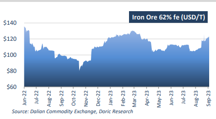
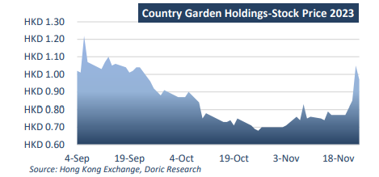
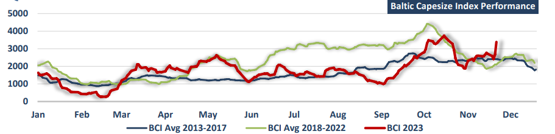

# Doric Weekly Market Insight

**Date:** November 27, 2023  
**Publisher:** Breakwave Advisors | **Category:** Market Insights  
**Original URL:** [https://www.breakwaveadvisors.com/insights/2023/11/27/doric-weekly-market-insight](https://www.breakwaveadvisors.com/insights/2023/11/27/doric-weekly-market-insight)  

---

> **Figure 1: Homepage+banner+1 (1)**  
> **Interactive Data & Source:** [Breakwave Advisors Market Insights](https://www.breakwaveadvisors.com/breakwave-day-2023) | [Local Asset](file:///C:/Users/Dell/Github/Shipping/corpus/03-breakwave/insights/2023/assets/2023-11-27_doric-weekly-market-insight_img_homepage2bbanner2b128129_5d7211685255.png)

[

> **Figure 2: Bymichalis Voutsinas**  
> *ByMichalis Voutsinas*  
> **Interactive Data & Source:** [Linkedin](https://www.linkedin.com/in/michalis-voutsinas-587544163/) | [Local Asset](file:///C:/Users/Dell/Github/Shipping/corpus/03-breakwave/insights/2023/assets/2023-11-27_doric-weekly-market-insight_img_homepage2bbutton28129_1d014100cc65.png)](https://www.breakwaveadvisors.com/breakwave-day-2023)

## “With Hang Seng Mainland Properties Index Reporting Gains at Last, Iron Ore Prices Galloping and Capesize Spot Market Rocketing on Friday, Hopes Have Resurfaced That Light Can Be Cast Over the Shadow of the Property Crisis in China in the Next Year.”

In a poetic analogy, John Lasseter, the director of the animated sports comedy film Cars, likened the love for cars to the sound of a throaty V-8 rumbling and revving, the acceleration throwing you back in the seat, especially when cruising on a beautiful, winding road with light dappling through the trees. Coincidentally, mirroring this exhilarating sensation, the Capesize segment experienced a noteworthy acceleration in this week's closing, with a remarkable $5,855 daily rise. This propelled the leading segment of the dry bulk spectrum to a balance of $28,071 daily at the conclusion of the fortyseventh trading week. Panamax joined the pace beside Capesize, reporting substantial weekly gains and ending the week at $18,577 daily. Similarly, the Supramax and Handy segments continued their upward trajectory over the last couple of weeks, with the former settling at $14,067 daily and the latter $2,000 below these levels.

Unlike spot market this week, on the commodity front, a discordance between oil and iron ore prices has become apparent during the last month. Both Brent crude and US West Texas Intermediate crude contracts were on track for their first weekly gain in five weeks as OPEC+ prepares for a meeting that will have output cuts high on the agenda after recent oil price declines on demand concerns. The OPEC+ group caught market by surprise mid-week, announcing that its November 26 meeting would be postponed to November 30. The delay was attributed to challenges in reaching a consensus among producers regarding production levels.

Contrarily, iron ore futures experienced their fifth consecutive weekly gain on Friday. This was related to optimism regarding government support for the property sector in China, the world's largest consumer of iron ore, which outweighed the warning of an intervention from authorities. On Friday, Beijing emphasized its commitment to strengthening supervision of iron ore at ports and preventing speculation to maintain market order. Earlier in the week, China's state planner had announced plans to closely monitor changes in the iron ore market and further tighten supervision of spot and futures trading to curb the rally in iron ore prices. In spite of these efforts and warnings, the benchmark December iron ore futures on the Singapore Exchange have reported double-digit monthly gains at $133 a tonne on hopes Beijing will kickstart the property sector.

Last month, China revealed a plan to issue 1 trillion yuan ($139 billion) in sovereign bonds by the year's end. This initiative is part of a broader strategy that includes increasing the 2023 budget deficit target to 3.8 percent of the gross domestic product (GDP), up from the initial 3 percent target. China's government advisers call for a steady growth target in 2024 when more fiscal policy support is expected to keep long-term development goals on track, Reuters reported.

> **Figure 3: 1**  
> **Interactive Data & Source:** [Doric](https://www.doric.gr/) | [Local Asset](file:///C:/Users/Dell/Github/Shipping/corpus/03-breakwave/insights/2023/assets/2023-11-27_doric-weekly-market-insight_img_1_d2089a1814f4.png)

In light of rumours that Chinese authorities have compiled a list of 50 real estate developers for funding support, iron ore prices surged to new highs this week. According to reports from Bloomberg, Country Garden Holdings Co. and Sino-Ocean Group are included in China's draft list, indicating a shift by Beijing to assist some of the country's most distressed builders. This move is expected to support steel demand from the construction sector, especially during the seasonal weakest period for construction activity in the first quarter of the next year. Bloomberg Intelligence's gauge of developer stocks has risen on expectations that this financial aid will alleviate concerns of further contagion in China's property sector. Furthermore, the Hang Seng Mainland Properties index, tracking Chinese developers, rose by 4.3 percent on Thursday, contributing to weekly gains of 9.1 percent. In reference to specific developers, Country Garden is yet to unveil its restructuring plan but its Hong Kong shares are up more than 60 percent this month. Distressed Chinese builder’s shares in Hong Kong rallied 24 percent Thursday to cap their best day in a year. Its 5.625%-dollar bond due 2030 gained another 10 percent after jumping 40 percent in the previous session, according to Bloombergcompiled data. The positive momentum extends even to Evergrande, with its stock price on an upward trajectory over the past few weeks.

> **Figure 4: 1ceb1**  
> **Interactive Data & Source:** [Doric](https://www.doric.gr/) | [Local Asset](file:///C:/Users/Dell/Github/Shipping/corpus/03-breakwave/insights/2023/assets/2023-11-27_doric-weekly-market-insight_img_1ceb1_0d8a34e8325f.png)

With Hang Seng Mainland Properties index reporting gains at last, iron ore prices galloping and Capesize spot market rocketing on Friday, hopes have resurfaced that light can be cast over the shadow of the property crisis in China in the next year.

> **Figure 5: 1ceb2**  
> **Interactive Data & Source:** [Doric](https://www.doric.gr/) | [Local Asset](file:///C:/Users/Dell/Github/Shipping/corpus/03-breakwave/insights/2023/assets/2023-11-27_doric-weekly-market-insight_img_1ceb2_b13d6464947c.png)

Data source:[Doric](https://www.doric.gr/)
