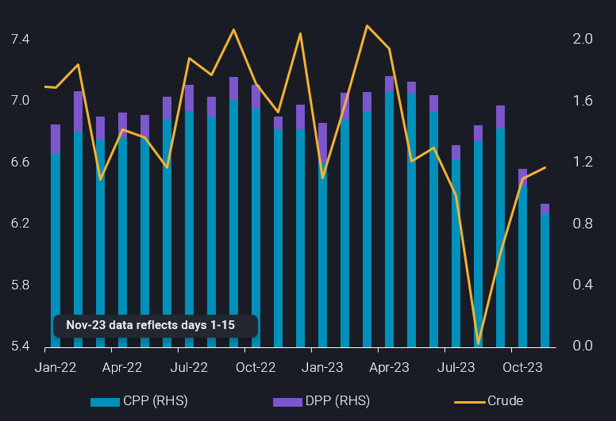
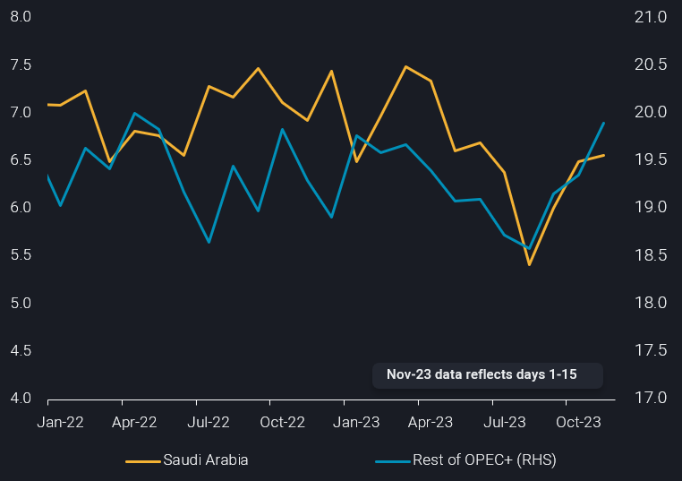

# Saudi crude exports recovery continues as products decline

**Date:** November 27, 2023  
**Publisher:** Breakwave Advisors | **Category:** Market Insights  
**Original URL:** [https://www.breakwaveadvisors.com/insights/2023/11/27/saudi-crude-exports-recovery-continues-as-products-decline](https://www.breakwaveadvisors.com/insights/2023/11/27/saudi-crude-exports-recovery-continues-as-products-decline)  

---

> **Figure 1: Homepage+banner+1 (1)**  
> **Interactive Data & Source:** [Breakwave Advisors Market Insights](https://www.breakwaveadvisors.com/breakwave-day-2023) | [Local Asset](file:///C:/Users/Dell/Github/Shipping/corpus/03-breakwave/insights/2023/assets/2023-11-27_saudi-crude-exports-recovery-continues-as-products-decline_img_homepage2bbanner2b128129_5d7211685255.png)

[

> **Figure 2: Homepage2bbutton**  
> **Interactive Data & Source:** [Linkedin](https://www.linkedin.com/search/results/all/?fetchDeterministicClustersOnly=true&heroEntityKey=urn%3Ali%3Afsd_profile%3AACoAAAcYBVoBsiAtPctbbvTfJKNiNRkvVy4ywuM&keywords=jay&origin=RICH_QUERY_SUGGESTION&position=0&searchId=cc15b8b9-107a-4d22-b8e9-3d511adaaf37&sid=-wW&spellCorrectionEnabled=false) | [Local Asset](file:///C:/Users/Dell/Github/Shipping/corpus/03-breakwave/insights/2023/assets/2023-11-27_saudi-crude-exports-recovery-continues-as-products-decline_img_homepage2bbutton28129_1d014100cc65.png)](https://www.breakwaveadvisors.com/breakwave-day-2023)

## Saudi Arabia’s Crude Exports in November Have Continued to Rise M-O-M Following a Slump in August, But Refined Products Exports Have Fallen to Multi-Year Lows. in This Insight, We Examine the Magnitude of This Divergence and Put It in Context of Wider OPEC+ Trends.

*By*[*Jay Maroo*](https://www.linkedin.com/search/results/all/?fetchDeterministicClustersOnly=true&heroEntityKey=urn%3Ali%3Afsd_profile%3AACoAAAcYBVoBsiAtPctbbvTfJKNiNRkvVy4ywuM&keywords=jay&origin=RICH_QUERY_SUGGESTION&position=0&searchId=cc15b8b9-107a-4d22-b8e9-3d511adaaf37&sid=-wW&spellCorrectionEnabled=false)

Vortexa preliminary data for the first half of November (days 1-15) show Saudi exports have crossed the 6.5mbd mark for the first time since June this year. The November figure also marks a strong rebound from the 5.4mbd seen in August (see chart below).

> **Figure 3: Picture1 15**  
> **Interactive Data & Source:** [Analytics Vortexa](https://analytics.vortexa.com/?dateRange=2020-01-01T00%3A00%3A00.000Z__2023-11-15T23%3A59%3A59.999Z&filtersEnabled=%5B%22p%22%2C%22o%22%2C%22d%22%2C%22d_r%22%2C%22v%22%2C%22sts_o%22%2C%22c_o%22%2C%22w%22%2C%22c%22%2C%22intra_d%22%5D&from=%5B%2243a70ba6b21894cd24165d9d7ee59b012e698cf97e22fd275ccdd05a556e7061%22%5D&metric=bpd&page=Flows&products=%5B%22deda35eb9ca56b54e74f0ff370423f9a8c61cf6a3796fcb18eaeeb32a8c290bb%22%2C%22d72edbab2b5e2e249d8c216909945922a02eb017dd200f90876fee6fa180c743%22%2C%223e4db72ef7027de928ce55703a213a546fd86d2debe6f2e9c85f3a5f9d53e8dd%22%2C%221c107b4317bc2c85fb6c13cd7b28e8e0a02ec7fecc68afc2b68ca0545c835e1c%22%2C%229d4d72cfc5620b4067c22b93e959733d3af66b059767f911efead258e0f7b376%22%2C%229256907ba7e4ed11ff03aa297a7e62e14484ce5a85c8118c7495b9120ad0e268%22%2C%225ebc06618c894f18a0445a474d114820862b49af7a8e47109f4a205b0162d446%22%2C%22cc21be96a91946eaac737a64977170c671e69e72f1854731b09c98c68a62129d%22%2C%229c028686c57b48fa8e1d0d20e7292eea3cb7234354a04aa699559bb4cdb09493%22%2C%2254af755a090118dcf9b0724c9a4e9f14745c26165385ffa7f1445bc768f06f11%22%5D&tabId=5d916f24-5452-4fff-bf0e-29da96400a2e&timeSeriesChartView=bar&timeSeriesProperty=product_group&timeSeriesSeasonalToggle=0&v=3) | [Local Asset](file:///C:/Users/Dell/Github/Shipping/corpus/03-breakwave/insights/2023/assets/2023-11-27_saudi-crude-exports-recovery-continues-as-products-decline_img_picture1-15_c44b388ce364.png)

This recovery in Saudi crude exports may be surprising given that Saudi Arabia’s voluntary production cut of 1mbd is still intact and may even be extended next year – depending on the upcoming (but recently delayed) OPEC+ meeting. But it is important to note that the recent rise in crude exports can be at least partly explained by two key factors:

- Lower product exports, especially clean petroleum products, suggest lower domestic refinery run rates, thereby freeing up more crude for the export market, without lifting crude production
- The end of the seasonal peak in power generation frees up crude oil from direct burn, i.e. for exports rather than domestic use

Some basic calculations outline the feasibility of this:

- Saudi crude exports so far in November are up by around 1.1mbd since Aug
- Saudi products exports are down by 500kbd over the same period
- The seasonal swing in Saudi Arabia’s direct crude burn (JODI data) is approximately 300-400kbd

This leaves a difference of 200-300kbd which could be caused by several factors; unplanned refinery maintenance, skewed loading schedules for a given month, or potential adjustments in how firm the commitment is to voluntary production cuts.

Zooming out, we can see that the rise in Saudi’s crude exports is not a singular effort in raising global seaborne crude supplies. When compared to its OPEC+ peers, Vortexa data shows while much of the heavy lifting has been done by Saudi Arabia, the rest of the group (collectively speaking) is significantly increasing exports.

OPEC+ exports (excluding Iran and Venezuela) have almost hit 20mbd so far in November, putting them well above the August low of 18.6mbd and at the upper range for levels seen during this year (see chart below).

> **Figure 4: Picture2 16**  
> **Interactive Data & Source:** [Analytics Vortexa](https://analytics.vortexa.com/?dateRange=2020-01-01T00%3A00%3A00.000Z__2023-11-15T23%3A59%3A59.999Z&filtersEnabled=%5B%22p%22%2C%22o%22%2C%22d%22%2C%22d_r%22%2C%22v%22%2C%22sts_o%22%2C%22c_o%22%2C%22w%22%2C%22c%22%2C%22intra_d%22%5D&from=%5B%221c47e09ebf73cbb0fda6e36ffc125d4be50936d17888e0a7d2acb17a439db108%22%5D&fromExcluded=%5B%22a1acb291bb339d07faa0d9c7b62ea292aa0ea1a01813b26c890aeeb4e2334b09%22%2C%22d308ddc557e774187ad6c7da81b39db990def9a39e6c88e79cb163b6bdd6e8e5%22%5D&metric=bpd&page=Flows&products=%5B%2254af755a090118dcf9b0724c9a4e9f14745c26165385ffa7f1445bc768f06f11%22%5D&tabId=5d916f24-5452-4fff-bf0e-29da96400a2e&timeSeriesProperty=origin_country&timeSeriesSeasonalToggle=0&v=3) | [Local Asset](file:///C:/Users/Dell/Github/Shipping/corpus/03-breakwave/insights/2023/assets/2023-11-27_saudi-crude-exports-recovery-continues-as-products-decline_img_picture2-16_0b4848718797.png)

The elevated levels of Saudi Arabia and other OPEC+ members’ crude exports, compared to August levels, add further weight to the bearish sentiment on crude markets. But given that the upcoming OPEC+ meeting is now rescheduled and no longer in person, any dramatic policy changes, e.g. even deeper cuts from Saudi Arabia or OPEC+ collective actions, are less likely. As a result, the current weakness in crude markets seems well justified for now – be it in the form of physical differentials at key pricing hubs or the emergence of contango/weaker backwardation structure.

Data Source:[Vortexa](https://www.vortexa.com//oil-gas-data-traders-analysts-data-scientists?gclid=Cj0KCQjw8_qRBhCXARIsAE2AtRZKOvMnbilZ_6_91d7huSFFy71pWLrnPwGwOHVzXsmsG-1a1mZnQw8aAt89EALw_wcB&hsa_acc=1782073842&hsa_ad=548425387665&hsa_cam=14746637662&hsa_grp=125038601902&hsa_kw=&hsa_mt=&hsa_net=adwords&hsa_src=g&hsa_tgt=dsa-1431852288425&hsa_ver=3&utm_campaign=%5BCD%5D%20-%20DSA%20-%20EMEA&utm_medium=cpc&utm_medium=ppc&utm_source=google&utm_source=adwords&utm_term=)
