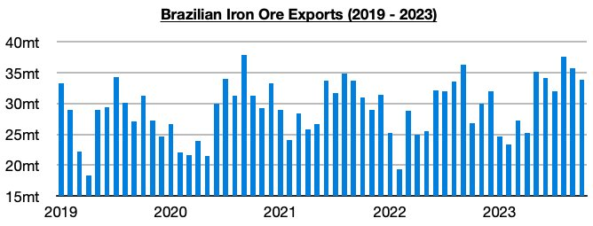

# Brazilian Iron Ore Export Shift Continues

**Date:** November 28, 2023  
**Publisher:** Breakwave Advisors | **Category:** Market Insights  
**Original URL:** [https://www.breakwaveadvisors.com/insights/2023/11/24/brazilian-iron-ore-export-shift-continues](https://www.breakwaveadvisors.com/insights/2023/11/24/brazilian-iron-ore-export-shift-continues)  

---

> **Figure 1: Homepage+banner+1**  
> **Interactive Data & Source:** [Breakwave Advisors Market Insights](https://www.breakwaveadvisors.com/breakwave-day-2023) | [Local Asset](file:///C:/Users/Dell/Github/Shipping/corpus/03-breakwave/insights/2023/assets/2023-11-28_brazilian-iron-ore-export-shift-continues_img_homepage2bbanner2b1_5d7211685255.png)

[

> **Figure 2: Byjeffrey Landsberg**  
> *ByJeffrey Landsberg*  
> **Interactive Data & Source:** [Linkedin](https://www.linkedin.com/in/jeffrey-landsberg-70ab957/) | [Local Asset](file:///C:/Users/Dell/Github/Shipping/corpus/03-breakwave/insights/2023/assets/2023-11-28_brazilian-iron-ore-export-shift-continues_img_homepage2bbutton_1d014100cc65.png)](https://www.breakwaveadvisors.com/breakwave-day-2023)

Brazil most recently exported 33.8 million tons of iron ore in October, which marked a month-on-month decline of 1.9 million tons (-5%) but a year-on-year increase of 7 million tons (26%).

> **Figure 3: Chart (2)**  
> [Local Asset](file:///C:/Users/Dell/Github/Shipping/corpus/03-breakwave/insights/2023/assets/2023-11-28_brazilian-iron-ore-export-shift-continues_img_chart28229_a9c925421951.jpg)

While down again on a month-on-month basis, 33.8 million tons is a firm amount that is much higher than was exported back in October 2022. Also significant is that the last three months have seen Brazil’s exports total 107 million tons. The only other time that such a large amount was exported was back in 2018.

We have stressed often in our Weekly Dry Bulk Reports this year that the dry bulk market (and in particular, the capesize segment) has been needing growth to return in Brazilian iron ore exports, and growth has in fact returned. If growth had not returned, then capesize rates would have fared particularly poorly this year. The first ten months of this year have seen Brazil’s exports rise year-on-year by 24.4 million tons (9%). This has been vital growth that has been needed and has marked a drastic market-changing shift particularly for the capesize market. During all of last year, Brazil’s iron ore exports contracted year-on-year by 12.9 million tons (-4%).
