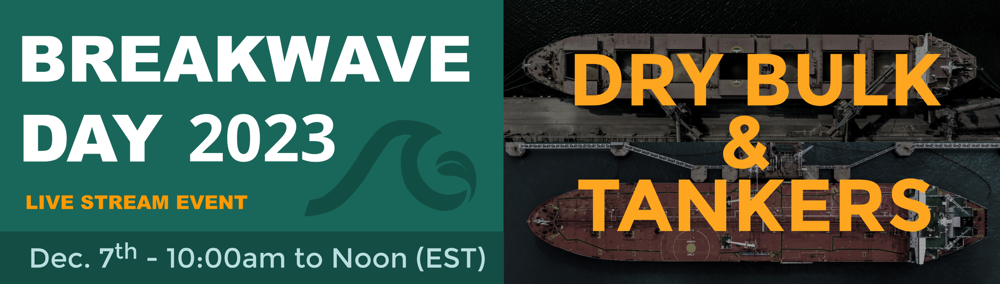
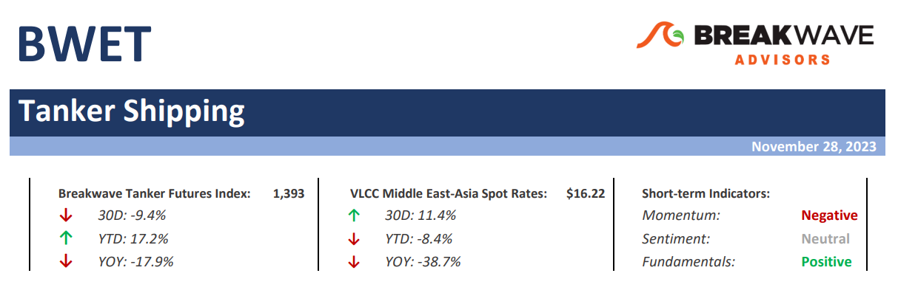
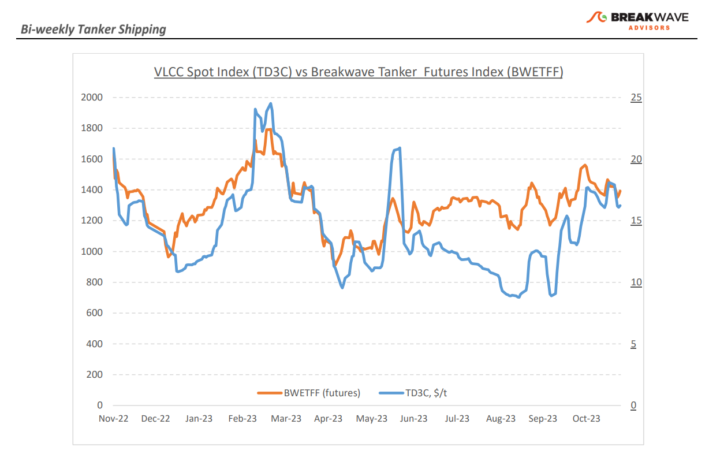
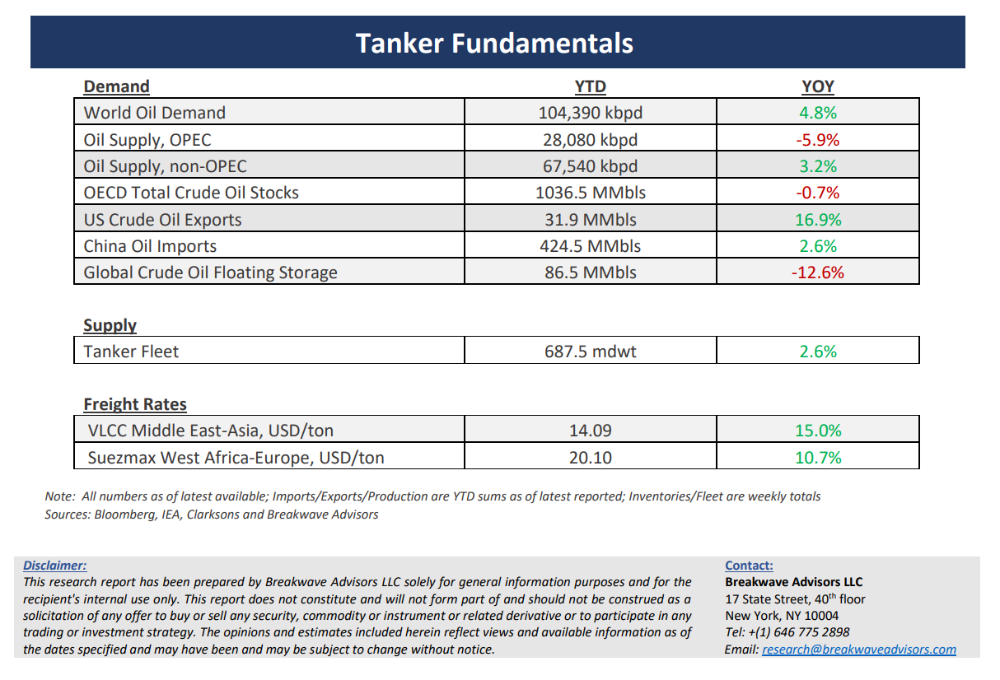

# Breakwave Bi-Weekly Tanker Report - November 28, 2023

**Date:** November 28, 2023  
**Publisher:** Breakwave Advisors | **Category:** Market Insights  
**Original URL:** [https://www.breakwaveadvisors.com/insights/2023/11/28/breakwave-bi-weekly-tanker-report-nov-28-2023-mmg34](https://www.breakwaveadvisors.com/insights/2023/11/28/breakwave-bi-weekly-tanker-report-nov-28-2023-mmg34)  

---

[

> **Figure 1: Homepagebanner1**  
> **Interactive Data & Source:** [Breakwave Advisors Market Insights](https://www.breakwaveadvisors.com/breakwave-day-2023) | [Local Asset](file:///C:/Users/Dell/Github/Shipping/corpus/03-breakwave/insights/2023/assets/2023-11-28_breakwave-bi-weekly-tanker-report-nov-28-2023-mmg34_img_homepagebanner1_bc54990543ef.png)](https://www.breakwaveadvisors.com/breakwave-day-2023)

[

> **Figure 2: Homepagebutton**  
> [Local Asset](file:///C:/Users/Dell/Github/Shipping/corpus/03-breakwave/insights/2023/assets/2023-11-28_breakwave-bi-weekly-tanker-report-nov-28-2023-mmg34_img_homepagebutton_01114095b1c9.png)](https://www.breakwaveadvisors.com/breakwave-day-2023)

> **Figure 3: Tankerreporttop**  
> [Local Asset](file:///C:/Users/Dell/Github/Shipping/corpus/03-breakwave/insights/2023/assets/2023-11-28_breakwave-bi-weekly-tanker-report-nov-28-2023-mmg34_img_tankerreporttop_74480ad6b4cd.png)

**· VLCC rates stable amid ongoing challenges and shifting dynamics in oil supply/demand –**The VLCC freight market**sentiment**appeared**softer**at the end of November, despite a more promising outlook mid-month, hinting at a better-balanced market. However,**freight rates**have**improved compared to levels seen a month ago**with VLCC rates from the Middle East and West Africa to China recording a monthly increase of roughly 20%. Meanwhile,**challenges persist**in the tanker market, particularly concerning oil supply and demand, but also volatile oil prices, and these factors will be crucial in shaping market dynamics as we head into December. Looking a bit closer at the oil demand prospects, a**subdued outlook**for future growth and**conflicting demand projections**from OPEC (more positive) and the IEA (more cautious) underscore uncertainties in the market's trajectory and thus complicates the outlook for freight rates in the intermediate future.**Freight futures**continue to price a**stable**December market, followed by a decline in freight rates during the seasonally weaker first half of 2024. However, time and again,**tightness due to winter weather**can always alter the supply/demand picture, and although fundamentally**less oil shipments**translate to less demand for tankers, such marginal changes could become a secondary factor when vessels get delayed due to weather factors.

**· Oil prices remain subdued as demand outlook becomes murky –**There is a**clear divergence**when it comes to oil**demand outlook**for 2024 amongst the two main oil research organizations. The International Energy Agency**(IEA**) maintains a cautious outlook pegging demand growth at less than 1 million barrels per day (mbpd). On the other hand, the Organization of the Petroleum Exporting Countries (**OPEC**) forecasts oil demand growth of 2.25 mbpd. The apparent variance of ~1.3 mbpd represents approximately 1% of the world's daily oil consumption and surpasses the daily production of certain OPEC members, exemplified by Libya. As the**upcoming OPEC meeting**on November 30th gets closer, any shift in the production outlook, including the extension or expansion of production cuts, will have a significant impact on both prices as well as freight expectations for 2024. Yet, all the above**highly depend on the global economic outlook**, which remains very uncertain amidst high interest rates, an ailing real estate market in China, and two ongoing wars.**Our view**remains that oil prices will fluctuate in a rather wide range of about**$70-$90 per barrel**for the foreseeable future while the potential for**stronger oil demand**for 2024 is a**more likely**scenario, yet admittedly our forecast is also subject to all the above factors and thus lacks confidence.

**· Tanker cycle driven by tight supply, recovering demand –**The tanker market is recovering from a long period of staggered rates as the growth in new vessel supply shrinks while oil demand is recovering in line with the global economy. A historically low orderbook combined with favorable demand fundamentals should continue to support increased spot rate volatility, which combined with the ongoing geopolitical turmoil, should support freight rates in the medium term.

> **Figure 4: Tankerreportchart**  
> [Local Asset](file:///C:/Users/Dell/Github/Shipping/corpus/03-breakwave/insights/2023/assets/2023-11-28_breakwave-bi-weekly-tanker-report-nov-28-2023-mmg34_img_tankerreportchart_3d96e647d445.png)

> **Figure 5: Tankerreportbottom**  
> [Local Asset](file:///C:/Users/Dell/Github/Shipping/corpus/03-breakwave/insights/2023/assets/2023-11-28_breakwave-bi-weekly-tanker-report-nov-28-2023-mmg34_img_tankerreportbottom_2f86bec8999c.png)

### Subscribe:
