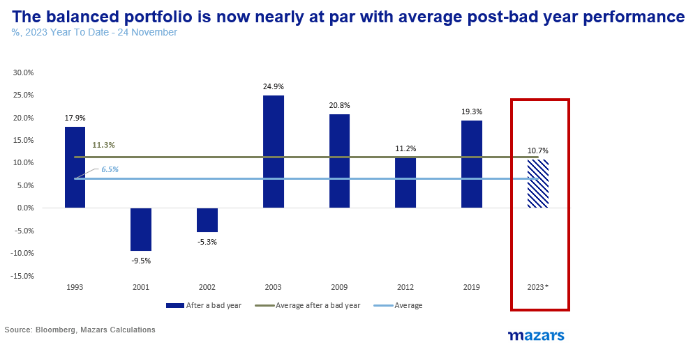
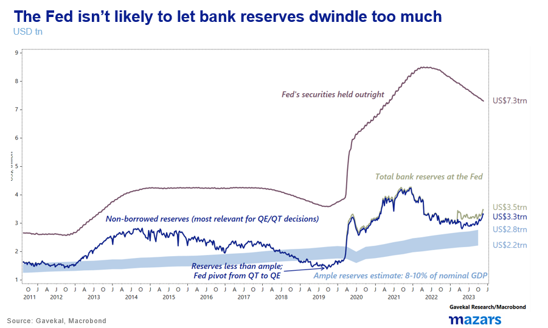
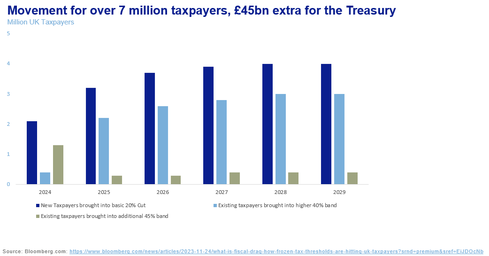

# Death and Taxes: It takes a village to maintain wealth

**Date:** November 29, 2023  
**Publisher:** Breakwave Advisors | **Category:** Market Insights  
**Original URL:** [https://www.breakwaveadvisors.com/insights/2023/11/29/death-and-taxes-it-takes-a-village-to-maintain-wealth](https://www.breakwaveadvisors.com/insights/2023/11/29/death-and-taxes-it-takes-a-village-to-maintain-wealth)  

---

> **Figure 1: Homepage+banner+1 (1)**  
> **Interactive Data & Source:** [Breakwave Advisors Market Insights](https://www.breakwaveadvisors.com/breakwave-day-2023) | [Local Asset](file:///C:/Users/Dell/Github/Shipping/corpus/03-breakwave/insights/2023/assets/2023-11-29_death-and-taxes-it-takes-a-village-to-maintain-wealth_img_homepage2bbanner2b128129_5d7211685255.png)

[

> **Figure 2: Three Things I’m Thinking About This Week**  
> *The three things I’m thinking about this week*  
> [Local Asset](file:///C:/Users/Dell/Github/Shipping/corpus/03-breakwave/insights/2023/assets/2023-11-29_death-and-taxes-it-takes-a-village-to-maintain-wealth_img_homepage2bbutton28129_1d014100cc65.png)](https://www.breakwaveadvisors.com/breakwave-day-2023)

1. *We don’t have any evidence to say that this Santa rally signals the beginning of a sustainable bull market just yet. Into 2024 though, a bull market prompted by the cessation of Quantitative Tightening is a real possibility.*
2. *In terms of the UK budget: The Fiscal Drag (no change in the income bands) balances out the negative fiscal effects of the Chancellor’s giveaways. The Fiscal Drag is a “stealth tax”.*
3. *In an era where inflation is un-anchored, i.e. less predictable, price changes might affect all manner of regulation, whether intended or not. This is why wealth needs to be viewed as a whole. The sun is setting in the land of single-wealth managers, and simple relationship managers, and rising in the land of integrated financial planning solutions.*

Stock markets continue to rally, performing their usual Christmas song-and-dance aided, presumably, by the tailwinds of more bullish projections around interest rates. A balanced portfolio performance is, as of this morning, roughly in line with what is expected after a bad year.

> **Figure 3: Market Chart 3**  
> [Local Asset](file:///C:/Users/Dell/Github/Shipping/corpus/03-breakwave/insights/2023/assets/2023-11-29_death-and-taxes-it-takes-a-village-to-maintain-wealth_img_image00128329_1c81bdd22d2e.png)

Despite the obvious, that market-implied rate expectations are the worst way of trying to predict rates, some of the bullishness is justified. As central banks pause rate hikes, they can’t continue quantitative tightening for much longer, for fear of driving bank reserves at the Fed down by too much. So far, the Fed and the ECB have drained more than three trillion dollars from financial markets. When this process stops, and central bank balance sheets start levelling out again, equity markets will be able to sustain a bull rally once again.

> **Figure 4: Market Chart 4**  
> [Local Asset](file:///C:/Users/Dell/Github/Shipping/corpus/03-breakwave/insights/2023/assets/2023-11-29_death-and-taxes-it-takes-a-village-to-maintain-wealth_img_image00228229_c85b42e6cc6f.png)

**So, to be clear, we don’t have any evidence to say that this Santa rally signals the beginning of a sustainable bull market just yet. Into 2024 though, a bull market prompted by the cessation of Quantitative Tightening is a real possibility. With bonds already paying a decent yield, some equity bullishness will be welcome for diversified portfolios.**

My unexpected bullishness, however, was interrupted by last week’s UK Autumn Statement.

Chancellor Hunt’s proposals seem fiscally generous at the headline level. £4.5bn for manufacturing and the permanence of the full-expensing policy will be welcome drivers for Foreign Direct Investment, and National Insurance Contribution cuts could provide a roughly £10bn boost to spending. 0

Alas, a generation of economists who haven’t seen inflation might easily forget about the accursed Fiscal Drag.

### What Is Fiscal Drag?

In essence, Fiscal Drag is an indirect tax, governments impose when they don’t change income bands along with inflation. For example, in the UK, the lower income band, beyond which income is taxed, is £12,570. Inflation, however, can “drag” a nominal income higher, even if a consumer's real spending power hasn’t changed. For example, Mr. Joey Toy who runs a small toy business, earned £21,000 in 2020, and incurred costs of £10,000, making a net £11,000. In the two years following, total inflation rose by 20.6%. Mr Toy’s costs, and nominal revenue, rose by exactly as much. He now makes £13,266, which buys him exactly what £11,000 bought him in 2020. Nevertheless, as the government hasn’t changed its bands,**Mr Toy now has income tax to pay.**

The Fiscal Drag, all other things being equal, is projected to add £45bn to the government’s coffers by 2028 according to calculations by Bloomberg. An estimated four million people will be pulled into the 20% basic rate income bracket by 2028 and three million will be pulled above the 40% bracket. And this is with somewhat benign OBR projections for inflation. So, when all is said and done, some taxes were shuffled around, but the net fiscal effect is negligent. If anything, by 2028, the government tax intake is projected to be 37.7% of GDP, the highest in 70 years.

> **Figure 5: Market Chart 5**  
> [Local Asset](file:///C:/Users/Dell/Github/Shipping/corpus/03-breakwave/insights/2023/assets/2023-11-29_death-and-taxes-it-takes-a-village-to-maintain-wealth_img_image00328129_529e69f4b7bc.png)

This brings us to the subject of Total Wealth Management. In an era where inflation is un-anchored, i.e. less predictable, price changes might affect all manner of regulation, whether intended or not. This is why wealth needs to be viewed as a whole. When investment specialists propose a product, any product, they should also be able to answer how this affects their client’s total wealth position.

The sun is setting in the land of single-wealth managers, and simple relationship managers, and rising in the land of integrated financial planning solutions.
