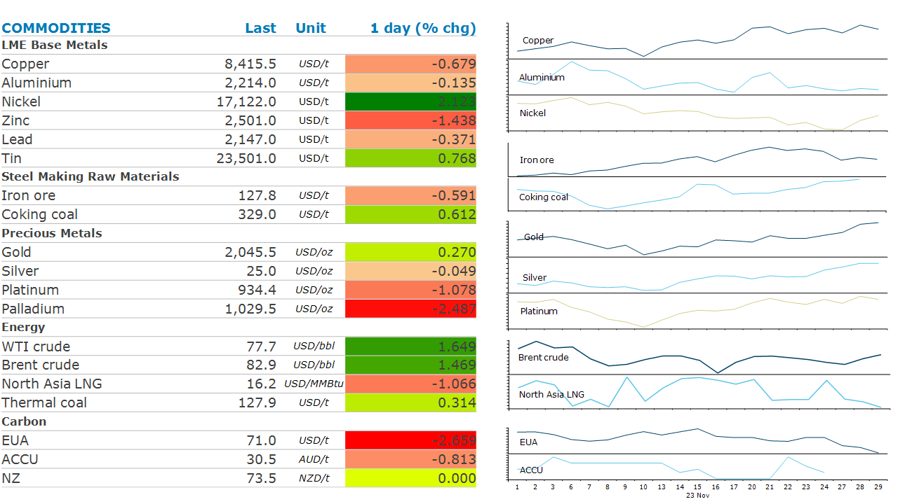

# Focus returns to supply risks

**Date:** December 01, 2023  
**Publisher:** Breakwave Advisors | **Category:** Market Insights  
**Original URL:** [https://www.breakwaveadvisors.com/insights/2023/11/30/focus-returns-to-supply-risks](https://www.breakwaveadvisors.com/insights/2023/11/30/focus-returns-to-supply-risks)  

---

*By*[*Daniel Hynes*](https://www.linkedin.com/in/dahynes/)

Supply side issues were back in focus across commodity markets. Broadly positive economic data also helped support prices.

> **Figure 1: 1701293702051**  
> **Interactive Data & Source:** [Linkedin](https://www.linkedin.com/newsletters/commodities-wrap-6692196755876012032/?fbclid=IwAR3kiXJqZdxmp9ZcRwBNI7FsBySI-XSC0pfPur1qzjt7OZp7PTE59Tsl1QI) | [Local Asset](file:///C:/Users/Dell/Github/Shipping/corpus/03-breakwave/insights/2023/assets/2023-12-01_focus-returns-to-supply-risks_img_1701293702051_c2c03425f16b.png)

**Copper**briefly touched a 10-week high as mine closures brought supply risks back into focus. The government has said it will shut the Cobre mine owned by First Quantum, following a decision from Panama’s top court that the operation was unconstitutional. This dashed hopes by the company that it might be able to reach a new deal to keep it operating. The copper mine produces around 1.5% of world supply. The market’s lack of reaction suggests it feels this may be a temporary closure, but it is a significant risk to a currently balanced market. Risk of further supply disruptions eased after workers at MMG’s Las Bambas copper mine in Peru said they will return to work on Thursday. However, they vowed to continue pushing for a new profit-sharing agreement, which could keep industrial action a risk.

**Iron ore**was steady as optimism over steel demand offset concerns of market intervention by Beijing. A Mysteel report showed China’s new commercial housing transactions in the week to 26 November rose by 14.4% w/w in ten key cities including Shanghai and Beijing. However, the threat of regulatory oversight continues to hang over the market.

**Gold**edged higher as bets on Fed rate cuts next year continue to rise. Treasury yields remained under pressure following Fed Governor Waller’s comments earlier this week that monetary policy is well positioned to return inflation to a 2% target. Investors are increasingly positioning for a hard economic landing and aggressive Fed policy easing next year, according to a JPMorgan Chase survey.

The prospect of easing monetary policy also boosted sentiment across the energy complex. However,**crude oil**also found support from expectations of additional output cuts by OPEC. Reports suggest an agreement to cut quotas further is still yet to be reached. African nations including Angola and Nigeria are said to be unhappy with the lower quota limits as they won’t reflect their diminished production capabilities. The gains were limited by rising inventories in the US. EIA’s weekly report showed that commercial stockpiles of crude oil rose 1.6mbbl last week to its highest level since July. Gasoline and distillate fuel stockpiles were also higher (1,764kbbl and 5,217kbbl respectively). This was offset by a rise in refinery runs, which could ultimately reduce those stockpiles in coming weeks.

**European gas**prices slumped for a fourth session amid concerns of weak demand. European Central Bank Vice President, Luis de Guindos, said there are risks to the current growth outlook and the economy may perform worse than currently expected. This suggests industrial and household demand are unlikely to cause a significant surge in consumption anytime soon.**North Asia LNG**prices edged lower despite ongoing supply risks. Instead, traders sat on the sidelines amid the prospect of weak winter demand.

Data source:[Commodities Wrap](https://www.linkedin.com/newsletters/commodities-wrap-6692196755876012032/?fbclid=IwAR3kiXJqZdxmp9ZcRwBNI7FsBySI-XSC0pfPur1qzjt7OZp7PTE59Tsl1QI)
