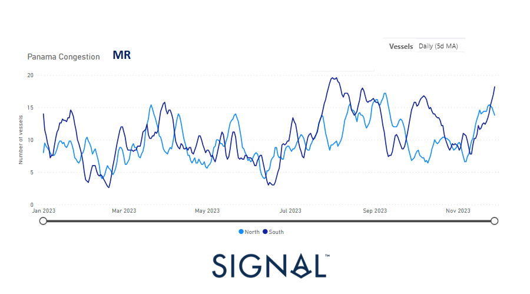
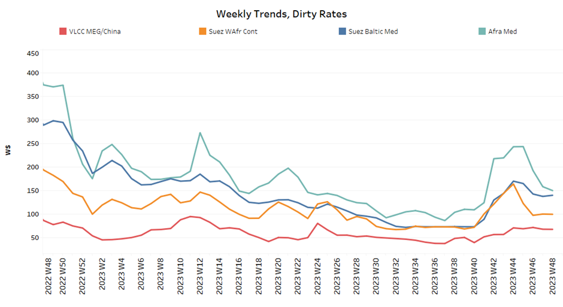
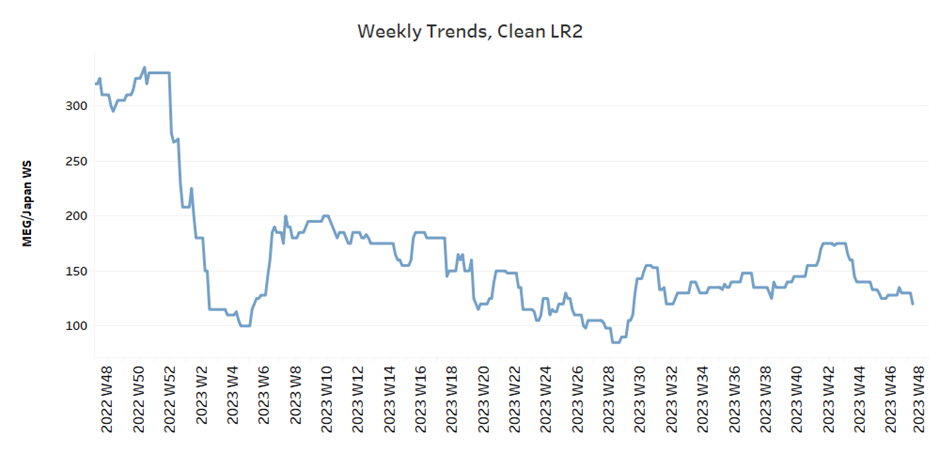
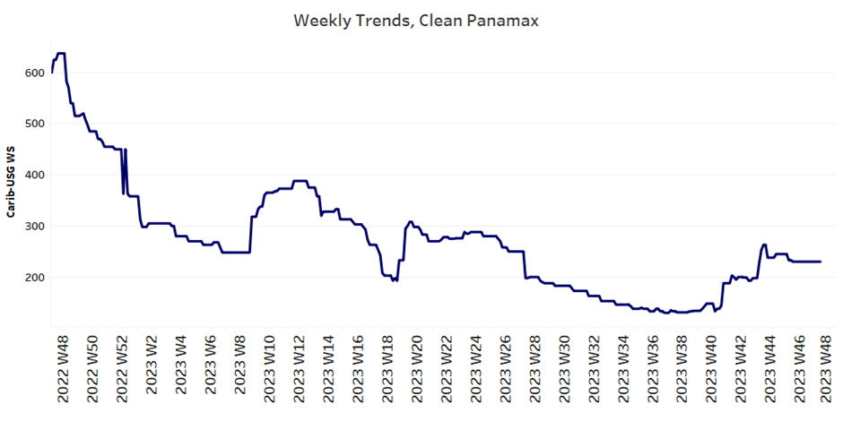
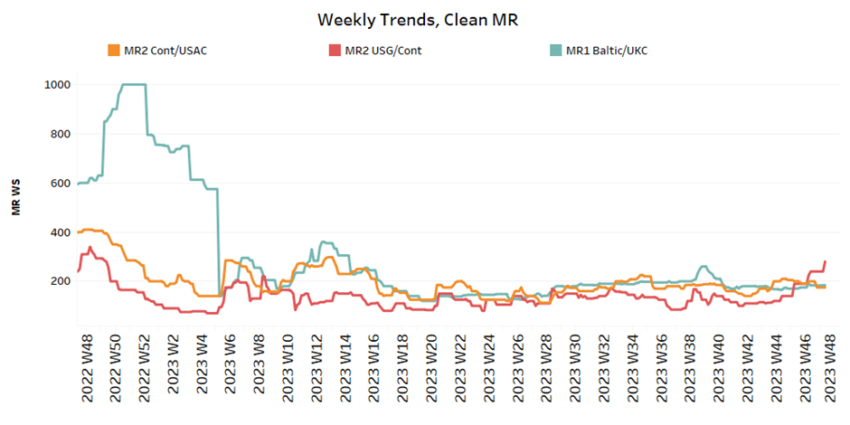
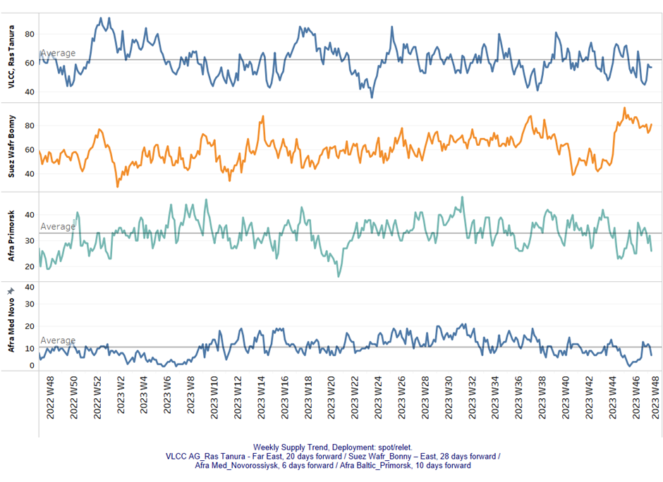
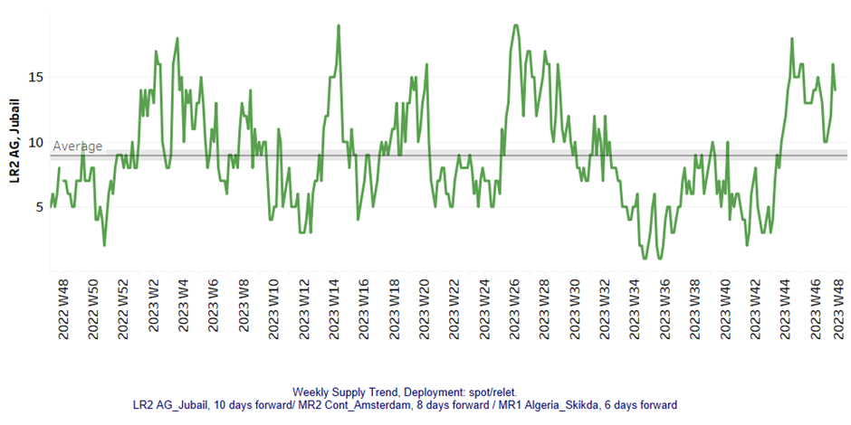
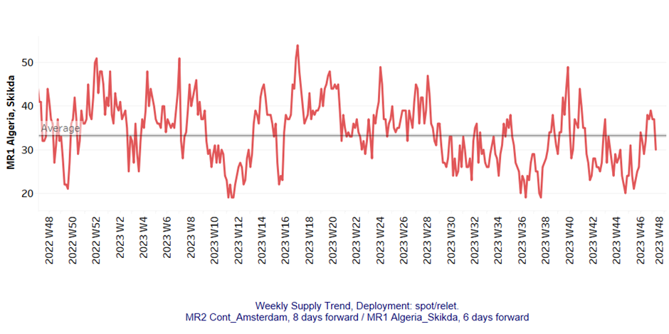
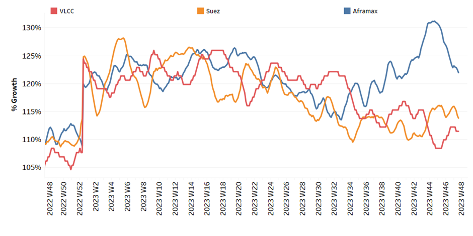

# Signal Tanker Weekly Report

**Date:** December 01, 2023  
**Publisher:** Breakwave Advisors | **Category:** Market Insights  
**Original URL:** [https://www.breakwaveadvisors.com/insights/2023/12/1/signal-tanker-weekly-report](https://www.breakwaveadvisors.com/insights/2023/12/1/signal-tanker-weekly-report)  

---

> **Figure 1: Homepage2bbanner2b1**  
> **Interactive Data & Source:** [Breakwave Advisors Market Insights](https://www.breakwaveadvisors.com/breakwave-day-2023) | [Local Asset](file:///C:/Users/Dell/Github/Shipping/corpus/03-breakwave/insights/2023/assets/2023-12-01_signal-tanker-weekly-report_img_homepage2bbanner2b128129_5d7211685255.png)

[

> **Figure 2: Homepage2bbutton**  
> **Interactive Data & Source:** [Signal Ocean Platform](https://www.thesignalgroup.com/signal-ocean-platform) | [Local Asset](file:///C:/Users/Dell/Github/Shipping/corpus/03-breakwave/insights/2023/assets/2023-12-01_signal-tanker-weekly-report_img_homepage2bbutton28129_1d014100cc65.png)](https://www.breakwaveadvisors.com/breakwave-day-2023)

## Chart of the Week: MR Panama Canal Congestion

**The congestion in the Panama Canal remained significant for MR, which had a positive impact on USG rates**

> **Figure 3: Market Chart 3**  
> **Interactive Data & Source:** [Signal Ocean Platform](https://www.thesignalgroup.com/signal-ocean-platform) | [Local Asset](file:///C:/Users/Dell/Github/Shipping/corpus/03-breakwave/insights/2023/assets/2023-12-01_signal-tanker-weekly-report_img_unnamed-2023-12-01t125832556_fa86a7e3682d.png)

Sentiment for crude oil freight rates deteriorated in November, which was particularly evident in the weaker trend towards the end of the month. However, there was a glimmer of optimism in the Very Large Crude Carrier (VLCC) segment, supported by a downward trend in supply below the annual average.
In particular, the growth rate of VLCC demand in tonne-days recovered in the second half of the month, creating the conditions for more robust momentum in VLCC freight rates at the beginning of December.

Surprisingly, rates recovered in the clean segment for MR1 size vessels in the US Gulf (USG). This unexpected rebound appears to be related to a steady increase in congestion in the Panama Canal, which led to significant spikes during the month. The sustainability of this newfound strength for MR tankers remains uncertain as challenging supply dynamics continue to hamper momentum. The evolving situation prompts close monitoring to assess the lasting stability of these recent positive trends.

Meanwhile, the Saudi Energy Ministry, as stated on its official website, has confirmed the extension of its voluntary reduction of 1 million barrels per day. This extension is set to persist throughout the initial three months of the upcoming year, maintaining the cut that was originally scheduled to conclude by the year-end. Notably, this commitment adds to the broader context of substantial cuts implemented by OPEC+ and individual nations.

For more information on this week's trends, see the analysis sections below:

Freight Market, Supply and Demand

## Section 1/ Freight

Market Rates (WS)

> **Figure 4: ‘Dirty’ WS - Weaker​vlcc - Suezmax - Aframax**  
> **Interactive Data & Source:** [Signal Ocean Platform](https://www.thesignalgroup.com/signal-ocean-platform) | [Local Asset](file:///C:/Users/Dell/Github/Shipping/corpus/03-breakwave/insights/2023/assets/2023-12-01_signal-tanker-weekly-report_img_unnamed-2023-12-01t130134255_e53b8349bee7.png)

​​​​Crude oil freight rates closed November with weaker momentum, but there appears to be a glimmer of hope for a recovery in VLCCs.

- VLCC MEG-China freight rates rose to 67.5 WS, 13% higher than a comparable week a month ago, but still 38% weaker than a year ago.
- Suezmaxfreight rates for shipments from West Africa to continental Europe have been revised downwards by less than 100 WS, almost 50% lower than a year ago. Rates on the Suez-Baltic-Med route fell to 140 WS, a drop of 20 points since the beginning of November.
- Aframax Med freight rates fell to WS150 levels, with an annual increase of 60%, and it appears that there will be no recovery in early December.

> **Figure 5: ‘Product’ Wslr2 Weaker**  
> **Interactive Data & Source:** [Signal Ocean Platform](https://www.thesignalgroup.com/signal-ocean-platform) | [Local Asset](file:///C:/Users/Dell/Github/Shipping/corpus/03-breakwave/insights/2023/assets/2023-12-01_signal-tanker-weekly-report_img_unnamed-2023-12-01t130311463_a1bd03bec760.png)

- LR2 AG freight rates stood at around 120 WS, which is 30% weaker than a month ago.

> **Figure 6: PANAMAX (Sentiment: Steady)**  
> **Interactive Data & Source:** [Signal Ocean Platform](https://www.thesignalgroup.com/signal-ocean-platform) | [Local Asset](file:///C:/Users/Dell/Github/Shipping/corpus/03-breakwave/insights/2023/assets/2023-12-01_signal-tanker-weekly-report_img_unnamed-2023-12-01t130347290_600325636ad1.png)

- Panamax Carib-to-USG rates are holding a steady sentiment for three consecutive weeks at around 230WS, 16% higher than a month ago.

> **Figure 7: ‘Clean’mr Mixed**  
> **Interactive Data & Source:** [Signal Ocean Platform](https://www.thesignalgroup.com/signal-ocean-platform) | [Local Asset](file:///C:/Users/Dell/Github/Shipping/corpus/03-breakwave/insights/2023/assets/2023-12-01_signal-tanker-weekly-report_img_unnamed-2023-12-01t130506857_46906ede9280.png)

- MR1 rates for the Baltic continent held a firmer momentum at levels around 184 WS, a 60% decrease compared to a similar week a year ago.

- MR2 rates for shipments from the continent to the U.S. stood at WS 170, amid expectations for a firmer momentum in early December, however, a significant upturn was started on the MR2 USG-Cont route with rates at a level WS 280, an increase of 140% on a monthly basis.

## Section 2/ Supply

> **Figure 8: 'Dirty' (#Vessels) - Mixed**  
> **Interactive Data & Source:** [Signal Ocean Platform](https://www.thesignalgroup.com/signal-ocean-platform) | [Local Asset](file:///C:/Users/Dell/Github/Shipping/corpus/03-breakwave/insights/2023/assets/2023-12-01_signal-tanker-weekly-report_img_unnamed-2023-12-01t130551359_9a563867785f.png)

At the end of November, the strong picture of the previous days was confirmed in the Suezmax Wafr, while signs of a decline were observed in the VLCC and Aframax segments.

- VLCC Ras Tanura: The number of ships fell below the annual average of 60, which is 10 fewer than in the previous week, and it remains to be seen whether the downward trend will continue at the beginning of December.
- Suezmax Wafr: The number of ships has remained at around 80 for the last two consecutive weeks, although it is positive to note that there are no longer any signs of an increase to around 90. It appears that the figures peaked two weeks ago.
- Aframax Primorsk: The current number of ships is 26, which is almost 6 below the yearly average.
- Aframax Med Novo: The number of ships held levels below the annual average of 10 for two consecutive weeks, but still significantly higher than the bottom of two weeks ago.

> **Figure 9: 'Clean'lr2 (#Vessels) - Increasing**  
> **Interactive Data & Source:** [Signal Ocean Platform](https://www.thesignalgroup.com/signal-ocean-platform) | [Local Asset](file:///C:/Users/Dell/Github/Shipping/corpus/03-breakwave/insights/2023/assets/2023-12-01_signal-tanker-weekly-report_img_unnamed-2023-12-01t130703459_ae0ed9681d88.png)

> **Figure 10: MR1 (#Vessels) - Decreasing**  
> **Interactive Data & Source:** [Signal Ocean Platform](https://www.thesignalgroup.com/signal-ocean-platform) | [Local Asset](file:///C:/Users/Dell/Github/Shipping/corpus/03-breakwave/insights/2023/assets/2023-12-01_signal-tanker-weekly-report_img_unnamed-2023-12-01t130741251_8b1993440397.png)

- Clean LR2 AG Jubail: At the end of November, there are signs of an upward trend despite the significant decline two weeks ago. The latest figures show a number of ships around 14, which is 5 above the annual average.

- Clean MR1 Algeria Skikda: There were no signs of a late surge last week at the end of November, and the figure immediately fell below the annual average of 30.

## Section 3/ Demand (Tonne Days)

> **Figure 11: ​​‘Dirty’ Decreasing**  
> **Interactive Data & Source:** [Signal Ocean Platform](https://www.thesignalgroup.com/signal-ocean-platform) | [Local Asset](file:///C:/Users/Dell/Github/Shipping/corpus/03-breakwave/insights/2023/assets/2023-12-01_signal-tanker-weekly-report_img_unnamed-2023-12-01t130849660_277df03d96b9.png)

- Dirty tonne days: The end of the month has not yet changed the declining growth trend in the Suezmax and Aframax segments, while there appears to be a late recovery in the VLCC segment, which will only be reflected in freight market sentiment in the coming days of December.

> **Figure 12: ‘Clean’ Decreasing**  
> **Interactive Data & Source:** [Signal Ocean Platform](https://www.thesignalgroup.com/signal-ocean-platform) | [Local Asset](file:///C:/Users/Dell/Github/Shipping/corpus/03-breakwave/insights/2023/assets/2023-12-01_signal-tanker-weekly-report_img_unnamed-2023-12-01t130849660_277df03d96b9.png)

- Panamax tonne days: The modest upturn seen in the previous week ended eventually with a downward correction, while the last peak was seen in week 42.

- Clean MR tonne days: The decline continues sharply for both MR1 and MR2 vessel sizes, with the growth rate for MR1 falling at a lower level than that of MR2.

Data Source:[Signal Ocean Platform](https://www.thesignalgroup.com/signal-ocean-platform)
