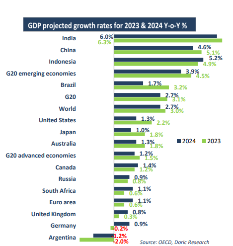

# How high could it soar?

**Date:** December 04, 2023  
**Publisher:** Breakwave Advisors | **Category:** Market Insights  
**Original URL:** [https://www.breakwaveadvisors.com/insights/2023/12/4/doric-weekly-market-insight](https://www.breakwaveadvisors.com/insights/2023/12/4/doric-weekly-market-insight)  

---

> **Figure 1: Homepage+banner+1 (1)**  
> **Interactive Data & Source:** [Breakwave Advisors Market Insights](https://www.breakwaveadvisors.com/breakwave-day-2023) | [Local Asset](file:///C:/Users/Dell/Github/Shipping/corpus/03-breakwave/insights/2023/assets/2023-12-04_doric-weekly-market-insight_img_homepage2bbanner2b128129_5d7211685255.png)

[

> **Figure 2: Bymichalis Voutsinas**  
> *ByMichalis Voutsinas*  
> **Interactive Data & Source:** [Linkedin](https://www.linkedin.com/in/michalis-voutsinas-587544163/) | [Local Asset](file:///C:/Users/Dell/Github/Shipping/corpus/03-breakwave/insights/2023/assets/2023-12-04_doric-weekly-market-insight_img_homepage2bbutton28129_1d014100cc65.png)](https://www.breakwaveadvisors.com/breakwave-day-2023)

## “During the Forty-Eighth Trading Week, the Spot Market Appeared Solely Fixated on One Question: How High Could It Soar?”

In sharp contrast to the euphoric feeling of the spot market, the Organisation for Economic Cooperation and Development has expressed concerns for the course of global economy in the following year. The global product proved more resilient than expected in the first half of 2023, but the growth outlook remains weak. The global economy is expected to slow slightly next year but the risk of a hard landing has subsided despite high levels of debt and uncertainty over interest rates, OECD stressed on Wednesday. According to the Parisbased international organisation, the world economy is set to expand by 3.0 percent in 2023, before slowing down to 2.7 percent in 2024. A disproportionate share of global growth in 2023-24 is expected to continue to derive from Asia, despite the weaker-than-expected recovery in China so far.

Growth in advanced economies was seen headed for a soft landing, with the United States holding up better than expected. In particular, the US economy has so far proved to be unexpectedly resilient to the steep rise in interest rates, with household spending supported by a run-down of excess savings accumulated during the pandemic. However, as the effect of the aforementioned boost fades, tighter financial conditions are expected to become increasingly visible. Calendar year GDP growth is projected to ease from 2.2 percent in 2023 to 1.3 percent in 2024, well below potential. Across the pond, activity has already weakened in the euro area and the United Kingdom, reflecting the lagged effect on incomes from the 2022 energy price shock. The projected GDP growth for the euro area in 2023 is 0.6 percent, and it's anticipated to rise to 1.1 percent in 2024. Meanwhile, the United Kingdom is expected to experience growth rates of 0.3 percent in 2023 and a slightly improved 0.8 percent in 2024. Being the only advanced economy in the G20 without any increase in interest rates, Japan is expected to see a GDP growth of 1.8 percent this year, before it reverts back to trend in 2024, at 1 percent. Overall, the macroeconomic policy adjustments necessary to curb inflation and establish sustainable public finances are expected to restrain growth across most advanced economies.

While many major emerging-market economies have responded to global trends by increasing interest rates to prevent currency depreciation against the US dollar, China has taken a different approach, opting to ease monetary policy to counteract a slowdown in domestic demand. Despite an initial post-reopening surge in early 2023, China's growth is expected to decelerate throughout the year. The OECD has slightly adjusted its growth forecast for the world’s second-largest economy, raising it by 0.1 points to 5.2 percent for this year and projecting 4.7 percent for the following year. In contrast, GDP growth in the other major Asian emerging-market economies, India and Indonesia, is projected to remain relatively steady in 2023 and 2024 at circa 6 percent for India and 5 percent for Indonesia. The growth trajectories in the remaining G20 emergingmarket economies vary significantly, contingent upon each nation's idiosyncrasies. Generally, except for China, there's a projected modest enhancement in growth among the G20 emerging-market economies over the next few years.

> **Figure 3: 1**  
> **Interactive Data & Source:** [Doric](https://www.doric.gr/) | [Local Asset](file:///C:/Users/Dell/Github/Shipping/corpus/03-breakwave/insights/2023/assets/2023-12-04_doric-weekly-market-insight_img_1_c6746b12fd44.png)

Despite the growth in global output, trade volumes have experienced a slower-than-anticipated rise in the first half of this year, resulting in a decline in trade intensity. Merchandise trade volumes have been particularly weak, especially in the major advanced economies, with global trade in goods falling by 2.5 percent over the year to June. After a swift rebound from the initial pandemic months, the global trade-to-GDP ratio surpassed 2018 levels by the fourth quarter of 2021 and maintained this position until the third quarter of 2022. However, this ratio has consistently lagged behind the anticipated trajectory compared to the pre-pandemic decade's growth pace. Since mid-2022, reduced merchandise trade has contributed to a decline in total trade relative to GDP. Leading indicators suggest a gradual recovery in trade following the current slowdown. Although there's a notable increase in container port activity in China, overall indicators point toward a mild recovery in total volumes.

In sync with OECD, BIMCO's latest dry bulk shipping outlook seems to diverge from the recent cheerfulness observed in the spot market. The Baltic and International Maritime Council anticipates that average freight rates will likely either maintain the current levels observed in 2023 or see only slight improvements. Despite a modest uptick in demand, the limited Capesize order book is expected to lend support to the spot market for the largest bulk carriers in the coming year. The Supramax and Handysize segments might experience advantages due to robust demand for grains and minor bulk cargoes. However, the considerable orderbook for Ultramax vessels may prevent rates from experiencing significant rises. Panamax segment may face challenges on the staple coal runs as shipments might start to fall as early as the first quarter of 2024.

Despite the aforementioned, during the forty-eighth trading week, the spot market appeared solely fixated on one question: How high could it soar? This focus allowed freight market to leverage the recent supportive measures from Beijing while blatantly disregarding warnings from international organizations.

Data source:[Doric](https://www.doric.gr/)
