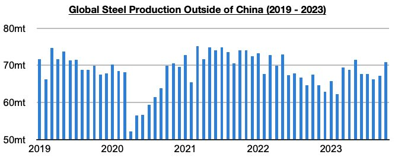
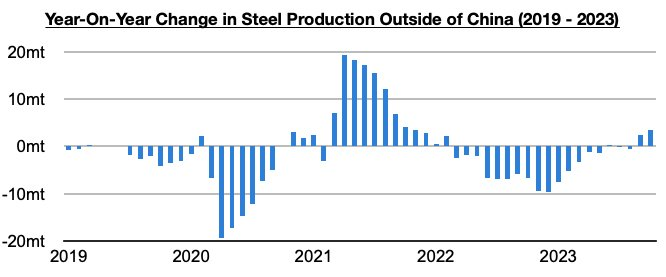
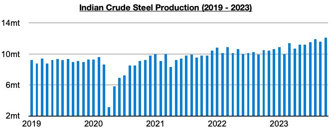
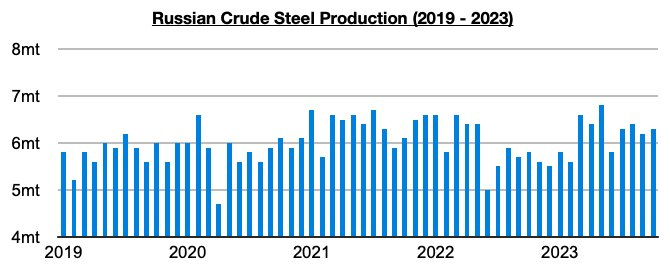

# Even More Growth in Steel Production Outside of China

**Date:** December 04, 2023  
**Publisher:** Breakwave Advisors | **Category:** Market Insights  
**Original URL:** [https://www.breakwaveadvisors.com/insights/2023/12/4/even-more-growth-in-steel-production-outside-of-china](https://www.breakwaveadvisors.com/insights/2023/12/4/even-more-growth-in-steel-production-outside-of-china)  

---

> **Figure 1: Homepage+banner+1 (1)**  
> **Interactive Data & Source:** [Breakwave Advisors Market Insights](https://www.breakwaveadvisors.com/breakwave-day-2023) | [Local Asset](file:///C:/Users/Dell/Github/Shipping/corpus/03-breakwave/insights/2023/assets/2023-12-04_even-more-growth-in-steel-production-outside-of-china_img_homepage2bbanner2b128129_5d7211685255.png)

[

> **Figure 2: Byjeffrey Landsberg**  
> *ByJeffrey Landsberg*  
> **Interactive Data & Source:** [Linkedin](https://www.linkedin.com/in/jeffrey-landsberg-70ab957/) | [Local Asset](file:///C:/Users/Dell/Github/Shipping/corpus/03-breakwave/insights/2023/assets/2023-12-04_even-more-growth-in-steel-production-outside-of-china_img_homepage2bbutton28129_1d014100cc65.png)](https://www.breakwaveadvisors.com/breakwave-day-2023)

Global steel production totaled approximately 150 million tons in October. This is up month-on-month by 700,000 tons (1%) and is 2.7 million tons (2%) more than was reported last year for October 2022’s production. Production outside of China totaled 70.9 million tons. This is up month-on-month by 3.7 million tons (6%) and is 3.4 million tons (5%) more than was reported last year for October 2022’s production. The growth outside of China occurred largely in India and Russia.

> **Figure 3: Chart 1 (68)**  
> [Local Asset](file:///C:/Users/Dell/Github/Shipping/corpus/03-breakwave/insights/2023/assets/2023-12-04_even-more-growth-in-steel-production-outside-of-china_img_chart1286829_f20819999458.jpg)

As we have been highlighting in Commodore's Weekly Dry Bulk Reports, June saw an inflection point as there was finally growth in steel production outside of China. Prior to June, steel production outside of China fell on a year-on-year basis for fifteen straight months (during those fifteen months, production outside of China contracted year-on-year by 77 million tons).

> **Figure 4: Chart 2 (63)**  
> [Local Asset](file:///C:/Users/Dell/Github/Shipping/corpus/03-breakwave/insights/2023/assets/2023-12-04_even-more-growth-in-steel-production-outside-of-china_img_chart2286329_eb890cb7a363.jpg)

In total, June, July, August, September, and October have seen steel production outside of China grow year-on-year by 5.5 million tons, with most of the growth occurring during the last two months. India’s steel production is where the growth remains strongest.

Indian steel production totaled 12.1 million tons in October. This is 500,000 tons (4%) more than was produced in September and is 600,000 tons (15%) more than was reported last year for October 2022’s production. India’s production has now increased on a year-on-year basis for eight straight months. March, July, August, and October all saw new records set.

> **Figure 5: Chart 3 (45)**  
> [Local Asset](file:///C:/Users/Dell/Github/Shipping/corpus/03-breakwave/insights/2023/assets/2023-12-04_even-more-growth-in-steel-production-outside-of-china_img_chart3284529_b74dd5b16c93.jpg)

Russian steel production totaled 6.3 million tons in October. This is 100,000 tons (2%) more than was produced in October and is 500,000 tons (9%) more than was reported last year for October 2022’s production. Russian production has now increased on a year-on-year basis for six straight months.

> **Figure 6: Chart 4 (23)**  
> [Local Asset](file:///C:/Users/Dell/Github/Shipping/corpus/03-breakwave/insights/2023/assets/2023-12-04_even-more-growth-in-steel-production-outside-of-china_img_chart4282329_0559d4c31826.jpg)
