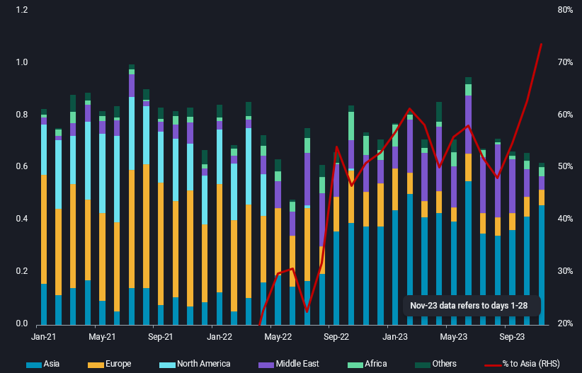
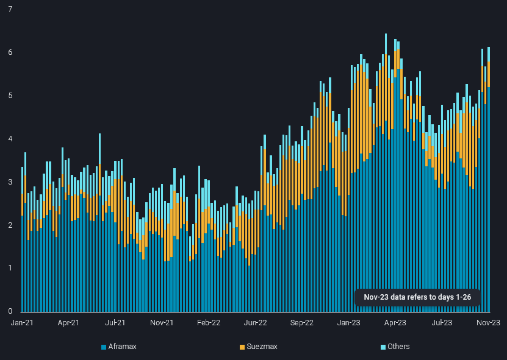

# Russia’s fuel oil exports see tougher days ahead

**Date:** December 05, 2023  
**Publisher:** Breakwave Advisors | **Category:** Market Insights  
**Original URL:** [https://www.breakwaveadvisors.com/insights/2023/12/5/9lkdvuaq27e30msiugo52tztpvti3c](https://www.breakwaveadvisors.com/insights/2023/12/5/9lkdvuaq27e30msiugo52tztpvti3c)  

---

> **Figure 1: Homepage+banner+1 (1)**  
> **Interactive Data & Source:** [Breakwave Advisors Market Insights](https://www.breakwaveadvisors.com/breakwave-day-2023) | [Local Asset](file:///C:/Users/Dell/Github/Shipping/corpus/03-breakwave/insights/2023/assets/2023-12-05_9lkdvuaq27e30msiugo52tztpvti3c_img_homepage2bbanner2b128129_5d7211685255.png)

[

> **Figure 2: Homepage2bbutton**  
> **Interactive Data & Source:** [Linkedin](https://www.linkedin.com/search/results/all/?fetchDeterministicClustersOnly=true&heroEntityKey=urn%3Ali%3Afsd_profile%3AACoAABLKb1YBSSkHNePCJagWajiyco7RH63bTuY&keywords=serena%20huang&origin=RICH_QUERY_SUGGESTION&position=0&searchId=47869d15-a8e4-4e02-b0c5-cc4693f36d92&sid=PBn&spellCorrectionEnabled=false) | [Local Asset](file:///C:/Users/Dell/Github/Shipping/corpus/03-breakwave/insights/2023/assets/2023-12-05_9lkdvuaq27e30msiugo52tztpvti3c_img_homepage2bbutton28129_1d014100cc65.png)](https://www.breakwaveadvisors.com/breakwave-day-2023)

## Russia’s Fuel Oil Exports Are Facing Growing Headwinds As More Middle East and West of Suez Supplies Head Towards Asia.

*By*[*Serena Huang*](https://www.linkedin.com/search/results/all/?fetchDeterministicClustersOnly=true&heroEntityKey=urn%3Ali%3Afsd_profile%3AACoAABLKb1YBSSkHNePCJagWajiyco7RH63bTuY&keywords=serena%20huang&origin=RICH_QUERY_SUGGESTION&position=0&searchId=47869d15-a8e4-4e02-b0c5-cc4693f36d92&sid=PBn&spellCorrectionEnabled=false)

More Russian fuel oil cargoes are heading to Asia in search of buyers, as Middle East reduces its intake and sanctions continue to keep the EU and US markets out of reach. This shift has coincided with a significant reduction in Middle Eastern fuel oil exports, which have hit a six-month low in November due to extensive autumn refinery maintenance that is further exacerbated by the unplanned shutdown of Kuwait’s Al-Zour refinery.

According to Vortexa’s data, Asia accounted for over 70% of Russia’s fuel oil arrivals in November, a notable increase of nearly 10% compared to the previous month. However, the journey eastward is not without its challenges for Russian exporters. Amid limited alternative markets outside of Asia, Russian exporters are faced with the double whammy of having to cut back on export prices to offset the higher freight premiums demanded by tanker owners for Russian-origin cargoes, and match the softening fuel oil prices in Asia, as supply outpaces demand.

In terms of Russian fuel oil distribution within Asia, arrivals into Singapore set a record of 200kbd in November, with 60% of the volume discharging into offshore floating storage in Tanjung Pelepas. Imports into India are up for the fourth consecutive month this month, while volumes to China have reversed the dip seen in October.

> **Figure 3: Russian Fuel Oil Arrivals by Destination Region (Mbd**  
> *Russian fuel oil arrivals by destination region (mbd, LHS)andpercentage share to Asia (%, RHS)*  
> **Interactive Data & Source:** [Analytics Vortexa](https://analytics.vortexa.com/?dateRange=2021-01-01T00%3A00%3A00.000Z__2023-11-28T23%3A59%3A59.999Z&filtersEnabled=%5B%22p%22%2C%22o%22%2C%22d%22%2C%22d_r%22%2C%22v%22%2C%22intra_d%22%2C%22sts_o%22%2C%22c_o%22%2C%22w%22%5D&from=%5B%22b996521be9c996db3560ca234a56286ac38f798d34be229437555fab4f12a6a5%22%5D&geoBreakdownDestinationGlobal=region&metric=bpd&movementEvent=unloading_start&page=Flows&products=%5B%221c107b4317bc2c85fb6c13cd7b28e8e0a02ec7fecc68afc2b68ca0545c835e1c%22%5D&tabId=ccb91766-9c10-4158-9930-ffb75a0bb743&timeSeriesProperty=destination_region&v=3) | [Local Asset](file:///C:/Users/Dell/Github/Shipping/corpus/03-breakwave/insights/2023/assets/2023-12-05_9lkdvuaq27e30msiugo52tztpvti3c_img_russia-fuel-oil-arrivals-1_08681f8d5836.png)

Higher Russian fuel oil volumes travelling longer distances to Asia have boosted Aframax tonne-mile demand, and also squeezed out Suezmax’s market share to a minimum. Aframax tonne-mile demand for Russian fuel oil are up over 150% in the week ending 26 Nov versus a month ago, accounting for 85% of the tonne-mile share. Meanwhile, the Suezmax tankers previously employed in carrying Russian fuel oil have either pivoted towards carrying Russian crude or left the Russian trade for Middle East and African trade.

> **Figure 4: Russia Fuel Oil Tonne Miles 3**  
> **Interactive Data & Source:** [Analytics Vortexa](https://analytics.vortexa.com/?dateRange=2021-01-01T00%3A00%3A00.000Z__2023-11-28T23%3A59%3A59.999Z&frequency1=week&from=%5B%22b996521be9c996db3560ca234a56286ac38f798d34be229437555fab4f12a6a5%22%5D&latestProducts=%5B%221c107b4317bc2c85fb6c13cd7b28e8e0a02ec7fecc68afc2b68ca0545c835e1c%22%5D&page=FleetUtilisation&primarySplitProperty1=vessel_class_coarse&secondaryTimeSeries1=hide&tabId=0a5a5160-331e-429b-a9ed-46c6fa940d40&v=4) | [Local Asset](file:///C:/Users/Dell/Github/Shipping/corpus/03-breakwave/insights/2023/assets/2023-12-05_9lkdvuaq27e30msiugo52tztpvti3c_img_russia-fuel-oil-tonne-miles-3_f2ef0117243b.png)

## Rising Fuel Oil Supplies to Singapore, Will China’s Higher Fuel Oil Import Quota Help?

A workable east-west arb could bring more fuel oil supplies to Asia in the coming weeks, with increased exports from the Middle East post refinery maintenance and the restart of Kuwait’s Al-Zour refinery (expected in mid-December) further lifting fuel oil supplies to Asia.

From the demand side, the Chinese government issued an additional 3mt of fuel oil import quotas to the independent refiners, which could increase fuel oil feedstock imports, as many of the refiners are running out of crude import quotas. However, this may not be enough to fully absorb the incremental supplies of fuel oil from the west into Asia, which likely means Asia’s fuel oil market will remain well-supplied, keeping prices capped.

Data Source:[Vortexa](https://www.vortexa.com//oil-gas-data-traders-analysts-data-scientists?gclid=Cj0KCQjw8_qRBhCXARIsAE2AtRZKOvMnbilZ_6_91d7huSFFy71pWLrnPwGwOHVzXsmsG-1a1mZnQw8aAt89EALw_wcB&hsa_acc=1782073842&hsa_ad=548425387665&hsa_cam=14746637662&hsa_grp=125038601902&hsa_kw=&hsa_mt=&hsa_net=adwords&hsa_src=g&hsa_tgt=dsa-1431852288425&hsa_ver=3&utm_campaign=%5BCD%5D%20-%20DSA%20-%20EMEA&utm_medium=cpc&utm_medium=ppc&utm_source=google&utm_source=adwords&utm_term=)
