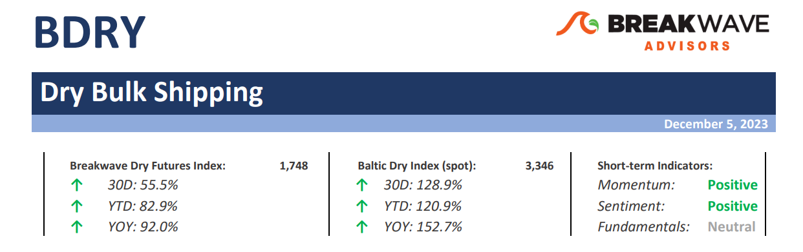
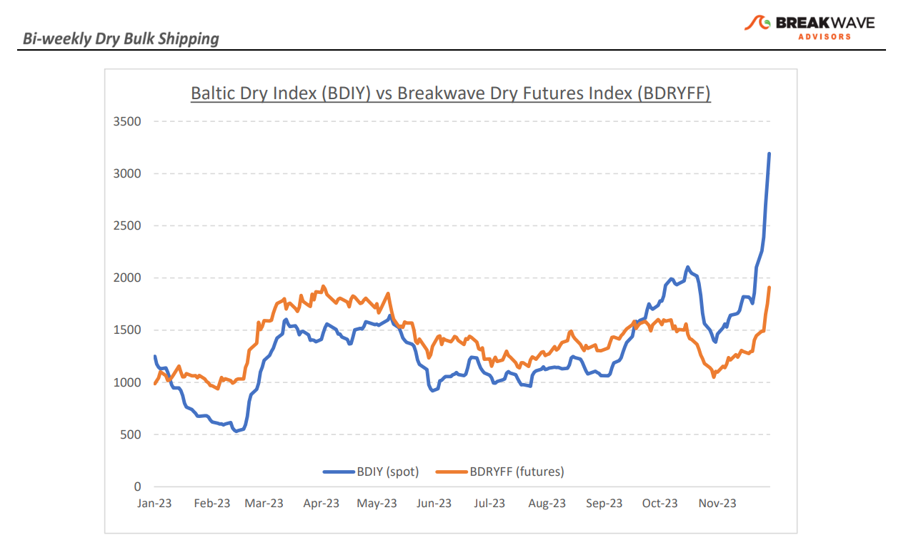
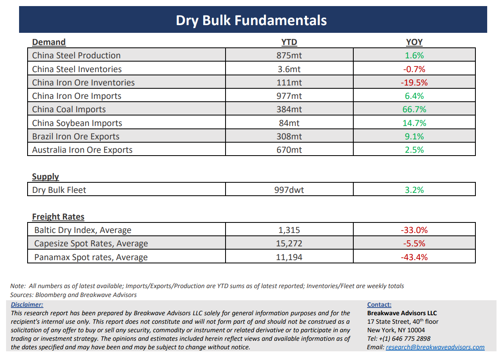

# Breakwave Bi-Weekly Dry Bulk Report - December 5, 2023

**Date:** December 05, 2023  
**Publisher:** Breakwave Advisors | **Category:** Market Insights  
**Original URL:** [https://www.breakwaveadvisors.com/insights/2023/12/05/breakwave-bi-weekly-drybulk-report-dec-05-2023-h58le](https://www.breakwaveadvisors.com/insights/2023/12/05/breakwave-bi-weekly-drybulk-report-dec-05-2023-h58le)  

---

> **Figure 1: Dbreporttop**  
> [Local Asset](file:///C:/Users/Dell/Github/Shipping/corpus/03-breakwave/insights/2023/assets/2023-12-05_breakwave-bi-weekly-drybulk-report-dec-05-2023-h58le_img_dbreporttop_c0c42166f60a.png)

**· Dry bulk rates surge at an unprecedented speed leaving traders stunned; Where do we go next? –**The dry bulk market never fails to impress, and the past fortnight is a great example:**Spot rates**across all asset classes staged an**extraordinary rally**, at times with**an intensity****not seen since the supercyle**of the 2007-2008 era. A clear**tightness in the availability of ships**in the Atlantic has been the main reason that fueled the rally but demand has also been very strong with iron ore and bauxite cargoes appearing daily in the market, further boosting confidence amongst owners and leaving charterers scrambling for open vessels. With**Capesize**rates sitting at the**mid-50,000**level (at least at the time of writing),**the outlook**, as priced by the futures market, is clearly**bearish**: January contracts trade in the high teens while February contracts are barely in the double digits. Although a**correction**of that magnitude will not be unprecedented following such a strong rally, the**potential for a shallower drop**should not be disregarded. After all,**most of the ingredients**that brought us to today’s spot levels are**still in place**: delays in the Panama Canal, disruptions due to winter weather in Europe, strong demand for iron ore and bauxite and port congestion in South America. However,**some**of the above are**transitory**: As we head into the first quarter of the year, iron ore volumes tend to decline while grain exports also ease, at least early in the year. So, where does all the above mean?**A correction**from the relatively stratospheric levels**seems inevitable**, but the**intensity of the decline**andthe**ultimate bottom**areup**for debate with the risk of being higher than previously thought**.

**· China economic numbers subdued, but dry bulk rates disregard such bearish factors –**Recent economic activity out of China based on**November PMI numbers**remain**subdued**without an indication of an upcoming pickup in activity. Although**manufacturing**seems to be**absorbing**more and more**steel**from construction, thus keeping steel demand from deteriorating further, the**outlook for next year is not encouraging**, at least without strictly speculating on such a recovery. It is difficult to envision a measurable increase in construction activity before some**fundamental changes in the real estate market**take place, which should become evident by some price stability in completed units as well as in secondhand transactions. The**ingredients**for such a development**are in place**(i.e. stimulus) but**confidence**among consumers relating to future economic prospects remains**low**. As we have stressed in the past, it is the Chinese consumer that ultimately needs to change behavior, and although financial incentives play a major role in the process,**investor psychology**towards the future**remains key**for a recovery.

**· Dry bulk focus shifts back to fundamentals –**Following a period of high uncertainty and significant disruptions across the commodity spectrum, the gradual normalization of trade is shifting the market’s attention back to the traditional demand and supply dynamics that have shaped dry bulk profitability for decades. As effective fleet supply growth for the next few years looks manageable, demand will be the main determinant of spot freight rates with China returning back to the driver’s seat as the dominant force of bulk imports and thus shipping demand.

> **Figure 2: Dbreportchart**  
> [Local Asset](file:///C:/Users/Dell/Github/Shipping/corpus/03-breakwave/insights/2023/assets/2023-12-05_breakwave-bi-weekly-drybulk-report-dec-05-2023-h58le_img_dbreportchart_1cc62ec6d55c.png)

> **Figure 3: Dbreportbottom**  
> [Local Asset](file:///C:/Users/Dell/Github/Shipping/corpus/03-breakwave/insights/2023/assets/2023-12-05_breakwave-bi-weekly-drybulk-report-dec-05-2023-h58le_img_dbreportbottom_c94686e137d1.png)

### Subscribe:
