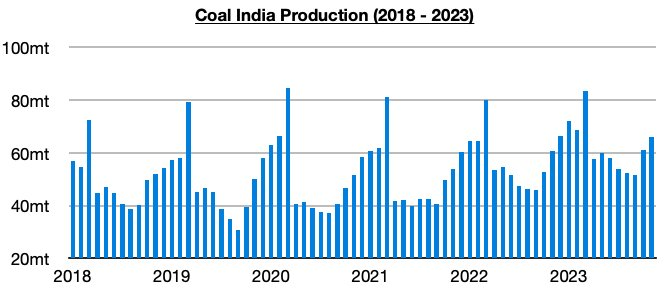
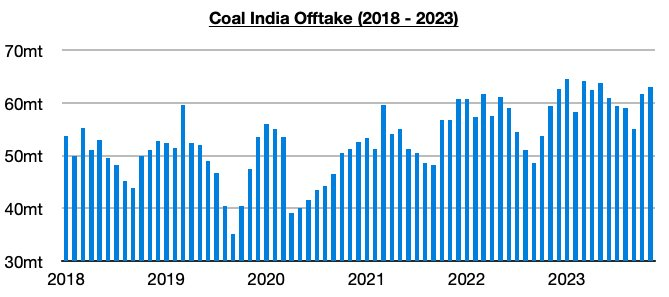

# Coal India's Production Remains Strong, But Coking Coal Remains Only Small Percentage

**Date:** December 06, 2023  
**Publisher:** Breakwave Advisors | **Category:** Market Insights  
**Original URL:** [https://www.breakwaveadvisors.com/insights/2023/12/6/rj6zkjsgpy5ah48448lmeu409e52af](https://www.breakwaveadvisors.com/insights/2023/12/6/rj6zkjsgpy5ah48448lmeu409e52af)  

---

> **Figure 1: Homepage+banner+1**  
> **Interactive Data & Source:** [Breakwave Advisors Market Insights](https://www.breakwaveadvisors.com/breakwave-day-2023) | [Local Asset](file:///C:/Users/Dell/Github/Shipping/corpus/03-breakwave/insights/2023/assets/2023-12-06_rj6zkjsgpy5ah48448lmeu409e52af_img_homepage2bbanner2b1_5d7211685255.png)

[

> **Figure 2: Byjeffrey Landsberg**  
> *ByJeffrey Landsberg*  
> **Interactive Data & Source:** [Linkedin](https://www.linkedin.com/in/jeffrey-landsberg-70ab957/) | [Local Asset](file:///C:/Users/Dell/Github/Shipping/corpus/03-breakwave/insights/2023/assets/2023-12-06_rj6zkjsgpy5ah48448lmeu409e52af_img_homepage2bbutton28129_1d014100cc65.png)](https://www.breakwaveadvisors.com/breakwave-day-2023)

Coal India produced approximately 66 million tons of coal last month, which marks a month-on-month increase of 5 million tons (8%) and a year-on-year increase of 5.3 million tons (9%). Coal India’s production has now increased on a year-on-year basis during thirty of the last thirty-one months. Coal India’s production has grown this year by 62.6 million tons (10%).

> **Figure 3: Chart 1 (74)**  
> [Local Asset](file:///C:/Users/Dell/Github/Shipping/corpus/03-breakwave/insights/2023/assets/2023-12-06_rj6zkjsgpy5ah48448lmeu409e52af_img_chart1287429_f78f10f484dc.jpg)

Offtake (amount sent to customers) totaled 63.1 million tons last month, which marks a month-on-month increase of 1.5 million tons (2%) and a year-on-year increase of 3.7 million tons (6%). Offtake has now increased on a year-on-year basis during thirty-two of the last thirty-three months, and last month again saw offtake exceed production. Prior to the last eight months, the previous five months all saw offtake fall short of production. Coal India’s stockpiles now stand at approximately 44 million tons.

> **Figure 4: Chart 2 (65)**  
> [Local Asset](file:///C:/Users/Dell/Github/Shipping/corpus/03-breakwave/insights/2023/assets/2023-12-06_rj6zkjsgpy5ah48448lmeu409e52af_img_chart2286529_42a990d9cdbd.jpg)

Fortunately for the dry bulk market, coking coal makes up less than 10% of Coal India’s total coal production. Demand for coking coal imports in India is poised to continue to grow (as India’s steel output continues to set records), just as stronger demand for coking coal imports is now suddenly occurring in China. Coal India, alone, is not able to come close to meeting India's coking coal demand.
