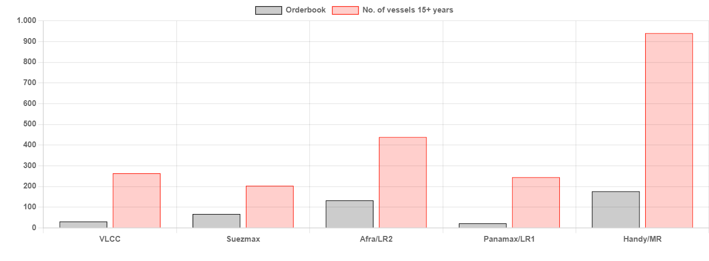

# Too Much or Too Little?

**Date:** December 06, 2023  
**Publisher:** Breakwave Advisors | **Category:** Market Insights  
**Original URL:** [https://www.breakwaveadvisors.com/insights/2023/12/6/too-much-or-too-little](https://www.breakwaveadvisors.com/insights/2023/12/6/too-much-or-too-little)  

---

> **Figure 1: Homepage+banner+1**  
> **Interactive Data & Source:** [Breakwave Advisors Market Insights](https://www.breakwaveadvisors.com/breakwave-day-2023) | [Local Asset](file:///C:/Users/Dell/Github/Shipping/corpus/03-breakwave/insights/2023/assets/2023-12-06_too-much-or-too-little_img_homepage2bbanner2b1_5d7211685255.png)

[

> **Figure 2: Homepage2bbutton**  
> **Interactive Data & Source:** [Gibsons Co](https://www.gibsons.co.uk/market-reports) | [Local Asset](file:///C:/Users/Dell/Github/Shipping/corpus/03-breakwave/insights/2023/assets/2023-12-06_too-much-or-too-little_img_homepage2bbutton28129_1d014100cc65.png)](https://www.breakwaveadvisors.com/breakwave-day-2023)

2023 has seen a notable increase in new tanker ordering activity and as the year slowly draws to its end, it is perhaps time to reflect on where investment in new tonnage has been the strongest and where it is still lacking.

For the year to date, ordering activity has been the strongest in the Aframax/LR2 segment, with the focus largely on coated tonnage. Here, circa 80 fresh orders have been placed, with the attractiveness of this asset class being fuelled by very robust spot tanker earnings, particularly in the Aframax segment. Aframax spot TCE earnings outperformed larger crude tanker categories both in 2022 and so far in 2023, driven by significant structural increases in tanker tonne miles amid Russian sanctions and a significant portion of ageing tonnage migrating into solely Russian trade. A degree of confidence in this size group has also been offered by the fact that close to 440 vessels in the existing Aframax/LR2 fleet are 15 years or older. With so many ageing tankers in this size, the volume of ordering activity to date is certainly looking modest in comparison.

Investment has also been robust in the Handy/MR and Suezmax categories. For the Handy/MRs, orders for tankers between 42 to 57,000 dwt (MRs) have amounted to just over 90 units to date, whilst we have also seen a modest (yet very rare in recent years!) re-emergence in orders for 30 to 42,000 dwt (Handy) tankers, with 16 orders placed. Yet again, whilst investment in this size group is already at its highest level in a decade, this has to be considered in the context of the ageing fleet, where we count just over 940 units built in 2008 or earlier and 288 tankers built in 2002 or earlier. The picture is somewhat more balanced for Suezmaxes, where ordering activity to date stands at 55 vessels, which compares to 204 units at 15+ years of age.

For the LR1/Panamaxes and VLCCs, where investment in new tankers has been restricted, the gap between orders and ageing tankers is even more stark. For the year to date, 20 confirmed LR1 orders have been placed (and no Panamax orders). Whilst these orders mark the first investment in this size group since 2018, these numbers are far too insufficient to offset 245 tankers in this segment aged at 15+. Despite the larger fleet size, VLCC orders for the year to date also stand at just 20 units, whilst 264 tankers in this category are at 15 years of age or older. However, it is worth bearing in mind that VLCCs (and Suezmaxes to an extent) have the largest share of tankers already absent from the mainstream market, with many units either trading sanctioned barrels (Iranian or Venezuelan crude before temporary sanctions relief) or are engaging in permanent storage.

The trend is similar if we consider total tanker orderbook vs. the fleet at 15+ years of age shown on the chart below, which clearly shows that whilst increases in ordering activity are welcome, it comes nowhere close to offsetting the growing mountain of ageing tonnage. This has not been a problem recently, however, due to a rapid pull of ageing tankers into Russian and sanctioned trades. Nonetheless, this alternative demand cannot continue growing forever and will be saturated at some point. When that happens, the normal drivers of tanker demolition will return, being reinforced by ever increasing regulatory pressure. Yet, if demand remains there, it may prove more economical for owners to upgrade their existing tonnage rather than invest into new tonnage.

## Tanker Orderbook vs Tanker Supply 15+ Years

> **Figure 3: Αρχείο Λήψης (6)**  
> **Interactive Data & Source:** [Gibsons Co](https://www.gibsons.co.uk/market-reports) | [Local Asset](file:///C:/Users/Dell/Github/Shipping/corpus/03-breakwave/insights/2023/assets/2023-12-06_too-much-or-too-little_img_ceb1cf81cf87ceb5ceafcebfcebbceaecf88_bc9d021a3cf6.png)

Data source:[Gibson Shipbrokers](https://www.gibsons.co.uk/market-reports)
