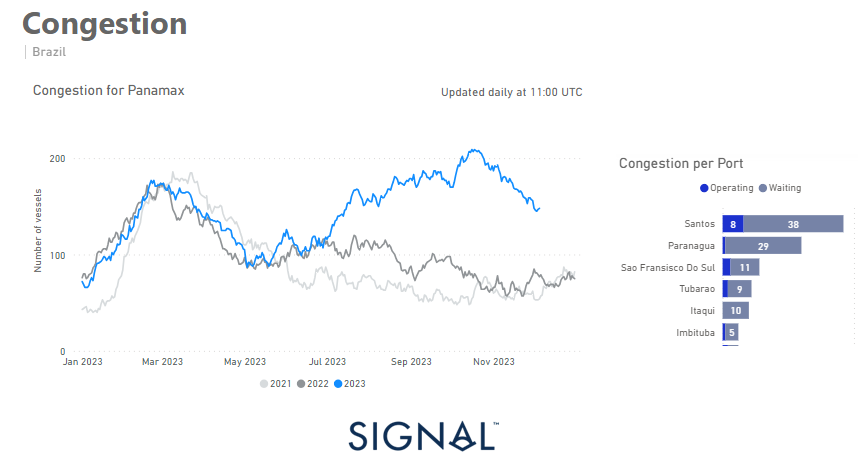
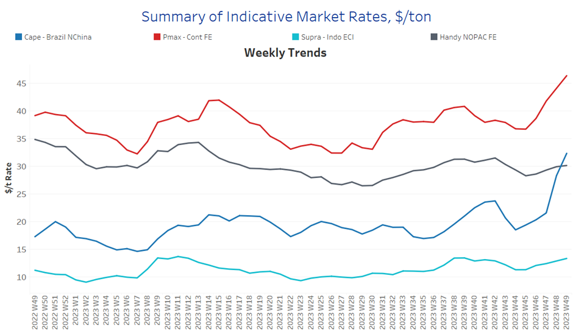
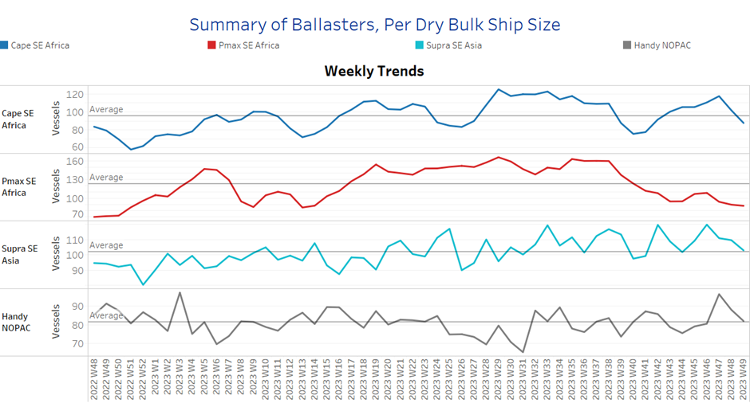
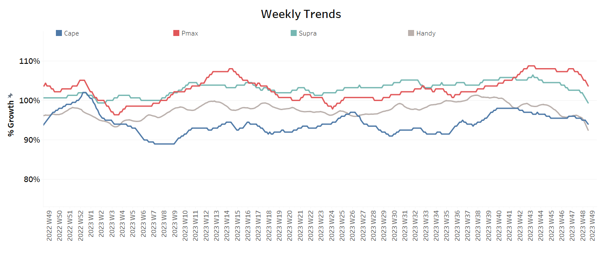
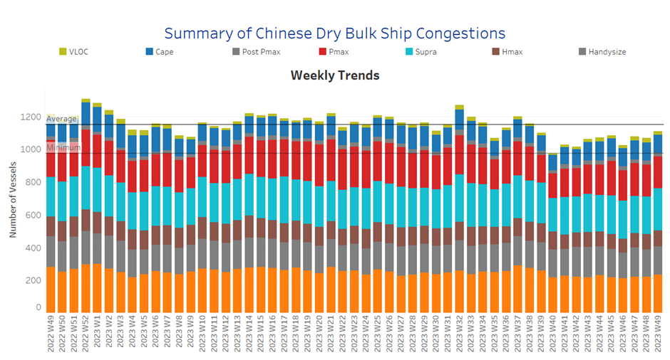

# Signal Dry Bulk Weekly Report

**Date:** December 08, 2023  
**Publisher:** Breakwave Advisors | **Category:** Market Insights  
**Original URL:** [https://www.breakwaveadvisors.com/insights/2023/12/8/bg9cev5n7ro3jq5ryh3d5wowu4vlq0](https://www.breakwaveadvisors.com/insights/2023/12/8/bg9cev5n7ro3jq5ryh3d5wowu4vlq0)  

---

## Chart of the Week :Panamax Brazilian Port Congestion​​​​​

### Downward Revision of the Number of Panamax Ships Congested in Brazilian Ports

> **Figure 1: Market Chart 1**  
> **Interactive Data & Source:** [Signal Ocean Platform](https://www.thesignalgroup.com/signal-ocean-platform) | [Local Asset](file:///C:/Users/Dell/Github/Shipping/corpus/03-breakwave/insights/2023/assets/2023-12-08_bg9cev5n7ro3jq5ryh3d5wowu4vlq0_img_unnamed-2023-12-08t153536022_8e6547c4f355.png)

In the first week of December, both the Capesize and Panamax freight markets experienced a remarkable upswing, reaching their highest levels of the past year. The larger vessel categories experienced an unexpected turnaround in sentiment and recorded a remarkable upswing. However, the smaller vessel categories are still struggling to develop stronger momentum, although there are signs of growth in the supramax sector. Interestingly, the number of congested Panamax vessels in Brazilian ports was revised downwards, marking the first decline since the end of the first half of 2023.
This was a crucial factor contributing to the rise in Panamax freight rates. Despite the recent rate recovery, demand in tonne-miles have not increased accordingly, raising the question of whether December will signal an upward cycle in freight rates, especially given concerns about the impact of China's economic recovery on the market.

In addition, Moody's downgraded China's credit rating in December, citing the costs associated with bailing out local governments and state-owned enterprises, as well as efforts to contain the housing crisis. This move makes the economic landscape even more complex and has the potential to impact global markets.

​​​For more information on this week's trends, see the analysis sections below:

Freight Market, Supply, Demand and Port Congestion

## Section 1/ Freight

‘The Big Picture’ - Capesize and Panamax Bulkers and Smaller Ship Sizes

Market Rates ($/t) Firmer

> **Figure 2: Supply Trend Lines for Key Load Areasballasters (#Vessels)**  
> *Supply Trend Lines for Key Load AreasBallasters (#vessels) Decreasing*  
> **Interactive Data & Source:** [Signal Ocean Platform](https://www.thesignalgroup.com/signal-ocean-platform) | [Local Asset](file:///C:/Users/Dell/Github/Shipping/corpus/03-breakwave/insights/2023/assets/2023-12-08_bg9cev5n7ro3jq5ryh3d5wowu4vlq0_img_unnamed-2023-12-08t153633552_94b290053036.png)

December is ablaze with unwavering optimism, propelled by the remarkable resurgence of rates in the Capesize and Panamax vessel size categories, soaring to unprecedented heights within a year.

- Capesize vessel freight rates from Brazil to North China reached $30/tonne, up 12% on the previous week and 50% on the previous month.
- Panamax vessel freight rates from the Continent to the Far East rose to $46 per tonne, up 25% from the same week a month ago.
- Supramax vessel freight rates on the Indo-ECI route held a similar momentum over the last three weeks at $13 per tonne, 18% higher than in the same week a year ago.
- Handysize freight rates for the NOPAC Far East route have not yet reached a different momentum and are still at $29-30/tonne, only 5% higher than a month ago.

## Section 2/ Supply

> **Figure 3: Market Chart 3**  
> **Interactive Data & Source:** [Signal Ocean Platform](https://www.thesignalgroup.com/signal-ocean-platform) | [Local Asset](file:///C:/Users/Dell/Github/Shipping/corpus/03-breakwave/insights/2023/assets/2023-12-08_bg9cev5n7ro3jq5ryh3d5wowu4vlq0_img_unnamed-2023-12-08t153803128_cb0ea9d954c7.png)

The number of ballasters dropped eventually below the annual average for SE Africa in the Capesize and Panamax segments, while there are signs of a decrease in the smaller vessel segments.

- Capesize SE Africa: The number of ballasters dropped below 90, which is the latest low after the level of week 40 (~76).
- Panamax SE Africa: The number of ballasters dropped to 86, which is surprisingly low when the last peak was reached in week 38 (~160).
- Supramax SE Asia: The number of ballast ships dropped to 100, 17 lower than the previous week, with the first decrease after a constant upward trend in the previous five consecutive weeks.
- Handysize NOPAC: The number of ballast ships dropped below 80 when a week ago was nearing a peak of 100, while the latest low remained at week 44 (~76).

## Section 3/ Demand

> **Figure 4: Summary of Dry Bulk Demand, per Ship Sizetonne Days Decreasing**  
> **Interactive Data & Source:** [Signal Ocean Platform](https://www.thesignalgroup.com/signal-ocean-platform) | [Local Asset](file:///C:/Users/Dell/Github/Shipping/corpus/03-breakwave/insights/2023/assets/2023-12-08_bg9cev5n7ro3jq5ryh3d5wowu4vlq0_img_unnamed-2023-12-08t153913053_87b01fa9938d.png)

Demand growth is still in a downward trend amid the recovery of freight rates seen in early December, while there seems to be a later rebound in the next few days along with the performance of freight rates.

- Capesize: The downward trend continues amid the spikes in freight rates, while it remains to be seen whether there will be a soon upturn with the latest dynamic swings reported in the freight market.
- Panamax: The downward correction remained persistent, with the decrease following previous weekly drops, but growth levels are higher than the lows recorded more than ten weeks ago.
- Supramax: The growth rate is still at its lowest level since the end of week 44, however, the evolution is improved compared to the sharp downward revision in the Handysize.
- Handysize: Demand growth dropped further and reached even the lowest level of the bottom recorded a week ago. ​​​​​​

## Section 4/ Port Congestion

> **Figure 5: Dry Bulk Ships Congested at Chinese Portsno of Vessels Increasing**  
> **Interactive Data & Source:** [Signal Ocean Platform](https://www.thesignalgroup.com/signal-ocean-platform) | [Local Asset](file:///C:/Users/Dell/Github/Shipping/corpus/03-breakwave/insights/2023/assets/2023-12-08_bg9cev5n7ro3jq5ryh3d5wowu4vlq0_img_unnamed-2023-12-08t154052563_ca548006f3fb.png)

The number of dry bulk vessels congested at Chinese ports has shown an upward trend over the last three weeks, with a significant increase in congestion in the Supramax segment.

- Capesize: The number of congested vessels has been held at levels of 100 over the last seven weeks and with not yet signs of falling below this mark.
- Panamax: The number of congested ships rose to 198, while indications of the previous week were showing levels of more than 200.
- Supramax: The number of ships stood 255, with an increase of over 230 since the end of week 45.
- Handysize: The number of congested ships now stands at 171, which is 3 more than in the previous week, whereas two weeks ago there were signs of an increase to almost 180.

Data Source:[Signal Ocean Platform](https://www.thesignalgroup.com/signal-ocean-platform)
