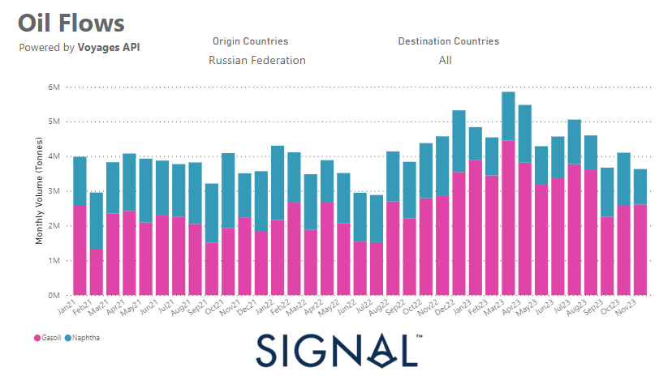
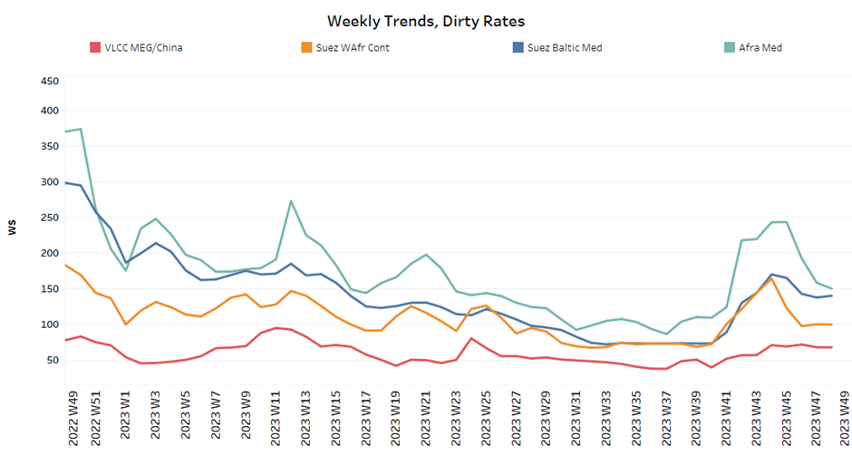
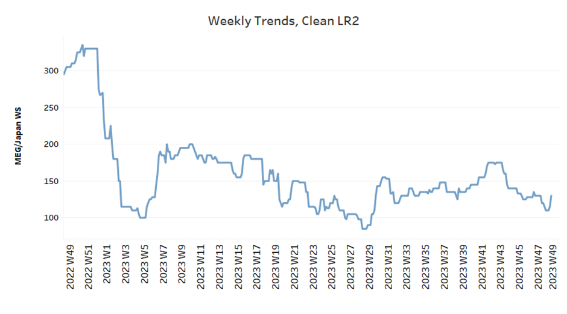
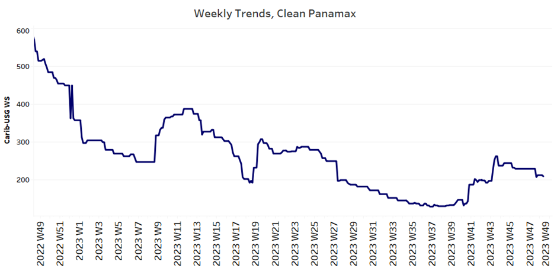
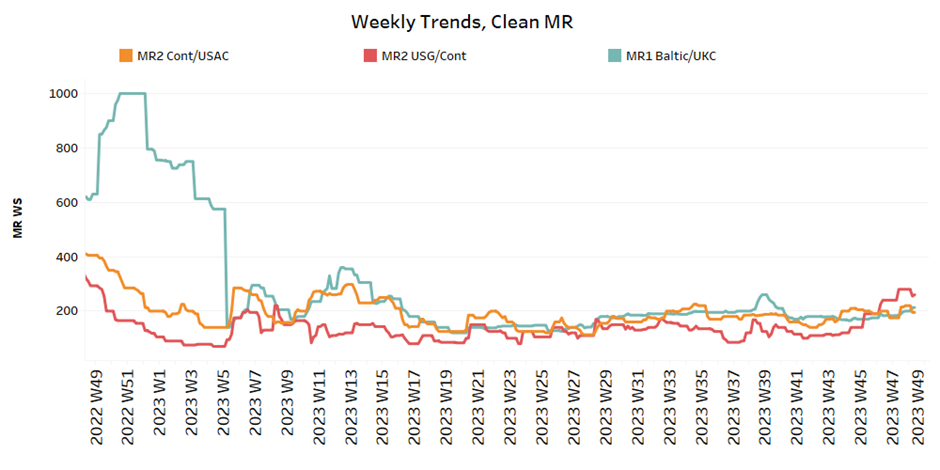
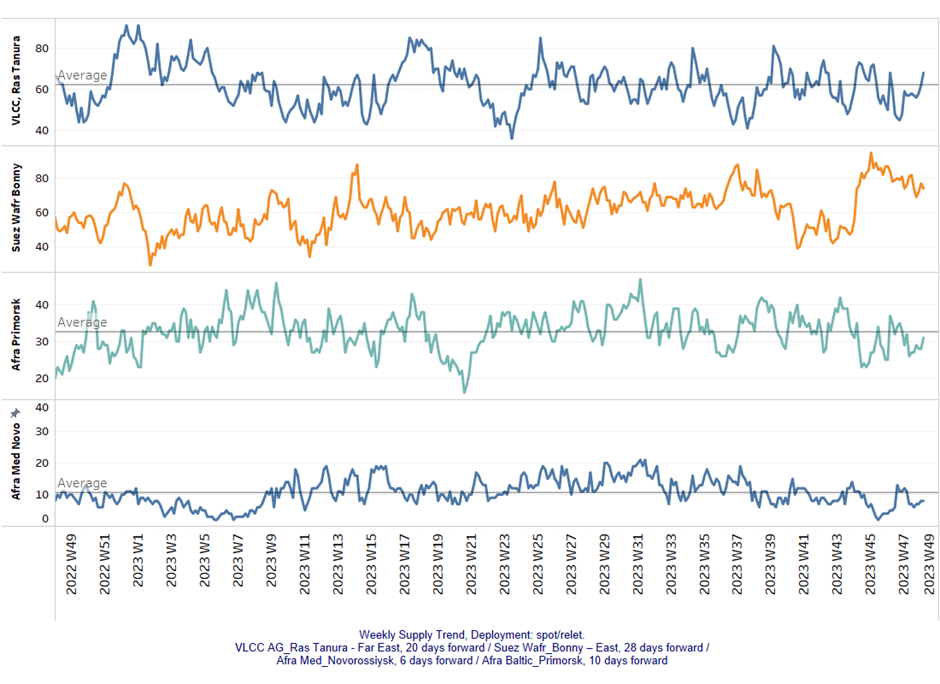
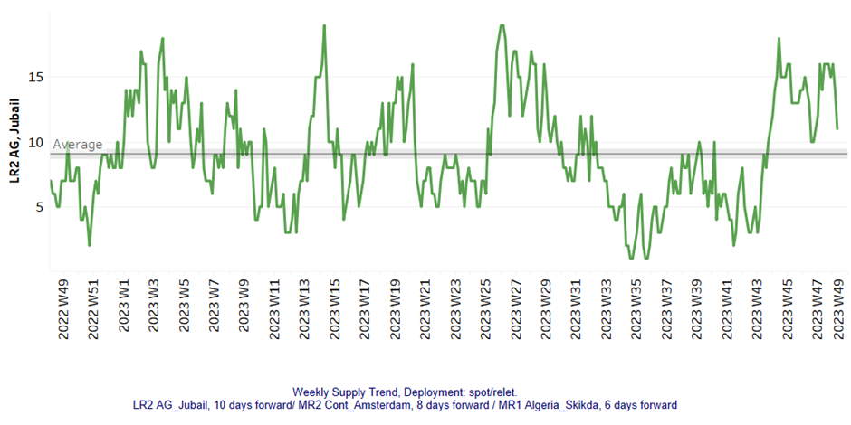
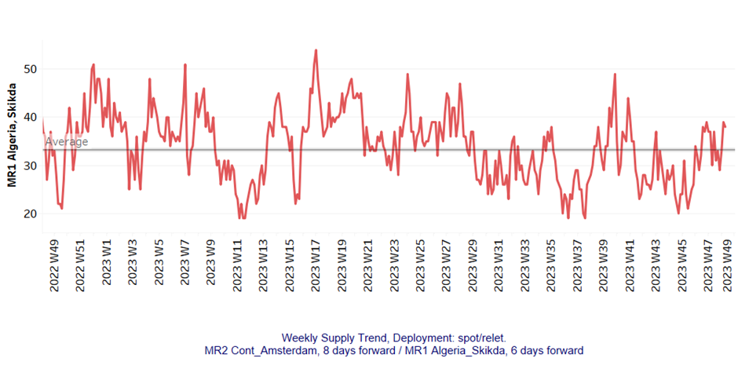
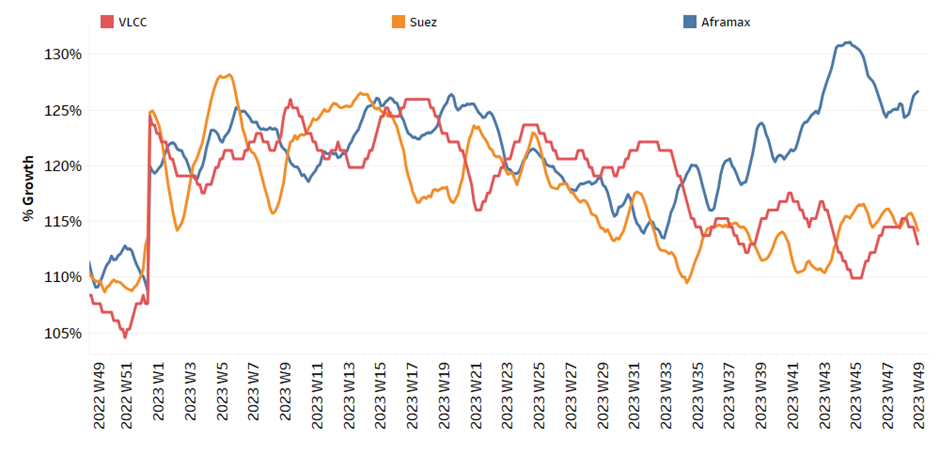
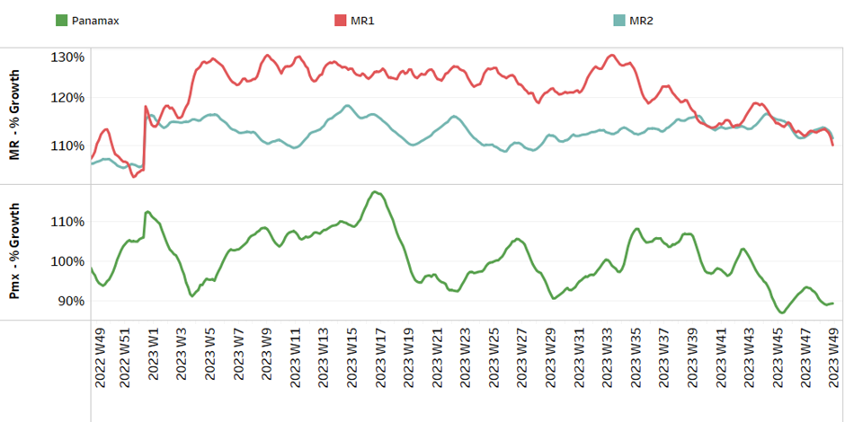

# Signal Tanker Weekly Report

**Date:** December 11, 2023  
**Publisher:** Breakwave Advisors | **Category:** Market Insights  
**Original URL:** [https://www.breakwaveadvisors.com/insights/2023/12/11/signal-tanker-weekly-report](https://www.breakwaveadvisors.com/insights/2023/12/11/signal-tanker-weekly-report)  

---

## Chart of the Week: Russian Clean Flows to All Destinations

### Russian Clean Flows to All Destinations in a Decreasing Trend After the End of 2q 2023

> **Figure 1: Market Chart 1**  
> **Interactive Data & Source:** [Signal Ocean Platform](https://www.thesignalgroup.com/signal-ocean-platform) | [Local Asset](file:///C:/Users/Dell/Github/Shipping/corpus/03-breakwave/insights/2023/assets/2023-12-11_signal-tanker-weekly-report_img_unnamed-2023-12-11t140441356_1a1653119312.png)

At the beginning of the first week of December, the outlook for crude oil freight rates, especially in the VLCC category, isn't yet stable. In the meantime, there is a strong upturn in the MR-US Gulf in the clean segment.

There are signs of an upward trend in the vessel supply with figures above the annual average, which raises concerns about a steady potential weakening of crude oil freight rates. However, the Aframax segment offers a contrasting picture with promising demand growth.

In the clean segment, MR vessel sizes are facing problems, particularly reflected in a decline in Russian clean exports in all directions. At the end of the third quarter, there was a significant decline in monthly volume of tonnes for Russian gasoil and naphtha cargoes, suggesting that volumes have fallen sustainably from the peaks in March and April.

For more information on this week's trends, see the analysis sections below:

Freight Market, Supply and Demand

## Section 1/ Freight

Market Rates (WS)

> **Figure 2: ‘Dirty’ WS - Mixed​vlcc - Suezmax - Aframax**  
> **Interactive Data & Source:** [Signal Ocean Platform](https://www.thesignalgroup.com/signal-ocean-platform) | [Local Asset](file:///C:/Users/Dell/Github/Shipping/corpus/03-breakwave/insights/2023/assets/2023-12-11_signal-tanker-weekly-report_img_unnamed-2023-12-11t140420095_73a604d234b2.png)

Crude oil freight rates started the first week of December on a downward trend, but sentiment seems to have been mixed last week as VLCC and Suezmax finally showed signs of steady momentum.
However, Aframax Med rates have continued to see downward pressure since the last peak in week 45.

- VLCC MEG-China freight rates held momentum around 67 WS, at a similar level of the previous week, 4% higher than a comparable week a month ago.
- Suezmax freight rates for shipments from West Africa to continental Europe maintained their momentum above the 100 WS threshold. Despite the challenges, there was only a 40% decrease, a remarkable improvement compared to the rates observed in the same week last year.
Rates on the Suez-Baltic-Med route reached the previous week's level at 140 WS, although there seemed to be a downward trend, the week ends with the same momentum as at the beginning of the month.
- Aframax Med freight rates fell to WS140 levels, 60% weaker than a year ago, however, sentiment has improved from the lows recorded almost ten weeks ago.

> **Figure 3: ‘Product’ Wslr2 Firmer**  
> **Interactive Data & Source:** [Signal Ocean Platform](https://www.thesignalgroup.com/signal-ocean-platform) | [Local Asset](file:///C:/Users/Dell/Github/Shipping/corpus/03-breakwave/insights/2023/assets/2023-12-11_signal-tanker-weekly-report_img_unnamed-2023-12-11t140627691_7863a825f572.png)

- LR2 AG freight rates stood at around 135 WS, which is 17% higher than in the previous week.

> **Figure 4: PANAMAX (Sentiment: Weaker)**  
> **Interactive Data & Source:** [Signal Ocean Platform](https://www.thesignalgroup.com/signal-ocean-platform) | [Local Asset](file:///C:/Users/Dell/Github/Shipping/corpus/03-breakwave/insights/2023/assets/2023-12-11_signal-tanker-weekly-report_img_unnamed-2023-12-11t140752861_1ad99f074498.png)

- Panamax Carib-to-USG rates dropped by 30 points to around 200 WS, 60% weaker than a year ago.

> **Figure 5: ‘Clean’mr Mixed**  
> **Interactive Data & Source:** [Signal Ocean Platform](https://www.thesignalgroup.com/signal-ocean-platform) | [Local Asset](file:///C:/Users/Dell/Github/Shipping/corpus/03-breakwave/insights/2023/assets/2023-12-11_signal-tanker-weekly-report_img_unnamed-2023-12-11t140922376_acd4a2670e6f.png)

- MR1 rates for the Baltic continent held a firmer momentum at levels around 300 WS, a 40% increase compared to a similar week a year ago.

- MR2 rates for shipments from the continent to the US were 195 WS, down 9% from the previous week, while rates on the MR2 USG-Cont route are still significantly higher than the previous week at around 270 WS, a 90% increase compared to a similar week a month ago.

## Section 2/ Supply

> **Figure 6: 'Dirty' (#Vessels) - Increasing**  
> **Interactive Data & Source:** [Signal Ocean Platform](https://www.thesignalgroup.com/signal-ocean-platform) | [Local Asset](file:///C:/Users/Dell/Github/Shipping/corpus/03-breakwave/insights/2023/assets/2023-12-11_signal-tanker-weekly-report_img_unnamed-2023-12-11t141127225_958a966e622f.png)

In the first week of December, a clear upward trend can be seen on the crude oil freight market, which contrasts with the significant decline in VLCC figures observed at the end of November.

- VLCC Ras Tanura: The number of ships rose to 68, which is 23 more than the low two weeks ago and 6 more than the annual average, although a trend towards higher numbers appears to be emerging in the second week of the month.
- Suezmax Wafr: The number of ships remained almost at the same level as the previous week at around 80, and there are still no signs of an increase to around 90. It seems that the numbers peaked four weeks ago.
- Aframax Primorsk: The current number of ships is 31, which is 5 more than in the previous week and a similar level to the annual average.
- Aframax Med Novo: The number of ships has been below the annual average of 10 for three weeks in a row, and it appears that the downward trend will continue for a few more days.

> **Figure 7: 'Clean'lr2 (#Vessels) - Decreasing**  
> **Interactive Data & Source:** [Signal Ocean Platform](https://www.thesignalgroup.com/signal-ocean-platform) | [Local Asset](file:///C:/Users/Dell/Github/Shipping/corpus/03-breakwave/insights/2023/assets/2023-12-11_signal-tanker-weekly-report_img_unnamed-2023-12-11t141227971_d8fd4fbd1f35.png)

> **Figure 8: MR1 (#Vessels) - Increasing**  
> **Interactive Data & Source:** [Signal Ocean Platform](https://www.thesignalgroup.com/signal-ocean-platform) | [Local Asset](file:///C:/Users/Dell/Github/Shipping/corpus/03-breakwave/insights/2023/assets/2023-12-11_signal-tanker-weekly-report_img_unnamed-2023-12-11t141301107_39aac50861e2.png)

- Clean LR2 AG Jubail: There was a clear downward trend to 11, 7 lower than the high in week 45.

- Clean MR1 Algeria Skikda: There seems to be an intense volatility with a sudden increase in early December defying expectations of the end of previous month for a downward revision. The recent vessel activity stood at 39, 7 vessels more than the annual average.

## Section 3/ Demand (Tonne Days)

> **Figure 9: ​​‘Dirty’ Mixed**  
> **Interactive Data & Source:** [Signal Ocean Platform](https://www.thesignalgroup.com/signal-ocean-platform) | [Local Asset](file:///C:/Users/Dell/Github/Shipping/corpus/03-breakwave/insights/2023/assets/2023-12-11_signal-tanker-weekly-report_img_unnamed-2023-12-11t141352288_7d5b72da0989.png)

- Dirty tonne days: At the beginning of December, there was an upward trend in demand in the Aframax segment, with the last low being reached in week 45. However, VLCCs and Suezmax were on a downward trend, while VLCCs showed signs of a late recovery two weeks ago.

> **Figure 10: ‘Clean’ Decreasing**  
> **Interactive Data & Source:** [Signal Ocean Platform](https://www.thesignalgroup.com/signal-ocean-platform) | [Local Asset](file:///C:/Users/Dell/Github/Shipping/corpus/03-breakwave/insights/2023/assets/2023-12-11_signal-tanker-weekly-report_img_unnamed-2023-12-11t141508606_0cc6654b0196.png)

Data Source:[Signal Ocean Platform](https://www.thesignalgroup.com/signal-ocean-platform)
