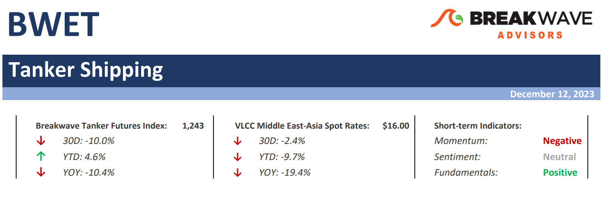
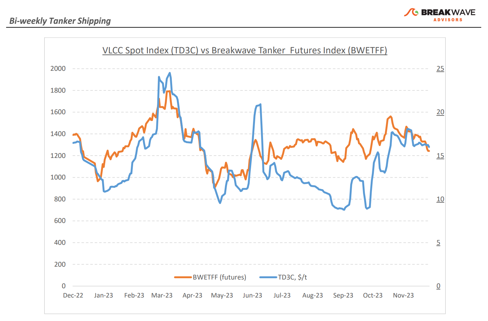
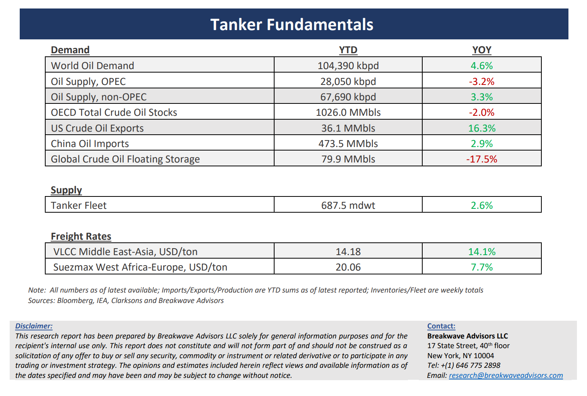

# Breakwave Bi-Weekly Tanker Report - December 12, 2023

**Date:** December 12, 2023  
**Publisher:** Breakwave Advisors | **Category:** Market Insights  
**Original URL:** [https://www.breakwaveadvisors.com/insights/2023/12/12/breakwave-bi-weekly-tanker-report-dec-12-2023-5jkjt](https://www.breakwaveadvisors.com/insights/2023/12/12/breakwave-bi-weekly-tanker-report-dec-12-2023-5jkjt)  

---

> **Figure 1: Tankerreporttop**  
> [Local Asset](file:///C:/Users/Dell/Github/Shipping/corpus/03-breakwave/insights/2023/assets/2023-12-12_breakwave-bi-weekly-tanker-report-dec-12-2023-5jkjt_img_tankerreporttop_cb9282d1ee7a.png)

**· Dull VLCC market continues, as supply and demand remain balanced –**The month of December has so far brought**little news**for the VLCC market. Spot rates remain relatively**flat**while there are little new developments pointing to an imminent change in the status quo. In both important markets, namely the Middle East to China and the Atlantic Basin to China market, rates have so far seen little movement since late October. The OPEC+**production cuts remain a headwind**, offset by**increased US crude oil exports**.**China’s**appetite for crude seems strong but volatile, with**November**being a particularly**weak month**in terms of crude oil imports into the country. As the focus turns into the first quarter of 2024, the main drivers in terms of oil demand remain in place (i.e. China, India growth) but the**outlook is less clear**, as evident by the divergence in demand growth scenarios by the main forecasts. We assume that**tanker demand will grow at a much slower pace**than 2023, but still exceed the non-existent VLCC fleet growth, leading to a healthy market. Yet, the**demand uncertainties**combined with**potential supply disruptions**(see Panama Canal, Red Sea war-related disruptions) could be the**wild cards**in such a forecast and as it is always the case in shipping, lead to**significant volatility**in spot rates next year for the crude oil tanker sector.

**· Oil prices drop at the low end of the range, once again focusing back on demand –**In the past 12 months, crude oil prices have traded in a**wide range**of ~70-90 USD per barrel for the benchmark WTI, as the potential**bullish sentiment around supply and the weak demand outlook**due to a slowing global economy have taken turns in shaping the price of the commodity. The year seems to end a bit lower compared to where it started in terms of price, but by no means a dramatic difference. We expect a**similar environment as we head into 2024**, as short-term demand concerns should remain elevated while the medium-term outlook for demand seems encouraging and is pointing to deficits towards the second half of next year.**OPEC+ appears determined**to maintain a balance in the market, and any supply disruption due to the**very unpredictable world**we currently live in should once again push prices at the high end of the range in a rapid fashion. Overall, we continue to see 2023’s**wide trading range**for crude oil as the most**likely outcome for 2024**, a level that remains quite**profitable**for most producers and easily**digestible**for consumers let alone the central banks that are looking at year-over-year changes in the main commodity to gauge the direction of inflation that continues to be the key input for central bank policies in the developed world.

**· Tanker cycle driven by tight supply, recovering demand –**The tanker market is recovering from a long period of staggered rates as the growth in new vessel supply shrinks while oil demand is recovering in line with the global economy. A historically low orderbook combined with favorable demand fundamentals should continue to support increased spot rate volatility, which combined with the ongoing geopolitical turmoil, should support freight rates in the medium term.

> **Figure 2: Tankerreportchart**  
> [Local Asset](file:///C:/Users/Dell/Github/Shipping/corpus/03-breakwave/insights/2023/assets/2023-12-12_breakwave-bi-weekly-tanker-report-dec-12-2023-5jkjt_img_tankerreportchart_62aa00bb8a54.png)

> **Figure 3: Tankerreportbottom**  
> [Local Asset](file:///C:/Users/Dell/Github/Shipping/corpus/03-breakwave/insights/2023/assets/2023-12-12_breakwave-bi-weekly-tanker-report-dec-12-2023-5jkjt_img_tankerreportbottom_2b9b0f085355.png)

### Subscribe:
