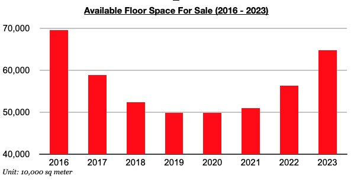
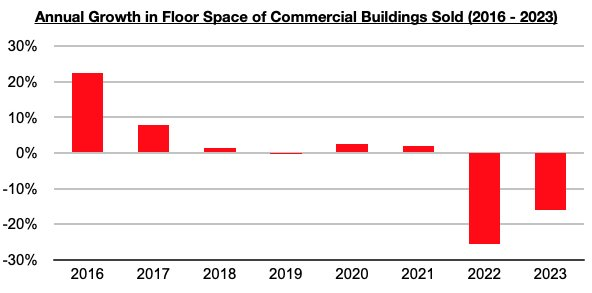
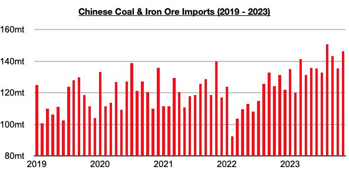

# China's Dry Bulk Demand Remains Robust Despite Extreme Housing Oversupply

**Date:** December 13, 2023  
**Publisher:** Breakwave Advisors | **Category:** Market Insights  
**Original URL:** [https://www.breakwaveadvisors.com/insights/2023/12/13/pwh8u5t91yif5kgmgh3f2xbpyd13dm](https://www.breakwaveadvisors.com/insights/2023/12/13/pwh8u5t91yif5kgmgh3f2xbpyd13dm)  

---

[

> **Figure 1: Byjeffrey Landsberg**  
> *ByJeffrey Landsberg*  
> **Interactive Data & Source:** [Linkedin](https://www.linkedin.com/in/jeffrey-landsberg-70ab957/) | [Local Asset](file:///C:/Users/Dell/Github/Shipping/corpus/03-breakwave/insights/2023/assets/2023-12-13_pwh8u5t91yif5kgmgh3f2xbpyd13dm_img_replay2bbutton_6880508cf732.png)](https://www.youtube.com/watch?t=76s&v=L_4zPBctem4)

October ended with 648.4 million square meters of floor space available in China's commercial buildings (which includes residential buildings), which marks the largest amount seen since February. Even more significant is that compared to the end of the last several years, this 648.4 million square meters of floor space continues to mark the largest amount available since 2016.

> **Figure 2: Chart 1 (77)**  
> [Local Asset](file:///C:/Users/Dell/Github/Shipping/corpus/03-breakwave/insights/2023/assets/2023-12-13_pwh8u5t91yif5kgmgh3f2xbpyd13dm_img_chart1287729_30eefbbf6b58.jpg)

As we have continued to stress in Commodore's Weekly Dry Bulk Reports and Weekly China Reports, a huge excess of homes remains available in China's housing market. Sales of China's commercial buildings (which again includes residential homes) designated in floor space have also remained down on a year-on-year basis. Sales contracted year-on-year by 20% in October and through the first ten months of the year sales are down year-on-year by 16%.

> **Figure 3: Chart 2 (66)**  
> [Local Asset](file:///C:/Users/Dell/Github/Shipping/corpus/03-breakwave/insights/2023/assets/2023-12-13_pwh8u5t91yif5kgmgh3f2xbpyd13dm_img_chart2286629_9f0b43153a55.jpg)

Oversupply in the housing market remains extreme, but we continue to stress that supply and demand of Chinese homes is not what drives China’s dry bulk spot demand. The production of steel, consumption of iron ore, consumption of coal, global mining, etc. are what drives China's commodity imports and spot demand for dry bulk vessels — and this year has continued to see iron ore and coal imports stay strong as we have been stressing. Looking forward, there are still no signs that China's robust appetite for commodity imports is set to suddenly reverse, even as there are also still no signs that China’s extreme housing oversupply problem is set to suddenly be solved.

So far this year, iron ore imports have totaled approximately 1.08 billion tons. This is up year-on-year by 63 million tons (6%). Coal imports have totaled approximately 427 million tons, which is up year-on-year by 165 million tons (63%). Collectively, iron ore and coal imports have totaled approximately 1.5 billion tons, which is up year-on-year by 220 million tons (17%) and marks the largest amount imported in the first eleven months of any year.

> **Figure 4: Chart 3 (46)**  
> [Local Asset](file:///C:/Users/Dell/Github/Shipping/corpus/03-breakwave/insights/2023/assets/2023-12-13_pwh8u5t91yif5kgmgh3f2xbpyd13dm_img_chart3284629_378f9e00299c.jpg)
