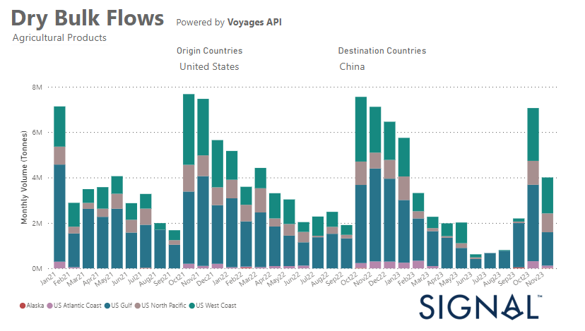
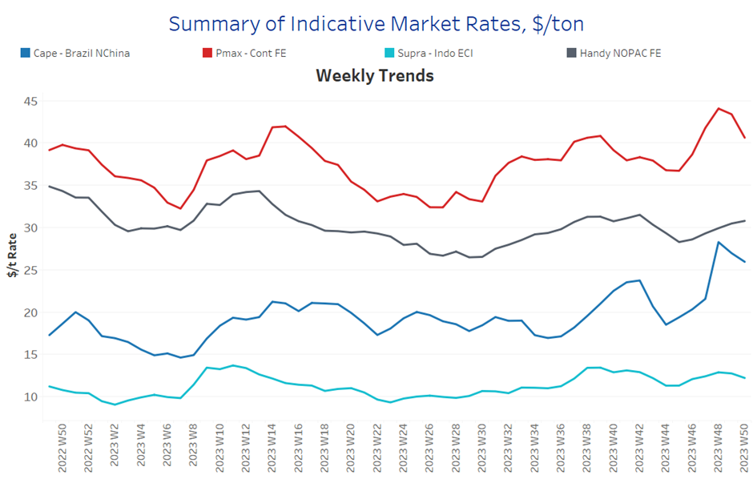
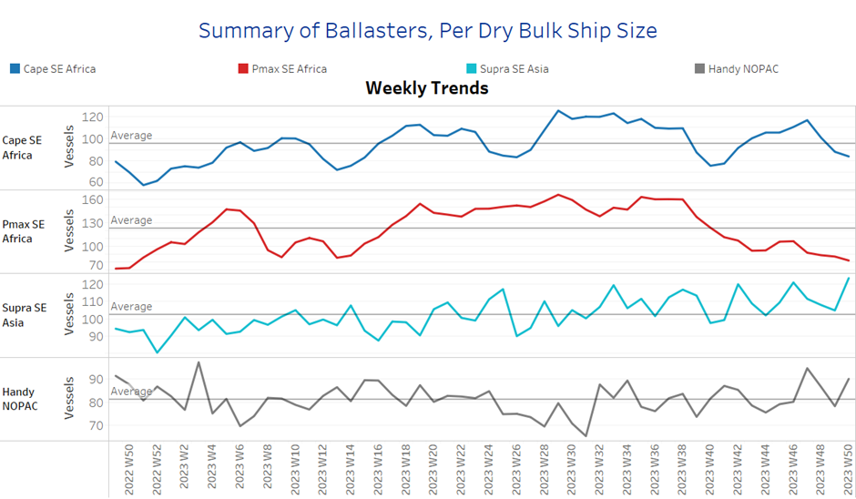
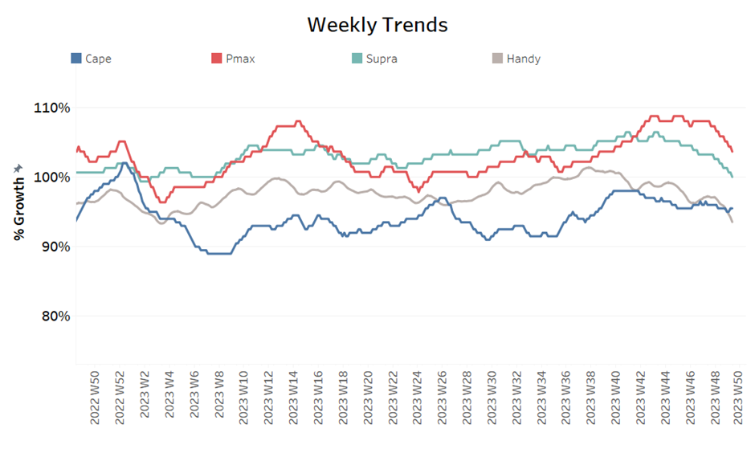
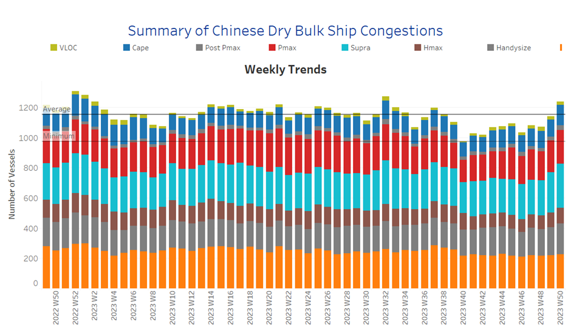

# Signal Dry Bulk Weekly Report

**Date:** December 13, 2023  
**Publisher:** Breakwave Advisors | **Category:** Market Insights  
**Original URL:** [https://www.breakwaveadvisors.com/insights/2023/12/13/signal-dry-bulk-weekly-report](https://www.breakwaveadvisors.com/insights/2023/12/13/signal-dry-bulk-weekly-report)  

---

[

> **Figure 1: Replay2bbutton**  
> **Interactive Data & Source:** [Signal Ocean Platform](https://www.thesignalgroup.com/signal-ocean-platform) | [Local Asset](file:///C:/Users/Dell/Github/Shipping/corpus/03-breakwave/insights/2023/assets/2023-12-13_signal-dry-bulk-weekly-report_img_replay2bbutton_6880508cf732.png)](https://www.youtube.com/watch?t=76s&v=L_4zPBctem4)

## Chart of the Week :U.s. Grain Exports to China​​​​​

### A Significant Decrease in the U.s. Grain Exports to China Following the Spike in October

> **Figure 2: Market Chart 2**  
> **Interactive Data & Source:** [Signal Ocean Platform](https://www.thesignalgroup.com/signal-ocean-platform) | [Local Asset](file:///C:/Users/Dell/Github/Shipping/corpus/03-breakwave/insights/2023/assets/2023-12-13_signal-dry-bulk-weekly-report_img_unnamed-2023-12-13t145434616_50a775dc77fc.png)

In the second week of December, the mood on the dry bulk market was mixed. Prices for Capesize vessels between Brazil and North China were down after the surprising upturn at the beginning of the month. In the smaller ship segments, however, the mood was optimistic, pointing to possible improvements in performance.
In particular, the number of ballast shipments in the smaller vessel segments increased, although this trend remained below the annual average for Capesize and Panamax vessels. In the grain segment, there was a significant decline in the monthly volume of shipments from the United States to China in November, although there was a record increase in October. Grain exports from the US to China fell by 45% in November, both compared to October and compared to shipments recorded in November last year.

​​​For more information on this week's trends, see the analysis sections below:

Freight Market, Supply, Demand and Port Congestion

## Section 1/ Freight

‘The Big Picture’ - Capesize and Panamax Bulkers and Smaller Ship Sizes

Market Rates ($/t) Mixed

> **Figure 3: Market Chart 3**  
> **Interactive Data & Source:** [Signal Ocean Platform](https://www.thesignalgroup.com/signal-ocean-platform) | [Local Asset](file:///C:/Users/Dell/Github/Shipping/corpus/03-breakwave/insights/2023/assets/2023-12-13_signal-dry-bulk-weekly-report_img_unnamed-2023-12-13t145532429_633770a866f5.png)

In the second week of December, the dry freight market showed a differentiated sentiment, characterised by varying developments in the most important ship categories. While there was a downward trend in several segments, the Handy-NOPAC route showed remarkable optimism, pointing to a recovery from the lows observed in week 46.

- Capesize vessel freight rates from Brazil to North China fell to below $18/tonne following the astonishing upswing of early December, and rates eventually fell by 28% each week.
- Panamax vessel freight rates from the Continent to the Far East stood at $40/tonne, down 10% on the previous week but 11% firmer than a similar week last month.
- Supramax vessel freight rates on the Indo-ECI route still preserved the same momentum over the last four weeks at $12 per tonne, 5% higher than in the same week a month ago.
- Handysize freight rates for the NOPAC Far East route appeared to exceed the $30-tonne mark, up 8% from a month ago.

## Section 2/ Supply

> **Figure 4: Supply Trend Lines for Key Load Areasballasters (#Vessels) Mixed**  
> **Interactive Data & Source:** [Signal Ocean Platform](https://www.thesignalgroup.com/signal-ocean-platform) | [Local Asset](file:///C:/Users/Dell/Github/Shipping/corpus/03-breakwave/insights/2023/assets/2023-12-13_signal-dry-bulk-weekly-report_img_unnamed-2023-12-13t145636022_5c625e04caa0.png)

The number of ballasters is still in a decreasing trend for the Capesize and Panamax SE Africa, fuelling expectations for a rebound in the weaker sentiment of freight rates in the second week of December. The smaller vessel size categories experienced a sudden increase after the lows of the previous two weeks and remains to be seen whether a similar trend will stay in the next days.

- Capesize SE Africa: The number of ballasters dropped to 84, 6 less than the previous week, with the latest low remaining at the same level as week 40 (~76).
- Panamax SE Africa: The number of ballasters dropped to 81, 7 lower than the previous two weeks and still surprisingly low when the last peak was reached in week 38 (~160).
- Supramax SE Asia: The number of ballast ships rose to 120, 20 more than the previous week, with a similar peak recorded in week 46.
- Handysize NOPAC:The number of ballast ships dropped reached 90, 12 higher than the previous week, while the latest low remained at week 44 (~76).

## Section 3/ Demand

> **Figure 5: Summary of Dry Bulk Demand, per Ship Sizetonne Days Decreasing**  
> **Interactive Data & Source:** [Signal Ocean Platform](https://www.thesignalgroup.com/signal-ocean-platform) | [Local Asset](file:///C:/Users/Dell/Github/Shipping/corpus/03-breakwave/insights/2023/assets/2023-12-13_signal-dry-bulk-weekly-report_img_unnamed-2023-12-13t145736092_070399fb7141.png)

The downward trend in demand continued in the second week of December, with slight signs of an upward correction in Capesize.

- Capesize: The downward trend appears to have come to a halt, while the peak reached ten weeks ago is fraught with uncertainty for a stronger recovery in view of the ongoing economic problems in China.
- Panamax:The decline is now steeper than in the previous weeks of November, with the downward trend set to continue until the end of the month.
- Supramax: The growth rate fell to one of the lowest levels of the entire year, with the last peak recorded in week 44.
- Handysize: Demand growth followed a similar pattern to the previous two weeks and stayed at the lowest level recorded this year. ​​​​​​

## Section 4/ Port Congestion

Dry bulk ships congested at Chinese ports

No of Vessels Increasing

> **Figure 6: Data Source:signal Ocean Platform**  
> *Data Source:Signal Ocean Platform*  
> **Interactive Data & Source:** [Signal Ocean Platform](https://www.thesignalgroup.com/signal-ocean-platform) | [Local Asset](file:///C:/Users/Dell/Github/Shipping/corpus/03-breakwave/insights/2023/assets/2023-12-13_signal-dry-bulk-weekly-report_img_unnamed-2023-12-13t145902777_8eab534633bb.png)

The number of dry bulk vessels congested at Chinese ports reached one of the highest levels this year, surpassing the peak of week 32, with an increase in all ship size categories.

- Capesize: The number of congested vessels 130, the highest of the entire year.
- Panamax: The number of congested ships rose to 220, confirming indications of end November for levels of more than 200.
- Supramax: The number of ships was 290, with an increase of 60 since the end of week 48.
- Handysize: The number of congested ships reached the 200 mark, 15 more than in the previous week, whereas two weeks ago it was below 180.
