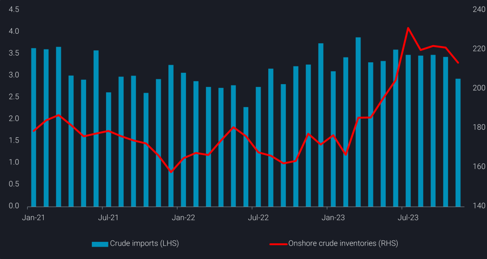
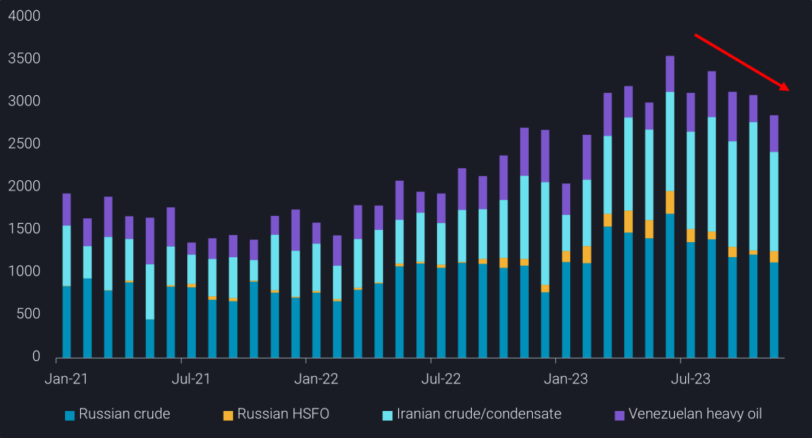
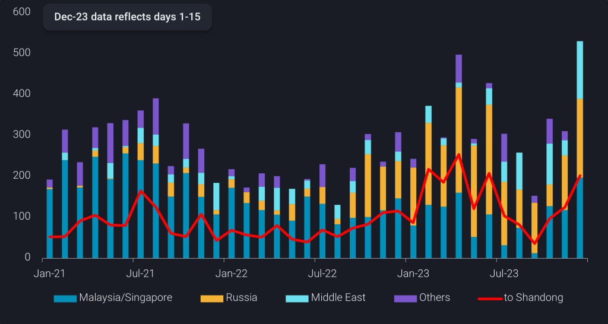

# China’s feedstock imports constrained by soft demand from teapots

**Date:** December 14, 2023  
**Publisher:** Breakwave Advisors | **Category:** Market Insights  
**Original URL:** [https://www.breakwaveadvisors.com/insights/2023/12/13/9btfi30523gn7g706vxllwlff9eobc](https://www.breakwaveadvisors.com/insights/2023/12/13/9btfi30523gn7g706vxllwlff9eobc)  

---

[

> **Figure 1: Replay2bbutton**  
> **Interactive Data & Source:** [Linkedin](https://www.linkedin.com/search/results/all/?fetchDeterministicClustersOnly=true&heroEntityKey=urn%3Ali%3Afsd_profile%3AACoAAAkUwhQBM44CbK7vxCDU3lmN3qvn09Ud8y8&keywords=emma%20li&origin=RICH_QUERY_SUGGESTION&position=0&searchId=9a3500db-6c88-4386-8caf-a8f0635209bb&sid=Uci&spellCorrectionEnabled=false) | [Local Asset](file:///C:/Users/Dell/Github/Shipping/corpus/03-breakwave/insights/2023/assets/2023-12-14_9btfi30523gn7g706vxllwlff9eobc_img_replay2bbutton_6880508cf732.png)](https://www.youtube.com/watch?t=76s&v=L_4zPBctem4)

## China’s Crude Imports Saw a Reversal in Year-on-Year Growth in November, Primarily Dragged by Sluggish Shandong Demand. This Also Puts China’s Discounted Oil Imports in Check.

*By*[*Emma Li*](https://www.linkedin.com/search/results/all/?fetchDeterministicClustersOnly=true&heroEntityKey=urn%3Ali%3Afsd_profile%3AACoAAAkUwhQBM44CbK7vxCDU3lmN3qvn09Ud8y8&keywords=emma%20li&origin=RICH_QUERY_SUGGESTION&position=0&searchId=9a3500db-6c88-4386-8caf-a8f0635209bb&sid=Uci&spellCorrectionEnabled=false)

The PMI (Purchasing Managers’ Index) for China dipped to 49.3 in November, falling below the 50% threshold for the second month. The economic contraction has negatively impacted domestic oil demand, leading to[China’s seaborne crude imports](https://analytics.vortexa.com/?dateRange=2021-01-01T00%3A00%3A00.000Z__2023-11-30T23%3A59%3A59.999Z&filtersEnabled=%5B%22p%22%2C%22o%22%2C%22d%22%2C%22d_r%22%2C%22intra_d%22%2C%22sts_o%22%2C%22c_o%22%2C%22v%22%2C%22w%22%5D&metric=bpd&movementEvent=unloading_start&page=Flows&products=%5B%2254af755a090118dcf9b0724c9a4e9f14745c26165385ffa7f1445bc768f06f11%22%5D&sortField=unloading_start&tabId=79e451b4-c797-47b5-940c-9821caee6759&timeSeriesProperty=origin_country&to=%5B%22b5fafce6e20de2dc307fb7e0b89978ee91a49a7b6ec6f5461daf2633f3c56674%22%5D&v=3)falling below the 10mbd mark in November for the first time since February. November also saw a year-on-year (y-o-y) decline in the country’s crude imports, marking a reversal from the previous nine months, which consistently grew by more than 10% versus last year.

Refinery CDU utilisation rates among Shandong teapot refiners have remained range-bound between 55-57% since late October, exhibiting a nearly 10% y-o-y decline (OilChem), amid sluggish refining margins and constraints in crude/fuel oil import quotas.

Consequently, crude imports into Shandong decreased to 2.9mbd in November, compared to the 3.3-3.8mbd registered in the preceding ten months. Concurrently,[Shandong onshore crude inventories](https://analytics.vortexa.com/?dateRange=2022-01-01T00%3A00%3A00.000Z__2023-12-02T23%3A59%3A59.999Z&frequency=day&hiddenSeries=%5B%22a63890260e29d859390fd1a23c690181afd4bd152943a04c00cd6a5ecf3f7d1e%22%2C%22781cacc7033f877caa4b4106d096b74afe006a96391bf5a56a4f55b849359a42%22%2C%22b5fafce6e20de2dc307fb7e0b89978ee91a49a7b6ec6f5461daf2633f3c56674%22%5D&onshoreInventoriesLocations=%5B%22b5fafce6e20de2dc307fb7e0b89978ee91a49a7b6ec6f5461daf2633f3c56674%22%2C%220fddbfd0d90bad306a92fcb483a19276f101a5f7f0783363f9f2a9d40c10558d%22%5D&page=OnShoreCrudeInventories&selectedRegion=%5B%220fddbfd0d90bad306a92fcb483a19276f101a5f7f0783363f9f2a9d40c10558d%22%5D&tabId=0cd16ff6-30e9-4ff7-a5c6-915250d00cc2&tankCrude=%5B%22confirmed%22%2C%22probable%22%5D)only saw a modest reduction of 6mb in the month, indicating a 500kbd cut in implied crude consumptions among the Shandong teapots.

> **Figure 2: Shandong Crude Imports(mbd**  
> *Shandong crude imports(mbd, LHS) andShandong onshore crude inventories(mb, RHS)*  
> **Interactive Data & Source:** [Analytics Vortexa](https://analytics.vortexa.com/?dateRange=2021-01-01T00%3A00%3A00.000Z__2023-11-30T23%3A59%3A59.999Z&metric=bpd&movementEvent=unloading_start&page=Flows&products=%5B%2254af755a090118dcf9b0724c9a4e9f14745c26165385ffa7f1445bc768f06f11%22%5D&tabId=322effd9-f0d3-418e-b741-d06c2b79b85a&timeSeriesHiddenSeries=%5B%22ea4d2edbcb3bc04fd81255124e7861aae375daaf21b0a78dc1a879cca97f88e3%22%5D&to=%5B%220fddbfd0d90bad306a92fcb483a19276f101a5f7f0783363f9f2a9d40c10558d%22%5D&v=3) | [Local Asset](file:///C:/Users/Dell/Github/Shipping/corpus/03-breakwave/insights/2023/assets/2023-12-14_9btfi30523gn7g706vxllwlff9eobc_img_picture1-16-1024x545_c8eb1da43354.png)

## Additional Fuel Oil Import Quotas Insufficient to Drive Teapots’ Runs

Shandong teapot refiners experienced some improvement in refining margins in the latter half of November, thanks to cooling crude prices. However, the upturn in margins did not immediately translate into higher refining runs due to persistently tight crude import quotas.

This situation has not only capped Shandong teapot refiners’ crude runs but has also constrained China’s overall discounted feedstock imports, as Shandong teapots are the primary buyers of crude and fuel oil from Iran, Russia, and Venezuela.

> **Figure 3: China’s Discounted Feedstock Imports (Kbd)**  
> *China’s discounted feedstock imports (kbd) –Russia crude/FO,Iran crude,Venezuela crude.Ir/Vz FO*  
> **Interactive Data & Source:** [Analytics Vortexa](https://analytics.vortexa.com/?dateRange=2021-01-01T00%3A00%3A00.000Z__2023-11-20T23%3A59%3A59.999Z&metric=bpd&movementEvent=unloading_start&page=Flows&products=%5B%22c8803c073c2980d9849784c16bcd41d7f7b7561d2c8c1799a16166527b120242%22%2C%2220c87d7477f8cfe103904d9af911668c9a69bd03690e74e52e4386ad34e054ee%22%2C%220c703e0e14d99572c62f15a26fdf2c9f0c00e111e625cd40b8b337154e81d46d%22%2C%2204c4ea46fc6fccfe8388717f399b40e5e348f9a98c451d99e7366caa998191a7%22%2C%227cab5376bbb441feabdafc7b9f6272c2f9cbd10deb604bed8fa7f9986b2a39a9%22%2C%22a6c0a31f361b480bddfb93b1b93f38f4989013ae54b2b147ab18116fdfbebdb7%22%2C%22fef83ff1194c77d969693ee17c08e1112878e184e3449400e5904bc47b0119fe%22%2C%220fff12441aa3bf28aa568134ef527d09f741c543a49c0db8c03a195a0bbc481e%22%2C%224aebc156649b4c9691cdf3a9c81758426d10ffc944ba441f907f9fbe0964e879%22%2C%224ff810b966104a658d22e7155596c11bedcd1e3e81594e6187ab88ec816d95d6%22%2C%221dfa78c965d56ab9d7b953e424d9160e9f79d0275e460c74994193a328f51537%22%2C%22054b79baa9a54171be2582c9b4f8fa82d0386d41c1914700a498dc5b95e8daba%22%2C%22c56c8a9d8404573236950b3644825b6928bf0c1f47abccc08e5aeff1afeabb5c%22%2C%2274a8bc823d4742318d38072f81068fac1ac02ac66e0d491ea4366007bb95c602%22%5D&tabId=322effd9-f0d3-418e-b741-d06c2b79b85a&to=%5B%22b5fafce6e20de2dc307fb7e0b89978ee91a49a7b6ec6f5461daf2633f3c56674%22%5D&v=3) | [Local Asset](file:///C:/Users/Dell/Github/Shipping/corpus/03-breakwave/insights/2023/assets/2023-12-14_9btfi30523gn7g706vxllwlff9eobc_img_picture2-17-1024x552_2b6d5cf1ede9.png)

On November 27, the National Development and Reform Commission (NDRC) confirmed the long-awaited allocation of an additional 3mt of fuel oil import quotas for this year. While this move is expected to support teapot refiners in sustaining operations until the year-end, the tightness in non-crude feedstock supplies will likely continue constraining their run rates.

Preliminary flows data suggests that China’s fuel oil imports, encompassing bunker fuel and refining feedstock, will surge to a new record of over 500kbd during the period of Dec 1-15. Notably, only 200kbd are enroute to Shandong, while the remaining volumes are primarily signalling for bunkering and storage hubs outside Shandong, as bunker demand remains whilst domestic supplies fall.

> **Figure 4: China’s Fuel Oil Imports by Originandvolumes to Shandong(kbd)**  
> *China’s fuel oil imports by originandvolumes to Shandong(kbd)*  
> **Interactive Data & Source:** [Analytics Vortexa](https://analytics.vortexa.com/?dateRange=2021-01-01T00%3A00%3A00.000Z__2023-12-15T23%3A59%3A59.999Z&metric=bpd&movementEvent=unloading_start&page=Flows&products=%5B%221c107b4317bc2c85fb6c13cd7b28e8e0a02ec7fecc68afc2b68ca0545c835e1c%22%2C%22adc86f3bb55b41f2a4430a2d18fc3f7c863fc8add14340f0aa0c4db8cd85e0a9%22%2C%2244c83435606b4e28b473b3d6308c40352be446cac49b47a79ce1c757c3e27b8e%22%5D&productsExcluded=%5B%2283322df435bfddf7357eff7d6e4240435ae321a22685bf7af6c220b1065c280b%22%2C%22e06296595e1d554008a70172440d5582c923bdb8182af54637d0ae5bf50a3e75%22%5D&tabId=322effd9-f0d3-418e-b741-d06c2b79b85a&timeSeriesHiddenSeries=%5B%22ea4d2edbcb3bc04fd81255124e7861aae375daaf21b0a78dc1a879cca97f88e3%22%5D&timeSeriesProperty=origin_country&to=%5B%22b5fafce6e20de2dc307fb7e0b89978ee91a49a7b6ec6f5461daf2633f3c56674%22%5D&v=3) | [Local Asset](file:///C:/Users/Dell/Github/Shipping/corpus/03-breakwave/insights/2023/assets/2023-12-14_9btfi30523gn7g706vxllwlff9eobc_img_picture3-9-1024x546_d44a3b42d159.png)

Persistent challenges to teapots’ refining margins, coupled with apprehensions regarding the strength in delivered prices for their preferred feedstock grades amid the redistribution of Venezuelan crude following the U.S. relaxation of sanctions on the South American nation, are likely to curb teapots’ appetite. Consequently, this is expected to limit China’s overall crude imports in the coming months.

Data Source:[Vortexa](https://www.vortexa.com//oil-gas-data-traders-analysts-data-scientists?gclid=Cj0KCQjw8_qRBhCXARIsAE2AtRZKOvMnbilZ_6_91d7huSFFy71pWLrnPwGwOHVzXsmsG-1a1mZnQw8aAt89EALw_wcB&hsa_acc=1782073842&hsa_ad=548425387665&hsa_cam=14746637662&hsa_grp=125038601902&hsa_kw=&hsa_mt=&hsa_net=adwords&hsa_src=g&hsa_tgt=dsa-1431852288425&hsa_ver=3&utm_campaign=%5BCD%5D%20-%20DSA%20-%20EMEA&utm_medium=cpc&utm_medium=ppc&utm_source=google&utm_source=adwords&utm_term=)
