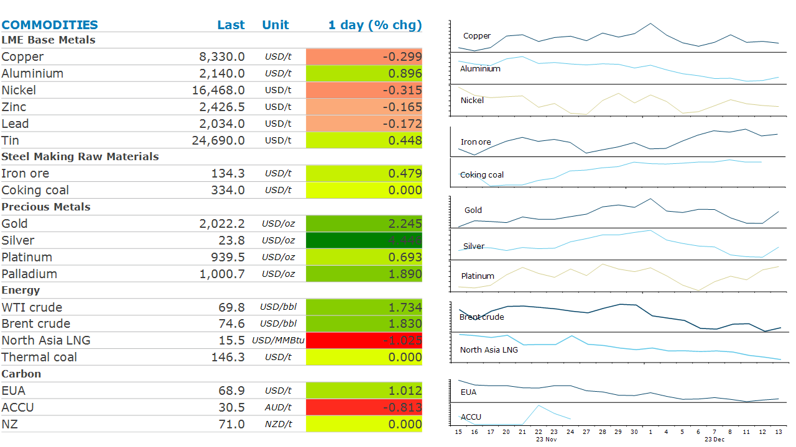

# Gold rallies at Fed hints at rate cuts

**Date:** December 14, 2023  
**Publisher:** Breakwave Advisors | **Category:** Market Insights  
**Original URL:** [https://www.breakwaveadvisors.com/insights/2023/12/14/zler9kwha8m413zqrl4k40stes4zcm](https://www.breakwaveadvisors.com/insights/2023/12/14/zler9kwha8m413zqrl4k40stes4zcm)  

---

*By*[*Daniel Hynes*](https://www.linkedin.com/in/dahynes/)

Markets were steady ahead of the FOMC meeting. Industrial metals fell on weak Chinese economic data. However, energy markets rebounded following further drawdowns in inventories.

> **Figure 1: 1702502560716**  
> **Interactive Data & Source:** [Linkedin](https://www.linkedin.com/newsletters/commodities-wrap-6692196755876012032/?fbclid=IwAR3kiXJqZdxmp9ZcRwBNI7FsBySI-XSC0pfPur1qzjt7OZp7PTE59Tsl1QI) | [Local Asset](file:///C:/Users/Dell/Github/Shipping/corpus/03-breakwave/insights/2023/assets/2023-12-14_zler9kwha8m413zqrl4k40stes4zcm_img_1702502560716_5ed569f21c1e.png)

**Copper**led the base metals sector lower amid further signs of weak economic growth in China. New credit grew more slowly than expected in November, with aggregate financing rising only 9.4% y/y. Banking lending missed consensus, and M1 money supply expanded the least in almost two years. This comes after the market was disappointed with a readout from China’s annual economic work conference, where leaders failed to propose any large fiscal stimulus measures. Nevertheless, the copper market is facing a period of tightness following recent supply side issues. The closure of the Cobre copper mine in Panama and cuts to output at Anglo American operations will see 600kt removed from the market next year. This moves our expectation of a small surplus into a deficit. More recently, inventories in LME warehouses have fallen for three consecutive weeks. Falling treatment charges are also suggesting tightness in the concentrate market.

A lack of new stimulus measures disappointed traders in the**iron ore**market. Steel mills have been ramping up supply amidst weak economic data in the hope that officials would propose new measures to support activity in the property and construction sectors. Futures fell nearly 3%, with contracts on the Singapore Exchange trading just above USD132/t.

Gold was steady leading into the FOMC meeting as investors waited for comments from Chair Jerome Powell that would provide some insight into the outlook for rates. Prices jumped sharply after the Fed Dot Plot suggested it now expects to cut rates in 2024. The pivot to easing monetary policy has been one of the last issues that has been holding back investors from the gold market. This apparent shift in tone from the Fed should see investors flock into the precious metal.

**Crude oil**gained amid signs of tightness. US crude stockpiles were drawn down by 4,258kbbl last week, the second consecutive week of falls. Total oil and product inventories declined the most since October. However, it wasn’t all good news, with gasoline and distillate inventories rising 409kbbl and 1,494kbbl respectively. Sentiment was also supported by OPEC’s monthly oil market report. The producer group expects a supply shortfall of 1.8mb/d in Q1 2024. OPEC expects oil demand to grow 2.2mb/d next year to average 104.36mb/d. That’s more than double the growth that the International Energy Agency is forecasting.

**North Asia LNG**prices extended recent falls amid fears of weaker demand. A lack of cold weather, combined with subdued industrial activity has lowered expectations of demand in coming months. However, the falling prices are inducing price sensitive buyers back into the spot market, which should limit the losses in coming weeks.

Data source:[Commodities Wrap](https://www.linkedin.com/newsletters/commodities-wrap-6692196755876012032/?fbclid=IwAR3kiXJqZdxmp9ZcRwBNI7FsBySI-XSC0pfPur1qzjt7OZp7PTE59Tsl1QI)
