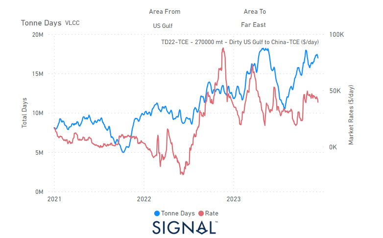
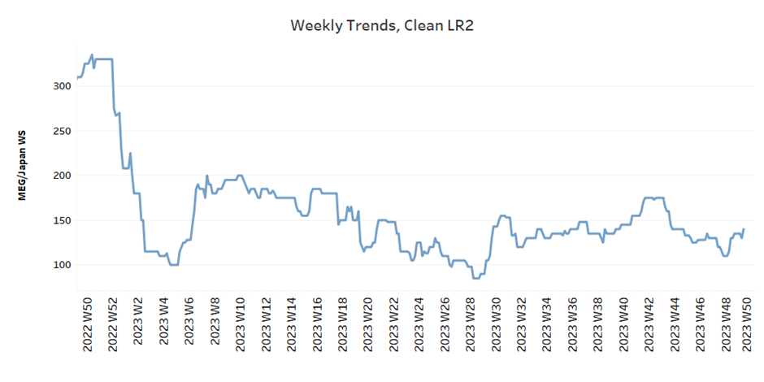
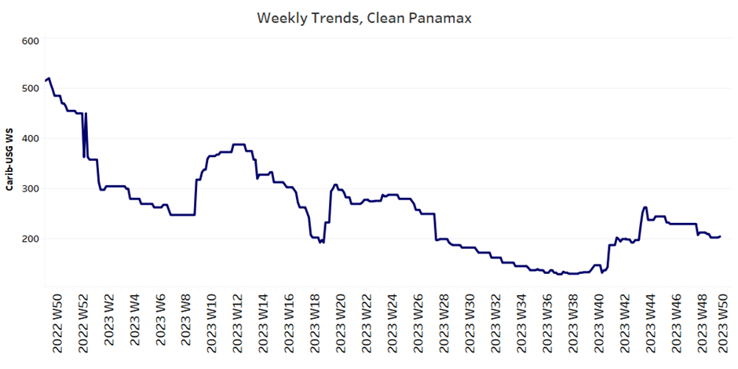
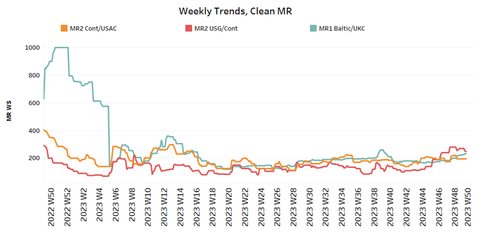
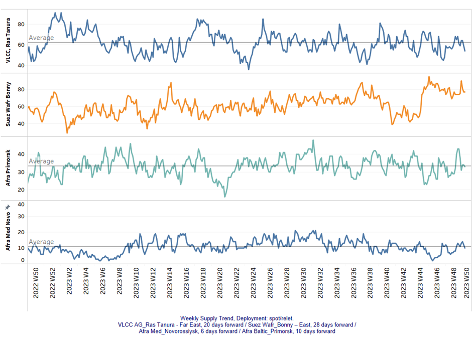
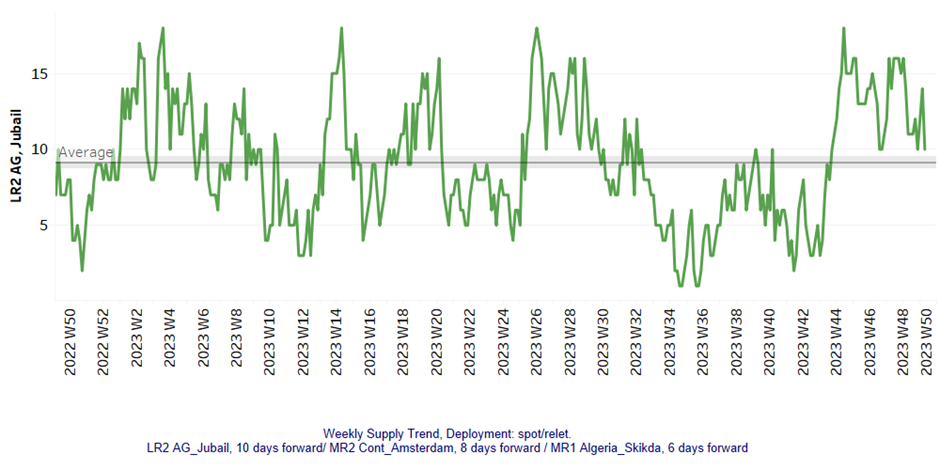
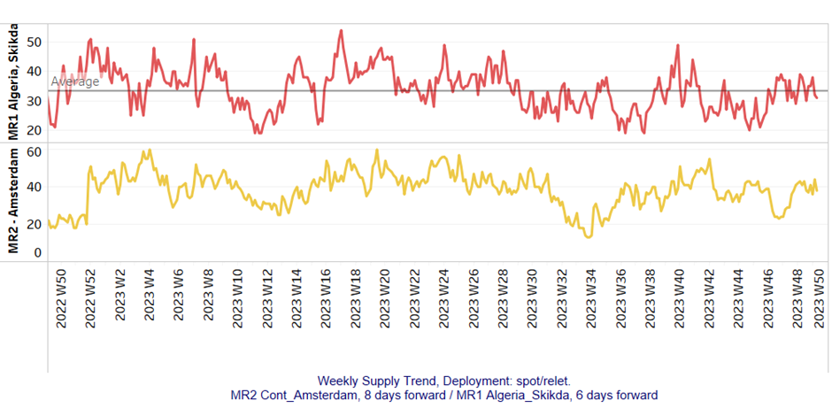
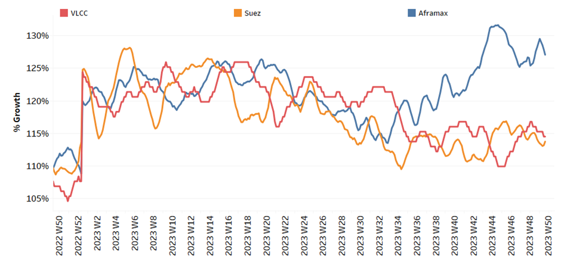
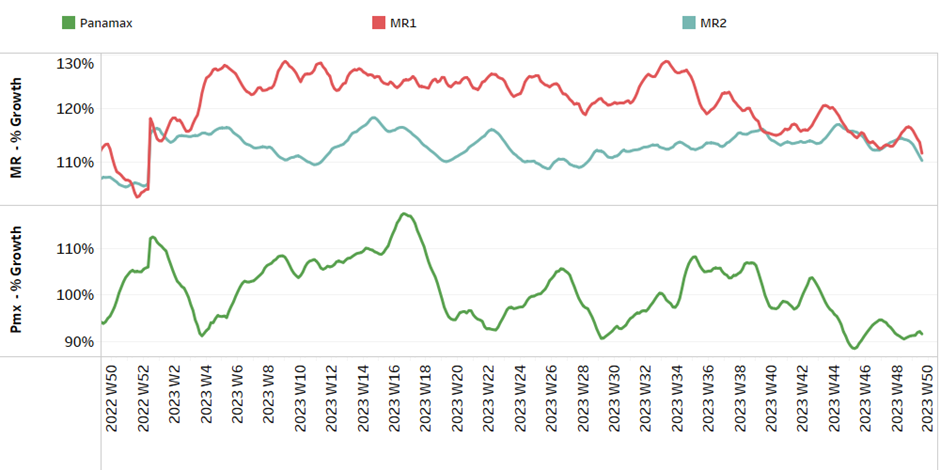

# Signal Tanker Weekly Report

**Date:** December 15, 2023  
**Publisher:** Breakwave Advisors | **Category:** Market Insights  
**Original URL:** [https://www.breakwaveadvisors.com/insights/2023/12/15/3uqrykb5wetu5cvv76woxcc2gd599q](https://www.breakwaveadvisors.com/insights/2023/12/15/3uqrykb5wetu5cvv76woxcc2gd599q)  

---

## Chart of the Week: Dirty VLCC Us Tonne Days to the Far East

**Increase in the tonne days for VLCC-US dirty shipments from the USG to the Far East at the end of**

> **Figure 1: The Year**  
> **Interactive Data & Source:** [Signal Ocean Platform](https://www.thesignalgroup.com/signal-ocean-platform) | [Local Asset](file:///C:/Users/Dell/Github/Shipping/corpus/03-breakwave/insights/2023/assets/2023-12-15_3uqrykb5wetu5cvv76woxcc2gd599q_img_unnamed-2023-12-15t141437747_3880e79b4611.png)

In the second week of December, the outlook for the crude oil freight market is subdued despite earlier expectations of stronger momentum. In the clean segment, however, there are encouraging signs that sentiment is brightening, particularly on the LR2 MEG-Japan route.

Amidst global geopolitical challenges related to Russian crude trade and the ongoing conflict between Israeland Hamas, it's notable that US crude exports have peaked in 2023. There has been a significant increase in VLCC tonne-days from the US to the Far East, particularly towards the end of the last quarter.

This increase in VLCC tonnage days from the US to the Far East appears to be having a positive impact on the recovery in sentiment for dirty freight rates for VLCCs. There is potential for further improvement as the USG market strengthens its position in crude oil exports to Asia.

For more information on this week's trends, see the analysis sections below:

Freight Market, Supply and Demand

## Section 1/ Freight

Market Rates (WS)

> **Figure 2: ‘Dirty’ WS - Weaker​vlcc - Suezmax - Aframax**  
> **Interactive Data & Source:** [Signal Ocean Platform](https://www.thesignalgroup.com/signal-ocean-platform) | [Local Asset](file:///C:/Users/Dell/Github/Shipping/corpus/03-breakwave/insights/2023/assets/2023-12-15_3uqrykb5wetu5cvv76woxcc2gd599q_img_unnamed-2023-12-15t141437747_3880e79b4611.png)

​​​​Freight rates for crude oil saw a significant decline, which was particularly noticeable in the Aframax-Med route, which showed a clear downward trend compared to the peak observed in week 44.

- VLCC MEG-China freight rates fell to 57 WS, 13% lower than in the previous week, when rates were still at 70 WS at the beginning of November.
- Suezmax freight rates for shipments from West Africa fell by more than 30 points to below 100 WS, 7% weaker than in the previous week. Rates on the Suez-Baltic-Med route stood at WS 130, a weekly decline of 16%, exceeding the peak of sentiment in week 44.
- Aframax Med freight rates fell to WS120 levels, 68% weaker than a year ago, and recent levels appeared to be the lowest in the last ten weeks.

> **Figure 3: ‘Product’ Wslr2 Firmer**  
> **Interactive Data & Source:** [Signal Ocean Platform](https://www.thesignalgroup.com/signal-ocean-platform) | [Local Asset](file:///C:/Users/Dell/Github/Shipping/corpus/03-breakwave/insights/2023/assets/2023-12-15_3uqrykb5wetu5cvv76woxcc2gd599q_img_unnamed-2023-12-15t141636866_95fe031083d7.png)

- LR2 AG freight rates were around 145 WS, 10 points higher than in the previous week and 11% higher than in a comparable week in the previous month.

## Panamaxsteady

> **Figure 4: Steady**  
> **Interactive Data & Source:** [Signal Ocean Platform](https://www.thesignalgroup.com/signal-ocean-platform) | [Local Asset](file:///C:/Users/Dell/Github/Shipping/corpus/03-breakwave/insights/2023/assets/2023-12-15_3uqrykb5wetu5cvv76woxcc2gd599q_img_unnamed-2023-12-15t141808283_c2e0a3702100.png)

- Panamax Carib-to-USG rates dropped below WS200, for the first time since mid-October, 60% weaker than a year ago.

> **Figure 5: ‘Clean’mr Mixed**  
> **Interactive Data & Source:** [Signal Ocean Platform](https://www.thesignalgroup.com/signal-ocean-platform) | [Local Asset](file:///C:/Users/Dell/Github/Shipping/corpus/03-breakwave/insights/2023/assets/2023-12-15_3uqrykb5wetu5cvv76woxcc2gd599q_img_unnamed-2023-12-15t141854794_2bfe51a1b23a.png)

- MR1 rates for the Baltic continent revised downward at levels below 300 WS, a 43% increase compared to a similar week a year ago.

- MR2 rates for shipments from the continent to the US remained unchanged from the previous week at 195 WS, while MR2 USG-Cont rates fell 30 points from the previous week to around 248 WS, a 30% increase from a similar week a month ago.

## Section 2/ Supply

> **Figure 6: 'Dirty' (#Vessels) - Decreasing**  
> **Interactive Data & Source:** [Signal Ocean Platform](https://www.thesignalgroup.com/signal-ocean-platform) | [Local Asset](file:///C:/Users/Dell/Github/Shipping/corpus/03-breakwave/insights/2023/assets/2023-12-15_3uqrykb5wetu5cvv76woxcc2gd599q_img_unnamed-2023-12-15t143727868_73929b515afc.png)

In the second week of December, there is a weekly decline in the number of vessels on the above routes, with the VLCC Ras Tanura showing a downward correction below the annual average.

- VLCC Ras Tanura: The number of ships dropped to 54, which is 12 lower than the annual average, but still higher than the bottom of 47 seen during the week 45.
- Suezmax Wafr: The number of ships dropped to 77, from around 90 a week ago, while it seems that the trend will continue downwards since the last peak of 95 at week 46.
- Aframax Primorsk: The current number of ships is close to the annual average of 33, which is in contrast to the signals of the previous week, which indicated a possible increase above the annual average.
- Aframax Med Novo: The number of ships has been around the annual average of 10 for the last two weeks in a row, and it appears that the downward trend will continue for the second half of December.

> **Figure 7: 'Clean'lr2 (#Vessels) - Decreasing**  
> **Interactive Data & Source:** [Signal Ocean Platform](https://www.thesignalgroup.com/signal-ocean-platform) | [Local Asset](file:///C:/Users/Dell/Github/Shipping/corpus/03-breakwave/insights/2023/assets/2023-12-15_3uqrykb5wetu5cvv76woxcc2gd599q_img_unnamed-2023-12-15t142458229_d30990a8556d.png)

> **Figure 8: MR1 (#Vessels) - Decreasing**  
> **Interactive Data & Source:** [Signal Ocean Platform](https://www.thesignalgroup.com/signal-ocean-platform) | [Local Asset](file:///C:/Users/Dell/Github/Shipping/corpus/03-breakwave/insights/2023/assets/2023-12-15_3uqrykb5wetu5cvv76woxcc2gd599q_img_unnamed-2023-12-15t142834145_54aafc6d96f9.png)

- Clean LR2 AG Jubail: There was a clear downward trend to 10, 8 lower than the high in week 45.

- Clean MR1 Algeria Skikda: Volatility remains high and the last four weeks have shown a mixed picture, while the latest activity indicated a drop in the number of vessels to 31, 8 less than three weeks ago.
- Clean MR2 Amsterdam: Recently, the number of ships has increased from the low reached four weeks ago and now stands at around 38, almost 14 more than in week 46.

## Section 3/ Demand (Tonne Days)

> **Figure 9: ​​‘Dirty’ Decreasing**  
> **Interactive Data & Source:** [Signal Ocean Platform](https://www.thesignalgroup.com/signal-ocean-platform) | [Local Asset](file:///C:/Users/Dell/Github/Shipping/corpus/03-breakwave/insights/2023/assets/2023-12-15_3uqrykb5wetu5cvv76woxcc2gd599q_img_unnamed-2023-12-15t143005335_5d21cd8bd225.png)

- Dirty tonne days: The downtrend correction in the Aframax segment is more pronounced, as the high of week 48 has now been corrected to weaker growth. In the VLCC segment, on the other hand, growth rates are following a weaker trend but are well above the recent low of week 44.

> **Figure 10: ‘Clean’ Decreasing**  
> **Interactive Data & Source:** [Signal Ocean Platform](https://www.thesignalgroup.com/signal-ocean-platform) | [Local Asset](file:///C:/Users/Dell/Github/Shipping/corpus/03-breakwave/insights/2023/assets/2023-12-15_3uqrykb5wetu5cvv76woxcc2gd599q_img_unnamed-2023-12-15t143115621_5caafbb8cfe9.png)

- Panamax tonne days: There seems to be a gradual upward revision following the downward correction at the end of week 46.

- Clean MR tonne days: The decline continued in both MR1 and MR2 vessel sizes, with growth rates now at their weakest after the recent peaks in week 42.

Data Source:[Signal Ocean Platform](https://www.thesignalgroup.com/signal-ocean-platform)
