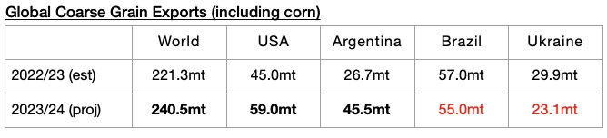
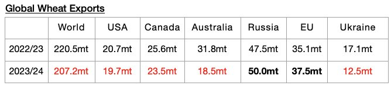
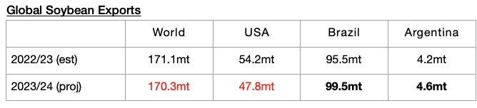
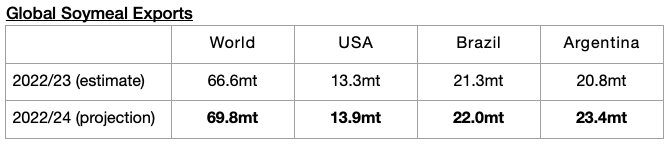

# Even More Grain Exports Expected Globally

**Date:** December 18, 2023  
**Publisher:** Breakwave Advisors | **Category:** Market Insights  
**Original URL:** [https://www.breakwaveadvisors.com/insights/2023/12/15/even-more-grain-exports-expected-globally](https://www.breakwaveadvisors.com/insights/2023/12/15/even-more-grain-exports-expected-globally)  

---

*By*[*Jeffrey Landsberg*](https://www.linkedin.com/in/jeffrey-landsberg-70ab957/)

The United States Department of Agriculture (USDA) has released their latest grain export forecast and is now predicting that global coarse grain, wheat, soybean, and soymeal exports (soybeans and soymeal are not classified as grain) in 2023/24 will collectively total 687.8 million tons. This is 6.4 million tons (1%) more than was predicted a month ago and would mark a year-on-year increase of 8.3 million tons (1%).

The USDA is now forecasting that global coarse grain exports in 2023/24 will total 240.5 million tons, which would mark a year-on-year jump of 19.2 million tons (9%). As we have been continuing to highlight in Commodore's Weekly Dry Bulk Reports, coarse grain will continue to serve as the dry bulk market’s largest volume grain cargo and is still expected to experience the largest year-on-year increase in exports. Significant year-on-year increases are still expected for both Argentinean coarse grain exports and US coarse grain exports.

> **Figure 1: Chart 1 (87)**  
> [Local Asset](file:///C:/Users/Dell/Github/Shipping/corpus/03-breakwave/insights/2023/assets/2023-12-18_even-more-grain-exports-expected-globally_img_chart1288729_5583680e1362.jpg)

Global wheat exports in 2023/24 are now expected to total 207.2 million tons, which would mark a year-on-year decline of 13.3 million tons (-6%).

> **Figure 2: Chart 2 (76)**  
> [Local Asset](file:///C:/Users/Dell/Github/Shipping/corpus/03-breakwave/insights/2023/assets/2023-12-18_even-more-grain-exports-expected-globally_img_chart2287629_d25bf5582853.jpg)

Global soybean exports in 2023/24 are now expected to total 170.3 million tons, which would mark a year-on-year decline of just 800,000 tons.

> **Figure 3: Chart 3 (54)**  
> [Local Asset](file:///C:/Users/Dell/Github/Shipping/corpus/03-breakwave/insights/2023/assets/2023-12-18_even-more-grain-exports-expected-globally_img_chart3285429_43204649b3b8.jpg)

Global soymeal exports in 2023/24 are now expected to total 69.8 million tons, which would mark a year-on-year increase of 3.2 million tons (5%).

> **Figure 4: Chart 4 (25)**  
> [Local Asset](file:///C:/Users/Dell/Github/Shipping/corpus/03-breakwave/insights/2023/assets/2023-12-18_even-more-grain-exports-expected-globally_img_chart4282529_162a436189a0.jpg)
