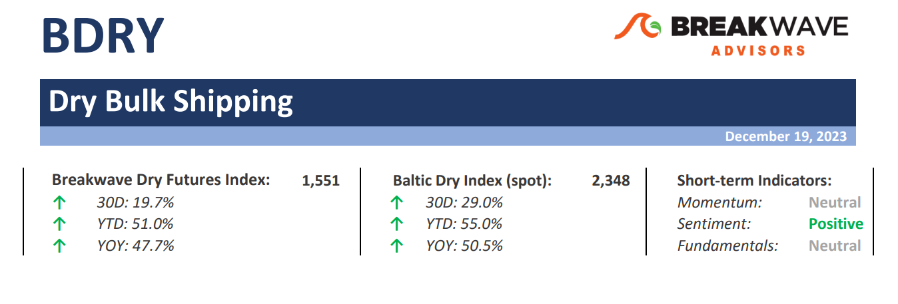
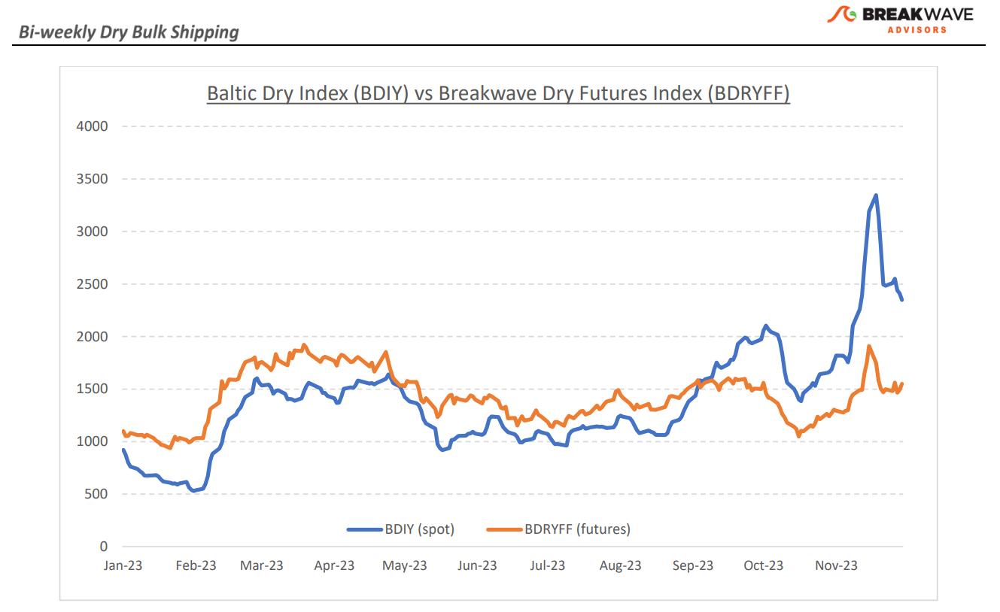
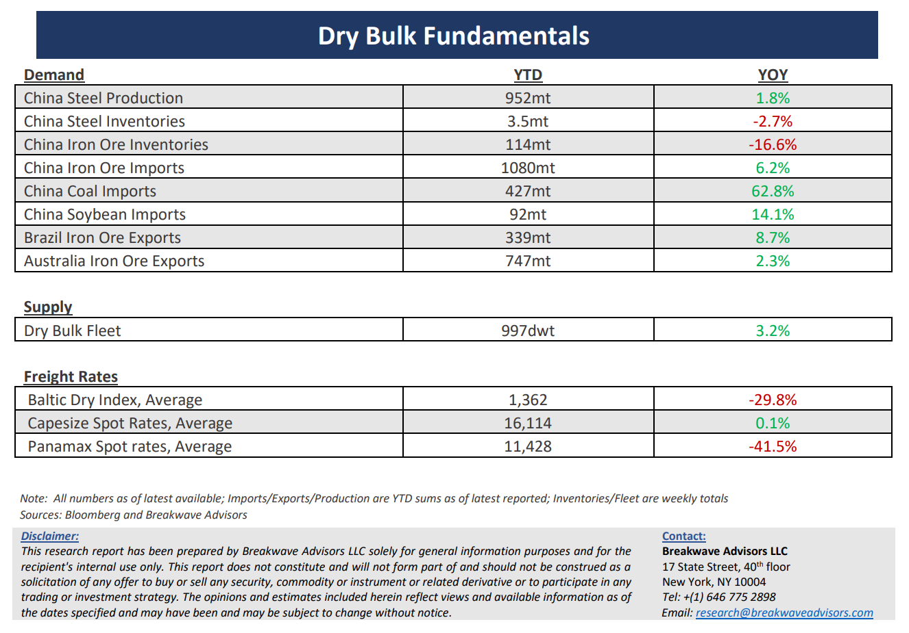

# Breakwave Bi-Weekly Dry Bulk Report - December 19, 2023

**Date:** December 19, 2023  
**Publisher:** Breakwave Advisors | **Category:** Market Insights  
**Original URL:** [https://www.breakwaveadvisors.com/insights/2023/12/breakwave-bi-weekly-drybulk-report-dec-19-2023-jhgyn19](https://www.breakwaveadvisors.com/insights/2023/12/breakwave-bi-weekly-drybulk-report-dec-19-2023-jhgyn19)  

---

> **Figure 1: Dryreporttop**  
> [Local Asset](file:///C:/Users/Dell/Github/Shipping/corpus/03-breakwave/insights/2023/assets/2023-12-19_breakwave-bi-weekly-drybulk-report-dec-19-2023-jhgyn19_img_dryreporttop_376e11dfdf5b.png)

**• White Christmas in China brings holiday joy for Capesize owners –**Surprise Christmas gifts are the best and Capesize owners are getting a big one this year. A confluence of events in the past month begun with a surge in rates in the Atlantic on tight vessel availability and has now been followed by a very cold weather front in North China that is causing delays and tightening vessel availability in the Pacific region. The result is a spot Capesize market that so far has failed to correct the way that the freight futures market has been dictating and the strength is now threatening to expand during a period that activity tends to calm down as the Christmas holidays rapidly approach. With few trading days left before the New Year and a highly backwardated curve (spot in the 30,000s /January futures at ~20,000) the risk of the stubbornly strong market spilling into 2024 is becoming real. Although the longer-term futures market has also moved up in the past few weeks, we still believe the current strength is a result of a “perfect storm” situation rather than a change in fundamentals, and although the positive “carry” in the curve is enormously tempting, any vacuum on current demand flow can rapidly bring spot rates down well below the level the futures curve is indicating. In the meantime, investors should cherish the current robustness that once again demonstrates the impressive uncorrelated returns one can achieve in shipping, especially in freight futures, that purely rely on the idiosyncratic and regional nature of supply and demand. HAPPY NEW YEAR!

**• China continues to aggressively add stimulus as economic numbers remain weak –**The streak of mediocre economic numbers lingers in China, as the most recent industrial activity and housing numbers point to further deterioration despite the “impressive” year over year headline growth that is based off the very weak Covid-related activity in 2022. The response from the Chinese government has been similar to the ones implemented in the last year or so, with further relaxation in housing rules and additional liquidity in the system in the form of funds from the MLF facility. The repeating nature of such sequence of events is becoming now common. Although one should assume that eventually we will see some structural change in demand, especially consumer driven demand, for now, the outlook remains pessimistic and there is little indication of an imminent turnaround in the cornerstones of the Chinese economy, namely the real estate sector as well as the consumer. As we look into 2024, the early part of the year should remain subdued, and once again, all focus will soon turn to the annual parliament meeting (NPC) in March when growth targets are officially approved.

**• Dry bulk focus shifts back to fundamentals –**Following a period of high uncertainty and significant disruptions across the commodity spectrum, the gradual normalization of trade is shifting the market’s attention back to the traditional demand and supply dynamics that have shaped dry bulk profitability for decades. As effective fleet supply growth for the next few years looks manageable, demand will be the main determinant of spot freight rates with China returning back to the driver’s seat as the dominant force of bulk imports and thus shipping demand.

> **Figure 2: Dryreportchart**  
> [Local Asset](file:///C:/Users/Dell/Github/Shipping/corpus/03-breakwave/insights/2023/assets/2023-12-19_breakwave-bi-weekly-drybulk-report-dec-19-2023-jhgyn19_img_dryreportchart_e0dfc2260059.png)

> **Figure 3: Dryreportbottom**  
> [Local Asset](file:///C:/Users/Dell/Github/Shipping/corpus/03-breakwave/insights/2023/assets/2023-12-19_breakwave-bi-weekly-drybulk-report-dec-19-2023-jhgyn19_img_dryreportbottom_ff0510115a56.png)

### Subscribe:
