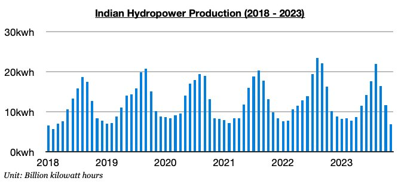
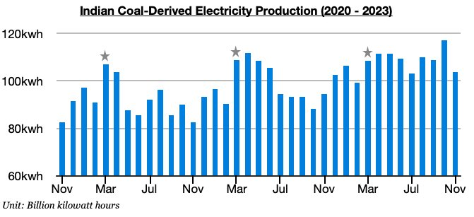

# Indian Tailwinds to Intensify

**Date:** December 20, 2023  
**Publisher:** Breakwave Advisors | **Category:** Market Insights  
**Original URL:** [https://www.breakwaveadvisors.com/insights/2023/12/20/indian-tailwinds-to-intensify](https://www.breakwaveadvisors.com/insights/2023/12/20/indian-tailwinds-to-intensify)  

---

*By*[*Jeffrey Landsberg*](https://www.linkedin.com/in/jeffrey-landsberg-70ab957/)

India's October industrial production data was released recently and showed year-on-year growth of 11.7%. Excluding any years affected by a direct comparison with a covid-year (2022 was not a major covid-year for India) this marks the largest growth seen in India since March 2013. Overall, we continue to stress that India's economy is doing extremely well. As we have been highlighting in Commodore's recent Weekly Dry Bulk Reports, India's steel production, total electricity production, and thermal coal-derived electricity production have all been setting records in recent months, and several more records are likely to be set next year.

For the dry bulk market, it has remained particularly encouraging recently that India’s economy has been faring so well while the nation's hydropower output has also been so weak due to low rainfall. Hydropower production most recently fell to the lowest level seen since 2018.

> **Figure 1: Chart 1 (89)**  
> [Local Asset](file:///C:/Users/Dell/Github/Shipping/corpus/03-breakwave/insights/2023/assets/2023-12-20_indian-tailwinds-to-intensify_img_chart1288929_49722e757f6a.jpg)

Demand for electricity surging in India at the same time that hydropower output has fallen to a low not seen since 2018 has been incredibly helpful for thermal coal demand and the dry bulk market. Also remaining very significant to us is that seasonal forces will act as even more of a tailwind going forward.

As we discussed in Commodore's recent Weekly Dry Bulk Reports, India’s overall electricity production and thermal coal-derived electricity production each set records in October. November always sees month-on-month declines, and then December, January, and February always see stronger overall electricity production and thermal coal-derived electricity generation than seen in November. Demand for thermal coal in India will be stronger during the next months, and then is extremely likely to surge beginning in March as is the seasonal norm. We expect that several new overall electricity production and thermal coal-derived electricity production records will be set in India beginning no later than in March of next year.

> **Figure 2: Chart 2 (78)**  
> [Local Asset](file:///C:/Users/Dell/Github/Shipping/corpus/03-breakwave/insights/2023/assets/2023-12-20_indian-tailwinds-to-intensify_img_chart2287829_910c18d207fa.jpg)
