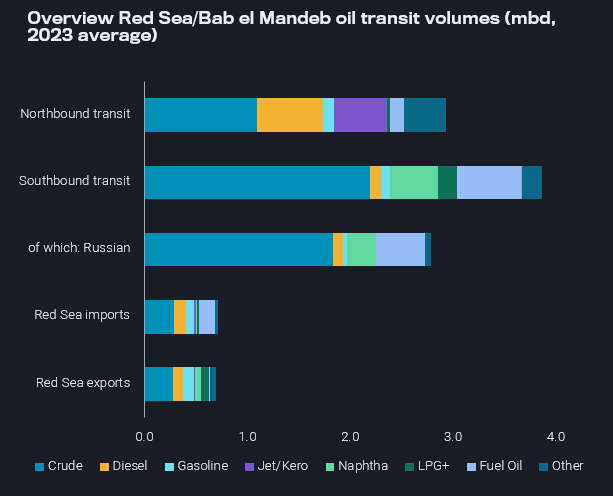

# Quick Q&A: Red Sea risks for oil, gas and tanker markets

**Date:** December 20, 2023  
**Publisher:** Breakwave Advisors | **Category:** Market Insights  
**Original URL:** [https://www.breakwaveadvisors.com/insights/2023/12/20/quick-qampa-red-sea-risks-for-oil-gas-and-tanker-markets](https://www.breakwaveadvisors.com/insights/2023/12/20/quick-qampa-red-sea-risks-for-oil-gas-and-tanker-markets)  

---

## Some of the Largest Companies in the Oil and Shipping Industries Are Now Adjusting Operations to Avoid Transit Through the Red Sea. As This Situation Evolves, It Makes Sense to Understand Just How These Shifts Could Impact Oil Flows and Tanker Activity. in This Quickfire Q&a, We Highlight Some of the Key Questions Around the Latest Developments.

*By*[*Jay Maroo*](https://www.linkedin.com/search/results/all/?keywords=Jay%20Maroo&origin=GLOBAL_SEARCH_HEADER&sid=.Hu)

How much cargo is transported by tankers via the Red Sea? How many tankers move along the route?

- Vortexa data for 2023 (Jan-Nov) shows around 8.2mbd of liquids (crude and products) were transported vessels moving along this route.

- Of this 8.2mbd, 2.9mbd is traveling northbound, 3.9mbd southbound and the remainder as imports/exports contained within the Red Sea region.
- Around 30 tankers enter or leave the Red Sea everyday via the southern end ([Bab el Mandeb](https://analytics.vortexa.com/?chartView=bar&dateRange=last-12-months&filtersEnabled=%5B%22l%22%2C%22v%22%2C%22l_c%22%2C%22o%22%2C%22d%22%2C%22v_v_st%22%2C%22v_f%22%2C%22v_o%22%2C%22v_c%22%5D&location=%5B%2234810d4a19fdf3d1de110ee44732bc8671179c28426b6a29f8585fed8bffec35%22%5D&page=FleetDistribution&tabId=5005404c-68a0-439a-b482-48ad8dc31179&v=3&vesselClasses=%5B%22oil%22%5D)) while 26 transit via the northern side ([Suez Canal](https://analytics.vortexa.com/?chartView=bar&dateRange=last-12-months&filtersEnabled=%5B%22l%22%2C%22v%22%2C%22l_c%22%2C%22o%22%2C%22d%22%2C%22v_v_st%22%2C%22v_f%22%2C%22v_o%22%2C%22v_c%22%5D&location=%5B%22f5634597081459985237dc54fcbe518d4b0a4f4af618b7719abda334b95538d1%22%5D&page=FleetDistribution&tabId=a7724e67-678c-44df-88ca-2be6aa608ff1&v=3&vesselClasses=%5B%22oil%22%5D)).
- On an average day, there are around 230 tankers situated within the Red Sea – 155 laden and 75 ballasting.

What is the most commonly transported cargo on oil tankers sailing northbound along the Red Sea?

- Crude oil, diesel/gasoil and jet/kero are the most commonly carried cargoes.
- Europe has historically been an importer of middle distillate products from the Middle East and India and this flow has picked up, especially for diesel since 2022.
- Volumes of diesel and crude oil sailing northbound have grown sharply on the back of European and US sanctions on Russia, which have boosted the importance of flows via the Red Sea.

What is the most commonly transported cargo on oil tankers sailing southbound along the Red Sea?

- Like tankers moving northbound, crude is also the most common cargo for southbound journeys, but the most common refined products are residual fuel oils and naphtha.
- Southbound flows are now largely dependent on cargo originating from Russia, as a result of the mass redirection of Russian Baltic/Black Sea crude to mainly India and China, and Russian fuel oil and naphtha to Singapore and East Asia.

> **Figure 1: Updated Red Sea**  
> **Interactive Data & Source:** [Vortexa](https://www.vortexa.com//oil-gas-data-traders-analysts-data-scientists?gclid=Cj0KCQjw8_qRBhCXARIsAE2AtRZKOvMnbilZ_6_91d7huSFFy71pWLrnPwGwOHVzXsmsG-1a1mZnQw8aAt89EALw_wcB&hsa_acc=1782073842&hsa_ad=548425387665&hsa_cam=14746637662&hsa_grp=125038601902&hsa_kw=&hsa_mt=&hsa_net=adwords&hsa_src=g&hsa_tgt=dsa-1431852288425&hsa_ver=3&utm_campaign=%5BCD%5D%20-%20DSA%20-%20EMEA&utm_medium=cpc&utm_medium=ppc&utm_source=google&utm_source=adwords&utm_term=) | [Local Asset](file:///C:/Users/Dell/Github/Shipping/corpus/03-breakwave/insights/2023/assets/2023-12-20_quick-qampa-red-sea-risks-for-oil-gas-and-tanker-markets_img_updated-red-sea_8f8dc591c21f.png)

What would be the implications on freight rates, if there is a sustained disruption on the Red Sea transits?

This would have severe implications on freight rates for routes that are transiting via the Red Sea. This could manifest in two ways:

- Vessels opting to transit via the Red Sea after recent developments would command high war-risk premia, pushing freight rate upwards.
- The disruption of the Red Sea transits would mean taking longer routes mainly around Africa, via the Cape of Good Hope. The extra mileage generated would both increase vessel tonnage requirements but would also increase the bunker consumption for operating vessels on both the laden and the ballast legs, hence also resulting in increased freight costs.

What would be the increase in voyage duration for the main routes affected, if vessels moved to alternative waypoints such the Cape of Good Hope?

- From India to North Europe route: 38 days instead of 24 days (58% increase)
- From the Middle East Gulf to North Europe route: 40 days instead of 23 days (74% increase)
- From the Middle East Gulf to Mediterranean route: 39 days instead of 17 days (129% increase)
- From the Mediterranean to Southeast Asia route: 40 days vs 23 days (74% increase)
- From the Russian Black Sea to China route: 55 days instead of 31 days (77% increase)
- From the Russian Baltics to India route: 44 days instead of 27 days (63% increase)

How does the potential impact on LNG transportation compare to oil/products flows?

- About 4% of global LNG recently passed through Bab el Mandeb north and southbound, but volumes could be swapped – i.e. LNG carriers could operate in a more localised manner.
- In comparison, European markets are highly reliant upon jet/kero loaded from the Middle East/Asia, and would struggle (relatively speaking) to find other ways to retain supplies without rerouting around the Cape of Good Hope.

Data Source:[Vortexa](https://www.vortexa.com//oil-gas-data-traders-analysts-data-scientists?gclid=Cj0KCQjw8_qRBhCXARIsAE2AtRZKOvMnbilZ_6_91d7huSFFy71pWLrnPwGwOHVzXsmsG-1a1mZnQw8aAt89EALw_wcB&hsa_acc=1782073842&hsa_ad=548425387665&hsa_cam=14746637662&hsa_grp=125038601902&hsa_kw=&hsa_mt=&hsa_net=adwords&hsa_src=g&hsa_tgt=dsa-1431852288425&hsa_ver=3&utm_campaign=%5BCD%5D%20-%20DSA%20-%20EMEA&utm_medium=cpc&utm_medium=ppc&utm_source=google&utm_source=adwords&utm_term=)
