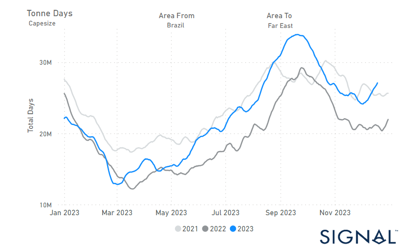
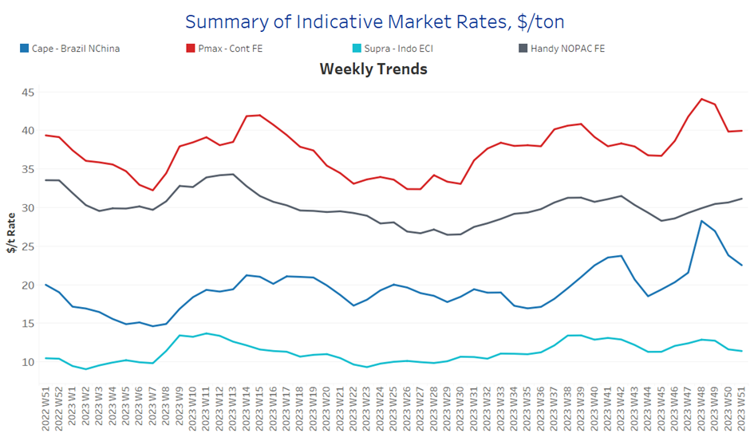
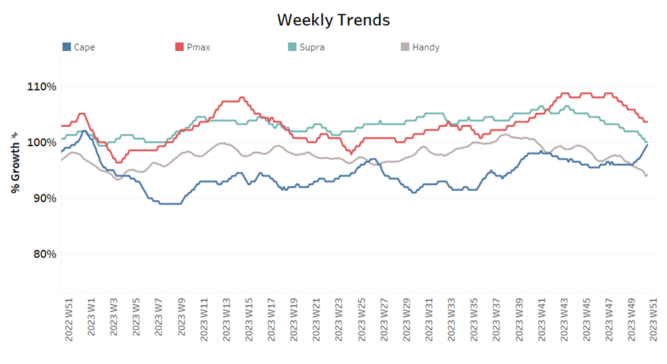
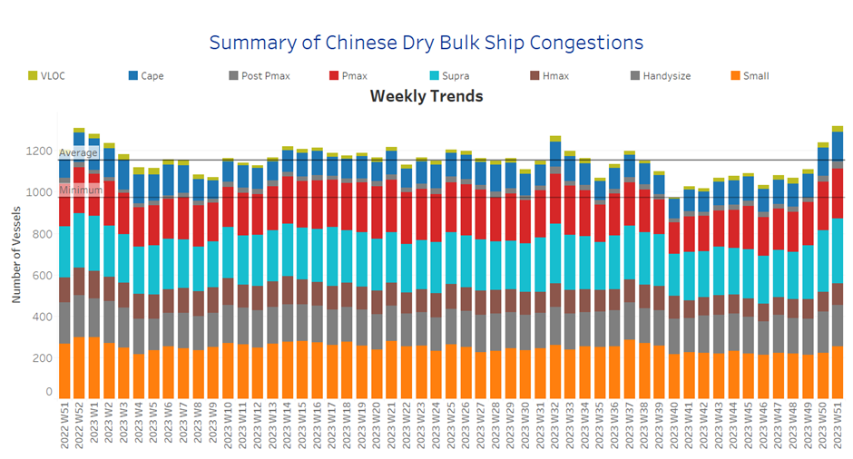

# Signal Dry Bulk Weekly Report

**Date:** December 21, 2023  
**Publisher:** Breakwave Advisors | **Category:** Market Insights  
**Original URL:** [https://www.breakwaveadvisors.com/insights/2023/12/21/signal-dry-bulk-weekly-report](https://www.breakwaveadvisors.com/insights/2023/12/21/signal-dry-bulk-weekly-report)  

---

## Chart of the Week : Capesize Tonne Days Brazil to China​​​​​

Significant increase in Capesize tonne days from Brazil to China since the beginning of December

> **Figure 1: Market Chart 1**  
> **Interactive Data & Source:** [Signal Ocean Platform](https://www.thesignalgroup.com/signal-ocean-platform) | [Local Asset](file:///C:/Users/Dell/Github/Shipping/corpus/03-breakwave/insights/2023/assets/2023-12-21_signal-dry-bulk-weekly-report_img_unnamed-2023-12-21t134249576_c4f90922c618.png)

In the third week of December, sentiment in the freight market for large vessel sizes has shown signs of weakening. However, optimism grows for a robust month-end, given the declining number of ballasters in the Panamax Continent Far East. Within the Capesize segment, there's been a notable increase in tonne days from Brazil to China, contrasting with the market price decline. Despite a rise in ballasters for Capesize vessels in SE Asia compared to recent lows, activity remains subdued, suggesting potential rate stabilisation through the month's end.

A positive factor for the next year is recent news suggesting that Chinese economic conditions will improve in 2024. According to state media, officials from the Chinese Communist Party's finance and economy office anticipate that China's economy will encounter more opportunities than challenges in 2024. The official Xinhua highlighted that macroeconomic policies will persistently bolster economic recovery.
This insight was provided in a comprehensive report on the annual Central Economic Work Conference held from December 11-12, where top leaders delineated economic objectives for the upcoming year.

​​​For more information on this week's trends, see the analysis sections below:

Freight Market, Supply, Demand and Port Congestion

## Section 1/ Freight

‘The Big Picture’ - Capesize and Panamax Bulkers and Smaller Ship Sizes

Market Rates ($/t) Weaker

> **Figure 2: Market Chart 2**  
> **Interactive Data & Source:** [Signal Ocean Platform](https://www.thesignalgroup.com/signal-ocean-platform) | [Local Asset](file:///C:/Users/Dell/Github/Shipping/corpus/03-breakwave/insights/2023/assets/2023-12-21_signal-dry-bulk-weekly-report_img_unnamed-2023-12-21t134520574_631daaba51d8.png)

In the third week of December, the dry freight market showed a weakening trend for the Capesize and Panamax, while the Handy-NOPAC-FE route showed signs of an upturn before the end of December.

- Capesize vessel freight rates from Brazil to North China from Brazil to North China fell to $22/t, down $6/t from week 48. The downward correction appears to be continuing, although rates are now 10% higher than a month ago.
- Panamax vessel freight rates from the Continent to the Far East were at the same level as the previous week at $39/tonne, with the latest sentiment appearing to converge with levels seen a month ago.
- Supramax vessel freight rates on the Indo-ECI route have remained unchanged over the last five weeks in a range of $11 to $12 per tonne, 7% weaker than a month ago.
- Handysize freight rates for the NOPAC Far East route confirmed sentiment of the previous week and exceeded the $30-tonne mark, up 9% from a month ago.

## Section 2/ Supply

> **Figure 3: Supply Trend Lines for Key Load Areasballasters (#Vessels) Increasing**  
> **Interactive Data & Source:** [Signal Ocean Platform](https://www.thesignalgroup.com/signal-ocean-platform) | [Local Asset](file:///C:/Users/Dell/Github/Shipping/corpus/03-breakwave/insights/2023/assets/2023-12-21_signal-dry-bulk-weekly-report_img_unnamed-2023-12-21t134620989_631daaba51d8.png)

The number of ballasters was above the annual average for all ship size classes, with the exception of Panamax ships, where the number has been falling continuously since the end of week 38.

- Capesize SE Africa: The number of ballasters held accelerated levels at around 108, with the last low in week 40 (~76).
- Panamax SE Africa: The number of ballasters has dropped further to 93, which is 4 less than in the previous week, when the last peak was reached in week 38 (~160).
- Supramax SE Asia: The number of ballast ships rose to 117, confirming the previous week's signs of an increase to 120, with a constant upward trend for five consecutive weeks.
- Handysize NOPAC: The number of ballast ships indicated a rise to 96, when two weeks ago hovered at around 90, while the latest low remained at week 44 (~76).

## Section 3/ Demand

> **Figure 4: Summary of Dry Bulk Demand, per Ship Sizetonne Days Mixed**  
> **Interactive Data & Source:** [Signal Ocean Platform](https://www.thesignalgroup.com/signal-ocean-platform) | [Local Asset](file:///C:/Users/Dell/Github/Shipping/corpus/03-breakwave/insights/2023/assets/2023-12-21_signal-dry-bulk-weekly-report_img_unnamed-2023-12-21t134815760_2afb88f89ec5.png)

In the third week of December, the declining demand persisted; however, there were indications of a rebound in Capesize from the previous week, suggesting the potential for further recovery in the upcoming days.

- Capesize: The upward trend, starting from the lows of week 47, has now reached one of its highest points since the conclusion of week 39.
- Panamax:The decline continued the sharp downward correction of the previous December days, with the last peak recorded in week 47.
- Supramax: The growth rate remained at its lowest level of the entire year for two consecutive weeks, with the last peak recorded in week 44.
- Handysize: Since the conclusion of week 47, demand growth has exhibited a consistent weakening trend, with current levels reaching their lowest point since the end of week 31.​​​​​​

## Section 4/ Port Congestion

> **Figure 5: Dry Bulk Ships Congested at Chinese Portsno of Vessels Increasing**  
> **Interactive Data & Source:** [Signal Ocean Platform](https://www.thesignalgroup.com/signal-ocean-platform) | [Local Asset](file:///C:/Users/Dell/Github/Shipping/corpus/03-breakwave/insights/2023/assets/2023-12-21_signal-dry-bulk-weekly-report_img_unnamed-2023-12-21t134936408_e9fd94e6ae62.png)

The number of dry bulk vessels congested at Chinese ports continued the previous week's rise and has now reached one of the highest levels since the peak in week 32.

- Capesize: The number of congested vessels rose to 143, the highest level of the entire year and 13 more than in the previous week.
- Panamax: The number of congested ships rose to 240, 20 more than the previous week and confirming indications of end November for levels of more than 200.
- Supramax: The number of ships surpassed 300, with an increase of 80 since the end of week 48.
- Handysize: The number of congested ships sustained the highs of 200 since the previous week, 24 more than two weeks ago.

Data Source:[Signal Ocean Platform](https://www.thesignalgroup.com/signal-ocean-platform)
