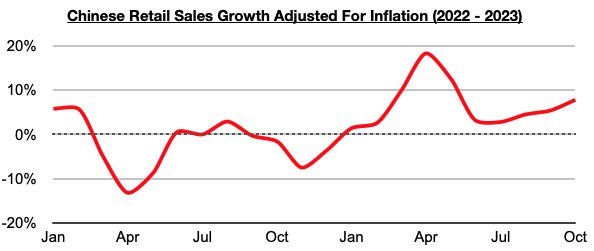
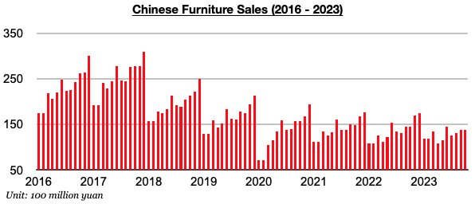

# Overall Consumption in China Remains Strong But Furniture Sales Continue to Contract

**Date:** January 03, 2024  
**Publisher:** Breakwave Advisors | **Category:** Market Insights  
**Original URL:** [https://www.breakwaveadvisors.com/insights/2024/1/3/overall-consumption-in-china-remains-strong-but-furniture-sales-continue-to-contract](https://www.breakwaveadvisors.com/insights/2024/1/3/overall-consumption-in-china-remains-strong-but-furniture-sales-continue-to-contract)  

---

*By*[*Jeffrey Landsberg*](https://www.linkedin.com/in/jeffrey-landsberg-70ab957/)

China’s retail sales in October grew year-on-year by 7.6%. This marked the highest growth seen since May and is of course well above October 0.2% decline in inflation. Overall, China’s retail sales growth has come in higher than inflation during each of the last ten months. Prior to these last ten months, retail sales growth had come in lower than inflation for four straight months.

> **Figure 1: Chart 1 (91)**  
> [Local Asset](file:///C:/Users/Dell/Github/Shipping/corpus/03-breakwave/insights/2024/assets/2024-01-03_overall-consumption-in-china-remains-strong-but-furniture-sales-continue-to-cont_img_chart1289129_92c654348a29.jpg)

As we have been highlighting in Commodore's Weekly China Reports, it remains very significant that Chinese consumers continue to buy more goods than they did a year ago. The same cannot unfortunately be said about consumers in many other major economies including the United States and Europe. In Europe, each of the last nineteen months have seen European consumers buy less goods than they did one year prior. In the United States, ten of the last twelve months have seen American consumers buy less goods than they did one year prior. China remains a rare major economy where consumption on the consumer side is actually growing.

As we also have been highlighting in Commodore's Weekly China Reports, also remaining significant (and much less supportive) in China is that furniture sales continue to contract on a year-on-year basis. This remains a direct result of the ongoing weakness in China’s housing market. Furniture sales in China fell year-on-year in October by 5%. Sales have now contracted on a year-on-year basis for seven straight months.

> **Figure 2: Chart 2 (80)**  
> [Local Asset](file:///C:/Users/Dell/Github/Shipping/corpus/03-breakwave/insights/2024/assets/2024-01-03_overall-consumption-in-china-remains-strong-but-furniture-sales-continue-to-cont_img_chart2288029_7a80b4c411d1.jpg)
