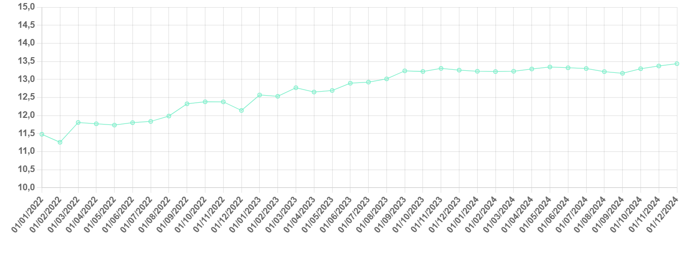

# A Year Ahead

**Date:** January 08, 2024  
**Publisher:** Breakwave Advisors | **Category:** Market Insights  
**Original URL:** [https://www.breakwaveadvisors.com/insights/2024/1/8/a-year-ahead](https://www.breakwaveadvisors.com/insights/2024/1/8/a-year-ahead)  

---

> **Figure 1: Istock 485480338 (2)**  
> **Interactive Data & Source:** [Gibsons Co](https://www.gibsons.co.uk/market-reports) | [Local Asset](file:///C:/Users/Dell/Github/Shipping/corpus/03-breakwave/insights/2024/assets/2024-01-08_a-year-ahead_img_istock-48548033828229_e8cd5e92a0e9.jpg)

The end of last year was marked by a significant increase in attacks on ocean-going vessels in the Red Sea, with several prominent shipping companies announcing temporary pauses in their transits through the region. At the same time, we have also seen new international sanctions against Russia, which among other things saw an increase in due diligence requirements for companies subject to the G7 price cap. The hastily assembled multinational naval military operation to protect commercial trade transiting through the Red Sea could improve the security situation in the region over time; yet, the latest news that Iran is deploying a warship to the Red Sea reminds us of the risk of further escalation and potentially extreme disruptions to global trade. In contrast, the latest round of international sanctions against Russia could see some owners abandoning Russian trade, boosting tonnage availability in the mainstream market, although much here depends on the Urals price and willingness of counterparties to abide by the new rules.

Fresh OPEC+ production cuts represent another downside risk to crude tankers; however, global oil demand is projected to grow by 1.1 mbd in 2024 and this demand needs to be met from somewhere. Although consumption in advanced economies, mainly the US and Europe, is projected to decline by 270kbd, demand in developing countries is expected to increase by 1.32 mbd. China accounts for the bulk of the increase, with the country’s anticipated consumption growing by 0.72 mbd, where growth in naphtha and LPG demand accounts for 70% of the total. Overall, non-OECD Asia’s refining runs are projected to increase by 0.5 mbd next year, suggesting healthy growth in regional crude imports.

Where will that crude come from? The growth in US crude production beat market expectations in 2023 and further gains are on the cards this year. The latest IEA report suggests the country’s production could increase by 0.59 mbd this year. This, coupled with expectations of declining demand, which could apply downward pressure on refining runs, means incremental growth in crude exports. Strong gains are also projected in Latin American crude output, driven by Brazil and Guyana. Overall, regional crude production is projected to increase by 0.52 mbd YoY. There is also some potential for a modest increase in Venezuela’s exports in the early part of 2024, although the longer-term trend is uncertain, depending on the outcome of Venezuela’s elections. With Middle East exports constrained, increases in Americas crude outflows are set to lead to incremental growth in long-haul trade to Asia, which will be further reinforced by an expected decline in US and European demand. This will mainly aid VLCC demand. Increases in Suezmax and Aframax demand are likely to be capped by Russian production cuts, although winter-related delays and disruptions traditionally fuel volatility during Q1. Later in the year, the long-awaited expansion of the Trans Mountain pipeline to West Coast Canada could generate a notable increase in Aframax demand, if the pipeline start-up date is not delayed yet again.

Growth in trade is also expected in the product tanker market this year, as recently commissioned refineries in the Middle East reach full-scale operations, with regional runs projected to increase by 0.6 mbd YoY and more products likely to head into Europe. Although manufacturing in Europe is underperforming, regional gasoil stocks as evidenced in ARA inventories are under downward pressure, following expended autumn refining maintenance. A further decline in European refining runs is projected in Q1 2024, with even bigger spring maintenance planned. Another factor that could support increased volatility is arbitrage opportunities if these become widely open as seen in 2H 2022 and early 2023. An element of support is also coming from restrictions in the Panama Canal: with these restrictions unlikely to materially ease until Q2, tighter MR supply and higher LPG prices relative to naphtha are likely this quarter.

Supply-side constraints are also expected to aid tanker markets, with deliveries highly limited in 2024. Environmental regulations, such as EEXI and CII will also impact on trading patterns, constraining fleet capacity and reducing trading flexibility. The same IMO regulations could facilitate the further exit of ageing tonnage from the mainstream trade, although it remains to be seen whether the latest EU sanctions will lead to a slowdown in secondhand tonnage sales into Russian trade.

In terms of downside risks, the pending start-up of the 600kbd Dangote refinery threatens WAF crude exports and CPP imports, with 4 cargoes of West African crude already delivered into Dangote in December. Although it is still unclear when the refinery will be fully operational, even a gradual ramp-up of operations will slowly eat into tanker demand. Another downside risk is the accelerating economic turmoil in Europe, with regional CPP imports at risk. Furthermore, any hard landing in China’s economic growth could slow crude imports. Although in this scenario Chinese CPP exports will be supported, much here depends on the volume of product export quotas, dictated by the government.

To sum it all up, strong tanker fundamentals are seen as we head into the new year, but geopolitical and economic events are the key “known unknowns” in terms of upside and downside risks. And of course, there always are “unknown unknowns”.

## Us Crude Production (Mbd)

> **Figure 2: Αρχείο Λήψης (7)**  
> **Interactive Data & Source:** [Gibsons Co](https://www.gibsons.co.uk/market-reports) | [Local Asset](file:///C:/Users/Dell/Github/Shipping/corpus/03-breakwave/insights/2024/assets/2024-01-08_a-year-ahead_img_ceb1cf81cf87ceb5ceafcebfcebbceaecf88_ff20f94e85c4.png)

Data source:[Gibson Shipbrokers](https://www.gibsons.co.uk/market-reports)
