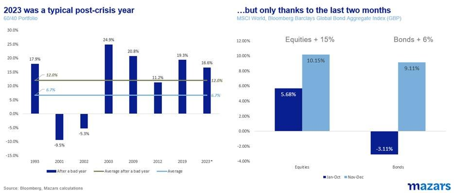
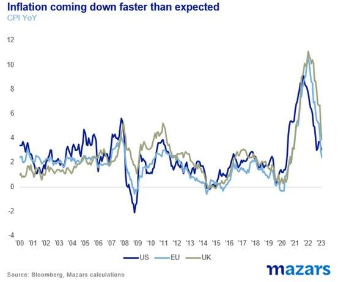
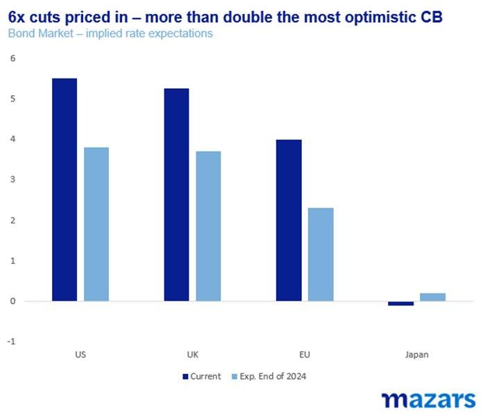
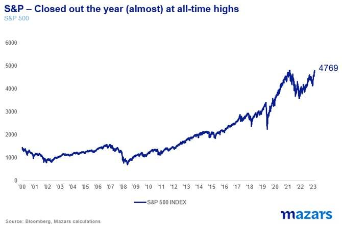
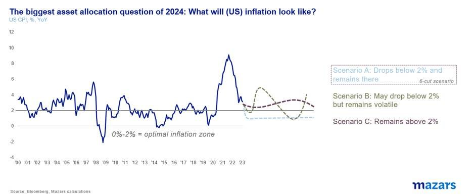

# 2024 – Runaway Bulls?

**Date:** January 09, 2024  
**Publisher:** Breakwave Advisors | **Category:** Market Insights  
**Original URL:** [https://www.breakwaveadvisors.com/insights/2024/1/8/2024-runaway-bulls](https://www.breakwaveadvisors.com/insights/2024/1/8/2024-runaway-bulls)  

---

*The three things we would notice in the beginning of the year.*

1. *2024 began with great momentum for risk assets, as traders bet on sharp rate cuts with no recession.*
2. *To position themselves, investors need to answer two key questions: a) how will inflation come down and will it stay there and b) is the Fed still mindful of repressing market volatility?*
3. *While we don’t feel that 2024 will look anything like 2022, we think that until rate cuts become a reality and Quantitative Tightening stops, markets and economies could experience a bumpier ride towards normality than doves may presently anticipate.*

*By*[*George Lagarias*](https://www.linkedin.com/in/george-lagarias-mba-3baa769/)

2023 was a slow and frustrating recovery train until late October, which then turned into a hypersonic rocket. What looked like a sub-par 2023 turned out to be a blowout year in the last two months, in line with the kind of performance we expect following a bad year (2022).

While the first week of 2024 saw a moderate pullback, overall sentiment remains bullish.

> **Figure 1: Market Chart 1**  
> **Interactive Data & Source:** [Mazars Co](https://www.mazars.co.uk/Users/Our-team/David-Baker) | [Local Asset](file:///C:/Users/Dell/Github/Shipping/corpus/03-breakwave/insights/2024/assets/2024-01-09_2024-runaway-bulls_img_image006281029_6d77cf770ff5.jpg)

So what changed in the last two months? Inflation began to come down faster than anticipated.

> **Figure 2: Market Chart 2**  
> **Interactive Data & Source:** [Mazars Co](https://www.mazars.co.uk/Users/Our-team/David-Baker) | [Local Asset](file:///C:/Users/Dell/Github/Shipping/corpus/03-breakwave/insights/2024/assets/2024-01-09_2024-runaway-bulls_img_image00728529_f03ea95ace40.jpg)

Investors, desperate for some good news after nearly two years of malaise, jumped on the news and started pre-empting central bank rate cuts, ahead of the Fed’s December meeting. Just as most commentators, and possibly even traders, were expecting the Fed’s Chair to cut the party short and remind markets to be prudent, an anonymous internal survey (called the Dot Plot) suggested that the Fed wasn’t siding with caution, but with bullish traders. The Plot suggested three rate cuts for 2024, two more than it had three months before. The year closed with a blowout. Bond markets are now pricing in no less than six cuts for each of the major central banks

> **Figure 3: Market Chart 3**  
> **Interactive Data & Source:** [Mazars Co](https://www.mazars.co.uk/Users/Our-team/David-Baker) | [Local Asset](file:///C:/Users/Dell/Github/Shipping/corpus/03-breakwave/insights/2024/assets/2024-01-09_2024-runaway-bulls_img_image00828629_08a0318da27c.jpg)

> **Figure 4: …And the S&p 500 Is Now Trading Back to All-Time Highs**  
> **Interactive Data & Source:** [Mazars Co](https://www.mazars.co.uk/Users/Our-team/David-Baker) | [Local Asset](file:///C:/Users/Dell/Github/Shipping/corpus/03-breakwave/insights/2024/assets/2024-01-09_2024-runaway-bulls_img_image00928629_f69838bf265a.jpg)

So we enter 2024 considering whether we should ride with the Bulls, wait on the sidelines, or bet against the market. While it’s early yet to answer that particular question, we need to think about the parameters that are going to help us determine the answer.

Question number 1: Will inflation fall below the 2% threshold and remain there, will it be volatile and trick us with a rebound, or will it slow down to 2.5%-3.5% and remain there?

> **Figure 5: Market Chart 5**  
> **Interactive Data & Source:** [Mazars Co](https://www.mazars.co.uk/Users/Our-team/David-Baker) | [Local Asset](file:///C:/Users/Dell/Github/Shipping/corpus/03-breakwave/insights/2024/assets/2024-01-09_2024-runaway-bulls_img_image01028629_8b654ced25c5.jpg)

To be sure, we think inflation is indeed coming down. But the way in which it comes down, and its volatility thereafter matter more than its present course.

The answer to that has very different policy indications. Only scenario A (a sustainable drop in inflation) would probably go someway towards justifying current market pricing. Scenario B (volatile inflation) would force data-dependent central banks, usually prone to err on the side of caution, to maintain higher rates. Scenario C (non-volatile but above-average inflation), would see moderate rate cuts, but still a rate cut pause above the r*, the natural rate of interest. Both B and C scenarios, which we presently favour, would probably cause some market correction from current prices.

Question number 2: Is the Fed inherently dovish? Technically, the Fed is on the side of the economy. Until inflation, a tax on everyone is beaten, it has a high tolerance for risk asset volatility. However, in the decade following the global financial crisis, the US central bank has often prioritised volatility suppression over other economic goals, insofar as inflation would not become a problem. Traders and investors often jump to the slightest hint of a Fed Pivot away from a tight interest rate regime.

The experience from 2022 onwards suggests that the Fed is presently more geared towards fighting inflation. If the Great Moderation (a long period of relatively stable macroeconomic readings) is indeed over, as we suggested this time last year, then we should expect two things: Central Banks more vigilant of inflation than of risk asset volatility, and the official end of forward guidance. In other words, this is not Greenspan’s, Bernanke’s or Yellen’s Fed. This is Volcker’s Fed.

What does it all mean for investors?

While we are positive that rates will come down this year, we, presently, do not share the markets’ optimism that this will happen quickly and sustainably enough to produce double the rate cuts the Fed has suggested.

While we do attempt to answer the two key questions, we acknowledge that, in reality, we can’t be sure of the outcomes. The name of the game is still volatility. Following the pandemic, the world remains an unbalanced place. While a reasonable[observer](https://www.mazars.co.uk/Users/Our-team/David-Baker)might argue that it has always been thus, we feel that the compounded effect of geopolitical conflicts, trade wars and the fact that this generation of supply chain decision-makers now knows inflation, create a particularly volatile mix for the global economy. Thus, the range of potential outcomes is wide.

To be sure, we don’t believe that 2024 holds a 2022-style retrenchment. Far from it. Bond prices have dropped significantly since then. Equity valuations, bar tech and telecoms are not that far from their mean. It is well within the realm of possibility that tech takes a break and allows other stocks to catch up.

But volatility is the enemy and risks abound. There are corners of the market, possibly still including some US banks, that could still suffer as a result of the steep rate hikes of last year. With central banks still somewhat hawkish, the safety net isn’t as wide and encompassing as in the past. Even if that wasn’t the case, Quantitative Tightening makes a sustainable equity rally very difficult.
