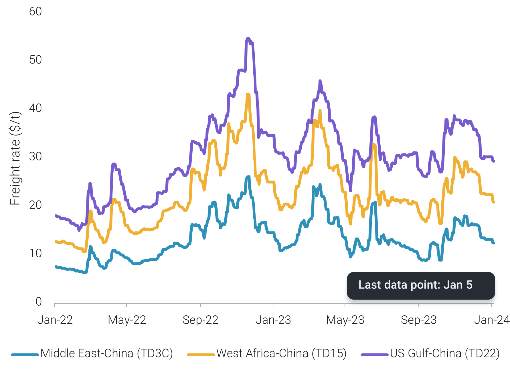
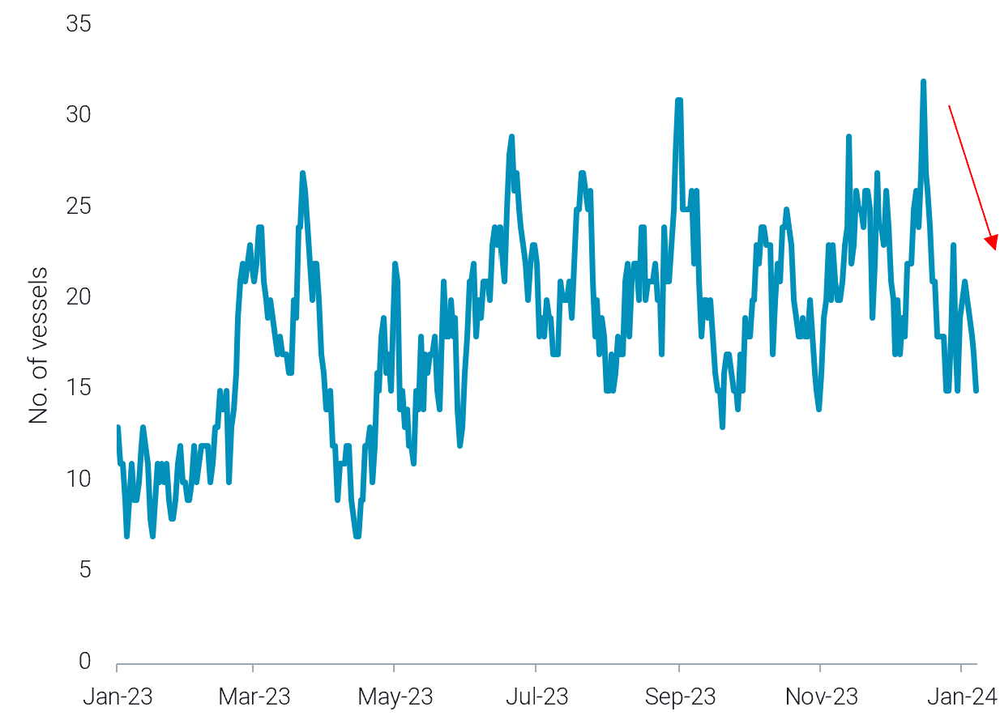

# Limited VLCC support from China import quotas || Support for TD25

**Date:** January 11, 2024  
**Publisher:** Breakwave Advisors | **Category:** Market Insights  
**Original URL:** [https://www.breakwaveadvisors.com/insights/2024/1/11/limited-vlcc-support-from-china-import-quotas-support-for-td25](https://www.breakwaveadvisors.com/insights/2024/1/11/limited-vlcc-support-from-china-import-quotas-support-for-td25)  

---

Happy New Year! In our first issue of 2024, in the East we discuss the outlook for China-bound VLCCs in light of recent import quota announcements, and we investigate which product is most affected by Red Sea Northbound diversions. In the West, we examine the ongoing TD25 rally, and we monitor gas carriers diverting from the Red Sea.

*By*[*Mary Melton*](https://www.linkedin.com/search/results/all/?fetchDeterministicClustersOnly=true&heroEntityKey=urn%3Ali%3Afsd_profile%3AACoAABXVyecBtg-pRnIrZe0BoWk0ygPiUfbvhsw&keywords=mary%20melton&origin=RICH_QUERY_SUGGESTION&position=0&searchId=40e8d7d2-c4d0-4022-81e7-176f6eba418b&sid=H_Y&spellCorrectionEnabled=false)

### Analysis / East of Suez / Dirty

## New Crude Import Quotas Offer Limited Support to China-Bound VLCC Freight Rates

> **Figure 1: VLCC Freight Rates on Major China-Bound Routes**  
> *VLCC freight rates on major China-bound routes*  
> **Interactive Data & Source:** [Vortexa](https://www.vortexa.com//oil-gas-data-traders-analysts-data-scientists?gclid=Cj0KCQjw8_qRBhCXARIsAE2AtRZKOvMnbilZ_6_91d7huSFFy71pWLrnPwGwOHVzXsmsG-1a1mZnQw8aAt89EALw_wcB&hsa_acc=1782073842&hsa_ad=548425387665&hsa_cam=14746637662&hsa_grp=125038601902&hsa_kw=&hsa_mt=&hsa_net=adwords&hsa_src=g&hsa_tgt=dsa-1431852288425&hsa_ver=3&utm_campaign=%5BCD%5D%20-%20DSA%20-%20EMEA&utm_medium=cpc&utm_medium=ppc&utm_source=google&utm_source=adwords&utm_term=) | [Local Asset](file:///C:/Users/Dell/Github/Shipping/corpus/03-breakwave/insights/2024/assets/2024-01-11_limited-vlcc-support-from-china-import-quotas-support-for-td25_img_unnamed-2024-01-11t130108922_834981a3a228.png)

- China issued crude import quotas for 2024, rather than the usual practice of around 50% of the yearly allowance at the start of the year. The change aims to boost imports, as many refiners exhausted their quotas in late 2023
- However, state-run refiners, with unlimited quotas, also reduced imports in the last two months of 2023 amid softened crude demand. Throughout December, VLCC rates on China-bound routes (TD3C, TD15 and TD22) experienced declines approaching 20%. Even after the quota announcement, these rates continued to slide.
- Through 9 January, TD3C experienced a 14% increase compared to last Friday (5 Jan) following Saudi’s OSP cuts, and TD22 saw a 15% rise over the same period, likely linked to Sinokor’s VLCC chartering flurry. However, the persistent weakness in Chinese demand is expected to constrain the extent of these upticks.

### Analysis / West of Suez / Dirty

## High USG-to-Europe Aframax Rates Likely to Endure in Short-Term

> **Figure 2: USG Prompt Aframax Availability**  
> *USG prompt Aframax availability*  
> **Interactive Data & Source:** [Vortexa](https://www.vortexa.com//oil-gas-data-traders-analysts-data-scientists?gclid=Cj0KCQjw8_qRBhCXARIsAE2AtRZKOvMnbilZ_6_91d7huSFFy71pWLrnPwGwOHVzXsmsG-1a1mZnQw8aAt89EALw_wcB&hsa_acc=1782073842&hsa_ad=548425387665&hsa_cam=14746637662&hsa_grp=125038601902&hsa_kw=&hsa_mt=&hsa_net=adwords&hsa_src=g&hsa_tgt=dsa-1431852288425&hsa_ver=3&utm_campaign=%5BCD%5D%20-%20DSA%20-%20EMEA&utm_medium=cpc&utm_medium=ppc&utm_source=google&utm_source=adwords&utm_term=) | [Local Asset](file:///C:/Users/Dell/Github/Shipping/corpus/03-breakwave/insights/2024/assets/2024-01-11_limited-vlcc-support-from-china-import-quotas-support-for-td25_img_unnamed-2024-01-11t130331076_92c8f36db492.png)

- Aframax rates USG-to-Europe (TD25) shot up last week, increasing about 60% since the rally began at the New Year. This was a function of both supply and demand fundamentals. Higher enquiries from European buyers served to increase tanker demand and clear tonnage in the US Gulf. As a result, prompt availability has continued to decline during this freight rate rally.
- Some of the enquiry activity from European buyers is likely driven by opportunistic buying due to a weak market and low prices for US crude due to ample supply, and it is unlikely that this buying will be sustained. However, buying could continue due to the proximity of the US as a source of crude supply during uncertainty in the Middle East and ongoing OPEC supply cuts.
- High winds in the US Gulf have prevented STS in some locations (Argus Media), and ongoing inclement weather in the North Atlantic is likely to keep rates high in the short term despite the weak crude demand environment.

Data Source:[Vortexa](https://www.vortexa.com//oil-gas-data-traders-analysts-data-scientists?gclid=Cj0KCQjw8_qRBhCXARIsAE2AtRZKOvMnbilZ_6_91d7huSFFy71pWLrnPwGwOHVzXsmsG-1a1mZnQw8aAt89EALw_wcB&hsa_acc=1782073842&hsa_ad=548425387665&hsa_cam=14746637662&hsa_grp=125038601902&hsa_kw=&hsa_mt=&hsa_net=adwords&hsa_src=g&hsa_tgt=dsa-1431852288425&hsa_ver=3&utm_campaign=%5BCD%5D%20-%20DSA%20-%20EMEA&utm_medium=cpc&utm_medium=ppc&utm_source=google&utm_source=adwords&utm_term=)
