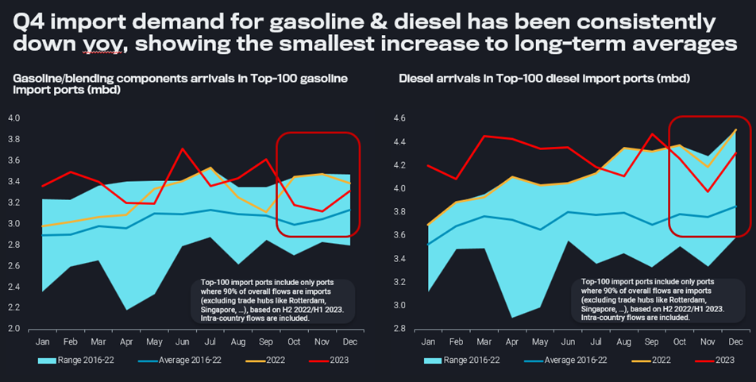

# The most important chart moving from 2023 into 2024

**Date:** January 12, 2024  
**Publisher:** Breakwave Advisors | **Category:** Market Insights  
**Original URL:** [https://www.breakwaveadvisors.com/insights/2024/1/12/the-most-important-chart-moving-from-2023-into-2024](https://www.breakwaveadvisors.com/insights/2024/1/12/the-most-important-chart-moving-from-2023-into-2024)  

---

## Motor Fuel Import Demand Has Slowed Substantially Over Q4, Aligning Well with an Ailing Pricing Complex While Dampening the Repercussions From Red Sea Risks.

*By*[*David Wech*](https://www.linkedin.com/search/results/all/?fetchDeterministicClustersOnly=true&heroEntityKey=urn%3Ali%3Afsd_profile%3AACoAACdbGu4B25CFPSM8gOGM562N0GXP-oL0T1Y&keywords=david%20wech&origin=RICH_QUERY_SUGGESTION&position=0&searchId=b175ebeb-efa1-48b7-b4ba-63f6a6ac7777&sid=X%29%21&spellCorrectionEnabled=false)

Εarlier this month, I was honoured to speak at the[HC Insider Podcast](https://www.hcgroup.global/hc-insider/hc-insider-podcast/the-oil-market-with-david-wech)on key features of the oil market in 2023 as well as the outlook for 2024. While a lot of relevant things happened last year with knock-on effects into 2024 and new issues are popping up, I would say the most important current feature and chart is the substantial slowdown in motor fuel import demand over the last couple of months.

11 out of 12 months over H2 2022/H1 2023 had shown record arrivals of diesel into the Top-100 import ports (ports where at least 90% of all flows are imports, excluding therefore trading hubs). This was driven by the post-Covid recovery, the rerouting of Russian diesel away from Europe, the emergence of replacement supplies and related stockbuilding ahead of what some had coined to be “the worst winter for Europe since WW2”.

Similarly 6 out of 9 months over Jan-Sep 2023 had yielded record imports for gasoline and blending components. The so-called “revenge” demand after Covid and a string of refinery outages contributed to strong trade flows and high cracks.

> **Figure 1: Arrivals Ofgasoline/blending Componentsanddieselin Top-100**  
> *Arrivals ofgasoline/blending componentsanddieselin Top-100 import ports (mbd)*  
> **Interactive Data & Source:** [Tinyurl](http://tinyurl.com/4kyjfyd5) | [Local Asset](file:///C:/Users/Dell/Github/Shipping/corpus/03-breakwave/insights/2024/assets/2024-01-12_the-most-important-chart-moving-from-2023-into-2024_img_011028129_676b9a417b98.png)

While over Q3 growth momentum for both gasoline and diesel started to fade, Q4 2023 saw a dramatic reverse of dynamics. For each month over Oct-Dec, both gasoline and diesel imports were lower year-on-year. In the case of gasoline, levels fell even into close reach of the 2016-2022 seasonal averages. The observation is a global one, but no regional market is holding up particularly strongly.

The 3-month stretch is too long to explain it with one-off factors or volatility in trade data. The fact that cracks (and the entire market including structure) have been correcting lower over Q4 clearly puts the blame to the demand and not the supply side (refinery outages). Probably numerous trends are playing together. The post-Covid recovery is now very likely to be over, except perhaps for a bit of upside in Asian jet demand. Two years of strong inflationary pressure in combination with a by now pretty clear manufacturing recession are leaving their mark as well. And while energy transition and conservation trends have taken somewhat of a backseat (in terms of perception and actual patterns), these factors have not disappeared and may now come again to the forefront more clearly. Finally, with heating fuel demand fading faster than transportation fuel demand the oil market’s seasonality is likely to transition to just one pronounced spike over Northern Hemisphere summer months.

Disappointing oil & gas demand amid ample supplies – seaborne crude/condensate exports reached a marked 9-month high in December – is also a key factor behind traders’ lukewarm reception of renewed Red Sea security risks and related diversions. In a bear market, the lengthening of the average supply chain (no volumes are lost) is easy to bear. Somewhat ironically, the real threats of passing through Bab el Mandeb are sheltering the global fleet from easing cargo demand by adding even more to already inflated travel times.

Data Source:[Vortexa](https://www.vortexa.com//oil-gas-data-traders-analysts-data-scientists?gclid=Cj0KCQjw8_qRBhCXARIsAE2AtRZKOvMnbilZ_6_91d7huSFFy71pWLrnPwGwOHVzXsmsG-1a1mZnQw8aAt89EALw_wcB&hsa_acc=1782073842&hsa_ad=548425387665&hsa_cam=14746637662&hsa_grp=125038601902&hsa_kw=&hsa_mt=&hsa_net=adwords&hsa_src=g&hsa_tgt=dsa-1431852288425&hsa_ver=3&utm_campaign=%5BCD%5D%20-%20DSA%20-%20EMEA&utm_medium=cpc&utm_medium=ppc&utm_source=google&utm_source=adwords&utm_term=)
