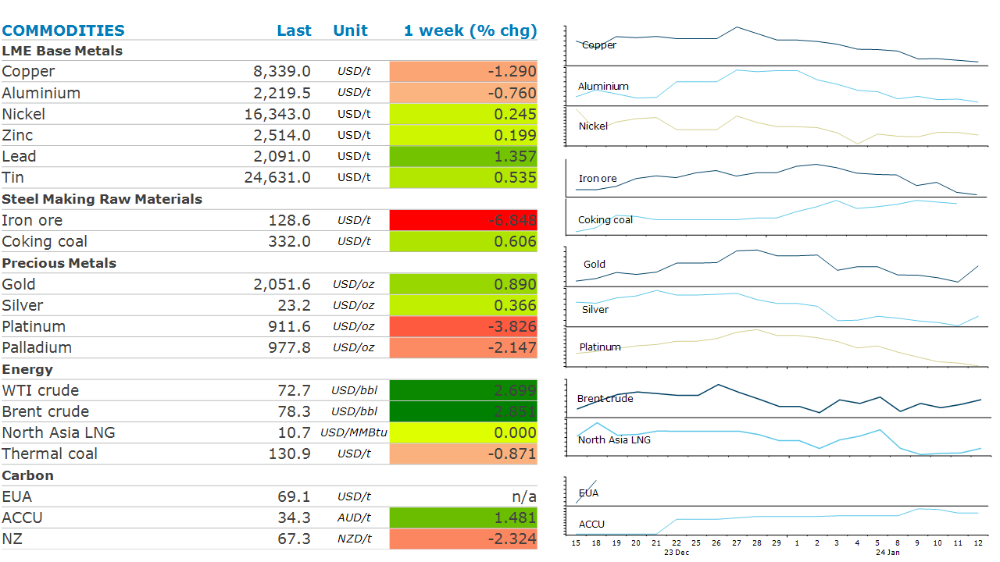

# Oil rebounds as geopolitical tensions rise

**Date:** January 15, 2024  
**Publisher:** Breakwave Advisors | **Category:** Market Insights  
**Original URL:** [https://www.breakwaveadvisors.com/insights/2024/1/15/oil-rebounds-as-geopolitical-tensions-rise](https://www.breakwaveadvisors.com/insights/2024/1/15/oil-rebounds-as-geopolitical-tensions-rise)  

---

*By*[*Daniel Hynes*](https://www.linkedin.com/in/dahynes/)

Geopolitical risks drive sentiment across the energy complex. However, the market still has one eye on the outlook for interest rates following economic data from China and the US.

> **Figure 1: 1705265726101**  
> **Interactive Data & Source:** [Linkedin](https://www.linkedin.com/newsletters/commodities-wrap-6692196755876012032/?fbclid=IwAR3kiXJqZdxmp9ZcRwBNI7FsBySI-XSC0pfPur1qzjt7OZp7PTE59Tsl1QI) | [Local Asset](file:///C:/Users/Dell/Github/Shipping/corpus/03-breakwave/insights/2024/assets/2024-01-15_oil-rebounds-as-geopolitical-tensions-rise_img_1705265726101_c7725a1b3360.png)

**Crude oil**ended the week largely unchanged despite wild swings as the market contemplated increasing geopolitical tensions amid signs of weak demand. Oil prices came under pressure early in the week after Saudi Arabia cut official selling prices for all regions, raising concerns of weakening fundamentals. Those concerns were magnified following a build in inventories in the US. The weekly gain of 1.34mbbl was well above expectations. However, the focus returned to supply side issues as tensions mounted in the Middle East. The Yemen based Houthis launched their largest assault to date on shipping in the Red Sea. This was followed by the seizure of an oil tanker off the coast of Oman by Iran. Concerns of a broad escalation of fighting rose sharply after the US responded to the Houthi attacks by launching its own airstrikes on the Iranian-backed group in Yemen. Nevertheless, there remains some doubt around the impact on oil supply, with prices giving back some of the gains late on Friday. Further rises would depend on whether Iran is drawn more into the conflict.

**North Asia LNG**held near USD11/mmBtu as rising geopolitical tensions raised concerns about supply. This sparked increased activity in the spot market, magnified opportunistic buying following the recent selloff which as seen prices in the region fall to a six-month low. European natural gas prices also rebounded amid the tension in the Middle East. An artic blast of cold weather is also spreading across Europe, fuelling demand for gas in heating and power generation.

**Copper**posted a weak start to the year, as hopes for an early rate cut by the Fed receded. This combined with a stronger USD which has made metals more expensive for non-USD consumers. This has offset supply side disruptions. The closure of the Cobre copper mine in Panama and cuts to output at Anglo American operations will see 600kt removed from the market next year. This moves our expectations of a small surplus to a deficit. Demand in China remains robust. Refined copper imports saw a net decline of 6% y/y in 2023 but was well compensated by an increase in concentrate imports.

**Gold**gained last week as inflation eased. Prices paid to US producers unexpectedly fell in December for a third straight month. However, the gains were largely driven by safe haven buying amid rising geopolitical tensions. The US-led airstrikes in Yemen triggered a quick reaction from Houthi rebels, who vowed to expand their campaign. The group warned that all US and UK interests are now targets.

**Iron ore**fell, recording its biggest weekly loss in more than five months amid a deteriorating demand outlook. Stockpiles of iron ore in China rose for the sixth straight month, according to Steelhome data. Strong imports amid weak demand triggered the build in inventories.

Data source:[Commodities Wrap](https://www.linkedin.com/newsletters/commodities-wrap-6692196755876012032/?fbclid=IwAR3kiXJqZdxmp9ZcRwBNI7FsBySI-XSC0pfPur1qzjt7OZp7PTE59Tsl1QI)
