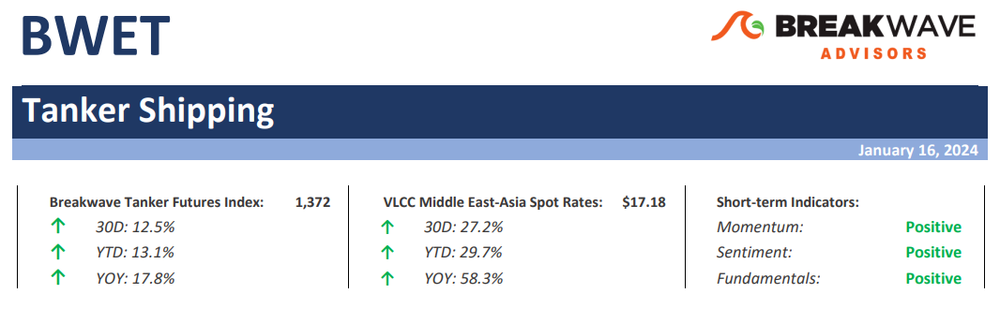
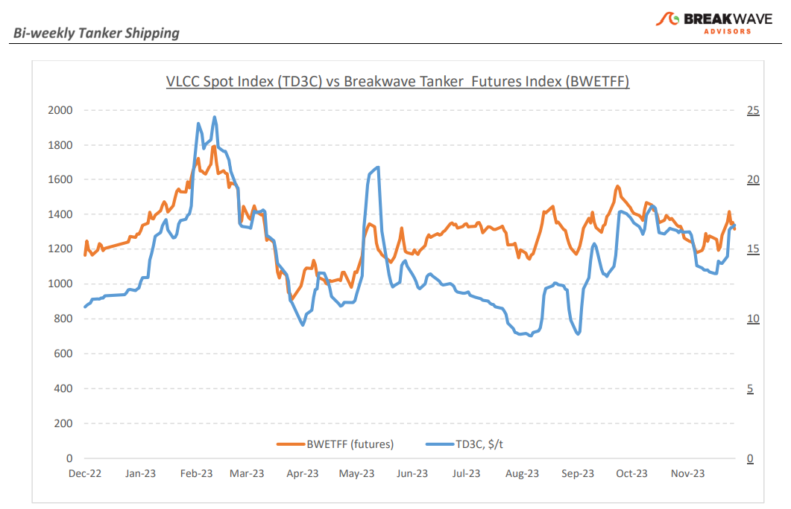
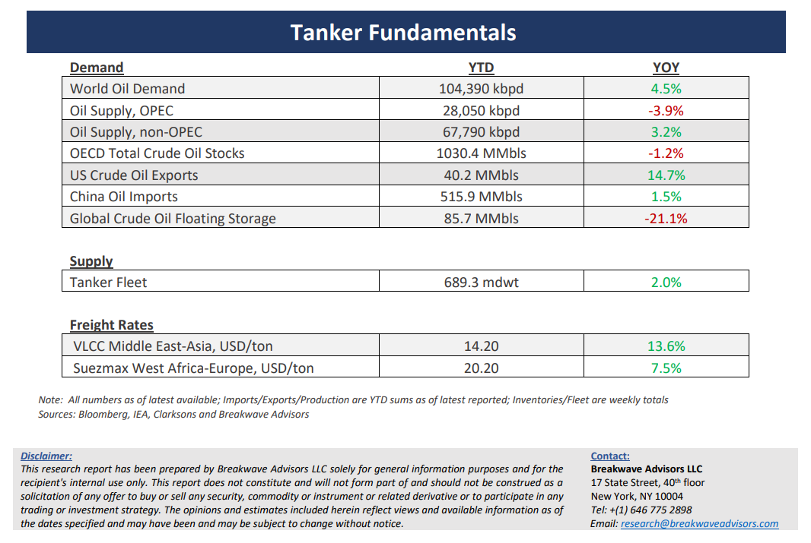

# Breakwave Bi-Weekly Tanker Report - January 16, 2024

**Date:** January 16, 2024  
**Publisher:** Breakwave Advisors | **Category:** Market Insights  
**Original URL:** [https://www.breakwaveadvisors.com/insights/2024/1/16/wet](https://www.breakwaveadvisors.com/insights/2024/1/16/wet)  

---

> **Figure 1: Tankerreporttop**  
> [Local Asset](file:///C:/Users/Dell/Github/Shipping/corpus/03-breakwave/insights/2024/assets/2024-01-16_wet_img_tankerreporttop_3a5124d3f9e1.png)

**• Geopolitical instability and oil supply disruptions propel the crude tanker market higher –**The onset of the New Year has ushered in geopolitical events that bear significant ramifications for the crude freight market and oil prices. Notably, the recent shutdown of Libya's Sharara oilfield, producing about 300,000 barrels per day, has injected uncertainty into the crude oil supply chain, exerting upward pressure on oil prices. Simultaneously, the Middle East faces a precarious situation, marked by the now well-published numerous attacks on ships in the Red Sea. Although a lot of analysis regarding ship diversions and the associated changes in tonne-mile demand that comes with longer sail distances is still ongoing, the reality is that any disruption across the shipping sector is a positive development for freight rates. Sentiment plays a major factor when it comes to shipping rates and as a result the VLCC Middle East Gulf to China route also experienced an upward trend, while a similar optimism emerged in the Atlantic market for the West Africa to China route. Looking ahead, the trajectory of the crude tanker market will now hinge on the evolving trends in February. As charterers begin to navigate the early February liftings, the market's direction will undoubtedly be dominated by the Red Sea crisis: The escalating tensions in the region, following the recent air strikes on Yemen, raise concerns about whether there will be sufficient crude tanker supply for charterers to conduct their operations and there is nothing more important in the physical crude oil trading of not only having the security of oil cargoes but also having tanker transportation available during such periods of high uncertainty.

**• 2024 global oil demand to continue to break new records –**Despite a rather uncertain and dull macroeconomic backdrop, world oil demand is expected to reach new highs in 2024, aided by China’s continuing appetite for oil. With ~2 million barrels per day (mbpd) of incremental demand for the year, forecasts call for more than 103 mpbd of global demand for 2024, a new record. With such significant oil demand growth comes also higher demand for tanker transportation and, given the relatively limited growth in the global tanker fleet for the year, utilization in the broader sector should improve further. China imported more than 11 mpbd in 2023, ~11% more than the previous year. Although China’s economic growth rates should remain depressed versus history (we estimate less than 5% GDP growth for 2024), the size of the Chinese oil import level remains sizable and even reduced growth rates translate to considerable extra overall barrels versus historical levels. Combining the above with what looks like another turbulent year in terms of geopolitics, and the outlook for the tanker sector in 2024 looks rather promising.

**• Our long-term view –**The tanker market is recovering from a long period of staggered rates as the growth in new vessel supply shrinks while oil demand is recovering in line with the global economy. A historically low orderbook combined with favorable demand fundamentals should continue to support increased spot rate volatility, which combined with the ongoing geopolitical turmoil, should support freight rates in the medium to long term.

> **Figure 2: Tankerreportchart**  
> [Local Asset](file:///C:/Users/Dell/Github/Shipping/corpus/03-breakwave/insights/2024/assets/2024-01-16_wet_img_tankerreportchart_b032413dcc35.png)

> **Figure 3: Tankerreportbottom**  
> [Local Asset](file:///C:/Users/Dell/Github/Shipping/corpus/03-breakwave/insights/2024/assets/2024-01-16_wet_img_tankerreportbottom_472b28576cfd.png)

### Subscribe:
