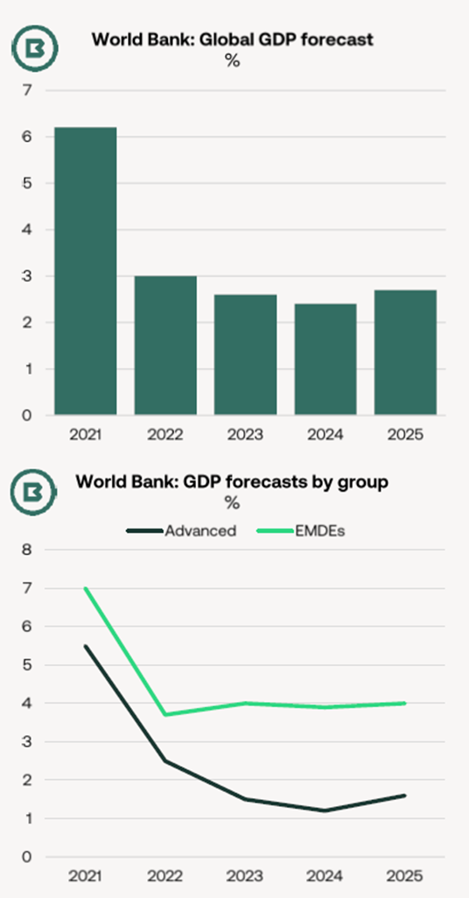
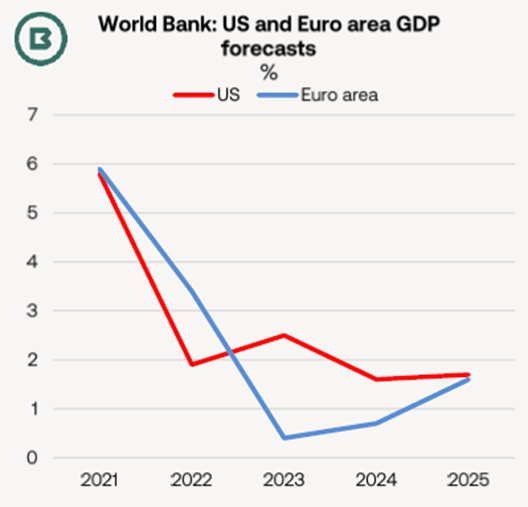
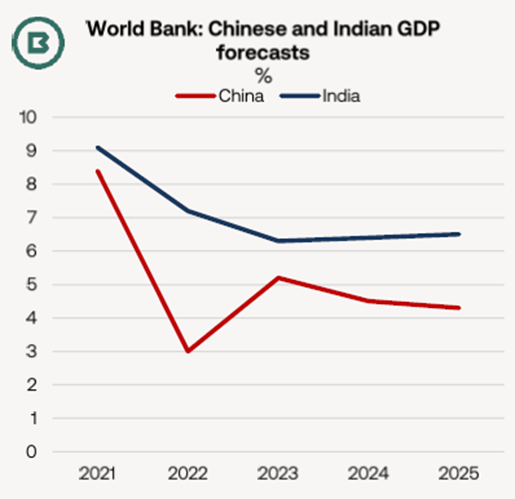

# The Big Picture - World Bank: Diverging prospects in the global economy

**Date:** January 17, 2024  
**Publisher:** Breakwave Advisors | **Category:** Market Insights  
**Original URL:** [https://www.breakwaveadvisors.com/insights/2024/1/15/the-big-picture-world-bank-diverging-prospects-in-the-global-economy](https://www.breakwaveadvisors.com/insights/2024/1/15/the-big-picture-world-bank-diverging-prospects-in-the-global-economy)  

---

- *In recent years economic outlooks from major international institutions have made unappetising reading, with gloomy headlines followed by a series of forecast risks, all heavily weighted to the downside.*

- *Titled “Subdued Growth, Multiple Challenges”, the latest Global Economic Prospects from the World Bank certainly fits into this pattern—even the report describes its projections as “dismal”—but the Bank outlines diverging prospects.*

- *According to the World Bank, prospects for emerging economies are more favourable than for advanced economies.*

Perhaps the best way to approach the World Bank’s conclusions is to arrange them into positives and negatives.

### Positives

Though marking a slowing from 2022,**the 2023 global GDP growth estimate was revised higher**by half a percentage point from the previous forecast in June to 2.6%.**Better-than-expected growth in the US**was behind the upgrade.

A bottoming out of advanced economies’ performance is expected this year, with 2025 forecast at 1.6% (up from 1.2% in 2024). This is mainly the result of ongoing recovery in the euro area and the US economy returning towards its long-term trend rate, with falling inflation and supportive monetary policy in place.

Although once again the balance of risks is tilted to the downside, one upside is the role of the US as an export market for East Asian economies.

For those emerging market and developing economies (EMDEs) with robust credit ratings, GDP growth is poised for improvement, returning to levels seen before the pandemic.

At the same time, headline and core inflation has continued to decline from its peaks in 2022.

> **Figure 1: Market Chart 1**  
> [Local Asset](file:///C:/Users/Dell/Github/Shipping/corpus/03-breakwave/insights/2024/assets/2024-01-17_the-big-picture-world-bank-diverging-prospects-in-the-global-economy_img_image00128429_975f75ec5637.png)

At the timing of the report’s writing, hostilities in the Middle East were assessed to have had only a “muted” impact on commodity prices. On the (admittedly large) assumption that the conflict does not escalate, the World Bank assumes oil prices will edge lower this year.

Food prices too are expected to soften further in 2024 thanks to ample supplies.

> **Figure 2: Market Chart 2**  
> [Local Asset](file:///C:/Users/Dell/Github/Shipping/corpus/03-breakwave/insights/2024/assets/2024-01-17_the-big-picture-world-bank-diverging-prospects-in-the-global-economy_img_image00228329_feaecf86226f.png)

### Negatives

**Global economic growth is projected by the World Bank to slow to 2.4% in 2024—from an estimate of 2.6% last year, 3.0% in 2022 and the strong rebound of 6.2% in 2021.**

Economic growth in**advanced economies and China**this year is forecast to slow to well below the average of 2010-19.

Indeed, if the World Bank’s forecasts are proved correct, then 2020-24 would mark the weakest start to a decade since the 1990s (in an era characterised by geopolitical strains and a global recession).

**The balance of risks is to the downside**. Among these, the report highlights the Middle East conflict and Russia’s invasion of Ukraine, acknowledging the risks of spiking energy prices spilling over into other commodities. Secondary effects could include lower investment and weaken economies further.

Weather events and climate change feature as a downside risk, with last year’s floods in China and Myanmar providing two examples.

> **Figure 3: Market Chart 3**  
> [Local Asset](file:///C:/Users/Dell/Github/Shipping/corpus/03-breakwave/insights/2024/assets/2024-01-17_the-big-picture-world-bank-diverging-prospects-in-the-global-economy_img_image00328229_3fe4d95af6b0.png)

**China’s prospects deserve particular attention.**

The country’s GDP growth is expected to decelerate from 5.2% last year to 4.5% this and then to 4.3% in 2025.

Noting issues surrounding the country’s real estate sector, the report also commented on weak external demand for China’s exported goods and receding capital inflows (a reflection of soft sentiment).

In turn, a manufacturing downturn in China would impact the wider East Asian region, with economies with large integrated export sectors, such as Malaysia and Vietnam singled out as at risk.
