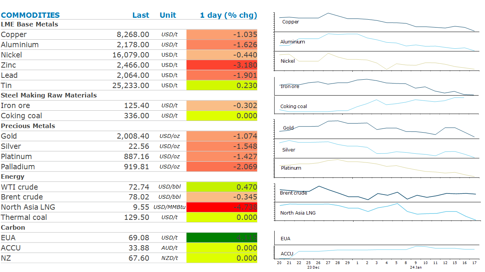

# Metals fall following mixed economic data in China

**Date:** January 18, 2024  
**Publisher:** Breakwave Advisors | **Category:** Market Insights  
**Original URL:** [https://www.breakwaveadvisors.com/insights/2024/1/18/metals-fall-following-mixed-economic-data-in-china](https://www.breakwaveadvisors.com/insights/2024/1/18/metals-fall-following-mixed-economic-data-in-china)  

---

*By*[*Daniel Hynes*](https://www.linkedin.com/in/dahynes/)

Disappointing economic data weighed on sentiment across the commodities complex. A stronger USD also kept investor appetite low.

> **Figure 1: 1705526137880**  
> **Interactive Data & Source:** [Linkedin](https://www.linkedin.com/newsletters/commodities-wrap-6692196755876012032/?fbclid=IwAR3kiXJqZdxmp9ZcRwBNI7FsBySI-XSC0pfPur1qzjt7OZp7PTE59Tsl1QI) | [Local Asset](file:///C:/Users/Dell/Github/Shipping/corpus/03-breakwave/insights/2024/assets/2024-01-18_metals-fall-following-mixed-economic-data-in-china_img_1705526137880_06cf0ca85479.png)

**Copper**extended recent losses after economic data in China missed expectations. Gross domestic product grew at 5.2% last year, meeting an official target. Industrial production rose 6.8% in December which was around consensus. However, retail sales and the urban jobless rate disappointed. The prospect of further stimulus measures also looks low. Chinese Premier, Li Qiang, trumpeted the nation’s ability to hit its 5% growth target without flooding the economy with massive stimulus. The data contributed to a downbeat mood across metal markets, with zinc leading the rest of the complex lower. This is despite recent supply disruptions. Nystar announced earlier this week that it was mothballing its Budel zinc smelter. The copper market is still reeling from Panama’s decision to shut the Cobra copper mine.

**Gold**fell as strong economic data in the US doused hopes of an imminent rate cut. US retail sales came in well above expectations in December, pointing to consumer resilience. A chorus of bankers at the World Economic Forum also urge caution in lowering rates. The strong economic data saw the USD rise, putting downward pressure on investor demand.

**Iron ore**futures remained under pressure as weakness in China’s property sector worsened. Home prices in China fell the most since 2014 in December. Crude steel production in December sank 15% y/y to 67.44mt. That left output in 2023 at 1.019bnt, unchanged from 2022. Inventories are also growing, with an industry survey showing 247 steel mills saw stockpiles rise over the past week. This saw iron ore future slump to their lowest level in two months, at USD125.30/t in Singapore.

**Crude oil**managed to pare earlier losses amid ongoing supply outages and bullish forecast on demand. The risk off tone across markets weighed on oil prices after the session opened. The mood improved as the supply risks mounted. Houthi rebels continue to threaten shipping in the Red Sea. There is also growing concerns that Iran may be drawn into conflict, with neighbours Iraq and Pakistan reporting recent attacks by Tehran. Elsewhere, production at Libya’s Sharara oil field remains shut by protesters, while loadings of Azeri Light crude are expected to fall to a 11-month low. Together this is impacting around 200kb/d of exports. In the US, freezing temperatures have curbed output in Texas and shut in more than half of North Dakota’s production. Overall 700kb/d is offline. Meanwhile, OPEC expects oil demand will continue to increase strongly in 2025. This should exceed supply growth to keep the market tight. The group kept its 2023 demand growth forecast unchanged at 2.25mb/d.

**Global gas**prices extended recent losses amid ample inventories. This is despite ongoing risks to supplies. LNG tankers appear to have stopped using the Red Sea as Houthi rebels threaten shipping.

Data source:[Commodities Wrap](https://www.linkedin.com/newsletters/commodities-wrap-6692196755876012032/?fbclid=IwAR3kiXJqZdxmp9ZcRwBNI7FsBySI-XSC0pfPur1qzjt7OZp7PTE59Tsl1QI)
