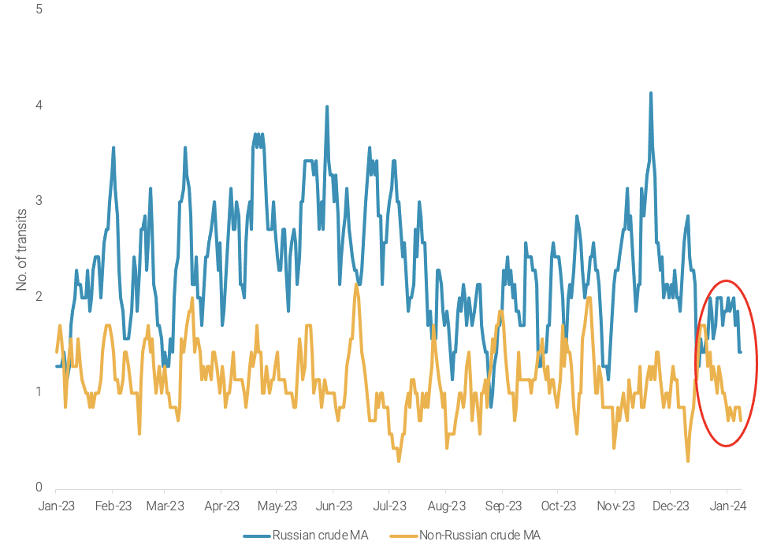
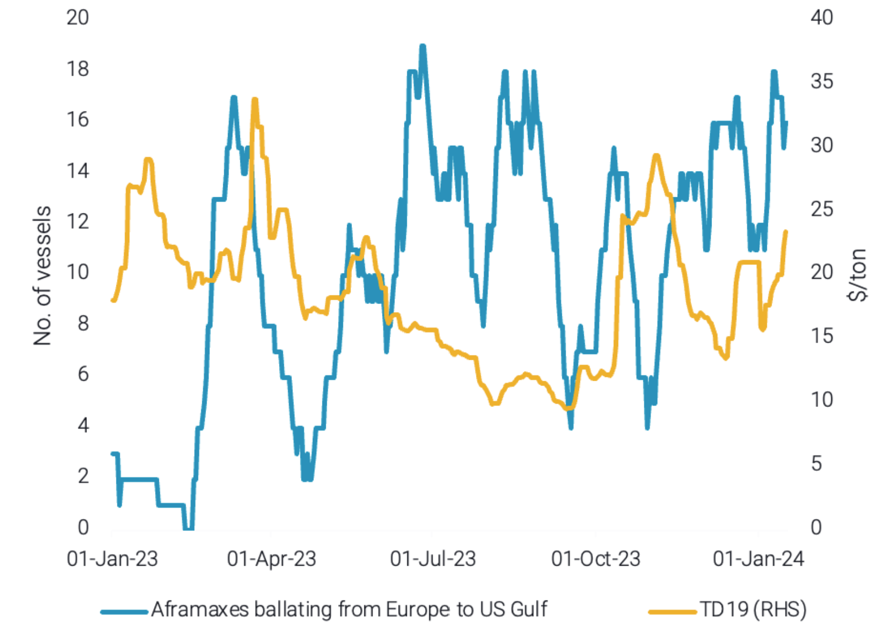

# Russian crude Red Sea transits stabilise for now || Aframax Med exodus

**Date:** January 18, 2024  
**Publisher:** Breakwave Advisors | **Category:** Market Insights  
**Original URL:** [https://www.breakwaveadvisors.com/insights/2024/1/18/russian-crude-red-sea-transits-stabilise-for-now-aframax-med-exodus](https://www.breakwaveadvisors.com/insights/2024/1/18/russian-crude-red-sea-transits-stabilise-for-now-aframax-med-exodus)  

---

This week we put the spotlight on Red Sea transits both north- and southbound: Russian crude heading southbound and middle distillates heading northbound. In the West, we examine the effect of Libyan oil field strikes on Aframaxes, and we discuss Atlantic Basin MR oversupply.

*By*[*Mary Melton*](https://www.linkedin.com/search/results/all/?fetchDeterministicClustersOnly=true&heroEntityKey=urn%3Ali%3Afsd_profile%3AACoAABXVyecBtg-pRnIrZe0BoWk0ygPiUfbvhsw&keywords=mary%20melton&origin=RICH_QUERY_SUGGESTION&position=0&searchId=40e8d7d2-c4d0-4022-81e7-176f6eba418b&sid=H_Y&spellCorrectionEnabled=false)

### Analysis / East of Suez / Dirty

## Russian Crude Red Sea Transits Stabilise, But Recent Attacks May Prompt Diversions

> **Figure 1: Daily Number of Southbound Bab El Mandeb Transits Made By**  
> *Daily number of Southbound Bab el Mandeb transits made by tankers carrying Russian and non-Russian crude (7-day moving average)*  
> **Interactive Data & Source:** [Vortexa](https://www.vortexa.com//oil-gas-data-traders-analysts-data-scientists?gclid=Cj0KCQjw8_qRBhCXARIsAE2AtRZKOvMnbilZ_6_91d7huSFFy71pWLrnPwGwOHVzXsmsG-1a1mZnQw8aAt89EALw_wcB&hsa_acc=1782073842&hsa_ad=548425387665&hsa_cam=14746637662&hsa_grp=125038601902&hsa_kw=&hsa_mt=&hsa_net=adwords&hsa_src=g&hsa_tgt=dsa-1431852288425&hsa_ver=3&utm_campaign=%5BCD%5D%20-%20DSA%20-%20EMEA&utm_medium=cpc&utm_medium=ppc&utm_source=google&utm_source=adwords&utm_term=) | [Local Asset](file:///C:/Users/Dell/Github/Shipping/corpus/03-breakwave/insights/2024/assets/2024-01-18_russian-crude-red-sea-transits-stabilise-for-now-aframax-med-exodus_img_unnamed-2024-01-18t141517865_b0be79c42417.png)

- Crude volumes heading Southbound via Bab-el-Mandeb have declined by almost 50% since late November 2023. However, Russian crude volumes transiting the area as well as the number of transits have stabilised in the past few weeks.
- Russian tankers have faced relatively low risk in the Red Sea since the Houthi attacks began due to geopolitical ties with Iran. However, recent attacks have reportedly accidentally hit tankers carrying Russian crude (TradeWinds).
- This has led Sovcomflot - a prominent Russian operator - to consider redirecting flows via alternative routes. Given the current ice thickness in the North Sea Route, the Cape of Good Hope seems the most likely candidate. Although no redirection has been made at the time of writing, this would significantly increase voyage length, and further tighten tanker supply in a market where voyage mileage has already increased drastically.

### Analysis / West of Suez / Dirty

## Aframaxes Ballast From East Med to USG As Sharara Field Remains Closed

> **Figure 2: Number of Aframaxes Ballasting From Europe to USG (Lhs) vs Td19**  
> *Number of Aframaxes ballasting from Europe to USG (LHS) vs TD19 freight rates (RHS)*  
> **Interactive Data & Source:** [Vortexa](https://www.vortexa.com//oil-gas-data-traders-analysts-data-scientists?gclid=Cj0KCQjw8_qRBhCXARIsAE2AtRZKOvMnbilZ_6_91d7huSFFy71pWLrnPwGwOHVzXsmsG-1a1mZnQw8aAt89EALw_wcB&hsa_acc=1782073842&hsa_ad=548425387665&hsa_cam=14746637662&hsa_grp=125038601902&hsa_kw=&hsa_mt=&hsa_net=adwords&hsa_src=g&hsa_tgt=dsa-1431852288425&hsa_ver=3&utm_campaign=%5BCD%5D%20-%20DSA%20-%20EMEA&utm_medium=cpc&utm_medium=ppc&utm_source=google&utm_source=adwords&utm_term=) | [Local Asset](file:///C:/Users/Dell/Github/Shipping/corpus/03-breakwave/insights/2024/assets/2024-01-18_russian-crude-red-sea-transits-stabilise-for-now-aframax-med-exodus_img_unnamed-2024-01-18t141741369_234ea7a909c7.png)

- The El Sharara oil field (300kbd production capacity) in Libya is currently closed due to force majeure imposed by Libya’s NOC. As a result of this, crude exports from Libya’s Zawia Terminal Port - which is fed by this field via pipeline - have declined by 120kbd in January (days 1-15) m-o-m.
- This decline in Libyan crude exports has naturally resulted in lower Aframax utilisation in Libya, because of lower Aframax demand in this area. Despite the drop in tanker demand in the region, TD19 (Cross-Mediterranean) freight rates are at 2-month highs.
- Increased demand for Aframaxes in the USG has pushed Aframaxes ballasting from Europe to USG to levels not observed since August 2023, helping keep the vessel availability in East Mediterranean at moderate levels, and in turn supporting TD19 rates.

Data Source:[Vortexa](https://www.vortexa.com//oil-gas-data-traders-analysts-data-scientists?gclid=Cj0KCQjw8_qRBhCXARIsAE2AtRZKOvMnbilZ_6_91d7huSFFy71pWLrnPwGwOHVzXsmsG-1a1mZnQw8aAt89EALw_wcB&hsa_acc=1782073842&hsa_ad=548425387665&hsa_cam=14746637662&hsa_grp=125038601902&hsa_kw=&hsa_mt=&hsa_net=adwords&hsa_src=g&hsa_tgt=dsa-1431852288425&hsa_ver=3&utm_campaign=%5BCD%5D%20-%20DSA%20-%20EMEA&utm_medium=cpc&utm_medium=ppc&utm_source=google&utm_source=adwords&utm_term=)
