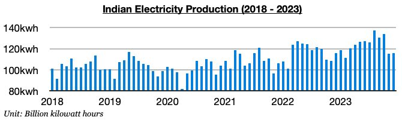
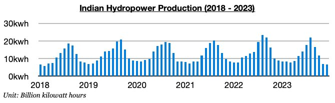
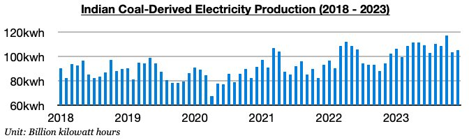

# Incredibly Weak Hydropower Production in India

**Date:** January 19, 2024  
**Publisher:** Breakwave Advisors | **Category:** Market Insights  
**Original URL:** [https://www.breakwaveadvisors.com/insights/2024/1/19/incredibly-weak-hydropower-production-in-india](https://www.breakwaveadvisors.com/insights/2024/1/19/incredibly-weak-hydropower-production-in-india)  

---

*By*[*Jeffrey Landsberg*](https://www.linkedin.com/in/jeffrey-landsberg-70ab957/)

For the near-term, it has remained India’s thermal coal import demand where we have been particularly bullish for the dry bulk market. As we started to highlight late last year in Commodore's Weekly Dry Bulk Reports, demand for thermal coal in India has been extremely likely to rise from an already strong base, and in our view new records have been very likely to begin to be set by March. India’s economy has been fairing very well while India’s hydropower production has been incredibly weak. As a result, a seasonal uptick in India’s coal-derived electricity generation this season has been likely to be much stronger than usual.

Most recently, India produced approximately 116 billion kilowatt hours of electricity in December. This is up month-on-month by 1 billion kilowatt hours (1%) and is up year-on-year by 300 million kilowatt hours. India’s electricity output has remained strong as anticipated and has now increased on a year-on-year basis for seven straight months. Hydropower production continues to contract, but thermal coal-derived electricity generation has continued to grow.

> **Figure 1: Chart 1 (92)**  
> [Local Asset](file:///C:/Users/Dell/Github/Shipping/corpus/03-breakwave/insights/2024/assets/2024-01-19_incredibly-weak-hydropower-production-in-india_img_chart1289229_210cf80f7797.jpg)

India's hydropower production totaled approximately 6.5 billion kilowatt hours in December. This is down month-on-month by 300 million kilowatt hours (-6%) and is down year-on-year by 2.3 billion kilowatt hours (-27%). India’s hydropower production has now contracted on a year-on-year basis for six straight months. Last month’s production marked the smallest amount of hydropower produced in India since February 2018.

> **Figure 2: Chart 2 (81)**  
> [Local Asset](file:///C:/Users/Dell/Github/Shipping/corpus/03-breakwave/insights/2024/assets/2024-01-19_incredibly-weak-hydropower-production-in-india_img_chart2288129_cfd77b613ce4.jpg)

Thermal coal-derived electricity generation totaled approximately 105.2 billion kilowatt hours. This is up month-on-month by 1.5 billion kilowatt hours (2%) and is up year-on-year by 2.7 billion kilowatt hours (3%). India’s thermal coal-derived electricity generation has now grown on a year-on-year basis during each of the last eight months. We remain of our view that strength will continue near term, and that several new overall electricity production and thermal coal-derived generation production records will also soon be set in India beginning no later than in March. The dry bulk market stands to continue to benefit from strong Indian coal import demand.

> **Figure 3: Chart 3 (55)**  
> [Local Asset](file:///C:/Users/Dell/Github/Shipping/corpus/03-breakwave/insights/2024/assets/2024-01-19_incredibly-weak-hydropower-production-in-india_img_chart3285529_6e23cb9dabd6.jpg)
